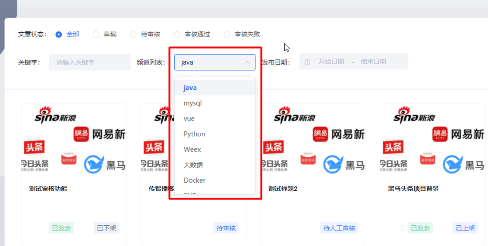
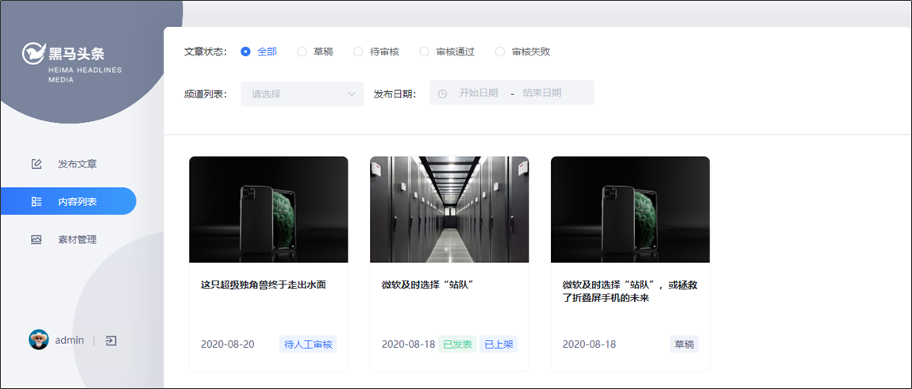
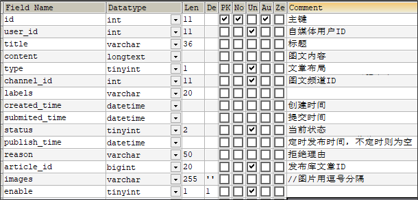
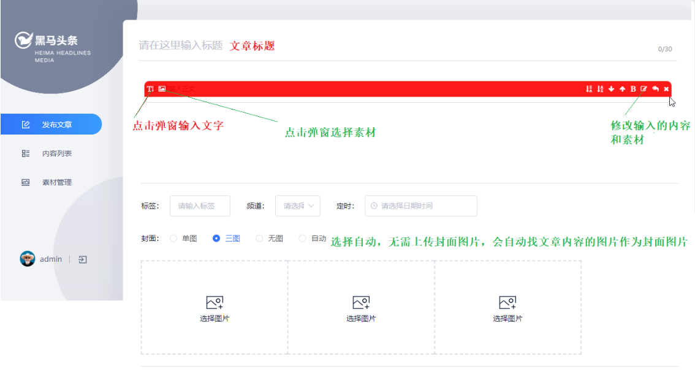
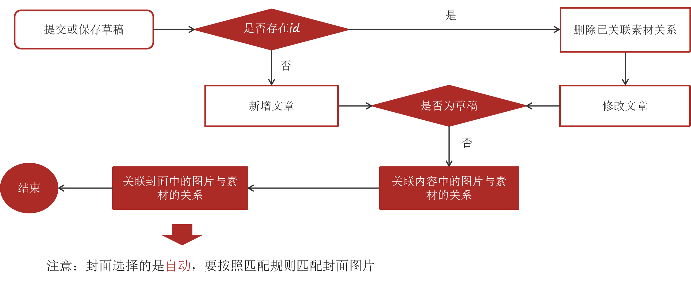

# 自媒体文章发布

- heima-leadnews-service
  - heima-leadnews-wemedia自媒体的服务
    - 基本的环境
    - 登录接口
- heima-leadnews-gateway
  - heima-leadnews-wemedia-gateway自媒体的网关
    - 基本的环境
    - 授权过滤器

## 自媒体后台搭建

### 1、自媒体微服务

资料中找到heima-leadnews-wemedia.zip解压

拷贝到heima-leadnews-service工程下，并指定子模块

添加对应的nacos配置。

### 2、自媒体网关

资料中找到heima-leadnews-wemedia-gateway.zip解压

 拷贝到heima-leadnews-gateway工程下，并指定子模块

在nacos网页后台，添加对应的nacos配置

### 3、数据准备

执行leadnews-wemedia.sql脚本

## 自媒体前台搭建

 [nginx.md](nginx.md) 

## 自媒体素材管理

### 1、素材上传

#### 1.1、素材管理-图片上传-表结构

媒体图文素材信息表wm_material


对应实体类：

```java
package com.heima.model.wemedia.pojos;

import com.baomidou.mybatisplus.annotation.IdType;
import com.baomidou.mybatisplus.annotation.TableField;
import com.baomidou.mybatisplus.annotation.TableId;
import com.baomidou.mybatisplus.annotation.TableName;
import lombok.Data;

import java.io.Serializable;
import java.util.Date;

/**
 * <p>
 * 自媒体图文素材信息表
 * </p>
 *
 * @author itheima
 */
@Data
@TableName("wm_material")
public class WmMaterial implements Serializable {

    private static final long serialVersionUID = 1L;

    /**
     * 主键
     */
    @TableId(value = "id", type = IdType.AUTO)
    private Integer id;

    /**
     * 自媒体用户ID
     */
    @TableField("user_id")
    private Integer userId;

    /**
     * 图片地址
     */
    @TableField("url")
    private String url;

    /**
     * 素材类型
        0 图片
        1 视频
     */
    @TableField("type")
    private Short type;

    /**
     * 是否收藏
     */
    @TableField("is_collection")
    private Short isCollection;

    /**
     * 创建时间
     */
    @TableField("created_time")
    private Date createdTime;

}
```

#### 1.2、实现思路

 [拦截器](认证授权和网关/网关-认证过滤器-拦截器.md) 

#### 1.3、接口定义

|          | **说明**                        |
| -------- | ------------------------------- |
| 接口路径 | /api/v1/material/upload_picture |
| 请求方式 | POST                            |
| 参数     | MultipartFile                   |
| 响应结果 | ResponseResult                  |

MultipartFile  ：Springmvc指定的文件接收类型

ResponseResult  ：

成功需要回显图片，返回素材对象

```json
{
  "host":null,
  "code":200,
  "errorMessage":"操作成功",
  "data":{
    "id":52,
    "userId":1102,
    "url":"http://192.168.200.130:9000/leadnews/2021/04/26/a73f5b60c0d84c32bfe175055aaaac40.jpg",
    "type":0,
    "isCollection":0,
    "createdTime":"2021-01-20T16:49:48.443+0000"
  }
}
```

失败：

- 参数失效

  ```java
  {
    "code":501,
    "errorMessage":"文件上传参数失效",
  }
  ```
- 文章上传失败

  ```java
  {
    "code":501,
    "errorMessage":"文件上传失败",
  }
  ```

#### 1.4、自媒体微服务集成heima-file-starter

①：导入heima-file-starter

```xml
<dependencies>
    <dependency>
        <groupId>com.heima</groupId>
        <artifactId>heima-file-starter</artifactId>
        <version>1.0-SNAPSHOT</version>
    </dependency>
</dependencies>
```

②：在自媒体微服务的配置中心添加minio配置。

#### 1.5、具体实现

##### ①：创建WmMaterialController

```java
@RestController
@RequestMapping("/api/v1/material")
public class WmMaterialController {

    @PostMapping("/upload_picture")//路径
    public ResponseResult uploadPicture(MultipartFile multipartFile){//multipartFile名称不要写错，前端传的就是这个名称。
        return null;
    }

}
```

##### ②：mapper

里面的内容就是集成mybatisplus。

```java
package com.heima.wemedia.mapper;

import com.baomidou.mybatisplus.core.mapper.BaseMapper;
import com.heima.model.wemedia.pojos.WmMaterial;
import org.apache.ibatis.annotations.Mapper;

@Mapper
public interface WmMaterialMapper extends BaseMapper<WmMaterial> {
}
```

##### ③：service interface

```java
package com.heima.wemedia.service;

public interface WmMaterialService extends IService<WmMaterial> {

    /**
     * 图片上传
     * @param multipartFile
     * @return
     */
    public ResponseResult uploadPicture(MultipartFile multipartFile);

}
```

##### service Impl

```java
package com.heima.wemedia.service.impl;


import com.baomidou.mybatisplus.extension.service.impl.ServiceImpl;
import com.heima.file.service.FileStorageService;
import com.heima.model.common.dtos.ResponseResult;
import com.heima.model.common.enums.AppHttpCodeEnum;
import com.heima.model.wemedia.pojos.WmMaterial;
import com.heima.utils.thread.WmThreadLocalUtil;
import com.heima.wemedia.mapper.WmMaterialMapper;
import com.heima.wemedia.service.WmMaterialService;
import lombok.extern.slf4j.Slf4j;
import org.springframework.beans.factory.annotation.Autowired;
import org.springframework.stereotype.Service;
import org.springframework.transaction.annotation.Transactional;
import org.springframework.web.multipart.MultipartFile;

import java.io.IOException;
import java.util.Date;
import java.util.UUID;

@Slf4j
@Service
@Transactional
public class WmMaterialServiceImpl extends ServiceImpl<WmMaterialMapper, WmMaterial> implements WmMaterialService {

  	//注解，自己写的MinIO文件上传start。
    @Autowired
    private FileStorageService fileStorageService;

    /**
     * 图片上传
     * @param multipartFile
     * @return
     */
    @Override
    public ResponseResult uploadPicture(MultipartFile multipartFile) {

        //1.检查参数
        if(multipartFile == null || multipartFile.getSize() == 0){
            return ResponseResult.errorResult(AppHttpCodeEnum.PARAM_INVALID);
        }

        //2.上传图片到minIO中
        String fileName = UUID.randomUUID().toString().replace("-", "");
        //aa.jpg 文件的名字
        String originalFilename = multipartFile.getOriginalFilename();
        String postfix = originalFilename.substring(originalFilename.lastIndexOf("."));
        String fileId = null;
        try {
            fileId = fileStorageService.uploadImgFile("", fileName + postfix, multipartFile.getInputStream());
            log.info("上传图片到MinIO中，fileId:{}",fileId);
        } catch (IOException e) {
            e.printStackTrace();
            log.error("WmMaterialServiceImpl-上传文件失败");
        }

        //3.保存到数据库中
        WmMaterial wmMaterial = new WmMaterial();
        wmMaterial.setUserId(WmThreadLocalUtil.getUser().getId());
        wmMaterial.setUrl(fileId);
        wmMaterial.setIsCollection((short)0);
        wmMaterial.setType((short)0);
        wmMaterial.setCreatedTime(new Date());
        save(wmMaterial);

        //4.返回结果
        return ResponseResult.okResult(wmMaterial);
    }

}
```

##### ④：控制器

```java
@RestController
@RequestMapping("/api/v1/material")
public class WmMaterialController {
	
  	//注入service
    @Autowired
    private WmMaterialService wmMaterialService;

    @PostMapping("/upload_picture")
    public ResponseResult uploadPicture(MultipartFile multipartFile){
        return wmMaterialService.uploadPicture(multipartFile);
    }

}
```

##### ⑤：test

启动自媒体微服务和自媒体网关，使用前端项目进行测试

### 2、素材列表查询

#### 2.1、接口定义

|          | **说明**              |
| -------- | --------------------- |
| 接口路径 | /api/v1/material/list |
| 请求方式 | POST                  |
| 参数     | WmMaterialDto         |
| 响应结果 | ResponseResult        |

WmMaterialDto  ：

```java
@Data
public class WmMaterialDto extends PageRequestDto {

    /**
     * 1 收藏
     * 0 未收藏
     */
    private Short isCollection;
}
```

ResponseResult  :

```json
{
  "host":null,
  "code":200,
  "errorMessage":"操作成功",
  "data":[
    {
    "id":52,
      "userId":1102,
      "url":"http://192.168.200.130:9000/leadnews/2021/04/26/ec893175f18c4261af14df14b83cb25f.jpg",
      "type":0,
      "isCollection":0,
      "createdTime":"2021-01-20T16:49:48.000+0000"
    },
    ....
  ],
  "currentPage":1,
  "size":20,
  "total":0
}
```

#### 2.2、功能实现

##### ①：在WmMaterialController类中新增方法

```java
@PostMapping("/list")
public ResponseResult findList(@RequestBody WmMaterialDto dto){
    return null;
}
```

##### ②：mapper已定义

##### ③：Service接口

在WmMaterialService中新增方法

```java
/**
 * 素材列表查询
 * @param dto
 * @return
 */
public ResponseResult findList( WmMaterialDto dto);
```

##### ServiceImpl

```java
/**
 * 素材列表查询
 * @param dto
 * @return
 */
@Override
public ResponseResult findList(WmMaterialDto dto) {

    //1.检查参数
    dto.checkParam();

    //2.分页查询
    IPage page = new Page(dto.getPage(),dto.getSize());
    LambdaQueryWrapper<WmMaterial> lambdaQueryWrapper = new LambdaQueryWrapper<>();
    //是否收藏
    if(dto.getIsCollection() != null && dto.getIsCollection() == 1){
        lambdaQueryWrapper.eq(WmMaterial::getIsCollection,dto.getIsCollection());
    }

    //按照用户查询
    lambdaQueryWrapper.eq(WmMaterial::getUserId,WmThreadLocalUtil.getUser().getId());

    //按照时间倒序
    lambdaQueryWrapper.orderByDesc(WmMaterial::getCreatedTime);

    page = page(page,lambdaQueryWrapper);

    //3.结果返回
    ResponseResult responseResult = new PageResponseResult(dto.getPage(),dto.getSize(),(int)page.getTotal());
    responseResult.setData(page.getRecords());
    return responseResult;
}
```

##### ④：控制器

```java
@PostMapping("/list")
public ResponseResult findList(@RequestBody WmMaterialDto dto){
    return wmMaterialService.findList(dto);
}
```

##### ⑤：在自媒体引导类中添加mybatis-plus的分页拦截器

## 自媒体文章管理

### 查询所有频道

#### 需求分析



#### 表结构

wm_channel 频道信息表


##### 实体类

```java
package com.heima.model.wemedia.pojos;

import com.baomidou.mybatisplus.annotation.IdType;
import com.baomidou.mybatisplus.annotation.TableField;
import com.baomidou.mybatisplus.annotation.TableId;
import com.baomidou.mybatisplus.annotation.TableName;
import lombok.Data;

import java.io.Serializable;
import java.util.Date;

/**
 * <p>
 * 频道信息表
 * </p>
 *
 * @author itheima
 */
@Data
@TableName("wm_channel")
public class WmChannel implements Serializable {

    private static final long serialVersionUID = 1L;

    @TableId(value = "id", type = IdType.AUTO)
    private Integer id;

    /**
     * 频道名称
     */
    @TableField("name")
    private String name;

    /**
     * 频道描述
     */
    @TableField("description")
    private String description;

    /**
     * 是否默认频道
     * 1：默认     true
     * 0：非默认   false
     */
    @TableField("is_default")
    private Boolean isDefault;

    /**
     * 是否启用
     * 1：启用   true
     * 0：禁用   false
     */
    @TableField("status")
    private Boolean status;

    /**
     * 默认排序
     */
    @TableField("ord")
    private Integer ord;

    /**
     * 创建时间
     */
    @TableField("created_time")
    private Date createdTime;

}
```

#### 接口定义

|          | **说明**                 |
| -------- | ------------------------ |
| 接口路径 | /api/v1/channel/channels |
| 请求方式 | POST                     |
| 参数     | 无                       |
| 响应结果 | ResponseResult           |

ResponseResult  ：

```json
{
  "host": "null",
  "code": 0,
  "errorMessage": "操作成功",
  "data": [
    {
      "id": 4,
      "name": "java",
      "description": "java",
      "isDefault": true,
      "status": false,
      "ord": 3,
      "createdTime": "2019-08-16T10:55:41.000+0000"
    },
    Object {  ... },
    Object {  ... }
  ]
}
```

#### 功能实现

##### 1、接口定义：

```java
package com.heima.wemedia.controller.v1;

import com.heima.model.common.dtos.ResponseResult;
import org.springframework.web.bind.annotation.GetMapping;
import org.springframework.web.bind.annotation.RequestMapping;
import org.springframework.web.bind.annotation.RestController;

@RestController
@RequestMapping("/api/v1/channel")
public class WmchannelController {

    @GetMapping("/channels")
    public ResponseResult findAll(){
        return null;
    }
}
```

##### 2、mapper

```java
package com.heima.wemedia.mapper;

import com.baomidou.mybatisplus.core.mapper.BaseMapper;
import com.heima.model.wemedia.pojos.WmChannel;
import org.apache.ibatis.annotations.Mapper;

@Mapper
public interface WmChannelMapper extends BaseMapper<WmChannel> {
}
```

##### 3、service

```java
package com.heima.wemedia.service;

import com.baomidou.mybatisplus.extension.service.IService;
import com.heima.model.common.dtos.ResponseResult;
import com.heima.model.wemedia.pojos.WmChannel;

public interface WmChannelService extends IService<WmChannel> {

    /**
     * 查询所有频道
     * @return
     */
    public ResponseResult findAll();
    
}
```

##### 3.1、实现类

```java
package com.heima.wemedia.service.impl;

import com.baomidou.mybatisplus.extension.service.impl.ServiceImpl;
import com.heima.model.common.dtos.ResponseResult;
import com.heima.model.wemedia.pojos.WmChannel;
import com.heima.wemedia.mapper.WmChannelMapper;
import com.heima.wemedia.service.WmChannelService;
import lombok.extern.slf4j.Slf4j;
import org.springframework.stereotype.Service;
import org.springframework.transaction.annotation.Transactional;

@Service
@Transactional
@Slf4j
public class WmChannelServiceImpl extends ServiceImpl<WmChannelMapper, WmChannel> implements WmChannelService {

    /**
     * 查询所有频道
     * @return
     */
    @Override
    public ResponseResult findAll() {
        return ResponseResult.okResult(list());
    }
}
```

##### 4、控制层

```java
package com.heima.wemedia.controller.v1;

import com.heima.model.common.dtos.ResponseResult;
import com.heima.wemedia.service.WmChannelService;
import org.springframework.beans.factory.annotation.Autowired;
import org.springframework.web.bind.annotation.GetMapping;
import org.springframework.web.bind.annotation.RequestMapping;
import org.springframework.web.bind.annotation.RestController;

@RestController
@RequestMapping("/api/v1/channel")
public class WmchannelController {

    @Autowired
    private WmChannelService wmChannelService;

    @GetMapping("/channels")
    public ResponseResult findAll(){
        return wmChannelService.findAll();
    }
}
```

### 查询自媒体文章

#### 需求说明



#### 表结构分析

wm_news 自媒体文章表



##### 对应实体类：

```java
package com.heima.model.wemedia.pojos;

import com.baomidou.mybatisplus.annotation.IdType;
import com.baomidou.mybatisplus.annotation.TableField;
import com.baomidou.mybatisplus.annotation.TableId;
import com.baomidou.mybatisplus.annotation.TableName;
import lombok.Data;
import org.apache.ibatis.type.Alias;

import java.io.Serializable;
import java.util.Date;

/**
 * <p>
 * 自媒体图文内容信息表
 * </p>
 *
 * @author itheima
 */
@Data
@TableName("wm_news")
public class WmNews implements Serializable {

    private static final long serialVersionUID = 1L;

    /**
     * 主键
     */
    @TableId(value = "id", type = IdType.AUTO)
    private Integer id;

    /**
     * 自媒体用户ID
     */
    @TableField("user_id")
    private Integer userId;

    /**
     * 标题
     */
    @TableField("title")
    private String title;

    /**
     * 图文内容
     */
    @TableField("content")
    private String content;

    /**
     * 文章布局
        0 无图文章
        1 单图文章
        3 多图文章
     */
    @TableField("type")
    private Short type;

    /**
     * 图文频道ID
     */
    @TableField("channel_id")
    private Integer channelId;

    @TableField("labels")
    private String labels;

    /**
     * 创建时间
     */
    @TableField("created_time")
    private Date createdTime;

    /**
     * 提交时间
     */
    @TableField("submited_time")
    private Date submitedTime;

    /**
     * 当前状态
        0 草稿
        1 提交（待审核）
        2 审核失败
        3 人工审核
        4 人工审核通过
        8 审核通过（待发布）
        9 已发布
     */
    @TableField("status")
    private Short status;

    /**
     * 定时发布时间，不定时则为空
     */
    @TableField("publish_time")
    private Date publishTime;

    /**
     * 拒绝理由
     */
    @TableField("reason")
    private String reason;

    /**
     * 发布库文章ID
     */
    @TableField("article_id")
    private Long articleId;

    /**
     * //图片用逗号分隔
     */
    @TableField("images")
    private String images;

    @TableField("enable")
    private Short enable;
    
     //状态枚举类
    @Alias("WmNewsStatus")
    public enum Status{
        NORMAL((short)0),SUBMIT((short)1),FAIL((short)2),ADMIN_AUTH((short)3),ADMIN_SUCCESS((short)4),SUCCESS((short)8),PUBLISHED((short)9);
        short code;
        Status(short code){
            this.code = code;
        }
        public short getCode(){
            return this.code;
        }
    }

}
```

#### 接口定义

|          | **说明**          |
| -------- | ----------------- |
| 接口路径 | /api/v1/news/list |
| 请求方式 | POST              |
| 参数     | WmNewsPageReqDto  |
| 响应结果 | ResponseResult    |

##### WmNewsPageReqDto

```java
package com.heima.model.wemedia.dtos;

import com.heima.model.common.dtos.PageRequestDto;
import lombok.Data;

import java.util.Date;

@Data
public class WmNewsPageReqDto extends PageRequestDto {

    /**
     * 状态
     */
    private Short status;
    /**
     * 开始时间
     */
    private Date beginPubDate;
    /**
     * 结束时间
     */
    private Date endPubDate;
    /**
     * 所属频道ID
     */
    private Integer channelId;
    /**
     * 关键字
     */
    private String keyword;
}
```

##### ResponseResult  :

```json
{
  "host": "null",
  "code": 0,
  "errorMessage": "操作成功",
  "data": [
    Object { ... },
    Object { ... },
    Object { ... }
    
  ],
  "currentPage":1,
  "size":10,
  "total":21
}
```

#### 功能实现

##### 1、WmNewsController

```java
package com.heima.wemedia.controller.v1;

import com.heima.model.common.dtos.ResponseResult;
import com.heima.model.wemedia.dtos.WmNewsPageReqDto;
import org.springframework.web.bind.annotation.PostMapping;
import org.springframework.web.bind.annotation.RequestBody;
import org.springframework.web.bind.annotation.RequestMapping;
import org.springframework.web.bind.annotation.RestController;

@RestController
@RequestMapping("/api/v1/news")
public class WmNewsController {

    @PostMapping("/list")
    public ResponseResult findAll(@RequestBody WmNewsPageReqDto dto){
        return  null;
    }

}
```

##### 2、WmNewsMapper

```java
package com.heima.wemedia.mapper;

import com.baomidou.mybatisplus.core.mapper.BaseMapper;
import com.heima.model.wemedia.pojos.WmNews;
import org.apache.ibatis.annotations.Mapper;

@Mapper
public interface WmNewsMapper  extends BaseMapper<WmNews> {
    
}
```

##### 3、WmNewsService

```java
package com.heima.wemedia.service;


import com.baomidou.mybatisplus.extension.service.IService;
import com.heima.model.common.dtos.ResponseResult;
import com.heima.model.wemedia.dtos.WmNewsPageReqDto;
import com.heima.model.wemedia.pojos.WmNews;

public interface WmNewsService extends IService<WmNews> {

    /**
     * 查询文章
     * @param dto
     * @return
     */
    public ResponseResult findAll(WmNewsPageReqDto dto);

}
```

##### 3.1、WmNewsServiceImpl

```java
package com.heima.wemedia.service.impl;

import com.baomidou.mybatisplus.core.conditions.query.LambdaQueryWrapper;
import com.baomidou.mybatisplus.core.metadata.IPage;
import com.baomidou.mybatisplus.extension.plugins.pagination.Page;
import com.baomidou.mybatisplus.extension.service.impl.ServiceImpl;
import com.heima.model.common.dtos.PageResponseResult;
import com.heima.model.common.dtos.ResponseResult;
import com.heima.model.common.enums.AppHttpCodeEnum;
import com.heima.model.wemedia.dtos.WmNewsPageReqDto;
import com.heima.model.wemedia.pojos.WmNews;
import com.heima.model.wemedia.pojos.WmUser;
import com.heima.utils.thread.WmThreadLocalUtil;
import com.heima.wemedia.mapper.WmNewsMapper;
import com.heima.wemedia.service.WmNewsService;
import lombok.extern.slf4j.Slf4j;
import org.apache.commons.lang3.StringUtils;
import org.springframework.stereotype.Service;
import org.springframework.transaction.annotation.Transactional;

@Service
@Slf4j
@Transactional
public class WmNewsServiceImpl  extends ServiceImpl<WmNewsMapper, WmNews> implements WmNewsService {

    /**
     * 查询文章
     * @param dto
     * @return
     */
    @Override
    public ResponseResult findAll(WmNewsPageReqDto dto) {

        //1.检查参数
        if(dto == null){
            return ResponseResult.errorResult(AppHttpCodeEnum.PARAM_INVALID);
        }
        //分页参数检查
        dto.checkParam();
        //获取当前登录人的信息
        WmUser user = WmThreadLocalUtil.getUser();
        if(user == null){
            return ResponseResult.errorResult(AppHttpCodeEnum.NEED_LOGIN);
        }

        //2.分页条件查询
        IPage page = new Page(dto.getPage(),dto.getSize());
        LambdaQueryWrapper<WmNews> lambdaQueryWrapper = new LambdaQueryWrapper<>();
        //状态精确查询
        if(dto.getStatus() != null){
            lambdaQueryWrapper.eq(WmNews::getStatus,dto.getStatus());
        }

        //频道精确查询
        if(dto.getChannelId() != null){
            lambdaQueryWrapper.eq(WmNews::getChannelId,dto.getChannelId());
        }

        //时间范围查询
        if(dto.getBeginPubDate()!=null && dto.getEndPubDate()!=null){
            lambdaQueryWrapper.between(WmNews::getPublishTime,dto.getBeginPubDate(),dto.getEndPubDate());
        }

        //关键字模糊查询
        if(StringUtils.isNotBlank(dto.getKeyword())){
            lambdaQueryWrapper.like(WmNews::getTitle,dto.getKeyword());
        }

        //查询当前登录用户的文章，从线程中获取用户。
        lambdaQueryWrapper.eq(WmNews::getUserId,user.getId());

        //发布时间倒序查询
        lambdaQueryWrapper.orderByDesc(WmNews::getCreatedTime);

        page = page(page,lambdaQueryWrapper);

        //3.结果返回
        ResponseResult responseResult = new PageResponseResult(dto.getPage(),dto.getSize(),(int)page.getTotal());
        responseResult.setData(page.getRecords());

        return responseResult;
    }
   
}
```

##### 4、控制器

```java
package com.heima.wemedia.controller.v1;

import com.heima.model.common.dtos.ResponseResult;
import com.heima.model.wemedia.dtos.WmNewsPageReqDto;
import com.heima.wemedia.service.WmNewsService;
import org.springframework.beans.factory.annotation.Autowired;
import org.springframework.web.bind.annotation.PostMapping;
import org.springframework.web.bind.annotation.RequestBody;
import org.springframework.web.bind.annotation.RequestMapping;
import org.springframework.web.bind.annotation.RestController;

@RestController
@RequestMapping("/api/v1/news")
public class WmNewsController {

    @Autowired
    private WmNewsService wmNewsService;

    @PostMapping("/list")
    public ResponseResult findAll(@RequestBody WmNewsPageReqDto dto){
        return  wmNewsService.findAll(dto);
    }

}
```

#### 测试

启动后端自媒体微服务和自媒体网关微服务，测试文章列表查询

### 文章发布

#### 需求分析



#### 表结构分析

保存文章，除了需要wm_news文章表以外，还需要另外两张表

wm_material 素材表


wm_news_material 文章素材关系表


其中wm_material和wm_news表的实体类已经导入到了项目中，下面是wm_news_material表对应的实体类：

```java
package com.heima.model.wemedia.pojos;

import com.baomidou.mybatisplus.annotation.IdType;
import com.baomidou.mybatisplus.annotation.TableField;
import com.baomidou.mybatisplus.annotation.TableId;
import com.baomidou.mybatisplus.annotation.TableName;
import lombok.Data;

import java.io.Serializable;

/**
 * <p>
 * 自媒体图文引用素材信息表
 * </p>
 *
 * @author itheima
 */
@Data
@TableName("wm_news_material")
public class WmNewsMaterial implements Serializable {

    private static final long serialVersionUID = 1L;

    /**
     * 主键
     */
    @TableId(value = "id", type = IdType.AUTO)
    private Integer id;

    /**
     * 素材ID
     */
    @TableField("material_id")
    private Integer materialId;

    /**
     * 图文ID
     */
    @TableField("news_id")
    private Integer newsId;

    /**
     * 引用类型
        0 内容引用
        1 主图引用
     */
    @TableField("type")
    private Short type;

    /**
     * 引用排序
     */
    @TableField("ord")
    private Short ord;

}
```

#### 实现思路分析

该功能为保存、修改（是否有id）、保存草稿的共有方法。



1. 前端提交发布或保存为草稿
2. 后台判断请求中是否包含了文章id
3. 如果不包含id，则为新增
   1. 执行新增文章的操作
   2. 关联文章内容图片与素材的关系
   3. 关联文章封面图片与素材的关系
4. 如果包含了id，则为修改请求
   1. 删除该文章与素材的所有关系
   2. 执行修改操作
   3. 关联文章内容图片与素材的关系
   4. 关联文章封面图片与素材的关系

#### 接口定义

|          | **说明**            |
| -------- | ------------------- |
| 接口路径 | /api/v1/news/submit |
| 请求方式 | POST                |
| 参数     | WmNewsDto           |
| 响应结果 | ResponseResult      |

##### WmNewsDto  

```java
package com.heima.model.wemedia.dtos;

import lombok.Data;

import java.util.Date;
import java.util.List;

@Data
public class WmNewsDto {
    
    private Integer id;
     /**
     * 标题
     */
    private String title;
     /**
     * 频道id
     */
    private Integer channelId;
     /**
     * 标签
     */
    private String labels;
     /**
     * 发布时间
     */
    private Date publishTime;
     /**
     * 文章内容
     */
    private String content;
     /**
     * 文章封面类型  0 无图 1 单图 3 多图 -1 自动
     */
    private Short type;
     /**
     * 提交时间
     */
    private Date submitedTime; 
     /**
     * 状态 提交为1  草稿为0
     */
    private Short status;
     
     /**
     * 封面图片列表 多张图以逗号隔开
     */
    private List<String> images;
}
```

##### 前端给传递过来的json数据格式

```json
{
    "title":"黑马头条项目背景",
    "type":"1",//这个 0 是无图  1 是单图  3 是多图  -1 是自动
    "labels":"黑马头条",
    "publishTime":"2020-03-14T11:35:49.000Z",
    "channelId":1,
    "images":[
        "http://192.168.200.130/group1/M00/00/00/wKjIgl5swbGATaSAAAEPfZfx6Iw790.png"
    ],
    "status":1,
    "content":"[
    {
        "type":"text",
        "value":"随着智能手机的普及，人们更加习惯于通过手机来看新闻。由于生活节奏的加快，很多人只能利用碎片时间来获取信息，因此，对于移动资讯客户端的需求也越来越高。黑马头条项目正是在这样背景下开发出来。黑马头条项目采用当下火热的微服务+大数据技术架构实现。本项目主要着手于获取最新最热新闻资讯，通过大数据分析用户喜好精确推送咨询新闻"
    },
    {
        "type":"image",
        "value":"http://192.168.200.130/group1/M00/00/00/wKjIgl5swbGATaSAAAEPfZfx6Iw790.png"
    }
]"
}
```

##### ResponseResult

```json
{
    “code”:501,
    “errorMessage”:“参数失效"
}

{
    “code”:200,
    “errorMessage”:“操作成功"
}

{
    “code”:501,
    “errorMessage”:“素材引用失效"
}
```

#### 功能实现

##### 1、WmNewsController中新增方法

```json
@PostMapping("/submit")
public ResponseResult submitNews(@RequestBody WmNewsDto dto){
    return null;
}
```

##### 2、WmNewsMaterialMapper

批量保存文章与素材的关联关系。

因为mybatis不能批量保存，所以需要定义mapper文件和对应的映射文件

```java
package com.heima.wemedia.mapper;

import com.baomidou.mybatisplus.core.mapper.BaseMapper;
import com.heima.model.wemedia.pojos.WmNewsMaterial;
import org.apache.ibatis.annotations.Mapper;
import org.apache.ibatis.annotations.Param;

import java.util.List;

@Mapper
public interface WmNewsMaterialMapper extends BaseMapper<WmNewsMaterial> {

     /**
      * 保存文章与素材的关联关系
      * @param materialIds
      * @param newsId
      * @param type 内容引用 封面引用
      */
     void saveRelations(@Param("materialIds") List<Integer> materialIds,@Param("newsId") Integer newsId, @Param("type")Short type);
}
```

##### 2.1、WmNewsMaterialMapper.xml

里面foreach循环，遍历素材的id，保存素材和文章的关系。

```xml
<?xml version="1.0" encoding="UTF-8"?>
<!DOCTYPE mapper PUBLIC "-//mybatis.org//DTD Mapper 3.0//EN" "http://mybatis.org/dtd/mybatis-3-mapper.dtd">
<mapper namespace="com.heima.wemedia.mapper.WmNewsMaterialMapper">

    <insert id="saveRelations">
        insert into wm_news_material (material_id,news_id,type,ord)
        values
        <foreach collection="materialIds" index="ord" item="mid" separator=",">
            (#{mid},#{newsId},#{type},#{ord})
        </foreach>
    </insert>

</mapper>
```

##### 常量类

```java
package com.heima.common.constants;

public class WemediaConstants {

    public static final Short COLLECT_MATERIAL = 1;//收藏

    public static final Short CANCEL_COLLECT_MATERIAL = 0;//取消收藏

    public static final String WM_NEWS_TYPE_IMAGE = "image";

    public static final Short WM_NEWS_NONE_IMAGE = 0;
    public static final Short WM_NEWS_SINGLE_IMAGE = 1;
    public static final Short WM_NEWS_MANY_IMAGE = 3;
    public static final Short WM_NEWS_TYPE_AUTO = -1;

    public static final Short WM_CONTENT_REFERENCE = 0;
    public static final Short WM_COVER_REFERENCE = 1;
}
```

##### 3、在WmNewsService中新增方法

```java
/**
 *  发布、修改文章或保存草稿
 * @param dto
 * @return
 */
public ResponseResult submitNews(WmNewsDto dto);
```

##### 3.1、实现方法

```java
/**
 * 发布修改文章或保存为草稿
 * @param dto
 * @return
 */
@Override
public ResponseResult submitNews(WmNewsDto dto) {

    //0.条件判断
    if(dto == null || dto.getContent() == null){
        return ResponseResult.errorResult(AppHttpCodeEnum.PARAM_INVALID);
    }

    //1.保存或修改文章

    WmNews wmNews = new WmNews();
    //属性拷贝 属性名词和类型相同才能拷贝
    BeanUtils.copyProperties(dto,wmNews);
    //封面图片  list---> string
    if(dto.getImages() != null && dto.getImages().size() > 0){
        //[1dddfsd.jpg,sdlfjldk.jpg]-->   1dddfsd.jpg,sdlfjldk.jpg
        String imageStr = StringUtils.join(dto.getImages(), ",");
        wmNews.setImages(imageStr);
    }
    //如果当前封面类型为自动 -1
    if(dto.getType().equals(WemediaConstants.WM_NEWS_TYPE_AUTO)){
        wmNews.setType(null);
    }

    saveOrUpdateWmNews(wmNews);

    //2.判断是否为草稿  如果为草稿结束当前方法
    if(dto.getStatus().equals(WmNews.Status.NORMAL.getCode())){
        return ResponseResult.okResult(AppHttpCodeEnum.SUCCESS);
    }

    //3.不是草稿，保存文章内容图片与素材的关系
    //获取到文章内容中的图片信息
    List<String> materials =  ectractUrlInfo(dto.getContent());
    saveRelativeInfoForContent(materials,wmNews.getId());

    //4.不是草稿，保存文章封面图片与素材的关系，如果当前布局是自动，需要匹配封面图片
    saveRelativeInfoForCover(dto,wmNews,materials);

    return ResponseResult.okResult(AppHttpCodeEnum.SUCCESS);
}

/**
 * 第一个功能：如果当前封面类型为自动，则设置封面类型的数据
 * 匹配规则：
 * 1，如果内容图片大于等于1，小于3  单图  type 1
 * 2，如果内容图片大于等于3  多图  type 3
 * 3，如果内容没有图片，无图  type 0
 *
 * 第二个功能：保存封面图片与素材的关系
 * @param dto
 * @param wmNews
 * @param materials
 */
private void saveRelativeInfoForCover(WmNewsDto dto, WmNews wmNews, List<String> materials) {

    List<String> images = dto.getImages();

    //如果当前封面类型为自动，则设置封面类型的数据
    if(dto.getType().equals(WemediaConstants.WM_NEWS_TYPE_AUTO)){
        //多图
        if(materials.size() >= 3){
            wmNews.setType(WemediaConstants.WM_NEWS_MANY_IMAGE);
            images = materials.stream().limit(3).collect(Collectors.toList());
        }else if(materials.size() >= 1 && materials.size() < 3){
            //单图
            wmNews.setType(WemediaConstants.WM_NEWS_SINGLE_IMAGE);
            images = materials.stream().limit(1).collect(Collectors.toList());
        }else {
            //无图
            wmNews.setType(WemediaConstants.WM_NEWS_NONE_IMAGE);
        }

        //修改文章
        if(images != null && images.size() > 0){
            wmNews.setImages(StringUtils.join(images,","));
        }
        updateById(wmNews);
    }
    if(images != null && images.size() > 0){
        saveRelativeInfo(images,wmNews.getId(),WemediaConstants.WM_COVER_REFERENCE);
    }

}


/**
 * 处理文章内容图片与素材的关系
 * @param materials
 * @param newsId
 */
private void saveRelativeInfoForContent(List<String> materials, Integer newsId) {
    saveRelativeInfo(materials,newsId,WemediaConstants.WM_CONTENT_REFERENCE);
}

@Autowired
private WmMaterialMapper wmMaterialMapper;

/**
 * 保存文章图片与素材的关系到数据库中。因为有文章内容与图片素材的关系，还有文章封面与素材的关系，所以抽出来方法。
 * @param materials
 * @param newsId
 * @param type 内容或者封面
 */
private void saveRelativeInfo(List<String> materials, Integer newsId, Short type) {
    if(materials!=null && !materials.isEmpty()){
        //通过图片的url查询素材的id
        List<WmMaterial> dbMaterials = wmMaterialMapper.selectList(Wrappers.<WmMaterial>lambdaQuery().in(WmMaterial::getUrl, materials));

        //判断素材是否有效
        if(dbMaterials==null || dbMaterials.size() == 0){
            //手动抛出异常   第一个功能：能够提示调用者素材失效了，第二个功能，进行数据的回滚
            throw new CustomException(AppHttpCodeEnum.MATERIASL_REFERENCE_FAIL);
        }

        if(materials.size() != dbMaterials.size()){
            throw new CustomException(AppHttpCodeEnum.MATERIASL_REFERENCE_FAIL);
        }

        List<Integer> idList = dbMaterials.stream().map(WmMaterial::getId).collect(Collectors.toList());

        //批量保存
        wmNewsMaterialMapper.saveRelations(idList,newsId,type);
    }

}


/**
 * 提取文章内容中的图片信息
 * @param content
 * @return
 */
private List<String> ectractUrlInfo(String content) {
    List<String> materials = new ArrayList<>();

    List<Map> maps = JSON.parseArray(content, Map.class);
    for (Map map : maps) {
        if(map.get("type").equals("image")){
            String imgUrl = (String) map.get("value");
            materials.add(imgUrl);
        }
    }

    return materials;
}

@Autowired
private WmNewsMaterialMapper wmNewsMaterialMapper;

/**
 * 保存或修改文章
 * @param wmNews
 */
private void saveOrUpdateWmNews(WmNews wmNews) {
    //补全属性
    wmNews.setUserId(WmThreadLocalUtil.getUser().getId());
    wmNews.setCreatedTime(new Date());
    wmNews.setSubmitedTime(new Date());
    wmNews.setEnable((short)1);//默认上架

    if(wmNews.getId() == null){
        //保存
        save(wmNews);
    }else {
        //修改
        //删除文章图片与素材的关系
        wmNewsMaterialMapper.delete(Wrappers.<WmNewsMaterial>lambdaQuery().eq(WmNewsMaterial::getNewsId,wmNews.getId()));
	      //修改文章
        updateById(wmNews);
    }

}
```

##### 4、控制器

```java
@PostMapping("/submit")
public ResponseResult submitNews(@RequestBody WmNewsDto dto){
    return  wmNewsService.submitNews(dto)
}
```
