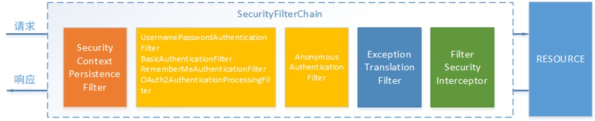
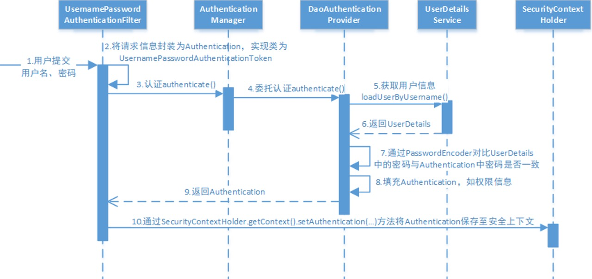
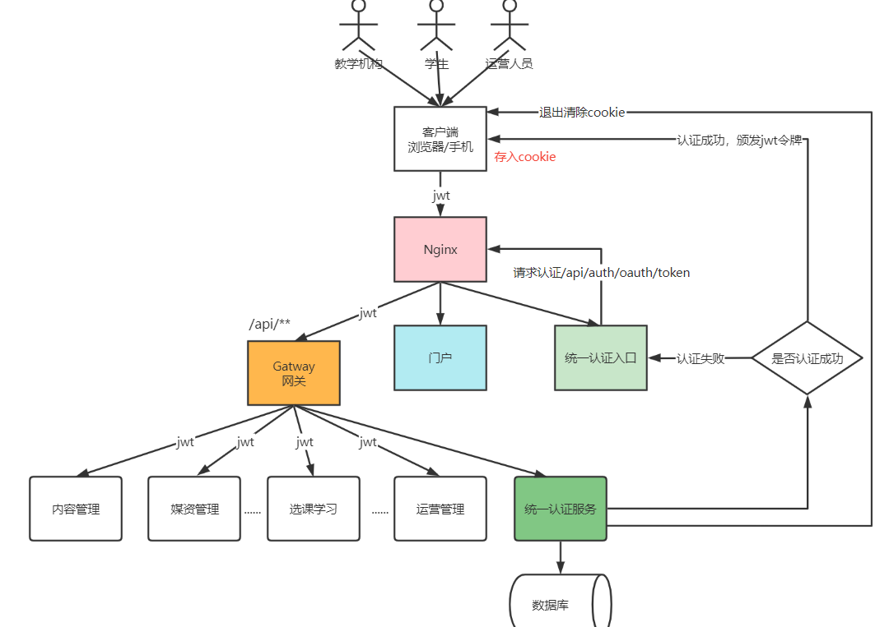
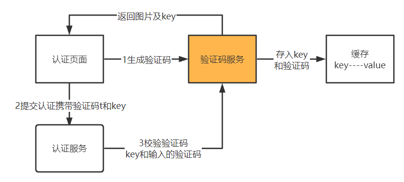
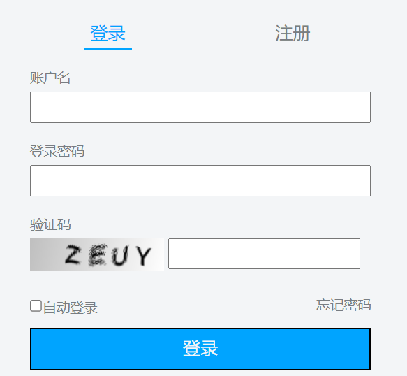
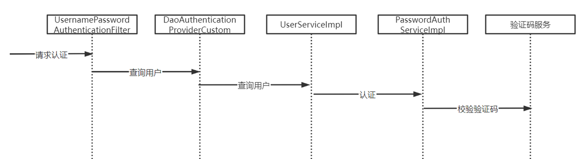

# 认证和授权

## 认证

认证即用户去访问系统资源时系统要求验证用户的身份信息。

- 身份合法方可继续访问。
- 未认证则需要去登录。

认证通过由认证服务向给用户颁发令牌，相当于访问系统的通行证，用户拿着令牌去访问系统的资源。

### 第三方认证

为了提高用户体验，很多网站有扫码登录的功能，如：微信扫码登录、QQ扫码登录等。扫码登录的好处是用户不用输入账号和密码，操作简便，另外一个好处就是有利于用户信息的共享，互联网的优势就是资源共享，用户也是一种资源，对于一个新网站如果让用户去注册是很困难的，如果提供了微信扫码登录将省去用户注册的成本，是一种非常有效的推广手段。

## 用户授权

用户认证通过后去访问系统的资源，系统会判断用户是否拥有访问资源的权限，只允许访问有权限的系统资源，没有权限的资源将无法访问，这个过程叫用户授权。

比如：用户去发布课程，系统首先进行用户身份认证，认证通过后继续判断用户是否有发布课程的权限，如果没有权限则拒绝继续访问系统，如果有权限则继续发布课程。

## 单点登录

项目基于微服务架构构建，微服务包括：内容管理服务、媒资管理服务、学习中心服务、系统管理服务等，为了提高用户体验性，用户只需要认证一次便可以在多个拥有访问权限的系统中访问，这个功能叫做单点登录。

> 单点登录（Single Sign On），简称为 SSO，是目前比较流行的企业业务整合的解决方案之一。SSO的定义是在多个应用系统中，用户只需要登录一次就可以访问所有相互信任的应用系统。

## Spring Security

认证功能几乎是每个项目都要具备的功能，它与业务无关。市面上有很多认证框架，如：Apache Shiro、CAS、Spring Security等。

Spring Security是spring家族的一份子且和Spring Cloud集成的很好，所以选用Spring Security作为认证服务的技术框架。

Spring Security 是一个功能强大且高度可定制的身份验证和访问控制框架，它是一个专注于为 Java 应用程序提供身份验证和授权的框架。

项目主页：https://spring.io/projects/spring-security

Spring cloud Security： https://spring.io/projects/spring-cloud-security

### 原理

Spring Security所解决的问题就是**安全访问控制**。

对所有进入系统的请求进行拦截，校验每个请求是否能够访问它所期望的资源。

Spring Security对Web资源的保护是靠Filter实现的。

初始化Spring Security时，会创建一个名为`SpringSecurityFilterChain`的Servlet过滤器，类型为`org.springframework.security.web.FilterChainProxy`，它实现了`javax.servlet.Filter`，因此外部的请求会经过此类。

Spring Security过虑器链结构图：


`FilterChainProxy`是一个代理，真正起作用的是`FilterChainProxy`中`SecurityFilterChain`所包含的各个Filter，同时这些Filter作为Bean被Spring管理，它们是Spring Security核心，各有各的职责，但他们并不直接处理用户的**认证**和**授权**，而是把它们交给了认证管理器`AuthenticationManager`和决策管理器`AccessDecisionManager`进行处理。

spring Security功能的实现主要是由一系列过滤器链相互配合完成。



下面介绍过滤器链中主要的几个过滤器及其作用：

- **SecurityContextPersistenceFilter**：这个Filter是整个拦截过程的入口和出口（也就是第一个和最后一个拦截器）
  - 请求开始时从配置好的 SecurityContextRepository 中获取 SecurityContext，然后把它设置给 SecurityContextHolder。
  - 在请求完成后将 SecurityContextHolder 持有的 SecurityContext 再保存到配置好的 SecurityContextRepository，同时清除 securityContextHolder 所持有的 SecurityContext。

- **UsernamePasswordAuthenticationFilter**：用于处理来自表单提交的认证。该表单必须提供对应的用户名和密码，其内部还有登录成功或失败后进行处理的`AuthenticationSuccessHandler`和`AuthenticationFailureHandler`，这些都可以根据需求做相关改变。
- **FilterSecurityInterceptor**：是用于保护web资源的，使用`AccessDecisionManager`对当前用户进行授权访问。
- **ExceptionTranslationFilter** 能够捕获来自 FilterChain 所有的异常，并进行处理。但是它只会处理两类异常：`AuthenticationException`和`AccessDeniedException`，其它的异常它会继续抛出。

### 执行流程



1. 用户提交用户名、密码被SecurityFilterChain中的`UsernamePasswordAuthenticationFilter`过滤器获取到，封装为请求Authentication，通常情况下是`UsernamePasswordAuthenticationToken`这个实现类。
2. 过滤器将Authentication提交至认证管理器`AuthenticationManager`进行认证。
3. 认证成功后，`AuthenticationManager`身份管理器返回一个被填充满了信息的（包括上面提到的权限信息，身份信息，细节信息，但密码通常会被移除）`Authentication`实例。
4. `SecurityContextHolder`安全上下文容器将上面填充了信息的`Authentication`，通过`SecurityContextHolder.getContext().setAuthentication(…)`方法，设置到其中。

AuthenticationManager接口（认证管理器）是认证相关的核心接口，也是发起认证的出发点，它的实现类为ProviderManager。而Spring Security支持多种认证方式，因此ProviderManager维护着一个`List<AuthenticationProvider>`列表，存放多种认证方式，最终实际的认证工作是由AuthenticationProvider完成的。
1. web表单的对应的AuthenticationProvider实现类为`DaoAuthenticationProvider`，它的内部又维护着一个`UserDetailsService`负责`UserDetails`的获取。最终AuthenticationProvider将`UserDetails`填充至`Authentication`。

## 注册登录


整合Spring Security实现JWT资源访问的认证和权限控制，保护应用的资源API。

整个流程确保了应用的安全性，通过对用户的身份验证和权限校验，来决定用户是否可以访问应用中特定的资源。

登录验证用户名和密码通过之后，生成jwt token返回给客户端，客户端之后的请求在请求头上面带上下发的JWT token，服务端使用JWT Filter验证请求访问头token，实现jwt跨域认证的效果。

引入依赖

```xml
<dependency>
    <groupId>org.springframework.boot</groupId>
    <artifactId>spring-boot-starter-security</artifactId>
    <version>${spring.boot.version}</version>
    <!-- 排除默认的日志-->
    <exclusions>
        <exclusion>
            <groupId>org.springframework.boot</groupId>
            <artifactId>spring-boot-starter-logging</artifactId>
        </exclusion>
    </exclusions>
</dependency>
<dependency>
    <groupId>io.jsonwebtoken</groupId>
    <artifactId>jjwt-api</artifactId>
    <version>0.12.6</version>
</dependency>
<dependency>
    <groupId>io.jsonwebtoken</groupId>
    <artifactId>jjwt-impl</artifactId>
    <version>0.12.6</version>
    <scope>runtime</scope>
</dependency>
<dependency>
    <groupId>io.jsonwebtoken</groupId>
    <artifactId>jjwt-jackson</artifactId>
    <version>0.12.6</version>
    <scope>runtime</scope>
</dependency>
```

### SecurityConfig

```java
import jakarta.annotation.Resource;
import org.springframework.context.annotation.Bean;
import org.springframework.context.annotation.Configuration;
import org.springframework.security.authentication.AuthenticationManager;
import org.springframework.security.config.Customizer;
import org.springframework.security.config.annotation.authentication.configuration.AuthenticationConfiguration;
import org.springframework.security.config.annotation.web.builders.HttpSecurity;
import org.springframework.security.config.annotation.web.configuration.EnableWebSecurity;
import org.springframework.security.config.http.SessionCreationPolicy;
import org.springframework.security.crypto.bcrypt.BCryptPasswordEncoder;
import org.springframework.security.crypto.password.PasswordEncoder;
import org.springframework.security.web.SecurityFilterChain;
import org.springframework.security.web.authentication.UsernamePasswordAuthenticationFilter;

@Configuration
@EnableWebSecurity
public class SecurityConfig {

    @Resource
    private AuthEntryPoint authEntryPoint;

    @Bean
    public SecurityFilterChain securityFilterChain(HttpSecurity http) throws Exception {
        http
                .csrf(csrf -> csrf.disable())  // 新式 Lambda 配置
                .exceptionHandling(exception -> exception
                        .authenticationEntryPoint(authEntryPoint)  // 自定义认证入口点
                )
                .sessionManagement(session -> session
                        .sessionCreationPolicy(SessionCreationPolicy.STATELESS)  // 因为jwt是无状态的，所以session管理策略改为无状态的
                )
                .authorizeHttpRequests(authorize -> authorize //放行相关端点
                        .requestMatchers(
                                "/api/auth/**",
                                "/user/**",
                                "/v2/api-docs",
                                "/configuration/ui",
                                "/configuration/security",
                                "/doc.html",
                                "/swagger-ui.html",
                                "/swagger-ui/**",
                                "/v3/api-docs/**",
                                "/swagger-resources/**",
                                "/webjars/**"
                        ).permitAll()  // 放行白名单
                        .anyRequest().authenticated()  // 其他请求需认证
                )
                .httpBasic(Customizer.withDefaults());  // 替换旧的 httpBasic() 写法

        // 添加 JWT 过滤器
        http.addFilterBefore(jwtAuthenticationFilter(), UsernamePasswordAuthenticationFilter.class);

        return http.build();
    }

    // 配置认证管理器，登录接口需要使用
    @Bean
    public AuthenticationManager authenticationManager
    (AuthenticationConfiguration authenticationConfiguration) throws Exception {
        return authenticationConfiguration.getAuthenticationManager();
    }

    //对用户密码进行加密
    @Bean
    public PasswordEncoder passwordEncoder() {
        return new BCryptPasswordEncoder();
    }

    @Bean
    public JWTAuthenticationFilter jwtAuthenticationFilter() {
        return new JWTAuthenticationFilter();
    }
}
```

### AuthenticationEntryPoint

没有权限时返回报错，而不是Spring Security默认的重定向登录页。需要添加登录异常的拦截处理类。

```java
import jakarta.servlet.ServletException;
import jakarta.servlet.http.HttpServletRequest;
import jakarta.servlet.http.HttpServletResponse;
import org.springframework.security.core.AuthenticationException;
import org.springframework.security.web.AuthenticationEntryPoint;
import org.springframework.stereotype.Component;

import java.io.IOException;

/**
 * 定义一个名为 AuthEntryPoint 的类，它实现了 AuthenticationEntryPoint 接口。这个类的作用是在用户尝试访问受保护的资源但未通过身份验证时，发送一个未授权的错误响应。
 * commence 方法是 AuthenticationEntryPoint 接口中的方法，当用户未通过身份验证时会被调用。
 * commence 方法接收三个参数：HttpServletRequest、HttpServletResponse 和 AuthenticationException。
 * 在方法内部，调用 response.sendError(HttpServletResponse.SC_UNAUTHORIZED, authException.getMessage()) 发送一个 401 未授权的 HTTP 响应，并附带异常信息。
 */
// @Component 注解表明这个类是一个 Spring 组件，会被 Spring 容器管理。
@Component
public class AuthEntryPoint implements AuthenticationEntryPoint {
    @Override
    public void commence(HttpServletRequest request, HttpServletResponse response, AuthenticationException authException) throws IOException, ServletException {
        response.sendError(HttpServletResponse.SC_UNAUTHORIZED, authException.getMessage());
    }
}
```

### UserDetailsService

Spring Security中的核心接口，用于提供用户的详细信息。Spring Security使用此接口来获取进行身份认证和授权的用户信息。

```java
import com.hh.user.dto.UserDto;
import com.hh.user.service.UserService;
import jakarta.annotation.Resource;
import org.springframework.security.core.GrantedAuthority;
import org.springframework.security.core.authority.SimpleGrantedAuthority;
import org.springframework.security.core.userdetails.User;
import org.springframework.security.core.userdetails.UserDetails;
import org.springframework.security.core.userdetails.UserDetailsService;
import org.springframework.security.core.userdetails.UsernameNotFoundException;
import org.springframework.stereotype.Component;

import java.util.Collection;
import java.util.stream.Collectors;

@Component // 注入到容器中
public class CustomUserDetailsService implements UserDetailsService {
    @Resource
    private UserService userService;

    @Override
    public UserDetails loadUserByUsername(String username) throws UsernameNotFoundException {
        UserDto user = userService.getUserByUsername(username);
        if (user == null) {
            return null;
        }
        // 返回包含用户信息和权限的 UserDetails 对象
        // import org.springframework.security.core.userdetails.User;
        return new User(user.getUsername(), user.getPassword(), getAuthorities(user));
    }

    //import org.springframework.security.core.GrantedAuthority;
    private Collection<? extends GrantedAuthority> getAuthorities(UserDto user) {
        return user.getRoles()
                .stream()
                .map(role -> new SimpleGrantedAuthority(role.getName()))
                .collect(Collectors.toList());
    }
}
```

### OncePerRequestFilter

验证token是否有效

JWTAuthenticationFilter 类是一个自定义的过滤器，用于在每次请求时验证 JWT 令牌。它继承自 OncePerRequestFilter，确保在每个请求中只执行一次过滤操作。 

通过AuthenticationFilter拦截用户请求并提取认证信息（用户名、密码、token），然后调用AuthenticationManager处理认证逻辑，认证逻辑会调用UserDetailsService来加载用户的详情信息（密码，用户名等），一旦认证成功，用户的信息会被设置到SecurityContext中，供后续的请求访问。

```java
import jakarta.annotation.Resource;
import jakarta.servlet.FilterChain;
import jakarta.servlet.ServletException;
import jakarta.servlet.http.HttpServletRequest;
import jakarta.servlet.http.HttpServletResponse;
import org.springframework.security.authentication.UsernamePasswordAuthenticationToken;
import org.springframework.security.core.context.SecurityContextHolder;
import org.springframework.security.core.userdetails.UserDetails;
import org.springframework.security.web.authentication.WebAuthenticationDetailsSource;
import org.springframework.stereotype.Component;
import org.springframework.web.filter.OncePerRequestFilter;

import java.io.IOException;

//过滤器，每次http请求时检查http请求头是否有有效的jwt令牌，对用户认证
@Component
public class JWTAuthenticationFilter extends OncePerRequestFilter {
    @Resource
    private JwtUtil jwtUtil;
    @Resource
    private CustomUserDetailsService customUserDetailsService;

    //过滤器，每次http请求时检查http请求头是否有有效的jwt令牌，对用户认证
    @Override
    protected void doFilterInternal(HttpServletRequest request, HttpServletResponse response,
                                    FilterChain filterChain) throws ServletException, IOException {
        //从请求中获取 JWT 令牌
        String token = getTokenFromRequest(request);
        //验证令牌的有效性
        if (token != null && jwtUtil.validateToken(token)) {
            //如果令牌有效，获取用户名
            String username = jwtUtil.getUsernameFromToken(token);
            //查询user详情
            UserDetails userDetails = customUserDetailsService.loadUserByUsername(username);
            //创建 UsernamePasswordAuthenticationToken 对象
            UsernamePasswordAuthenticationToken authentication =
                    new UsernamePasswordAuthenticationToken(userDetails,
                            null, userDetails.getAuthorities());
            //设置认证详细信息
            authentication.setDetails(new WebAuthenticationDetailsSource().buildDetails(request));
            //设置认证详细信息
            SecurityContextHolder.getContext().setAuthentication(authentication);
        }
        //继续过滤链
        filterChain.doFilter(request, response);
    }

    //从请求头里面获取token
    private String getTokenFromRequest(HttpServletRequest request) {
        String bearerToken = request.getHeader("Authorization");
        if (bearerToken != null && bearerToken.startsWith("Bearer ")) {
            return bearerToken.substring(7);
        }
        return null;
    }
}
```

## 网关认证

一个前端请求首先会经过网关，之后再路由到一个个的微服务。

API网关（Gateway）是应用程序客户端的单一入口点，它位于客户端和应用程序的后端服务集合之间。

流程

1. 客户端向API网关发送请求，该请求通常基于HTTP协议。
2. API网关验证HTTP请求。
3. API网关根据其允许列表和拒绝列表检查调用者的IP地址和其它HTTP请求头，还可以针对IP地址和HTTP请求头等属性执行基本的速率限制检查。例如：它可以拒绝来自超过一定速率的IP地址的请求。
4. API网关将请求传递给身份验证服务，以进行身份验证和授权。API网关从身份验证服务处接收经过身份验证的会话，其中包含允许请求执行的操作范围。
5. 对经过身份验证的会话应用更高级别的速率限制检查，如果超过限制，此时请求将被拒绝。
6. 在**服务发现组件**的帮助下，API网关通过路径匹配找到适当的后端服务来处理请求。
7. 网关将请求转换为适当的协议，并将转换后的请求发送到后端服务（例如gRPC）。当响应从后端服务返回时，网关会将响应转换回面向公众的协议，并将响应返回给客户端。

### 技术方案

认证服务颁发jwt令牌，客户端携带jwt访问微服务，统一让网关校验令牌的合法性，在每一个微服务处不再校验令牌的合法性。

所有访问微服务的请求都要经过网关，在网关进行用户身份的认证可以将很多非法的请求拦截到微服务以外，这叫做网关认证。

网关是基础设置的关键部分，应将其部署到多个区域以提高可用性。

### 网关的职责

**网站白名单维护**

针对不用认证的URL全部放行。

**身份验证和安全性**

进行身份验证和授权，保护后端服务。

除了白名单剩下的就是需要认证的请求，网关需要验证jwt的合法性，jwt合法则说明用户身份合法，否则说明身份不合法则拒绝继续访问。

**请求路由转发**

将请求转发到合适的微服务。

**协议转换和服务发现**

处理不同协议之间的转换，例如从 HTTP 到 MQTT。

**负载均衡**

分配请求到多个实例，以提高性能和可用性。

**断路**

网关应跟踪错误，并提供断路功能以防止服务过载。

**监控与日志记录**

收集和分析流量数据，以便于监控和故障排查。

**分析和计费**

**缓存**

### 网关不负责授权

对请求的授权操作在各个微服务进行，因为微服务最清楚用户有哪些权限访问哪些接口。

### 实现网关认证

#### 1、在网关工程添加依赖

```XML
<dependency>
    <groupId>org.springframework.cloud</groupId>
    <artifactId>spring-cloud-starter-security</artifactId>
</dependency>
<dependency>
    <groupId>org.springframework.cloud</groupId>
    <artifactId>spring-cloud-starter-oauth2</artifactId>
</dependency>
<dependency>
    <groupId>org.projectlombok</groupId>
    <artifactId>lombok</artifactId>
</dependency>
<!--解析json-->
<dependency>
    <groupId>com.alibaba</groupId>
    <artifactId>fastjson</artifactId>
</dependency>
```

#### 2、配置白名单文件security-whitelist.properties

```properties
/**=临时全部放开
/auth/**=认证地址，也就是注册登录申请令牌的接口
/content/open/**=内容管理公开访问接口
/media/open/**=媒资管理公开访问接口
```

注意：网关鉴权功能调试通过后，由于目前还没有开发认证功能，前端请求网关的URL不在白名单中间时会“没有认证”的错误，暂时在白名单中添加 全部放行配置，待认证功能开发完成再屏蔽全部放行配置。

重启网关工程，进行测试

1、申请令牌

2、通过网关访问资源服务

当token正确时可以正常访问资源服务，token验证失败返回token无效。

由于是在网关处进行令牌校验，所以在微服务处不再校验令牌的合法性，修改内容管理服务的ResouceServerConfig类，屏蔽authenticated()。

```Java
 @Override
 public void configure(HttpSecurity http) throws Exception {
  http.csrf().disable()
          .authorizeRequests()
//          .antMatchers("/r/**","/course/**").authenticated()//所有/r/**的请求必须认证通过
          .anyRequest().permitAll()
  ;
 }
```

## 用户认证

了解了Spring Security进行认证授权的过程，下面实现用户认证功能。

## 连接用户中心数据库认证

基于的认证流程在研究Spring Security过程中已经测试通过，到目前为止用户认证流程如下：



认证所需要的用户信息存储在用户中心数据库，现在需要将**认证服务连接数据库查询用户信息**。

前边学习Spring Security工作原理时有一张执行流程图。

`DaoAuthenticationProvider`就是用来查询数据库的。

用户提交账号和密码由`DaoAuthenticationProvider`调用`UserDetailsService`的`loadUserByUsername()`方法获取`UserDetails`用户信息。

查询`DaoAuthenticationProvider`的源代码如下：

```java
protected final UserDetails retrieveUser(String username, UsernamePasswordAuthenticationToken authentication) throws AuthenticationException {
    this.prepareTimingAttackProtection();

    try {
        UserDetails loadedUser = this.getUserDetailsService().loadUserByUsername(username);
        if (loadedUser == null) {
            throw new InternalAuthenticationServiceException("UserDetailsService returned null, which is an interface contract violation");
        } else {
            return loadedUser;
        }
    } catch (UsernameNotFoundException ex) {
        this.mitigateAgainsstTimingAttack(authentication);
        throw ex;
    } catch (InternalAuthenticationServiceException ex) {
        throw ex;
    } catch (Exception ex) {
        throw new InternalAuthenticationServiceException(ex.getMessage(), ex);
    }
}
```

UserDetailsService是一个接口，如下：

```Java
package org.springframework.security.core.userdetails;

public interface UserDetailsService {
    UserDetails loadUserByUsername(String var1) throws UsernameNotFoundException;
}
```

只要实现UserDetailsService 接口查询数据库得到用户信息返回UserDetails 类型的用户信息即可，框架调用loadUserByUsername()方法拿到用户信息之后是如何执行的，如下：

- 查询用户 -> UserDetailsService
  - 为NULL表示用户不存在，认证失败
  - 为UserDetails，开始比对密码
    - 密码错误，认证失败
    - 密码正确，认证通过

在研究Spring Security的过程中是将用户信息硬编码，存在内存的，所以要屏蔽原来定义的UserDetailsService如下：

```Java
    //配置用户信息服务
//    @Bean
//    public UserDetailsService userDetailsService() {
//        //这里配置用户信息,这里暂时使用这种方式将用户存储在内存中
//        InMemoryUserDetailsManager manager = new InMemoryUserDetailsManager();
//        manager.createUser(User.withUsername("zhangsan").password("123").authorities("p1").build());
//        manager.createUser(User.withUsername("lisi").password("456").authorities("p2").build());
//        return manager;
//    }
```

### 扩展用户身份信息

用户表中存储了用户的账号、手机号、email，昵称、qq等信息，`UserDetails`是用户信息接口，只返回了username、密码等信息。如下：

```Java
public interface UserDetails extends Serializable {
    Collection<? extends GrantedAuthority> getAuthorities();

    String getPassword();

    String getUsername();

    boolean isAccountNonExpired();

    boolean isAccountNonLocked();

    boolean isCredentialsNonExpired();

    boolean isEnabled();
}
```

扩展Spring Security的用户身份信息，在jwt令牌中存储用户的昵称、头像、qq等信息。

在认证阶段DaoAuthenticationProvider会调用UserDetailService查询用户的信息，这里是可以获取到齐全的用户信息的。由于JWT令牌中用户身份信息来源于UserDetails，UserDetails中仅定义了username为用户的身份信息，这里有两个思路：第一是可以扩展UserDetails，使之包括更多的自定义属性，第二也可以扩展username的内容 ，比如存入json数据内容作为username的内容。相比较而言，方案二比较简单还不用破坏UserDetails的结构，我们采用方案二。

下边自定义UserDetailsService：

```Java
package com.xuecheng.ucenter.service.impl;

import com.alibaba.fastjson.JSON;
import com.baomidou.mybatisplus.core.conditions.query.LambdaQueryWrapper;
import com.xuecheng.ucenter.mapper.XcUserMapper;
import com.xuecheng.ucenter.model.po.XcUser;
import org.springframework.beans.factory.annotation.Autowired;
import org.springframework.security.core.userdetails.User;
import org.springframework.security.core.userdetails.UserDetails;
import org.springframework.security.core.userdetails.UserDetailsService;
import org.springframework.security.core.userdetails.UsernameNotFoundException;
import org.springframework.stereotype.Service;

@Service
public class UserServiceImpl implements UserDetailsService {
    @Autowired
    XcUserMapper xcUserMapper;//查数据库用户
    /**
     * @description 根据账号查询用户信息
     * @param s  账号
     * @return org.springframework.security.core.userdetails.UserDetails
    */
    @Override
    public UserDetails loadUserByUsername(String s) throws UsernameNotFoundException {
        XcUser user = xcUserMapper.selectOne(new LambdaQueryWrapper<XcUser>().eq(XcUser::getUsername, s));
        if(user==null){
            //返回空，spring security框架自动抛出异常表示用户不存在
            return null;
        }
        //取出数据库存储的正确密码
        String password = user.getPassword();
        //用户权限,如果不加报Cannot pass a null GrantedAuthority collection
        String[] authorities = {"p1"};
 		//为了安全在令牌中不放密码
        user.setPassword(null);
        //将user对象转json
        String userString = JSON.toJSONString(user);
        //创建UserDetails对象给spring security框架返回，由框架进行密码比对
        UserDetails userDetails = User.withUsername(userString).password(password).authorities(authorities).build();
        return userDetails;
    }
}
```

数据库中的密码加过密的，用户输入的密码是明文，需要修改密码格式器`PasswordEncoder`，原来使用的是`NoOpPasswordEncoder`，它是通过明文方式比较密码，现在修改为`BCryptPasswordEncoder`，它是将用户输入的密码编码为`BCrypt`格式与数据库中的密码进行比对。

如下：

```Java
    @Bean
    public PasswordEncoder passwordEncoder() {
//        //密码为明文方式
//        return NoOpPasswordEncoder.getInstance();
        return new BCryptPasswordEncoder();
    }
```

通过测试代码测试BCryptPasswordEncoder，如下：

```Java
public static void main(String[] args) {
    String password = "111111";
    PasswordEncoder passwordEncoder = new BCryptPasswordEncoder();
    for(int i=0;i<5;i++) {
        //每个计算出的Hash值都不一样
        String hashPass = passwordEncoder.encode(password);
        System.out.println(hashPass);
        //虽然每次计算的密码Hash值不一样但是校验是通过的
        boolean f = passwordEncoder.matches(password, hashPass);
        System.out.println(f);
    }
}
```

修改数据库中的密码为Bcrypt格式，并且记录明文密码，稍后申请令牌时需要。

由于修改密码编码方式还需要将客户端的密钥更改为Bcrypt格式.

```Java
 @Override
  public void configure(ClientDetailsServiceConfigurer clients)
          throws Exception {
        clients.inMemory()// 使用in-memory存储
                .withClient("XcWebApp")// client_id
//                .secret("secret")//客户端密钥
                .secret(new BCryptPasswordEncoder().encode("XcWebApp"))//客户端密钥
                .resourceIds("xuecheng-plus")//资源列表
                .authorizedGrantTypes("authorization_code", "password","client_credentials","implicit","refresh_token")// 该client允许的授权类型authorization_code,password,refresh_token,implicit,client_credentials
                .scopes("all")// 允许的授权范围
                .autoApprove(false)//false跳转到授权页面
                //客户端接收授权码的重定向地址
                .redirectUris("http://www.51xuecheng.cn")
   ;
  }
```

现在重启认证服务进行测试。

user_name存储了用户信息的json格式，在资源服务中就可以取出该json格式的内容转为用户对象去使用。

### 资源服务获取用户身份

编写工具类在各个微服务中去使用，获取当前登录用户的对象。

在content-api中定义此类：

```Java
import com.alibaba.fastjson.JSON;
import lombok.Data;
import lombok.extern.slf4j.Slf4j;
import org.springframework.security.core.context.SecurityContextHolder;

import java.io.Serializable;
import java.time.LocalDateTime;

/**
 * @description 获取当前用户身份工具类
 */
@Slf4j
public class SecurityUtil {

    public static XcUser getUser() {
        try {
            // 拿到当前用户身份
            Object principalObj = SecurityContextHolder.getContext().getAuthentication().getPrincipal();
            if (principalObj instanceof String) {
                //取出用户身份信息
                String principal = principalObj.toString();
                //将json转成对象
                XcUser user = JSON.parseObject(principal, XcUser.class);
                return user;
            }
        } catch (Exception e) {
            log.error("获取当前登录用户身份出错:{}", e.getMessage());
            e.printStackTrace();
        }
        return null;
    }


    @Data
    public static class XcUser implements Serializable {

        private static final long serialVersionUID = 1L;
        private String id;
        private String username;
        private String password;
        private String salt;
        private String name;
        private String nickname;
        private String wxUnionid;
        private String companyId;
        /**
         * 头像
         */
        private String userpic;
        private String utype;
        private LocalDateTime birthday;
        private String sex;
        private String email;
        private String cellphone;
        private String qq;
        /**
         * 用户状态
         */
        private String status;
        private LocalDateTime createTime;
        private LocalDateTime updateTime;
    }

}
```

下边在内容管理服务中测试此工具类，以查询课程信息接口为例：

```Java
@ApiOperation("根据课程id查询课程基础信息")
@GetMapping("/course/{courseId}")
public CourseBaseInfoDto getCourseBaseById(@PathVariable("courseId") Long courseId){
    //取出当前用户身份
//    Object principal = SecurityContextHolder.getContext().getAuthentication().getPrincipal();
   	SecurityUtil.XcUser user = SecurityUtil.getUser();
    System.out.println(user);

    return courseBaseInfoService.getCourseBaseInfo(courseId);
}
```

重启内容管理服务：

1、启动认证服务、网关、内容管理服务

2、生成新的令牌

3、携带令牌访问内容管理服务的查询课程接口

## 支持认证方式多样

### 统一认证入口

常见的用户身份认证的表现形式有：账号密码认证、手机验证码认证、微信扫码登录等。

1、账号和密码认证

采用OAuth2协议的密码模式即可实现。

2、手机号加验证码认证

用户认证提交的是手机号和验证码，并不是账号和密码。

3、微信扫码认证

基于OAuth2协议与微信交互，客户端网站向微信服务器申请到一个令牌，然后携带令牌去微信查询用户信息，查询成功则用户在客户端网站项目认证通过。

目前我们测试通过OAuth2的密码模式，用户认证会提交账号和密码，由`DaoAuthenticationProvider`调用`UserDetailsService`的`loadUserByUsername()`方法获取`UserDetails`用户信息。

前边我们自定义了`UserDetailsService`接口实现类，通过`loadUserByUsername()`方法根据账号查询用户信息。

而不同的认证方式提交的数据不一样，比如：手机加验证码方式会提交手机号和验证码，账号密码方式会提交账号、密码、验证码。

我们可以在`loadUserByUsername()`方法上作文章，将用户原来提交的账号数据改为提交json数据，json数据可以扩展不同认证方式所提交的各种参数。

首先创建一个DTO类表示认证的参数：

```Java
import lombok.Data;

import java.util.HashMap;
import java.util.Map;

/**
 * @description 认证用户请求参数
 */
@Data
public class AuthParamsDto {

    private String username; //用户名
    private String password; //域  用于扩展
    private String cellphone;//手机号
    private String checkcode;//验证码
    private String checkcodekey;//验证码key
    private String authType; // 认证的类型   password:用户名密码模式类型    sms:短信模式类型
    private Map<String, Object> payload = new HashMap<>();//附加数据，作为扩展，不同认证类型可拥有不同的附加数据。如认证类型为短信时包含smsKey : sms:3d21042d054548b08477142bbca95cfa; 所有情况下都包含clientId

}
```

此时loadUserByUsername()方法可以修改如下：

```Java
import com.alibaba.fastjson.JSON;
import com.baomidou.mybatisplus.core.conditions.query.LambdaQueryWrapper;
import com.xuecheng.ucenter.mapper.XcUserMapper;
import com.xuecheng.ucenter.model.dto.AuthParamsDto;
import com.xuecheng.ucenter.model.po.XcUser;
import lombok.extern.slf4j.Slf4j;
import org.springframework.beans.factory.annotation.Autowired;
import org.springframework.security.core.userdetails.User;
import org.springframework.security.core.userdetails.UserDetails;
import org.springframework.security.core.userdetails.UserDetailsService;
import org.springframework.security.core.userdetails.UsernameNotFoundException;
import org.springframework.stereotype.Service;

/**
 * @author Mr.M
 * @version 1.0
 * @description 自定义UserDetailsService用来对接Spring Security
 * @date 2022/9/28 18:09
 */
@Slf4j
@Service
public class UserServiceImpl implements UserDetailsService {

    @Autowired
    XcUserMapper xcUserMapper;

    /**
     * @description 查询用户信息组成用户身份信息
     * @param s  AuthParamsDto类型的json数据
     * @return org.springframework.security.core.userdetails.UserDetails
    */
    @Override
    public UserDetails loadUserByUsername(String s) throws UsernameNotFoundException {

        AuthParamsDto authParamsDto = null;
        try {
            //将认证参数转为AuthParamsDto类型
            authParamsDto = JSON.parseObject(s, AuthParamsDto.class);
        } catch (Exception e) {
            log.info("认证请求的参数不符合项目要求:{}",s);
            throw new RuntimeException("认证请求数据格式不对");
        }
        //账号
        String username = authParamsDto.getUsername();
        XcUser user = xcUserMapper.selectOne(new LambdaQueryWrapper<XcUser>().eq(XcUser::getUsername, username));
        if(user==null){
            //返回空表示用户不存在
            return null;
        }
        //取出数据库存储的正确密码
        String password  =user.getPassword();
        //用户权限,如果不加报Cannot pass a null GrantedAuthority collection
        String[] authorities = {"p1"};
        //将user对象转json
        String userString = JSON.toJSONString(user);
        //创建UserDetails对象
        UserDetails userDetails = User.withUsername(userString).password(password).authorities(authorities).build();
        return userDetails;
    }

}
```

原来的`DaoAuthenticationProvider`会进行密码校验，现在重新定义`DaoAuthenticationProviderCustom`类，重写类的`additionalAuthenticationChecks`方法。

```Java
import lombok.extern.slf4j.Slf4j;
import org.springframework.beans.factory.annotation.Autowired;
import org.springframework.security.authentication.BadCredentialsException;
import org.springframework.security.authentication.UsernamePasswordAuthenticationToken;
import org.springframework.security.authentication.dao.DaoAuthenticationProvider;
import org.springframework.security.core.AuthenticationException;
import org.springframework.security.core.userdetails.UserDetails;
import org.springframework.security.core.userdetails.UserDetailsService;
import org.springframework.stereotype.Component;

/**
 * @description 自定义DaoAuthenticationProvider
 */
@Slf4j
@Component
public class DaoAuthenticationProviderCustom extends DaoAuthenticationProvider {

 @Autowired
 public void setUserDetailsService(UserDetailsService userDetailsService) {
  super.setUserDetailsService(userDetailsService);
 }

 //屏蔽密码对比
 protected void additionalAuthenticationChecks(UserDetails userDetails, UsernamePasswordAuthenticationToken authentication) throws AuthenticationException {

 }

}
```

修改WebSecurityConfig类指定daoAuthenticationProviderCustom

```Java
@Autowired
DaoAuthenticationProviderCustom daoAuthenticationProviderCustom;

@Override
protected void configure(AuthenticationManagerBuilder auth) throws Exception {
    auth.authenticationProvider(daoAuthenticationProviderCustom);
}
```

此时可以重启认证服务，测试申请令牌接口，传入的账号信息改为json数据，如下：

```Plain
################扩展认证请求参数后######################
###密码模式
POST {{auth_host}}/auth/oauth/token?client_id=XcWebApp&client_secret=XcWebApp&grant_type=password&username={"username":"stu1","authType":"password","password":"111111"}
```

经过测试发现loadUserByUsername()方法可以正常接收到认证请求中的json数据。

有了这些认证参数我们可以定义一个认证Service接口去进行各种方式的认证。

定义用户信息，为了扩展性让它继承XcUser

```Java
@Data
public class XcUserExt extends XcUser {
}
```

定义认证Service接口

```Java
package com.xuecheng.ucenter.service;

import com.xuecheng.ucenter.model.dto.AuthParamsDto;
import com.xuecheng.ucenter.model.po.XcUser;

/**
 * @description 认证service
 */
public interface AuthService {

   /**
    * @description 认证方法
    * @param authParamsDto 认证参数
    * @return com.xuecheng.ucenter.model.po.XcUser 用户信息
   */
   XcUserExt execute(AuthParamsDto authParamsDto);

}
```

loadUserByUsername()修改如下：

到此我们基于Spring Security认证流程修改为如下：

- 请求认证：`UsernamePasswordAuthenticationFilter`
- 查询用户：`DaoAuthenticationProvider`
- 查询用户：`UserServiceImpl`
- 认证：`AuthService`

### 实现账号密码认证

上面定义了AuthService认证接口，下边实现该接口实现账号密码认证

会用到策略模式。

```Java
import com.baomidou.mybatisplus.core.conditions.query.LambdaQueryWrapper;
import com.xuecheng.ucenter.mapper.XcUserMapper;
import com.xuecheng.ucenter.model.dto.AuthParamsDto;
import com.xuecheng.ucenter.model.po.XcUser;
import com.xuecheng.ucenter.service.AuthService;
import org.springframework.beans.factory.annotation.Autowired;
import org.springframework.security.crypto.bcrypt.BCryptPasswordEncoder;
import org.springframework.security.crypto.password.PasswordEncoder;
import org.springframework.stereotype.Service;

/**
 * @description 账号密码认证
 */
@Service("password_authservice")//指定bean的名称
public class PasswordAuthServiceImpl implements AuthService {

 @Autowired
 XcUserMapper xcUserMapper;

 @Autowired
 PasswordEncoder passwordEncoder;

 @Override
 public XcUserExt execute(AuthParamsDto authParamsDto) {

  //账号
  String username = authParamsDto.getUsername();
  XcUser user = xcUserMapper.selectOne(new LambdaQueryWrapper<XcUser>().eq(XcUser::getUsername, username));
  if(user==null){
   //返回空表示用户不存在
   throw new RuntimeException("账号不存在");
  }
  XcUserExt xcUserExt = new XcUserExt();
  BeanUtils.copyProperties(user,xcUserExt);
  //校验密码
  //取出数据库存储的正确密码
  String passwordDb = user.getPassword();
  //用户输入的密码
  String passwordForm = authParamsDto.getPassword();
  boolean matches = passwordEncoder.matches(passwordForm, passwordDb);
  if(!matches){
   throw new RuntimeException("账号或密码错误");
  }
  return xcUserExt;
 }
  
}
```

修改UserServiceImpl类，根据认证方式使用不同的认证bean

```Java
import com.alibaba.fastjson.JSON;
import com.baomidou.mybatisplus.core.conditions.query.LambdaQueryWrapper;
import com.xuecheng.ucenter.mapper.XcUserMapper;
import com.xuecheng.ucenter.model.dto.AuthParamsDto;
import com.xuecheng.ucenter.model.po.XcUser;
import com.xuecheng.ucenter.service.AuthService;
import lombok.extern.slf4j.Slf4j;
import org.springframework.beans.factory.annotation.Autowired;
import org.springframework.context.ApplicationContext;
import org.springframework.security.core.userdetails.User;
import org.springframework.security.core.userdetails.UserDetails;
import org.springframework.security.core.userdetails.UserDetailsService;
import org.springframework.security.core.userdetails.UsernameNotFoundException;
import org.springframework.stereotype.Service;

/**
 * @description 自定义UserDetailsService用来对接Spring Security
 */
@Slf4j
@Service
public class UserServiceImpl implements UserDetailsService {

    @Autowired
    XcUserMapper xcUserMapper;

    //注入spring 容器
    @Autowired
    ApplicationContext applicationContext;

//    @Autowired
//    AuthService authService;

    /**
     * @description 查询用户信息组成用户身份信息
     * @param s  AuthParamsDto类型的json数据
     * @return org.springframework.security.core.userdetails.UserDetails
    */
    @Override
    public UserDetails loadUserByUsername(String s) throws UsernameNotFoundException {

        AuthParamsDto authParamsDto = null;
        try {
            //将认证参数转为AuthParamsDto类型
            authParamsDto = JSON.parseObject(s, AuthParamsDto.class);
        } catch (Exception e) {
            log.info("认证请求不符合项目要求:{}",s);
            throw new RuntimeException("认证请求数据格式不对");
        }

        //认证方法
        String authType = authParamsDto.getAuthType();
        //根据认证类型从spring容器中取出指定的bean
        AuthService authService =  applicationContext.getBean(authType + "_authservice",AuthService.class);
        //调用execute方法，完成认证
        XcUserExt user = authService.execute(authParamsDto);

        return getUserPrincipal(user);
    }

    /**
     * @description 查询用户信息
     * @param user  用户id，主键
     * @return com.xuecheng.ucenter.model.po.XcUser 用户信息
    */
    public UserDetails getUserPrincipal(XcUserExt user){
        //用户权限,如果不加报Cannot pass a null GrantedAuthority collection
        String[] authorities = {"p1"};
        String password = user.getPassword();
        //为了安全在令牌中不放密码
        user.setPassword(null);
        //将user对象转json
        String userString = JSON.toJSONString(user);
        //创建UserDetails对象
        UserDetails userDetails = User.withUsername(userString).password(password ).authorities(authorities).build();
        return userDetails;
    }

}
```

重启认证服务，测试申请令牌接口。

1、测试账号和密码都正确的情况是否可以申请令牌成功。

2、测试密码错误的情况。

3、测试账号不存在情况。

## 验证码服务

一些比较复杂的图形验证码可以防止恶性攻击，比如：XSS跨站脚本攻击、CSRF跨站请求伪造攻击。

为了保护系统的安全在一些比较重要的操作都需要`验证码服务`，例如：

- 认证
- 找回密码
- 人机判断
- 支付验证

验证码的类型有：图片、语音、短信验证码等，验证码模块也是一个微服务。

创建单独的验证码服务为各业务提供验证码的生成、校验等服务。

定义nacos配置文件

```YAML
server:
  servlet:
    context-path: /checkcode
  port: 63075
```

注意修改bootstrap.yml中的命名空间为自己定义的命名空间。

配置redis-dev.yaml，保存redis服务启动

内容如下：

```yaml
spring: 
  redis:
    host: 192.168.101.65
    port: 6379
    password: redis
    database: 0
    lettuce:
      pool:
        max-active: 20
        max-idle: 10
        min-idle: 0
    timeout: 10000
    #redisson:
      #配置文件目录
      #config: classpath:singleServerConfig.yaml
```

### 验证码接口

验证码服务对外提供的接口有：

1、生成验证码

2、校验验证码。

验证码服务如何生成并校验验证码？

拿图片验证码举例：

1. 生成一个指定位数的验证码，根据需要可能是数字、数字字母组合或文字。
2. 根据生成的验证码生成一个图片并返回给页面
3. 给生成的验证码分配一个key，将key和验证码一同存入缓存。这个key和图片一同返回给页面。
4. 用户输入验证码，连同key一同提交至认证服务。
5. 认证服务拿key和输入的验证码请求验证码服务去校验
6. 验证码服务根据key从缓存（redis）取出正确的验证码和用户输入的验证码进行比对，如果相同则校验通过，否则不通过。



根据接口分析，验证码服务controller接口如下：

```Java
import com.xuecheng.base.model.RestResponse;
import com.xuecheng.checkcode.model.CheckCodeParamsDto;
import com.xuecheng.checkcode.model.CheckCodeResultDto;
import com.xuecheng.checkcode.service.CheckCodeService;
import io.swagger.annotations.Api;
import io.swagger.annotations.ApiImplicitParam;
import io.swagger.annotations.ApiImplicitParams;
import io.swagger.annotations.ApiOperation;
import org.springframework.beans.factory.annotation.Autowired;
import org.springframework.web.bind.annotation.*;

import javax.annotation.Resource;
import java.util.Map;

/**
 * @description 验证码服务接口
 */
@Api(value = "验证码服务接口")
@RestController
public class CheckCodeController {

    @ApiOperation(value="生成验证信息", notes="生成验证信息")
    @PostMapping(value = "/pic")
    public CheckCodeResultDto generatePicCheckCode(CheckCodeParamsDto checkCodeParamsDto){
        
    }

    @ApiOperation(value="校验", notes="校验")
    @ApiImplicitParams({
            @ApiImplicitParam(name = "name", value = "业务名称", required = true, dataType = "String", paramType="query"),
            @ApiImplicitParam(name = "key", value = "验证key", required = true, dataType = "String", paramType="query"),
            @ApiImplicitParam(name = "code", value = "验证码", required = true, dataType = "String", paramType="query")
    })
    @PostMapping(value = "/verify")
    public Boolean verify(String key, String code){
        
    }
}
```

1、生成验证码接口

```Plain
POST {{checkcode_host}}/checkcode/pic
```

2、校验验证码接口

根据生成验证码返回的key以及日志中输出正确的验证码去测试。

```Bash
POST {{checkcode_host}}/checkcode/verify?key=checkcode4506b95bddbe46cdb0d56810b747db1b&code=70dl
```

## 账号密码认证

下边实现账号密码认证，输出如下图：



执行流程如下：



### 账号密码认证开发

1、在认证服务定义远程调用验证码服务的接口

```Java
package com.xuecheng.ucenter.feignclient;

import org.springframework.cloud.openfeign.FeignClient;
import org.springframework.web.bind.annotation.PostMapping;
import org.springframework.web.bind.annotation.RequestParam;

//value 服务名
//fallbackFactory 降级方法执行的逻辑
@FeignClient(value = "checkcode",fallbackFactory = CheckCodeClientFactory.class)
@RequestMapping("/checkcode")
public interface CheckCodeClient {

 @PostMapping(value = "/verify")
 public Boolean verify(@RequestParam("key") String key,@RequestParam("code") String code);

}
```

CheckCodeClientFactory:

```Java
@Slf4j
@Component
public class CheckCodeClientFactory implements FallbackFactory<CheckCodeClient> {
    @Override
    public CheckCodeClient create(Throwable throwable) {
        return new CheckCodeClient() {
            @Override
            public Boolean verify(String key, String code) {
                log.debug("调用验证码服务熔断异常:{}", throwable.getMessage());
                return null;
            }
        };
    }
}
```

启动类添加：

```Java
@EnableFeignClients(basePackages={"com.xuecheng.*.feignclient"})
```

配置文件引入feign-dev.yaml

```Java
- data-id: feign-${spring.profiles.active}.yaml
  group: xuecheng-plus-common
  refresh: true
```

2、完善PasswordAuthServiceImpl

```Java
package com.xuecheng.ucenter.service.impl;

import com.baomidou.mybatisplus.core.conditions.query.LambdaQueryWrapper;
import com.xuecheng.ucenter.feignclient.CheckCodeClient;
import com.xuecheng.ucenter.mapper.XcUserMapper;
import com.xuecheng.ucenter.model.dto.AuthParamsDto;
import com.xuecheng.ucenter.model.po.XcUser;
import com.xuecheng.ucenter.service.AuthService;
import org.apache.commons.lang.StringUtils;
import org.springframework.beans.factory.annotation.Autowired;
import org.springframework.security.crypto.bcrypt.BCryptPasswordEncoder;
import org.springframework.security.crypto.password.PasswordEncoder;
import org.springframework.stereotype.Service;

/**
 * @description 账号密码认证
 */
 @Service("password_authservice")
public class PasswordAuthServiceImpl implements AuthService {

 @Autowired
 XcUserMapper xcUserMapper;

 @Autowired
 PasswordEncoder passwordEncoder;
 @Autowired
 CheckCodeClient checkCodeClient;

 @Override
 public XcUser execute(AuthParamsDto authParamsDto) {

  //校验验证码
  String checkcode = authParamsDto.getCheckcode();
  String checkcodekey = authParamsDto.getCheckcodekey();

  if(StringUtils.isBlank(checkcodekey) || StringUtils.isBlank(checkcode)){
   throw new RuntimeException("验证码为空");
  }
  Boolean verify = checkCodeClient.verify(checkcodekey, checkcode);
  if(!verify){
   throw new RuntimeException("验证码输入错误");
  }
  //账号
  String username = authParamsDto.getUsername();
  XcUser user = xcUserMapper.selectOne(new LambdaQueryWrapper<XcUser>().eq(XcUser::getUsername, username));
  if(user==null){
   //返回空表示用户不存在
   throw new RuntimeException("账号不存在");
  }
  //校验密码
  //取出数据库存储的正确密码
  String passwordDb  =user.getPassword();
  String passwordForm = authParamsDto.getPassword();
  boolean matches = passwordEncoder.matches(passwordForm, passwordDb);
  if(!matches){
   throw new RuntimeException("账号或密码错误");
  }
  return user;
 }
}
```

小技巧：目前账号密码方式添加了验证码校验，为了后期获取令牌方便可以重新定义一个不需要验证码校验的认证类AuthService ，AuthService 中去掉验证码的校验，方便生成令牌。

### 账号密码认证测试

1. 使用浏览器访问客户端网站地址。

2. 首先测试验证码，分别输入正确的验证码和错误的验证码进行测试。

3. 输入正确的账号密码和错误的账号密码进行测试。

4. 登录成功将jwt令牌存储cookie。

5. 测试自动登录。

   勾选自动登录cookie生成时间为30天，不勾选自动登录关闭浏览器窗口后自动删除cookie。
