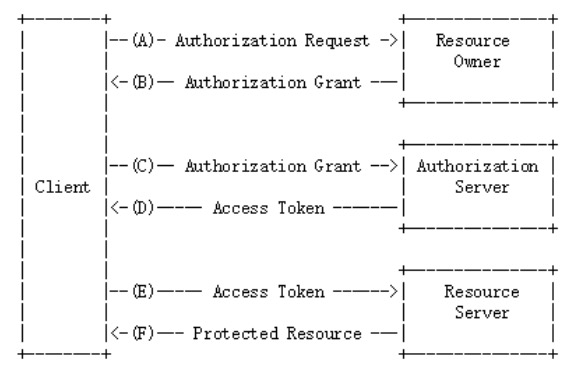

# OAuth2协议

微信扫码认证，是一种第三方认证的方式，这种认证方式是基于**OAuth2协议**实现。

OAUTH协议为用户资源的授权提供了一个安全的、开放而又简易的标准。

- 任何第三方都可以使用OAUTH认证服务，任何服务提供商都可以实现自身的OAUTH认证服务，因而OAUTH是开放的。
- 业界提供了OAUTH的多种实现如PHP、JavaScript，Java，Ruby等各种语言开发包，大大节约了程序员的时间，因而OAUTH是简易的。
- 互联网很多服务如Open API，很多大公司如Google，Yahoo，Microsoft等都提供了OAUTH认证服务，这些都足以说明OAUTH标准逐渐成为开放资源授权的标准。

参考：https://baike.baidu.com/item/oAuth/7153134?fr=aladdin

Oauth协议：https://tools.ietf.org/html/rfc6749

接下来认识Oauth2.0的认证流程：

引自Oauth2.0协议rfc6749 https://tools.ietf.org/html/rfc6749

## Oauth2中的角色

1. 资源

   用户信息，在微信中存储。

2. 资源拥有者（用户本人）

   通常用户是用户信息资源的拥有者，也可以是应用程序。

   A：客户端请求资源拥有者授权。

   B：资源拥有者授权客户端访问自己的用户信息。

3. 客户端（手机客户端、浏览器等）

   黑马程序员网站即客户端。

   本身不存储资源，需要通过资源拥有者的授权后携带令牌去请求资源服务器的资源（用户信息）。

4. 授权服务器（也称认证服务器）

   微信负责认证当前用户的身份，负责为客户端颁发令牌。

   C：客户端网站携带授权码请求认证。

   D：认证通过颁发令牌。

5. 资源服务器（微信）

   存储资源的服务器。用户信息，在微信中存储。

   E：客户端网站携带令牌请求资源服务器获取资源。

   F：资源服务器校验令牌通过后提供受保护资源。

## OAuth2的授权模式

Spring Security支持OAuth2认证，OAuth2提供授权码模式、密码模式、简化模式、客户端模式等四种授权模式，其中授权码模式和密码模式应用较多，微信扫码登录就是基于授权码模式。

OAuth2的几个授权模式是根据不同的应用场景**以不同的方式去认证服务获取令牌**，最终**通过令牌去获取资源**。

## 1、授权码模式

授权码模式简单理解是使用授权码去获取令牌，授权码的获取需要资源拥有者亲自授权同意才可以获取。

以微信扫码登录为例：

1. 用户进入客户端网站登录页面，打开微信扫码。

   微信扫码的目的是通过微信认证登录客户端网站，客户端网站需要从微信获取当前用户的身份信息才会让当前用户在客户端网站登录成功。

2. 客户端向认证服务请求授权，请求授权时会携带客户端的URL，此URL为下发授权码的重定向地址。

3. 认证服务向资源拥有者返回授权页面。

4. 资源拥有者（用户）授权客户端网站访问用户信息

   资源拥有者扫描二维码表示资源拥有者请求微信进行认证，微信认证通过向用户手机返回**授权页面**询问用户是否授权客户端网站访问自己在微信的用户信息，用户点击“确认登录”表示同意授权，**微信认证服务器颁发一个授权码给客户端网站**。

   只有资源拥有者同意微信才允许客户端网站访问资源。

5. 认证服务向客户端地址重定向并携带授权码。

   客户端网站获取到授权码

6. 客户端携带授权码请求**微信认证服务器**申请令牌（此交互过程用户看不到）。

7. 微信认证服务器向客户端网站响应令牌（此交互过程用户看不到）。

8. 客户端网站携带令牌请求**微信资源服务器**获取资源即用户信息。

9. 资源服务器返回受保护资源即用户信息。

10. 客户端网站接收到用户信息，此时用户在客户端网站登录成功。

## 2、密码模式

密码模式相对授权码模式简单，授权码模式需要借助浏览器供用户亲自授权，密码模式不用借助浏览器。

1. 资源拥有者（用户）提供账号和密码。
2. 客户端网站向认证服务申请令牌，请求中携带账号和密码。
3. 认证服务校验账号和密码正确颁发令牌。

这种模式十分简单，但是却意味着将用户敏感信息泄漏给了client，因此这就说明这种模式只能用于client是我们自己开发的情况下。

**授权码模式适合客户端和认证服务非同一个系统的情况，所以本项目使用授权码模式完成微信扫码认证，采用密码模式作为前端请求微服务的认证方式。**

---

## spring-boot-starter-oauth2-resource-server

用来保护资源，比如API端点，让它们需要OAuth2的令牌才能访问。

## spring-security-oauth2-authorization-servers

`spring-security-oauth2-authorization-server` 是用于处理 OAuth2 认证和授权的组件。

- **用途**: 用于构建 OAuth2 授权服务器。
- **功能**:
  - 提供 OAuth2 授权服务，管理和颁发访问令牌。
  - 支持多种授权模式（如授权码、客户端凭证等）。
  - 适用于需要提供 OAuth2 授权服务的应用。
