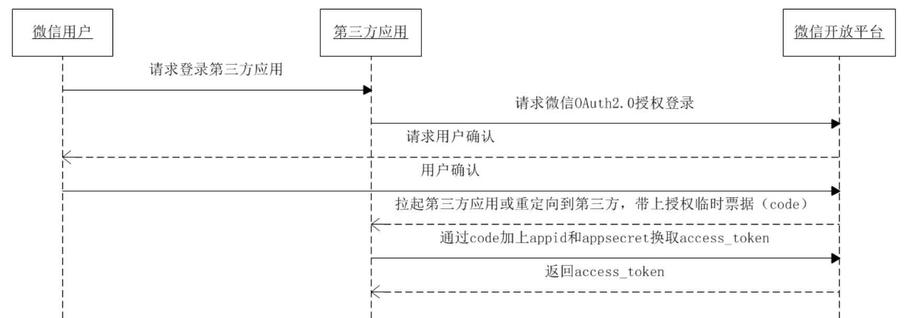
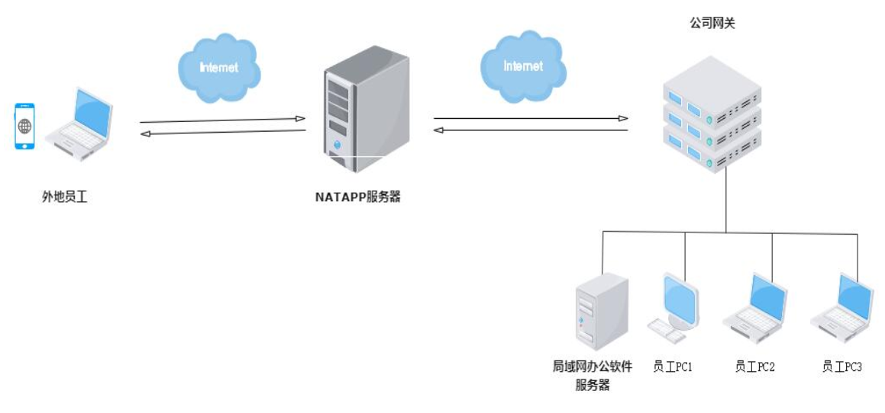
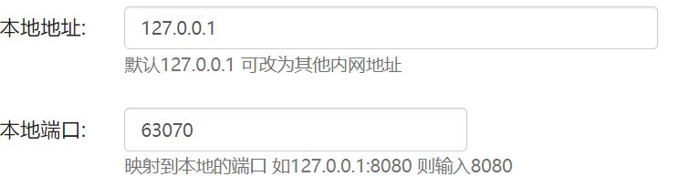
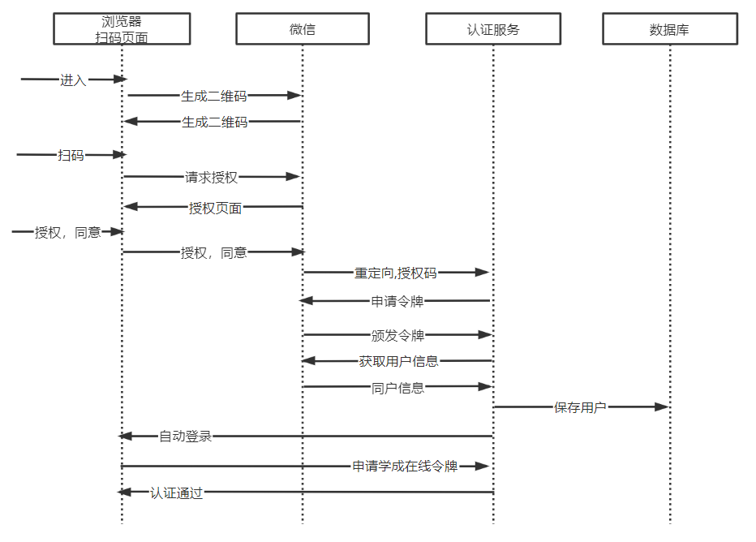

# 微信扫码登录

## 接入规范

### 1 接入流程

微信扫码登录基于OAuth2协议的授权码模式，

接口文档：

https://developers.weixin.qq.com/doc/oplatform/Website_App/WeChat_Login/Wechat_Login.html

流程如下：



第三方应用获取access_token令牌后即可请求微信获取用户的信息，成功获取到用户的信息表示用户在第三方应用认证成功。

### 2 请求获取授权码

第三方使用网站应用授权登录前请注意已获取相应网页授权作用域（scope=snsapi_login），则可以通过在 PC 端打开以下链接： https://open.weixin.qq.com/connect/qrconnect?appid=APPID&redirect_uri=REDIRECT_URI&response_type=code&scope=SCOPE&state=STATE#wechat_redirect 若提示“该链接无法访问”，请检查参数是否填写错误，如redirect_uri的域名与审核时填写的授权域名不一致或 scope 不为snsapi_login。

**参数说明**

| 参数          | 是否必须 | 说明                                                         |
| ------------- | -------- | ------------------------------------------------------------ |
| appid         | 是       | 应用唯一标识                                                 |
| redirect_uri  | 是       | 请使用 urlEncode 对链接进行处理                              |
| response_type | 是       | 填code                                                       |
| scope         | 是       | 应用授权作用域，拥有多个作用域用逗号（,）分隔，网页应用目前仅填写snsapi_login |
| state         | 否       | 用于保持请求和回调的状态，授权请求后原样带回给第三方。该参数可用于防止 csrf 攻击（跨站请求伪造攻击），建议第三方带上该参数，可设置为简单的随机数加 session 进行校验 |
| lang          | 否       | 界面语言，支持cn（中文简体）与en（英文），默认为cn           |

**返回说明**

用户允许授权后，将会重定向到redirect_uri的网址上，并且带上 code 和state参数

```Plain
redirect_uri?code=CODE&state=STATE
```

若用户禁止授权，则不会发生重定向。

登录一号店网站应用 https://test.yhd.com/wechat/login.do 打开后，一号店会生成 state 参数，跳转到 https://open.weixin.qq.com/connect/qrconnect?appid=wxbdc5610cc59c1631&redirect_uri=https%3A%2F%2Fpassport.yhd.com%2Fwechat%2Fcallback.do&response_type=code&scope=snsapi_login&state=3d6be0a4035d839573b04816624a415e#wechat_redirect 微信用户使用微信扫描二维码并且确认登录后，PC端会跳转到 https://test.yhd.com/wechat/callback.do?code=CODE&state=3d6be0a40sssssxxxxx6624a415e 为了满足网站更定制化的需求，我们还提供了第二种获取 code 的方式，支持网站将微信登录二维码内嵌到自己页面中，用户使用微信扫码授权后通过 JS 将code返回给网站。 JS微信登录主要用途：网站希望用户在网站内就能完成登录，无需跳转到微信域下登录后再返回，提升微信登录的流畅性与成功率。 网站内嵌二维码微信登录 JS 实现办法：

步骤1：在页面中先引入如下 JS 文件（支持https）：

```Plain
http://res.wx.qq.com/connect/zh_CN/htmledition/js/wxLogin.js
```

步骤2：在需要使用微信登录的地方实例以下 JS 对象：

```javascript
 var obj = new WxLogin({
 self_redirect:true,
 id:"login_container", 
 appid: "", 
 scope: "", 
 redirect_uri: "",
  state: "",
 style: "",
 href: ""
 });
```

| 参数          | 是否必须 | 说明                                                         |
| ------------- | -------- | ------------------------------------------------------------ |
| self_redirect | 否       | true：手机点击确认登录后可以在 iframe 内跳转到 redirect_uri，false：手机点击确认登录后可以在 top window 跳转到 redirect_uri。默认值为 false。 |
| id            | 是       | 第三方页面显示二维码的容器id                                 |
| appid         | 是       | 应用唯一标识，在微信开放平台提交应用审核通过后获得           |
| scope         | 是       | 应用授权作用域，拥有多个作用域用逗号（,）分隔，网页应用目前仅填写snsapi_login即可 |
| redirect_uri  | 是       | 重定向地址，需要进行UrlEncode                                |
| state         | 否       | 用于保持请求和回调的状态，授权请求后原样带回给第三方。该参数可用于防止 csrf 攻击（跨站请求伪造攻击），建议第三方带上该参数，可设置为简单的随机数加 session 进行校验 |
| style         | 否       | 提供"black"、"white"可选，默认为黑色文字描述。详见文档底部FAQ |
| href          | 否       | 自定义样式链接，第三方可根据实际需求覆盖默认样式。详见文档底部FAQ |

### 3 **通过 code 获取access_token**

通过 code 获取access_token

```Plain
https://api.weixin.qq.com/sns/oauth2/access_token?appid=APPID&secret=SECRET&code=CODE&grant_type=authorization_code
```

| 参数       | 是否必须 | 说明                                                    |
| ---------- | -------- | ------------------------------------------------------- |
| appid      | 是       | 应用唯一标识，在微信开放平台提交应用审核通过后获得      |
| secret     | 是       | 应用密钥AppSecret，在微信开放平台提交应用审核通过后获得 |
| code       | 是       | 填写第一步获取的 code 参数                              |
| grant_type | 是       | 填authorization_code                                    |

**返回说明**

正确的返回：

```json
{ 
"access_token":"ACCESS_TOKEN", 
"expires_in":7200, 
"refresh_token":"REFRESH_TOKEN",
"openid":"OPENID", 
"scope":"SCOPE",
"unionid": "o6_bmasdasdsad6_2sgVt7hMZOPfL"
}
```

 **参数说明**

| 参数          | 说明                                                         |
| ------------- | ------------------------------------------------------------ |
| access_token  | 接口调用凭证                                                 |
| expires_in    | access_token接口调用凭证超时时间，单位（秒）                 |
| refresh_token | 用户刷新access_token                                         |
| openid        | 授权用户唯一标识                                             |
| scope         | 用户授权的作用域，使用逗号（,）分隔                          |
| unionid       | 当且仅当该网站应用已获得该用户的userinfo授权时，才会出现该字段。 |

错误返回样例：

```json
{"errcode":40029,"errmsg":"invalid code"}
```

### 4 **通过access_token调用接口**

获取access_token后，进行接口调用，有以下前提：

```Plain
access_token有效且未超时；
微信用户已授权给第三方应用帐号相应接口作用域（scope）。
```

对于接口作用域（scope），能调用的接口有以下：

| 授权作用域 (scope) | 接口                      | 接口说明                                               |
| ------------------ | ------------------------- | ------------------------------------------------------ |
| snsapi_base        | /sns/oauth2/access_token  | 通过 code 换取access_token、refresh_token和已授权scope |
| snsapi_base        | /sns/oauth2/refresh_token | 刷新或续期access_token使用                             |
| snsapi_base        | /sns/auth                 | 检查access_token有效性                                 |
| snsapi_userinfo    | /sns/userinfo             | 获取用户个人信息                                       |

其中snsapi_base属于基础接口，若应用已拥有其它 scope 权限，则默认拥有snsapi_base的权限。使用snsapi_base可以让移动端网页授权绕过跳转授权登录页请求用户授权的动作，直接跳转第三方网页带上授权临时票据（code），但会使得用户已授权作用域（scope）仅为snsapi_base，从而导致无法获取到需要用户授权才允许获得的数据和基础功能。 接口调用方法可查阅[《微信授权关系接口调用指南》](https://developers.weixin.qq.com/doc/oplatform/Website_App/WeChat_Login/Authorized_Interface_Calling_UnionID.html)

获取用户信息接口文档：https://developers.weixin.qq.com/doc/oplatform/Website_App/WeChat_Login/Authorized_Interface_Calling_UnionID.html

接口地址如下：

**请求说明**

```
http请求方式: GET
https://api.weixin.qq.com/sns/userinfo?access_token=ACCESS_TOKEN&openid=OPENID
```

**参数说明**

| 参数         | 是否必须 | 说明                                                        |
| ------------ | -------- | ----------------------------------------------------------- |
| access_token | 是       | 调用凭证                                                    |
| openid       | 是       | 普通用户的标识，对当前开发者帐号唯一                        |
| lang         | 否       | 国家地区语言版本，zh_CN 简体，zh_TW 繁体，en 英语，默认为en |

响应：

```json
{
"openid":"OPENID",
"nickname":"NICKNAME",
"sex":1,
"province":"PROVINCE",
"city":"CITY",
"country":"COUNTRY",
"headimgurl": "https://thirdwx.qlogo.cn/mmopen/g3MonUZtNHkdmzicIlibx6iaFqAc56vxLSUfpb6n5WKSYVY0ChQKkiaJSgQ1dZuTOgvLLrhJbERQQ4eMsv84eavHiaiceqxibJxCfHe/0",
"privilege":[
"PRIVILEGE1",
"PRIVILEGE2"
],
"unionid": " o6_bmasdasdsad6_2sgVt7hMZOPfL"
}
```

说明如下：

| 参数       | 说明                                                         |
| ---------- | ------------------------------------------------------------ |
| openid     | 普通用户的标识，对当前开发者帐号唯一                         |
| nickname   | 普通用户昵称                                                 |
| sex        | 普通用户性别，1为男性，2为女性                               |
| province   | 普通用户个人资料填写的省份                                   |
| city       | 普通用户个人资料填写的城市                                   |
| country    | 国家，如中国为CN                                             |
| headimgurl | 用户头像，最后一个数值代表正方形头像大小（有0、46、64、96、132数值可选，0代表640*640正方形头像），用户没有头像时该项为空 |
| privilege  | 用户特权信息，json数组，如微信沃卡用户为（chinaunicom）      |
| unionid    | 用户统一标识。针对一个微信开放平台帐号下的应用，同一用户的 unionid 是唯一的。 |

## 准备开发环境

### 1 添加应用

1、注册微信开放平台

https://open.weixin.qq.com/

2、添加应用

进入网站应用，添加应用


3、添加应用需要指定一个外网域名作为微信回调域名

审核通过后，生成app密钥。

最终获取appID和AppSecret

### 2 内网穿透

我们的开发环境在局域网，微信回调指向一个公网域名。

如何让微信回调请求至我们的开发计算机上呢？

可以使用内网穿透技术：

内网穿透简单来说就是将内网外网通过隧道打通，让内网的数据让外网可以获取。开启隧道之后，内网穿透工具会分配一个专属域名/端口，办公软件就已经在公网上了，在外地的办公人员可以在任何地方愉快的访问办公软件了~~



1、在内网穿透服务器上开通隧道，配置外网域名，配置穿透内网的端口即本地电脑上的端口。



这里我们配置认证服务端口，最终实现通过外网域名访问本地认证服务。

2、在本地电脑上安装内网穿透的工具，工具上配置内网穿透服务器隧道token。

## 接入微信登录

### 1 接入分析

根据OAuth2协议授权码流程，结合本项目自身特点，分析接入微信扫码登录的流程如下：



本项目认证服务需要做哪些事？

1、需要定义接口接收微信下发的授权码。

2、收到授权码调用微信接口申请令牌。

3、申请到令牌调用微信获取用户信息

4、获取用户信息成功将其写入本项目用户中心数据库。

5、最后重定向到浏览器自动登录。

### 2 定义接口

参考接口规范中“请求获取授权码” 定义接收微信下发的授权码接口，

定义WxLoginController类，如下：

```Java
@Slf4j
@Controller
public class WxLoginController {

    @RequestMapping("/wxLogin")
    public String wxLogin(String code, String state) throws IOException {
        log.debug("微信扫码回调,code:{},state:{}",code,state);
        //请求微信申请令牌，拿到令牌查询用户信息，将用户信息写入本项目数据库
        XcUser xcUser = new XcUser();
        //暂时硬编写，目的是调试环境
        xcUser.setUsername("t1");
        if(xcUser==null){
            return "redirect:http://www.51xuecheng.cn/error.html";
        }
        String username = xcUser.getUsername();
        return "redirect:http://www.51xuecheng.cn/sign.html?username="+username+"&authType=wx";
    }
}
```

定义微信认证的service

```Java
package com.xuecheng.ucenter.service.impl;

import java.time.LocalDateTime;
import java.util.ArrayList;
import java.util.List;
import java.util.Map;
import java.util.UUID;

/**
 * @author Mr.M
 * @version 1.0
 * @description 微信扫码认证
 * @date 2022/9/29 12:12
 */
@Slf4j
@Service("wx_authservice")
public class WxAuthServiceImpl implements AuthService {

    @Autowired
    XcUserMapper xcUserMapper;

    @Override
    public XcUserExt execute(AuthParamsDto authParamsDto) {

        //账号
        String username = authParamsDto.getUsername();
        XcUser user = xcUserMapper.selectOne(new LambdaQueryWrapper<XcUser>().eq(XcUser::getUsername, username));
        if(user==null){
            //返回空表示用户不存在
            throw new RuntimeException("账号不存在");
        }
        XcUserExt xcUserExt = new XcUserExt();
        BeanUtils.copyProperties(user,xcUserExt);
        return xcUserExt;
    }
}
```

### 3 接口环境测试

接口定义好下边进行测试下，主要目的是测试接口调度的环境。

1、启动内网穿透工具

2、在/wxLogin接口中打断点

3、打开前端微信扫码页面

用户扫码，确认授权

此时正常进入 /wxLogin  方法，最后跳转到http://www.51xuecheng.cn/sign.html?username=t1&authType=wx。

### 4 接入微信认证 

接下来请求微信申请令牌。

1、使用restTemplate请求微信，配置RestTemplate bean

在启动类配置restTemplate

```Java
    @Bean
    RestTemplate restTemplate(){
        RestTemplate restTemplate = new RestTemplate(new OkHttp3ClientHttpRequestFactory());
        return  restTemplate;
    }
```

2、定义与微信认证的service接口：

```Java
/**
 * @author Mr.M
 * @version 1.0
 * @description 微信认证接口
 * @date 2023/2/21 22:15
 */
public interface WxAuthService {

    public XcUser wxAuth(String code);

}
```

3、下边在controller中调用wxAuth接口：

```Java
@Slf4j
@Controller
public class WxLoginController {

    @Autowired
    WxAuthService wxAuthService;

    @RequestMapping("/wxLogin")
    public String wxLogin(String code, String state) throws IOException {
        log.debug("微信扫码回调,code:{},state:{}",code,state);
        //请求微信申请令牌，拿到令牌查询用户信息，将用户信息写入本项目数据库
        XcUser xcUser = wxAuthService.wxAuth(code);
        if(xcUser==null){
            return "redirect:http://www.51xuecheng.cn/error.html";
        }
        String username = xcUser.getUsername();
        return "redirect:http://www.51xuecheng.cn/sign.html?username="+username+"&authType=wx";
    }
}
```

4、在WxAuthService 的wxAuth方法中实现申请令牌、查询用户信息等内容。

```Java
@Slf4j
@Service("wx_authservice")
public class WxAuthServiceImpl implements AuthService, WxAuthService {
@Autowired
XcUserMapper xcUserMapper;
@Autowired
RestTemplate restTemplate;

@Value("${weixin.appid}")
String appid;
@Value("${weixin.secret}")
String secret;

public XcUser wxAuth(String code){

    //收到code调用微信接口申请access_token
    Map<String, String> access_token_map = getAccess_token(code);
    if(access_token_map==null){
        return null;
    }
    System.out.println(access_token_map);
    String openid = access_token_map.get("openid");
    String access_token = access_token_map.get("access_token");
    //拿access_token查询用户信息
    Map<String, String> userinfo = getUserinfo(access_token, openid);
    if(userinfo==null){
        return null;
    }
    //添加用户到数据库
    XcUser xcUser = null;
    
    return xcUser;
}

/**
 * 申请访问令牌,响应示例
 {
 "access_token":"ACCESS_TOKEN",
 "expires_in":7200,
 "refresh_token":"REFRESH_TOKEN",
 "openid":"OPENID",
 "scope":"SCOPE",
 "unionid": "o6_bmasdasdsad6_2sgVt7hMZOPfL"
 }
*/
private Map<String,String> getAccess_token(String code) {

    String wxUrl_template = "https://api.weixin.qq.com/sns/oauth2/access_token?appid=%s&secret=%s&code=%s&grant_type=authorization_code";
    //请求微信地址
    String wxUrl = String.format(wxUrl_template, appid, secret, code);

    log.info("调用微信接口申请access_token, url:{}", wxUrl);

    ResponseEntity<String> exchange = restTemplate.exchange(wxUrl, HttpMethod.POST, null, String.class);

    String result = exchange.getBody();
    log.info("调用微信接口申请access_token: 返回值:{}", result);
    Map<String,String> resultMap = JSON.parseObject(result, Map.class);

    return resultMap;
}

/**获取用户信息，示例如下：
 {
 "openid":"OPENID",
 "nickname":"NICKNAME",
 "sex":1,
 "province":"PROVINCE",
 "city":"CITY",
 "country":"COUNTRY",
 "headimgurl": "https://thirdwx.qlogo.cn/mmopen/g3MonUZtNHkdmzicIlibx6iaFqAc56vxLSUfpb6n5WKSYVY0ChQKkiaJSgQ1dZuTOgvLLrhJbERQQ4eMsv84eavHiaiceqxibJxCfHe/0",
 "privilege":[
 "PRIVILEGE1",
 "PRIVILEGE2"
 ],
 "unionid": " o6_bmasdasdsad6_2sgVt7hMZOPfL"
 }
*/
private Map<String,String> getUserinfo(String access_token,String openid) {

    String wxUrl_template = "https://api.weixin.qq.com/sns/userinfo?access_token=%s&openid=%s";
    //请求微信地址
    String wxUrl = String.format(wxUrl_template, access_token,openid);

    log.info("调用微信接口申请access_token, url:{}", wxUrl);

    ResponseEntity<String> exchange = restTemplate.exchange(wxUrl, HttpMethod.POST, null, String.class);

    //防止乱码进行转码
    String result = new     String(exchange.getBody().getBytes(StandardCharsets.ISO_8859_1),StandardCharsets.UTF_8);
    log.info("调用微信接口申请access_token: 返回值:{}", result);
    Map<String,String> resultMap = JSON.parseObject(result, Map.class);

    return resultMap;
}
....
```

测试获取用户信息

1、在获取用户信息处打断点

2、进入http://www.51xuecheng.cn/wxsign.html

3、手机扫码授权

### 5 保存用户信息

向数据库保存用户信息，如果用户不存在将其保存在数据库。

```Java
@Autowired
XcUserRoleMapper xcUserRoleMapper;

@Transactional
public XcUser addWxUser(Map userInfo_map){
    String unionid = userInfo_map.get("unionid").toString();
    //根据unionid查询数据库
    XcUser xcUser = xcUserMapper.selectOne(new LambdaQueryWrapper<XcUser>().eq(XcUser::getWxUnionid, unionid));
    if(xcUser!=null){
        return xcUser;
    }
    String userId = UUID.randomUUID().toString();
    xcUser = new XcUser();
    xcUser.setId(userId);
    xcUser.setWxUnionid(unionid);
    //记录从微信得到的昵称
    xcUser.setNickname(userInfo_map.get("nickname").toString());
    xcUser.setUserpic(userInfo_map.get("headimgurl").toString());
    xcUser.setName(userInfo_map.get("nickname").toString());
    xcUser.setUsername(unionid);
    xcUser.setPassword(unionid);
    xcUser.setUtype("101001");//学生类型
    xcUser.setStatus("1");//用户状态
    xcUser.setCreateTime(LocalDateTime.now());
    xcUserMapper.insert(xcUser);
    XcUserRole xcUserRole = new XcUserRole();
    xcUserRole.setId(UUID.randomUUID().toString());
    xcUserRole.setUserId(userId);
    xcUserRole.setRoleId("17");//学生角色
    xcUserRoleMapper.insert(xcUserRole);
    return xcUser;
}
```

调用保存用户信息

```Java
@Autowired
WxAuthServiceImpl currentProxy;

public XcUser wxAuth(String code){

    //收到code调用微信接口申请access_token
    Map<String, String> access_token_map = getAccess_token(code);
    if(access_token_map==null){
        return null;
    }
    System.out.println(access_token_map);
    String openid = access_token_map.get("openid");
    String access_token = access_token_map.get("access_token");
    //拿access_token查询用户信息
    Map<String, String> userinfo = getUserinfo(access_token, openid);
    if(userinfo==null){
        return null;
    }
    //将用户信息保存到数据库
    XcUser xcUser = currentProxy.addWxUser(userinfo);
    return xcUser;
}
```

测试保存用户信息

1、在保存用户信息处打断点

2、进入http://www.51xuecheng.cn/wxsign.html

3、手机扫码授权

4、自动跳转到登录页面，提交认证成功。