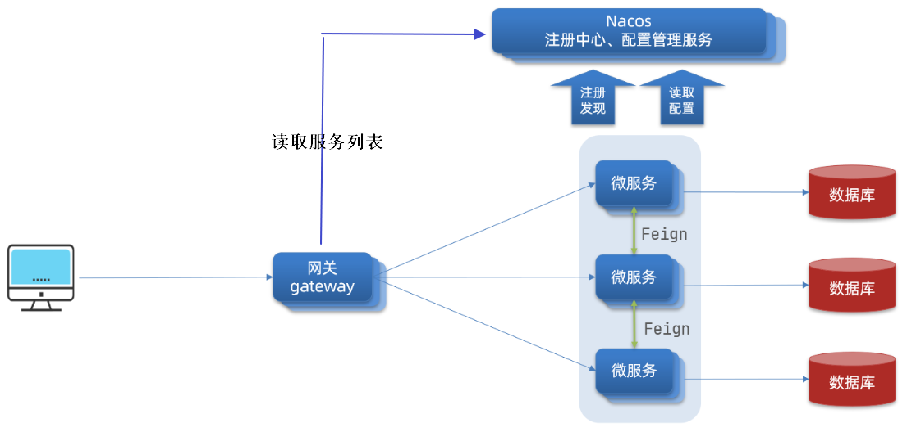

# 网关-认证过滤器-拦截器

## 模块环境架构的问题分析

项目中的微服务越来越多，由前端直接请求微服务的方式存在弊端：

开发环境在自己电脑上使用本地localhost，测试环境使用公司局域网ip，生产环境使用域名。

如果在前端对每个请求地址都配置绝对路径，不利于系统维护。

基于这个问题可以通过网关来解决。

在前端的代码中只需要指定每个接口的相对路径，在前端代码的一个固定的地方在接口地址前统一加网关的地址，每个请求统一到网关，由网关将请求转发到具体的微服务。

项目采用Spring Cloud Gateway作为网关，网关在请求路由时需要知道每个微服务实例的地址，项目使用Nacos作为服务发现中心和配置中心，整体的架构图如下：



流程如下：

1. 微服务启动，将自己注册到Nacos，Nacos记录了各微服务实例的地址。
2. 网关从Nacos读取服务列表，包括服务名称、服务地址等。
3. 请求到达网关，网关将请求路由到具体的微服务。

**要使用网关首先搭建Nacos**

## 网关认证

一个前端请求首先会经过网关，之后再路由到一个个的微服务。

API网关（Gateway）是应用程序客户端的单一入口点，它位于客户端和应用程序的后端服务集合之间。

流程

1. 客户端向API网关发送请求，该请求通常基于HTTP协议。
2. API网关验证HTTP请求。
3. API网关根据其允许列表和拒绝列表检查调用者的IP地址和其它HTTP请求头，还可以针对IP地址和HTTP请求头等属性执行基本的速率限制检查。例如：它可以拒绝来自超过一定速率的IP地址的请求。
4. API网关将请求传递给身份验证服务，以进行身份验证和授权。API网关从身份验证服务处接收经过身份验证的会话，其中包含允许请求执行的操作范围。
5. 对经过身份验证的会话应用更高级别的速率限制检查，如果超过限制，此时请求将被拒绝。
6. 在**服务发现组件**的帮助下，API网关通过路径匹配找到适当的后端服务来处理请求。
7. 网关将请求转换为适当的协议，并将转换后的请求发送到后端服务（例如gRPC）。当响应从后端服务返回时，网关会将响应转换回面向公众的协议，并将响应返回给客户端。

### 技术方案

认证服务颁发 JWT，客户端携带 Token 访问微服务。早期方案只让网关校验 Token，并假定每一个微服务都无法被绕过；现代部署更推荐纵深防御：网关提前拦截非法流量，下游资源服务仍使用公钥独立验签。

所有访问微服务的请求都要经过网关，在网关进行用户身份的认证可以将很多非法的请求拦截到微服务以外，这叫做网关认证。

网关是基础设置的关键部分，应将其部署到多个区域以提高可用性。

### 网关的职责

**网站白名单维护**

针对不用认证的URL全部放行。

**认证授权**

除了白名单剩下的就是需要认证的请求，网关需要验证jwt的合法性，jwt合法则说明用户身份合法，否则说明身份不合法则拒绝继续访问。

**路由转发**

将请求转发到合适的微服务。减少外界对接微服务的成本。路由可以根据请求路径进行路由、根据host地址进行路由等。

**负载均衡**

当**一个微服务有多个实例时**可以通过负载均衡算法进行路由，将流量均衡的发送给所有服务实例，以提高性能和可用性。

**协议转换**

微服务系统，不同的微服务可能使用的的协议不同。网关收到客户端请求后，如果请求的协议与目标服务使用的协议不一致，则会根据请求信息转换成目标协议请求，再转发给目标服务。

处理不同协议之间的转换，例如从 HTTP 到 MQTT。

**断路**

网关应跟踪错误，并提供断路功能以防止服务过载。

**监控与日志记录**

收集和分析流量数据，以便于监控和故障排查。

**分析和计费**

**缓存**

**限流**

### 网关不负责授权

对请求的授权操作在各个微服务进行，因为微服务最清楚用户有哪些权限访问哪些接口。

## 标准 Resource Server 方案

### 1、Gateway 使用 Reactive Resource Server

```xml
<dependency>
    <groupId>org.springframework.boot</groupId>
    <artifactId>spring-boot-starter-oauth2-resource-server</artifactId>
</dependency>
```

```java
@Bean
SecurityWebFilterChain securityWebFilterChain(ServerHttpSecurity http) {
    return http
            .csrf(ServerHttpSecurity.CsrfSpec::disable)
            .authorizeExchange(exchange -> exchange
                    .pathMatchers(HttpMethod.POST,
                            "/user/auth/register",
                            "/user/auth/login")
                    .permitAll()
                    .pathMatchers(
                            "/user/oauth2/**",
                            "/user/.well-known/**",
                            "/user/login",
                            "/user/error")
                    .permitAll()
                    .anyExchange()
                    .authenticated())
            .oauth2ResourceServer(resourceServer -> resourceServer
                    .jwt(Customizer.withDefaults()))
            .build();
}
```

不要把整个 `/user/**` 放进白名单。按 HTTP 方法和完整业务路径放行，才能避免未来新增接口自动匿名开放。

#### hhjava 当前路由与文档路径边界

开发环境的 Nacos 路由只有 `/user/**` 和 `/backup/**`，并且不移除前缀。注册、登录的完整网关路径分别是 `POST /user/auth/register`、`POST /user/auth/login`。

文件服务 Controller 只声明 `/files/**`，本地配置没有 `/backup` context path；缺失的 `hhjava-backup-file-dev.yaml` 也无法证明远端会补上该前缀。启用文件服务时必须二选一：为服务配置 `server.servlet.context-path=/backup`，或让 Gateway 对 `/backup/**` 执行 `StripPrefix=1`。否则即使补齐 data-id 和 MinIO，`/backup/files/**` 仍会因为下游路径不匹配而返回 404。

Gateway 源码中的 Swagger/OpenAPI 白名单目前是 `/v3/api-docs/**`、`/swagger-ui/**` 等根路径，但 Gateway 自身没有对应文档路由。真实的用户服务网关路径 `/user/v3/api-docs`、`/user/swagger-ui/**` 不匹配这些根路径，因此经 Gateway 访问时仍需要 JWT；直连用户服务时才由用户服务自己的白名单匿名放行。不要笼统写成“Gateway 已公开 Swagger”。

当前 Gateway 只实现 `permitAll` 与 `authenticated`，因此它形成的是认证边界，尚未实现角色、scope 或对象级授权。项目自有 `/auth/login` JWT 不带 roles/scope；OAuth2 access token 可以包含 scope，但 Gateway 也没有根据对应 authority 编写授权规则。Nacos 中没有 CORS、Retry、CircuitBreaker 或 fallback；`.cors(disable)` 不是“允许所有跨域”。

### 2、下游服务继续验签

下面的无状态配置对应 backup-file 这类纯资源服务：

```java
@Bean
SecurityFilterChain securityFilterChain(HttpSecurity http) throws Exception {
    return http
            .csrf(csrf -> csrf.disable())
            .sessionManagement(session -> session
                    .sessionCreationPolicy(SessionCreationPolicy.STATELESS))
            .authorizeHttpRequests(authorize -> authorize
                    .requestMatchers("/v3/api-docs/**", "/swagger-ui/**")
                    .permitAll()
                    .anyRequest()
                    .authenticated())
            .oauth2ResourceServer(resourceServer -> resourceServer
                    .jwt(Customizer.withDefaults()))
            .build();
}
```

Gateway 和 backup-file 使用相同的 issuer、audience、JWKS URI 和 RS256 限制。user 同时承担授权服务器职责：授权码表单登录需要会话，所以它使用 `IF_REQUIRED`，并由本地 RSA 公钥创建 Decoder，而不是照抄这里的 `STATELESS + JWKS`。RSA 私钥只保留在 user 服务。

### 3、不要重复复制 Authorization Header

Spring Cloud Gateway 默认会转发标准 `Authorization` Header。仅仅读取 Bearer Token 再把原值写回请求，没有增加任何认证能力，也容易造成过滤链职责混乱。

### 4、CORS 与认证是两件事

关闭 Spring Security 的 CORS 集成并不代表“允许所有跨域”。浏览器跨域访问仍应显式配置允许的 origin、method、header 和预检请求，不要把 `*` 当作默认生产策略。

Nacos 安全配置见 [Nacos](../Nacos.md)，完整项目实现和验收矩阵见 [hhjava 认证授权与配置安全整改实战](./hhjava认证授权与配置安全整改实战.md)。
