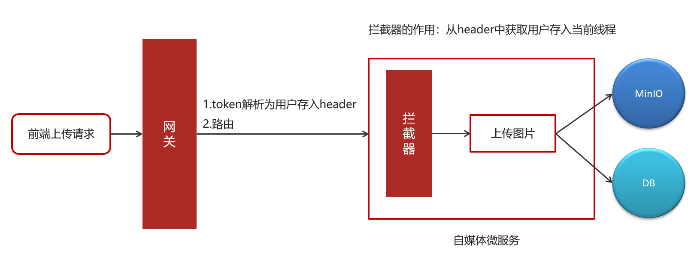

# 网关

## 模块环境架构的问题分析

项目中的微服务越来越多，当前这种由前端直接请求微服务的方式存在弊端：

开发环境在自己电脑上使用localhost，测试环境使用公司局域网ip，生产环境使用域名。

如果在前端对每个请求地址都配置绝对路径，非常不利于系统维护。

客户端请求接口需要改动，基于这个问题可以通过网关来解决。

这样在前端的代码中只需要指定每个接口的相对路径，在前端代码的一个固定的地方在接口地址前统一加网关的地址，每个请求统一到网关，由网关将请求转发到具体的微服务。

为什么所有的请求先到网关呢？

有了网关就可以对请求进行路由，路由到具体的微服务，减少外界对接微服务的成本。路由可以根据请求路径进行路由、根据host地址进行路由等， 当**一个微服务有多个实例时**可以通过负载均衡算法进行路由。

另外，网关还可以实现权限控制、限流等功能。

项目采用Spring Cloud Gateway作为网关，网关在请求路由时需要知道每个微服务实例的地址，项目使用Nacos作为服务发现中心和配置中心，整体的架构图如下：


流程如下：

1. 微服务启动，将自己注册到Nacos，Nacos记录了各微服务实例的地址。
2. 网关从Nacos读取服务列表，包括服务名称、服务地址等。
3. 请求到达网关，网关将请求路由到具体的微服务。

**要使用网关首先搭建Nacos**

## 搭建Gateway

使用`Spring Cloud Gateway`作为网关。

新建一个网关工程，添加依赖：

```XML
<!--网关-->
<dependency>
    <groupId>org.springframework.cloud</groupId>
    <artifactId>spring-cloud-starter-gateway</artifactId>
</dependency>
<!-- nacos的注册依赖-->
<dependency>
    <groupId>com.alibaba.cloud</groupId>
    <artifactId>spring-cloud-starter-alibaba-nacos-discovery</artifactId>
</dependency>
<!-- nacos配置-->
<dependency>
    <groupId>com.alibaba.cloud</groupId>
    <artifactId>spring-cloud-starter-alibaba-nacos-config</artifactId>
</dependency>
<!-- 负载均衡-->
<dependency>
    <groupId>org.springframework.cloud</groupId>
    <artifactId>spring-cloud-starter-loadbalancer</artifactId>
</dependency>
<dependency>
    <groupId>com.alibaba</groupId>
    <artifactId>fastjson</artifactId>
</dependency>
<dependency>
    <groupId>org.projectlombok</groupId>
    <artifactId>lombok</artifactId>
</dependency>
<!-- 排除 Spring Boot 依赖的日志包冲突 -->
<dependency>
    <groupId>org.springframework.boot</groupId>
    <artifactId>spring-boot-starter</artifactId>
    <exclusions>
        <exclusion>
            <groupId>org.springframework.boot</groupId>
            <artifactId>spring-boot-starter-logging</artifactId>
        </exclusion>
    </exclusions>
</dependency>
<!-- Spring Boot 集成 log4j2 -->
<dependency>
    <groupId>org.springframework.boot</groupId>
    <artifactId>spring-boot-starter-log4j2</artifactId>
</dependency>
<!-- jwt解析的jar包-->
<dependency>
    <groupId>io.jsonwebtoken</groupId>
    <artifactId>jjwt</artifactId>
</dependency>
```

在heima-leadnews-gateway下创建heima-leadnews-app-gateway微服务Module

在`heima-leadnews-app-gateway|src|main|java|heima-leadnews-app-gateway`包下创建引导类`AppGatewayApplication`。

配置网关的application.yml配置文件

```yaml
#微服务配置
spring:
  application:
    name: gateway
  cloud:
    nacos:
      server-addr: 192.168.101.65:8848
      discovery:
        #注册中心的地址
        #server-addr: 192.168.200.130:8848
        namespace: dev
        group: xuecheng-plus-project
      config:
        #配置中心的地址
        #server-addr: 192.168.200.130:8848
        namespace: dev
        group: xuecheng-plus-project
        file-extension: yaml
        refresh-enabled: true
        shared-configs:
          - data-id: logging-${spring.profiles.active}.yaml
            group: xuecheng-plus-common
            refresh: true

  profiles:
    active: dev
```

### 在nacos上配置网关路由策略

```YAML
server:
  port: 63010 # 网关端口
spring:
  cloud:
    gateway:
#      globalcors:
#        add-to-simple-url-handler-mapping: true
#        corsConfigurations:
#          '[/**]': #匹配所有的请求
#            allowedHeaders: "*" #允许所有的header
#            allowedOrigins: "*" #跨域处理 允许所有的域
#            allowedMethods:		#支持的方法
#              - GET
#              - POST
#              - DELETE
#              - PUT
#              - OPTION

#      filter:
#        strip-prefix:
#          enabled: true
      routes: # 网关路由配置
	      # 内容管理微服务
        - id: content-api # 路由id，自定义，只要唯一即可
          # uri: http://127.0.0.1:8081 # 路由的目标地址 http就是固定地址
          uri: lb://content-api # 路由的目标地址 lb就是负载均衡，后面跟服务名称
          predicates: # 路由断言，也就是判断请求是否符合路由规则的条件
            - Path=/content/** # 这个是按照路径匹配，只要以/content/开头就符合要求
#          filters:
#            - StripPrefix=1
        # 系统设置微服务
        - id: system-api
          # uri: http://127.0.0.1:8081
          uri: lb://system-api
          predicates:
            - Path=/system/**
          filters:
            - StripPrefix=1
```

启动网关和用户两个服务，使用postman进行测试。

网关工程搭建完成即可将前端工程中的接口地址改为网关的地址。

## 认证过滤器

**全局过滤器实现jwt校验**

思路分析：

1. 用户进入网关，网关过滤器进行判断是否是登录
   1. 如果是登录则路由到后台管理微服务进行登录，用户登录成功，后台管理微服务签发JWT TOKEN信息返回给用户。
   2. 如果不是登录，网关过滤器接收用户携带的TOKEN。
      1. 网关过滤器解析TOKEN ，判断是否有权限。
         1. 如果有，则放行，路由到具体微服务。
         2. 如果没有，则返回401未认证错误。


在网关微服务中新建全局过滤器：

```java
import io.jsonwebtoken.Claims;
import lombok.extern.slf4j.Slf4j;
import org.apache.commons.lang.StringUtils;
import org.springframework.cloud.gateway.filter.GatewayFilterChain;
import org.springframework.cloud.gateway.filter.GlobalFilter;
import org.springframework.core.Ordered;
import org.springframework.http.HttpStatus;
import org.springframework.http.server.reactive.ServerHttpRequest;
import org.springframework.http.server.reactive.ServerHttpResponse;
import org.springframework.stereotype.Component;
import org.springframework.web.server.ServerWebExchange;
import reactor.core.publisher.Mono;

@Component//被spring管理的注解
@Slf4j//打印日志的注解
public class AuthorizeFilter implements Ordered, GlobalFilter {//需要实现Ordered, GlobalFilter
    @Override
    public Mono<Void> filter(ServerWebExchange exchange, GatewayFilterChain chain) {
        //1.获取request和response对象
        ServerHttpRequest request = exchange.getRequest();
        ServerHttpResponse response = exchange.getResponse();

        //2.判断是否是登录
        if(request.getURI().getPath().contains("/login")){
            //放行
            return chain.filter(exchange);
        }

        //3.获取token
        String token = request.getHeaders().getFirst("token");

        //4.判断token是否存在
        if(StringUtils.isBlank(token)){//token为空
            response.setStatusCode(HttpStatus.UNAUTHORIZED);
            return response.setComplete();//结束请求
        }

        //5.判断token是否有效
        try {
            Claims claimsBody = AppJwtUtil.getClaimsBody(token);
            //是否是过期
            int result = AppJwtUtil.verifyToken(claimsBody);
            if(result == 1 || result  == 2){
                response.setStatusCode(HttpStatus.UNAUTHORIZED);
                return response.setComplete();
            }
          
            //获得token解析后中的用户信息
            Object userId = claimsBody.get("id");
            //在header中添加新的信息
            ServerHttpRequest serverHttpRequest = request.mutate().headers(httpHeaders -> {
                httpHeaders.add("userId", userId + "");
            }).build();
            //重置header
            exchange.mutate().request(serverHttpRequest).build();
        } catch (Exception e) {
            e.printStackTrace();//打印失败日志
            response.setStatusCode(HttpStatus.UNAUTHORIZED);
            return response.setComplete();
        }

        //6.放行
        return chain.filter(exchange);
    }

    /**
     * 优先级设置  值越小  优先级越高
     * @return
     */
    @Override
    public int getOrder() {
        return 0;
    }
}
```

测试：

启动user服务，继续访问其他微服务，会提示需要认证才能访问，这个时候需要在headers中设置设置token才能正常访问。

## 拦截器

- 前端请求先到网关。

- 认证过滤器在网关中实现，网关拿到token之后解析，保存到header中。
- 拦截器在具体的微服务中实现，从header中获取用户id，把用户信息存到当前线程中。请求放到当前线程中。这个请求下，所有的位置都可以从当前线程中获取用户。



①：前端发送上传图片请求，类型为MultipartFile。

②：`AuthorizeFilter.java`**网关**进行token解析后，把解析后的用户信息存储到`header`中。

③：自媒体微服务使用**拦截器**获取到header中的的用户信息，并放入到`threadlocal`中。

在heima-leadnews-utils中新增工具类

```java
package com.heima.utils.thread;

import com.heima.model.wemedia.pojos.WmUser;

public class WmThreadLocalUtil {

    private final static ThreadLocal<WmUser> WM_USER_THREAD_LOCAL = new ThreadLocal<>();

    /**
     * 添加用户
     * @param wmUser
     */
    public static void  setUser(WmUser wmUser){
        WM_USER_THREAD_LOCAL.set(wmUser);
    }

    /**
     * 获取用户
     */
    public static WmUser getUser(){
        return WM_USER_THREAD_LOCAL.get();
    }

    /**
     * 清理用户
     */
    public static void clear(){
        WM_USER_THREAD_LOCAL.remove();
    }
}
```

在heima-leadnews-wemedia微服务中新增拦截器

```java
package com.heima.wemedia.interceptor;

import com.heima.model.wemedia.pojos.WmUser;
import com.heima.utils.thread.WmThreadLocalUtils;
import lombok.extern.slf4j.Slf4j;
import org.springframework.web.servlet.HandlerInterceptor;
import org.springframework.web.servlet.ModelAndView;

import javax.servlet.http.HttpServletRequest;
import javax.servlet.http.HttpServletResponse;
import java.util.Optional;

@Slf4j
public class WmTokenInterceptor implements HandlerInterceptor {
  
    //前置
    @Override
    public boolean preHandle(HttpServletRequest request, HttpServletResponse response, Object handler) throws Exception {
        //得到header中的信息，并且存入到当前线程中
        String userId = request.getHeader("userId");
        Optional<String> optional = Optional.ofNullable(userId);
        if(optional.isPresent()){
            //把用户id存入threadloacl中
            WmUser wmUser = new WmUser();
            wmUser.setId(Integer.valueOf(userId));
            WmThreadLocalUtils.setUser(wmUser);
            log.info("wmTokenFilter设置用户信息到threadlocal中...");
        }
        return true;
    }

    @Override
    public void afterCompletion(HttpServletRequest request, HttpServletResponse response, Object handler, Exception ex) throws Exception {
        WmThreadLocalUtil.clear();
    }
  
  	//后置，清理线程中的数据
    /*@Override
    public void postHandle(HttpServletRequest request, HttpServletResponse response, Object handler, ModelAndView modelAndView) throws Exception {
        log.info("清理threadlocal...");
        WmThreadLocalUtils.clear();
    }*/
}
```

配置使拦截器生效，拦截所有的请求

`heima-leadnews/heima-leadnews-service/heima-leadnews-wemedia/src/main/java/com/heima/wemedia/config/WebMvcConfig.java`

```java
package com.heima.wemedia.config;

import com.heima.wemedia.interceptor.WmTokenInterceptor;
import org.springframework.context.annotation.Configuration;
import org.springframework.web.servlet.config.annotation.InterceptorRegistry;
import org.springframework.web.servlet.config.annotation.WebMvcConfigurer;

@Configuration//注解
public class WebMvcConfig implements WebMvcConfigurer {//实现WebMvcConfigurer

    @Override
    public void addInterceptors(InterceptorRegistry registry) {//添加自定义的拦截器
        registry.addInterceptor(new WmTokenInterceptor()).addPathPatterns("/**");
    }
}
```
