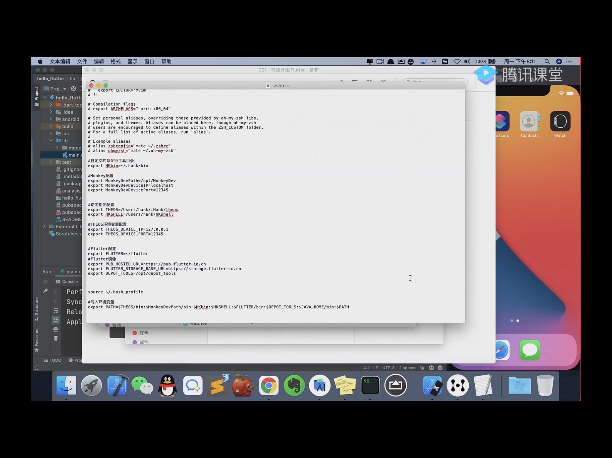

家目录下创建一个文件夹，可以是隐藏的。里面放自己的脚本和工具。

用的时候需要配置环境变量。

打开.zshrc文件`open ~/.zshrc`

如果不存在则创建.zshrc文件`touch ~/.zshrc`

`vi ~/.zshrc`

```shell
# Flutter镜像配置
export PUB_HOSTED_URL=https://pub.flutter-io.cn
export FLUTTER_STORAGE_BASE_URL=https://storage.flutter-io.cn
# Flutter 配置
export FLUTTER=/opt/flutter/bin
export PATH=$FLUTTER:$PATH
```

# git配置

家目录下有一个隐藏的.ssh目录，里面创建公钥.pub和私钥。

known_hosts里面记录了公钥和私钥。

1. Settings
2. Developer settings，创建access token
3. 保存环境变量里，终端使用的时候直接使用环境变量里的。