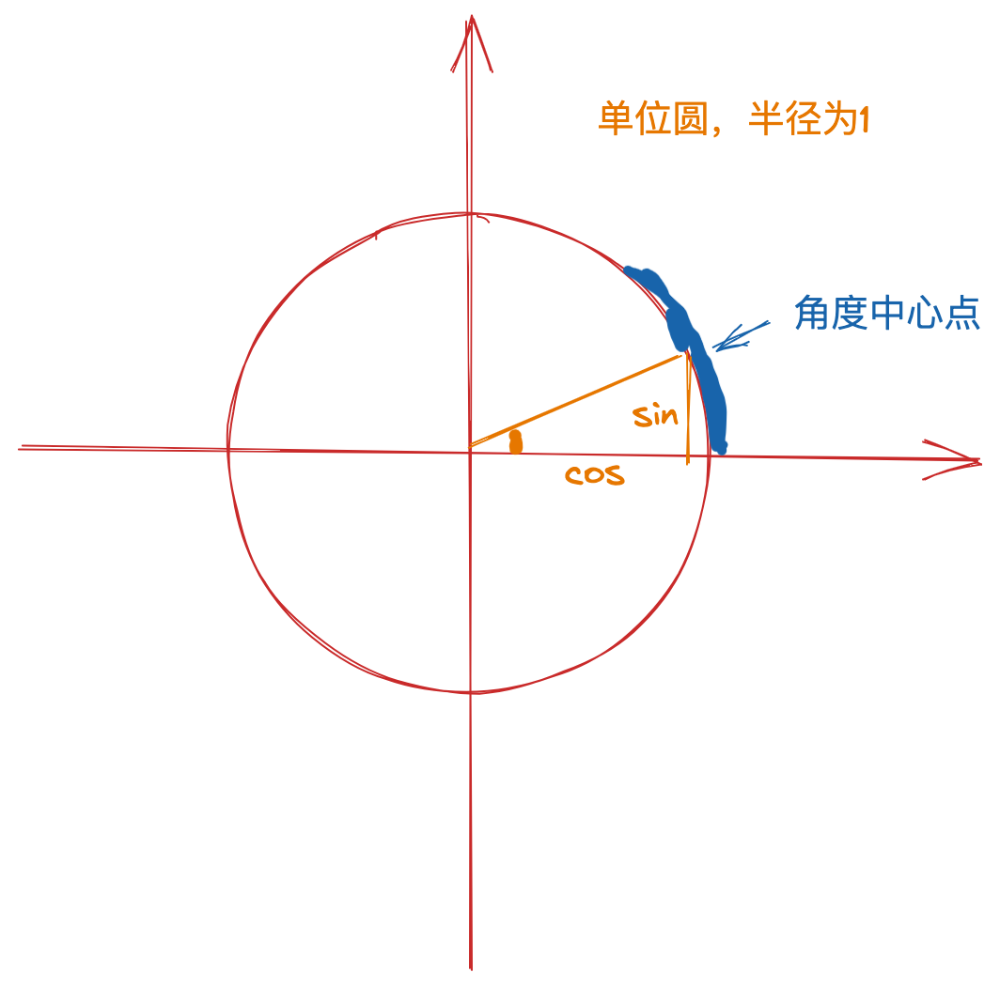

## 正弦（sin）和余弦（cos）

正弦（sin）和余弦（cos）是三角函数的两个基本函数，它们在数学和工程中有广泛的应用，特别是在涉及到周期现象、波动和旋转的情况下。它们的定义通常基于直角三角形或单位圆。

### 在直角三角形中的定义

对于一个直角三角形，设一个角为θ，那么：

- 正弦（sin）是角θ对应的对边与斜边的比值：
  $$
  \sin(\theta) = \frac{\text{对边}}{\text{斜边}}
  $$

- 余弦（cos）是角θ对应的邻边与斜边的比值：
  $$
  \cos(\theta) = \frac{\text{邻边}}{\text{斜边}}
  $$

### 在单位圆中的定义

单位圆是指半径为1的圆，圆心在原点 \((0,0)\)。在单位圆上，角 \(\theta\) 的正弦和余弦可以通过以下方式定义：

- 正弦（sin）是单位圆上与角θ对应的点的y坐标：
  $$
  \sin(\theta) = y
  $$

- 余弦（cos）是单位圆上与角θ对应的点的x坐标：
  $$
  \cos(\theta) = x
  $$

### 性质

1. **周期性**：sin(θ) 和 cos(θ) 都是周期为`2π`的函数，这意味着：
   $$
   \sin(\theta + 2\pi) = \sin(\theta)
   $$

   $$
   \cos(\theta + 2\pi) = \cos(\theta)
   $$

2. **对称性**：
   $$
   \sin(-\theta) = -\sin(\theta)
   $$

   $$
   \cos(-\theta) = \cos(\theta)
   $$

3. **平方和恒等式**：
   $$
   \sin^2(\theta) + \cos^2(\theta) = 1
   $$

这些性质使得正弦和余弦函数在解决各种数学问题时非常有用。