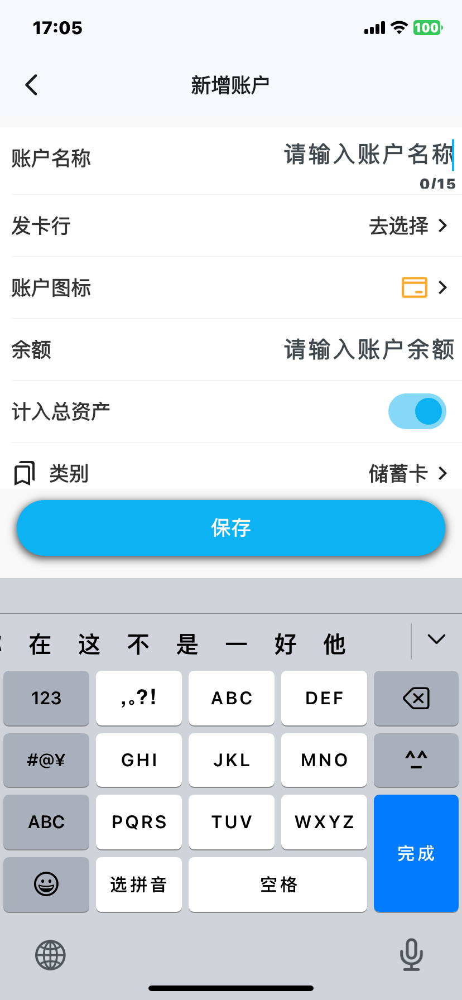
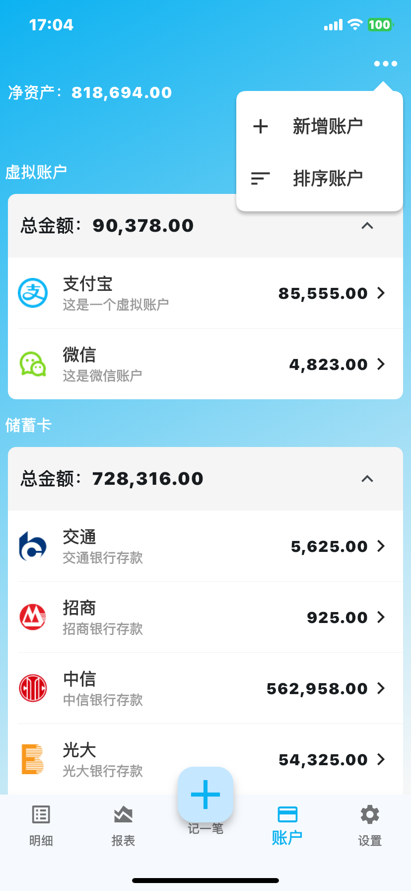
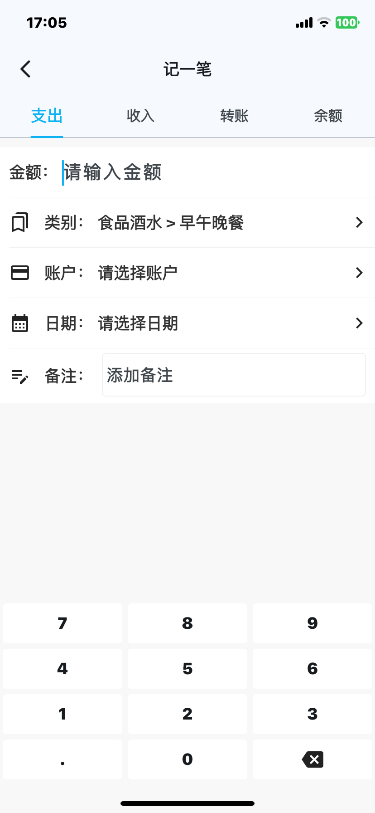
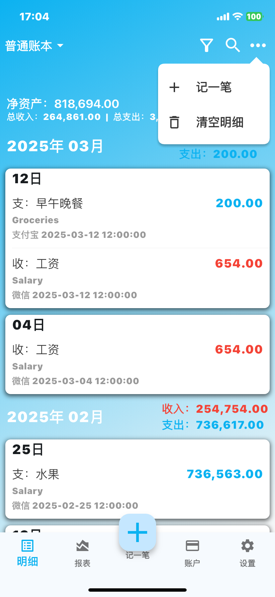
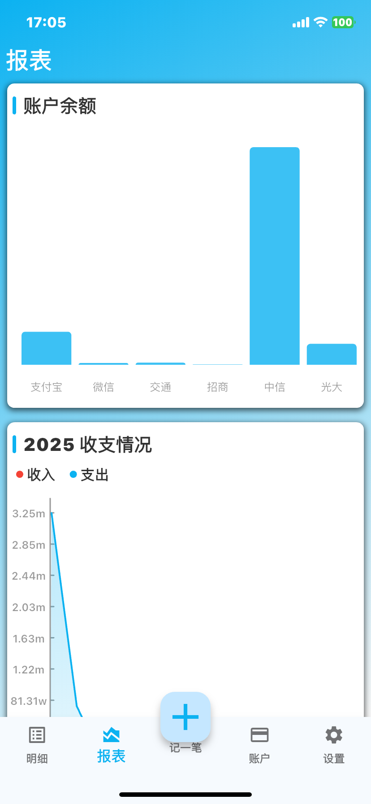

# 小木记账使用说明

## 账户

### 1、新增账户

使用应用需要先新增一个账户，新增页面可以设置账户名称、图标、初始余额、类别、备注等。

- 名称：账户名称不能超过限制字数。
- 图标：选择一个图标，可以更加清晰的区分账户，快速的找到账户。
- 类别：有现金、银行卡、虚拟账户、投资理财、信用卡等，对账户进行分类管理和查看。
  - 选择储蓄卡/信用卡类别时，可以选择发卡行，选择完发卡行之后会自动的带入账户名称和账户图标。
  - 账户图标只能通过选择发卡行去设置。
  - 账户名称可以修改。
- 计入总资产：打开时则净资产包含该账户的余额，关闭则不包含该账户的余额。
- 备注：可以给账户添加更加详细的备注。

### 2、账户列表

列表根据账户类别进行分区展示。

#### 2.1、资产

所在分类下所有账户的金额之和，点击右侧按钮可以展开或合起当前分类下的账户列表。

#### 2.2、点击账户

点击可以查看该账户下的明细列表。

#### 2.3、左滑账户

左滑会出现功能删除和编辑的功能按钮

- 删除：删除会将该账户下所有的明细数据都删除，一旦删除，数据无法恢复。
- 编辑：点击编辑按钮会自动代入图标、备注、发卡行信息至账户编辑页，修改该账户的账户名称、图标、类别和备注。

#### 2.4、账户排序

长按即可拖动调整账户顺序。

## 记一笔

包含支出、收入、转账、余额4种明细类型。

### 1、支出和收入

金额：输入支出（或收入）金额（金额最多两位小数）。

类别：选择收入支出的具体类别。

账户：选择哪个账户有支出（收入）。

日期：记录是哪一天的支出（收入），还可以选择日期的具体时刻。

备注：记录该笔明细的其它信息。

### 2、转账

金额：输入转账的金额（金额最多两位小数）。

账户：选择从哪个账户转入到哪个账户。

日期：记录是哪一天的转账，还可以选择日期的具体时刻。

备注：记录该笔明细的其它信息。

### 3、余额

金额：设置账户的余额，会做相应的加减操作。

账户：选择设置的哪个账户。

日期：记录是哪一天的余额，还可以选择日期的具体时刻。

备注：记录该笔明细的其它信息。

### 再记一笔

点击再记一笔会保存当前的明细，并自动带入当前明细的账户和日期至新的明细。

## 明细

### 明细列表

整个列表按照年、月、日分块展示。

可以很清晰的显示每天的消费收入情况。

每条数据包含收入支出转账类型、收支类别、金额、备注、账户和日期。

每个月有一个总支出和总收入，最顶部有一个总的收入和支出金额。

### 1、日期范围选择

点击可以选择开始和结束日期，明细列表是在某一个日期范围的，默认是近半年。

### 2、筛选

根据明细类型、日期范围、和账户列表来对明细列表进行筛选。

### 3、搜索

当新增明细有误时，可以点击列表进入编辑该条数据，可以修改金额、类别、账户、日期和备注，还可以删除该条数据。

### 4、更多

#### 4.1、记一笔

#### 4.2、清空明细

点击清空按钮可以清空当前账户下的所有明细。

### 5、修改和删除明细

当新增明细有误时，可以点击列表进入编辑该条数据，可以修改金额、类别、账户、日期和备注，还可以删除该条数据。

## 报表

### 1、账户余额

柱状图显示个人的所有账户余额

- 长按可以显示具体的余额，了解自己的资金分布情况。
- 当账户数量比较多时，支持左右滑动查看。
- 金额为负数和金额为正数的柱状图颜色不同以进行区分。

### 2、支出和收入情况

按年显示每个月的支出和收入情况。收入和支出多条线可以更加清晰的对比当年的走势，哪个月花费的多，哪个月收入的多。

点击某一个月会弹出指示图显示当月具体收支的金额。

左右滑动可以切换年份。

> **单位说明**
>
> - K：千
> - W：万
> - M：百万

### 3、收支类别排行

可以查看自己在某一个月内，收入的排行和支出的排行。

点击日期选择按钮可以选择想要分析的那个月，点击收入或支出可以切换类型。

## 设置

### 1、切换账本

可以选择不同的账本，各个账本数据相互隔离。

### 2、分享账本

分享账本数据，用于数据导出和备份。

### 3、主题模式

可以设置浅色模式、深色模式、跟随系统。根据不同的场景去选择不同的主题模式。

### 4、密码保护

设置密码之后，每次打开应用都需要输入密码，防止手机被他人使用时查看个人账户数据，保证个人隐私。

输入密码正确时会自动解锁。

### 5、应用评分

点击跳转App Store，给出应用的评价。

### 6、关于app

展示有关于app的信息：图标、版本号、隐私政策、帮助中心和备案号。

### 7、联系我们

如果您有任何问题或需要支持，请不要犹豫，通过以下方式与我们联系：

**电子邮件支持**

对于任何支持请求，请发送电子邮件至：michaelss_work@outlook.com。

## 推送

