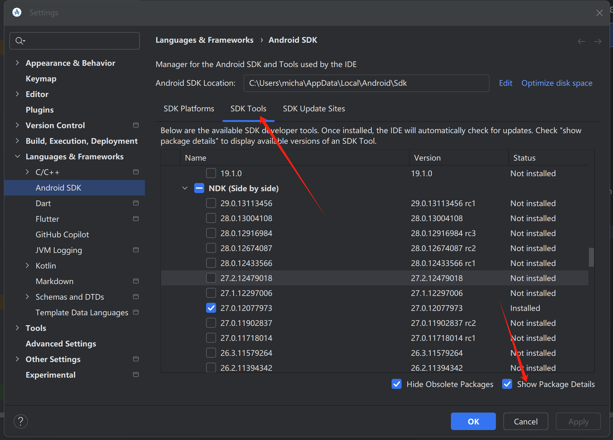

# flutter

## website

flutter中文网

api.flutter.dev

dart.cn

https://pub.dev 三方库，dart packages

https://flutter.dev/ 下载flutter

https://book.flutterchina.club/ flutter实战第二版

## flutter安装

可以放到家目录里：只能自己访问。

可以放到根目录`/opt`下：不同用户都可以访问，但是有权限问题, 不能用命令直接升级, 需要重新下载解压安装。

## 环境配置

配置环境变量是为了让shell能够找到你的工具。

shell就是操作系统

位置：`~/.zshrc`。

`vim ~/.zshrc`去编辑

```shell
# Flutter镜像配置
export PUB_HOSTED_URL=https://pub.flutter-io.cn
export FLUTTER_STORAGE_BASE_URL=https://storage.flutter-io.cn
# Flutter 配置
export FLUTTER=/opt/flutter/bin
export PATH=$FLUTTER:$PATH
```

`export PATH=$FLUTTER:$PATH`

`$`表示变量

- 变量名是：`FLUTTER`
- 路径是：`/opt/flutter/bin`。

`:$PATH`表示把之前的读一遍。不同路径之间用`:`隔开。

```
➜  ~ which flutter
/opt/flutter/bin/flutter
```

flutter doctor是shell调用flutter

AS创建flutter也有flutter路径

## Android studio

### 插件Plugins

搜索flutter，Android studio安装flutter插件。会安装dart，安装完之后需要重启Android studio。

### Android studio配置

设置搜索Android SDK


设置Android NDK version



### 自动格式化代码

Settings -> Languages & Frameworks -> Flutter -> Editor

选中`Format code on save`也可以勾选子选项`Organize imports on save`

### Windows Version (Unable to confirm if installed Windows version is 10 or greater)

下载master分支的flutter：`git clone -b master https://github.com/flutter/flutter.git`。

https://github.com/flutter/flutter/issues/119927#issuecomment-1415858226

### 🔧 配置Gradle包装器下载源

找到你Flutter项目中的 `android/gradle/wrapper/gradle-wrapper.properties` 文件，将 `distributionUrl`修改为国内镜像地址。

```properties
# 这是原来的配置
# distributionUrl=https\://services.gradle.org/distributions/gradle-8.13-bin.zip

# 修改为腾讯云镜像
distributionUrl=https\://mirrors.cloud.tencent.com/gradle/gradle-8.13-bin.zip
```

### 📦 配置项目依赖仓库镜像

在首次运行的时候，你会发现卡在如下的地方了：

```
Running Gradle task 'assembleDebug'
```

原因是`Gradle`的`Maven`仓库在国外，解决方法就是镜像：

1. 打开`/path-to-flutter-sdk/packages/flutter_tools/lib/src/http_host_validator.dart`文件，修改`https://maven.google.com/`为 google maven 的国内镜像，如`https://maven.aliyun.com/repository/google/`

2. 修改`flutter安装目录/packages/flutter_tools/gradle/flutter.gradle`文件和`项目 -> Android -> build.gradle`两个文件：

   - 在 `buildscript > repositories` 块内添加阿里镜像

   ```groovy
   buildscript {
       repositories {
           //google()
           //mavenCentral()
           maven { url 'https://maven.aliyun.com/repository/google' }
           maven { url 'https://maven.aliyun.com/repository/jcenter' }
           maven { url 'https://maven.aliyun.com/nexus/content/groups/public' }
       }
       dependencies {
           classpath 'com.android.tools.build:gradle:4.1.0'
       }
   }
   ```

   - 在 `allprojects > repositories` 块内添加:

   ```groovy
   allprojects {
       repositories {
           // 阿里云镜像仓库
           maven { url 'https://maven.aliyun.com/repository/google' }
           maven { url 'https://maven.aliyun.com/repository/jcenter' }
           maven { url 'https://maven.aliyun.com/nexus/content/groups/public' }      
           // 如需，也可添加清华镜像
           // maven { url 'https://mirrors.tuna.tsinghua.edu.cn/flutter/download.flutter.io' } :cite[3]:cite[10]
       }
   }
   ```

   请注意，有些配置建议移除或注释掉原有的 `google()` 和 `jcenter()`，但有时这可能导致某些特定依赖找不到。如果遇到问题，可以尝试保留它们，并将国内镜像放在前面优先使用。

3. 删除`/path-to-flutter-sdk/bin/cache` 文件夹

4. 重新执行`flutter doctor`

### Unable to find bundled Java version.

下载安装java。

更新的时候在电脑偏好设置，点击java，然后更新。

## flutter doctor -v

查看flutter版本，有新版本就更新flutter版本。

Engine revision：引擎版本

## Windows

下载java，打开终端输入java，如果出现java命令用法则说明安装成功。

去flutter官网下载安装flutter的sdk，bin目录是flutter的运行目录，flutter_console是运行flutter

### 配置环境变量

系统属性--高级系统设置--环境变量--系统变量--双击Path--新建--把flutter的bin路径复制进来`"C:\Users\micha\hhsoftware\flutter\bin\"`

打开终端--flutter doctor

## 强制退出AS

AS强退，为了保存数据，有一个缓存机制，会lock运行环境。需要删除缓存文件：`/fluter/bin/cache/lockfile`。

## flutter入口

在main.dart文件中写代码，入口是main函数。

iOS有UIKit，flutter中有`import 'package:flutter/material.dart';`库，素材。

显示app的话就执行`runApp`函数。

```dart
void main() {
  runApp(const MyApp());
}
```

iOS控件==flutter widget，flutter万物皆Widget组件，iOS在window上创建视图，flutter上runApp(里面创建控件)，创建了控件就会在屏幕上显示。

## 去除警告

```
// ignore_for_file: avoid_print
```

## Flutter 命令

```sh
flutter upgrade
flutter upgrade --force	#更新flutter

flutter pub cache clean	#清除依赖包，需要重新flutter pub get
flutter clean
flutter pub get	#安装依赖，iOS还需要pod install。
flutter run --release	#运行在iPhone上，通过桌面图标就可以打开
```

```sh
flutter pub deps	#查看项目的依赖关系树
```


flutter pub outdated

