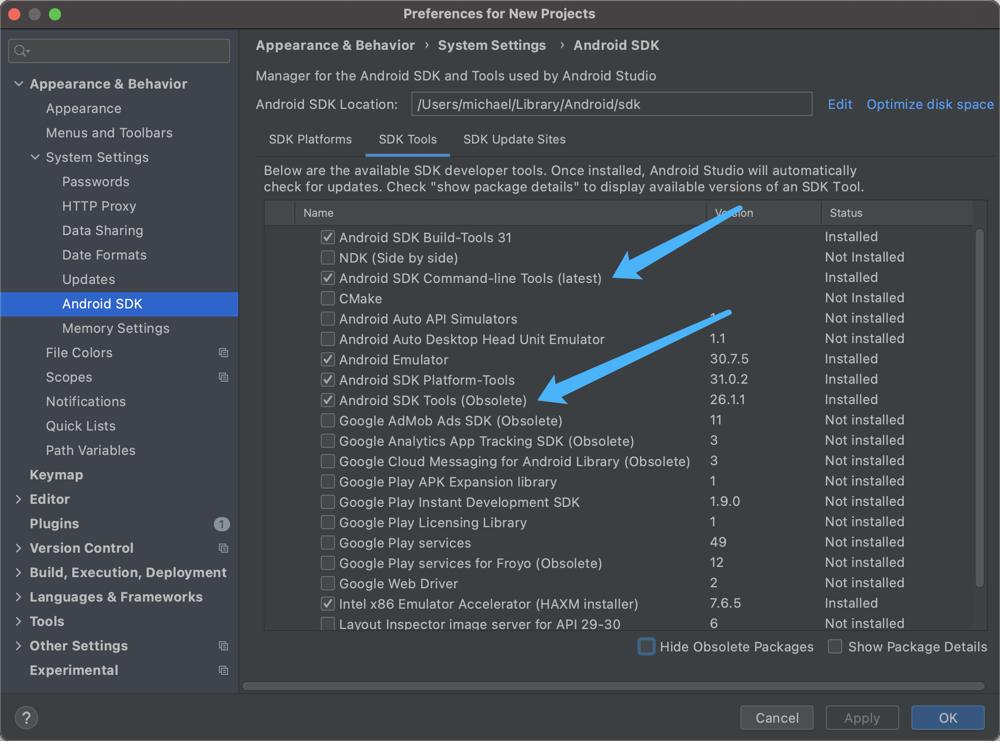

# flutter简介

## RN和flutter

### RN

调的系统的UIKit。原生UI的基础上进行的包装。性能不如flutter，原生更新的话，RN也需要更新。

### flutter

界面不依赖原生Ui，有自己独立的渲染引擎，iOS和安卓UI高度统一。iOS和安卓都有渲染引擎去解析Dart代码。flutter包大，因为有渲染引擎，效率高。

## 网站

flutter中文网

api.flutter.dev

dart.cn

https://pub.dev 三方库，dart packages

dartpad.dev 在线编程

https://flutter.dev/ 下载flutter

## flutter安装

可以放到家目录里：只能自己访问。

可以放到根目录`/opt`下：不同用户都可以访问，但是有权限问题, 不能用命令直接升级, 需要重新下载解压安装。

## 环境配置

配置环境变量是为了让shell能够找到你的工具。

shell就是操作系统

Mac电脑上早期是bash 位置：`~/.bash_profile`，现在是zsh更强大 位置：`~/.zshrc`。

`vim ~/.zshrc`去编辑

```shell
# Flutter镜像配置
export PUB_HOSTED_URL=https://pub.flutter-io.cn
export FLUTTER_STORAGE_BASE_URL=https://storage.flutter-io.cn
# Flutter 配置
export FLUTTER=/opt/flutter/bin
export PATH=$FLUTTER:$PATH
```

`export PATH=$FLUTTER:$PATH`

`$`表示变量，FLUTTER变量是上面定义的`export FLUTTER=/opt/flutter/bin`。

变量名是：`FLUTTER`

路径是：`/opt/flutter/bin`。

`:$PATH`表示把之前的读一遍。不同路径之间用`:`隔开。

```
➜  ~ which flutter
/opt/flutter/bin/flutter
```

flutter doctor是shell调用flutter

AS创建flutter也有flutter路径

## Android studio

### Android studio选择Plugins安装插件

搜索flutter，Android studio安装flutter插件。会安装dart，安装完之后需要重启Android studio。

### Android studio配置



### 保存时自动格式化代码

Settings -> Languages & Frameworks -> Flutter -> Editor

选中`Format code on save`也可以勾选子选项`Organize imports on save`

### 1、Windows Version (Unable to confirm if installed Windows version is 10 or greater)

下载master分支的flutter：`git clone -b master https://github.com/flutter/flutter.git`。

https://github.com/flutter/flutter/issues/119927#issuecomment-1415858226

### 2、[!] HTTP Host Availability

  **✗** **HTTP host https://maven.google.com/ is not reachable. Reason: An error**

   **occurred while checking the HTTP host: Operation timed out**

解决方法：

1. 打开`/path-to-flutter-sdk/packages/flutter_tools/lib/src/http_host_validator.dart`文件，修改`https://maven.google.com/`为 google maven 的国内镜像，如`https://maven.aliyun.com/repository/google/`

2. 修改 flutter 安装目录中的 `flutter.gradle` 文件

   - 文件路径: /opt/flutter/packages/flutter_tools/gradle/flutter.gradle
   - 修改内容: `buildscript` 加入阿里镜像

   ```
   buildscript {
       repositories {
           //google()
           //mavenCentral()
           maven { url 'https://maven.aliyun.com/repository/google' }
           maven { url 'https://maven.aliyun.com/repository/jcenter' }
           maven { url 'http://maven.aliyun.com/nexus/content/groups/public' }
   
       }
       dependencies {
           classpath 'com.android.tools.build:gradle:4.1.0'
       }
   }
   ```

3. 删除`/path-to-flutter-sdk/bin/cache` 文件夹

4. 重新执行`flutter doctor`

### 3、Unable to find bundled Java version.

下载安装java。

更新的时候在电脑偏好设置，点击java，然后更新。

## flutter doctor -v

查看flutter版本，有新版本就更新flutter版本。

Engine revision：引擎版本

```bash
➜  ~ flutter doctor -v
╔════════════════════════════════════════════════════════════════════════════╗
║ A new version of Flutter is available!                                     ║
║                                                                            ║
║ To update to the latest version, run "flutter upgrade".                    ║
╚════════════════════════════════════════════════════════════════════════════╝


[✓] Flutter (Channel stable, 2.5.3, on macOS 12.1 21C52 darwin-x64, locale
    zh-Hans-CN)
    • Flutter version 2.5.3 at /opt/flutter
    • Upstream repository https://github.com/flutter/flutter.git
    • Framework revision 18116933e7 (4 months ago), 2021-10-15 10:46:35 -0700
    • Engine revision d3ea636dc5
    • Dart version 2.14.4
    • Pub download mirror https://pub.flutter-io.cn
    • Flutter download mirror https://storage.flutter-io.cn

[✓] Android toolchain - develop for Android devices (Android SDK version 31.0.0)
    • Android SDK at /Users/michael/Library/Android/sdk
    • Platform android-31, build-tools 31.0.0
    • Java binary at: /Applications/Android
      Studio.app/Contents/jre/Contents/Home/bin/java
    • Java version OpenJDK Runtime Environment (build 11.0.10+0-b96-7281165)
    • All Android licenses accepted.

[✓] Xcode - develop for iOS and macOS
    • Xcode at /Applications/Xcode.app/Contents/Developer
    • Xcode 13.2.1, Build version 13C100
    • CocoaPods version 1.11.2

[✓] Chrome - develop for the web
    • Chrome at /Applications/Google Chrome.app/Contents/MacOS/Google Chrome

[✓] Android Studio (version 2020.3)
    • Android Studio at /Applications/Android Studio.app/Contents
    • Flutter plugin can be installed from:
      🔨 https://plugins.jetbrains.com/plugin/9212-flutter
    • Dart plugin can be installed from:
      🔨 https://plugins.jetbrains.com/plugin/6351-dart
    • Java version OpenJDK Runtime Environment (build 11.0.10+0-b96-7281165)

[✓] VS Code (version 1.62.3)
    • VS Code at /Applications/Visual Studio Code.app/Contents
    • Flutter extension can be installed from:
      🔨 https://marketplace.visualstudio.com/items?itemName=Dart-Code.flutter

[✓] Connected device (1 available)
    • Chrome (web) • chrome • web-javascript • Google Chrome 97.0.4692.99
    ! Error: Michael的iPhone is not connected. Xcode will continue when Michael的iPhone is
      connected. (code -13)

• No issues found!
➜  ~ 
```

## flutter更新

`flutter upgrade`更新flutter。

## 安卓模拟器

夜神NoxAPPPlayer

需要安装最新的VirtualBox，如果不是最新的会卡在99%，需要下载最新的，然后使用安装包中自带的uninstall去卸载，然后安装。在系统偏好设置中权限打开。最后重新打开启动Nox。

####  `Android Studio` 依旧连接不到模拟器

前往 `应用程序` 找到 `Nox App Player.app` ，然后右键 `显示包内容` ，找到 `Contents / MacOS / adb` 文件，将 `adb` 文件直接拖到终端，然后 `Android Studio` 上就会显示夜神模拟器了。

## 运行安卓模拟器Gradle卡住问题

那么在首次运行的时候, 你会发现卡在如下的地方了, 原因是`Gradle`的`Maven`仓库在国外......然后你就懂了.

```
Running Gradle task 'assembleDebug'
```

解决它比较简单的操作就是镜像, 配置如下:

### 修改项目下的 `build.gradle` 文件

- 文件路径: 项目 -> Android -> build.gradle

- 修改内容: 找到`buildscript` 和 `allprojects`, 将里边 `google()`  和`mavenCentral()`注释掉, 添加阿里云的镜像.

  ```
  maven { url 'https://maven.aliyun.com/repository/google' }
  maven { url 'https://maven.aliyun.com/repository/jcenter' }
  maven { url 'http://maven.aliyun.com/nexus/content/groups/public' }
  ```

  

## 闪电按钮⚡️

热重载，加载修改的。

有状态的widget，数据改变的时候就需要重新启动项目。树发生改变了时候就需要重新运行。

## Windows

下载java，打开终端输入java，如果出现java命令用法则说明安装成功。

去flutter官网下载安装flutter的sdk，bin目录是flutter的运行目录，flutter_console是运行flutter

### 配置环境变量

系统属性--高级系统设置--环境变量--系统变量--双击Path--新建--把flutter的bin路径复制进来`"C:\Users\micha\hhsoftware\flutter\bin\"`

打开终端--flutter doctor

## 创建flutter项目

1. Project name 不能用驼峰命名，需要用下划线，全用小写字母。

flutter写的dart代码在lib文件中。

## 强制退出AS

AS强退，会锁死lock，会锁住运行环境，再次打开工程运行会出问题。

为了保存数据，有一个缓存机制。需要删除缓存文件，cd/fluter/bin/cache/，cache里面有一个lockfile，删除lockfile就可以了。

## flutter入口

在main.dart文件中写代码，入口是main函数。

iOS有UIKit，flutter中有`import 'package:flutter/material.dart';`库，素材。

显示app的话就执行`runApp`函数。

```dart
void main() {
  runApp(const MyApp());
}
```

iOS控件==flutter widget，flutter万物皆Widget组件，iOS在window上创建视图，flutter上runApp(里面创建控件)，创建了控件就会在屏幕上显示。

## 去除警告

```
// ignore_for_file: avoid_print
```

## Flutter 命令

```shell
michael@localhost flutter_demo % flutter run --release #这样运行在iPhone上，以后通过桌面就可以打开
Launching lib/main.dart on iOS的 iPhone in release mode...
Automatically signing iOS for device deployment using specified development team in Xcode project: FHBV35YZLP
Running pod install...                                           1,511ms
Running Xcode build...                                                  
 └─Compiling, linking and signing...                         9.7s
Xcode build done.                                           90.4s
Installing and launching...                                        23.8s

Flutter run key commands.
h List all available interactive commands.
c Clear the screen
q Quit (terminate the application on the device). #退出运行
```

