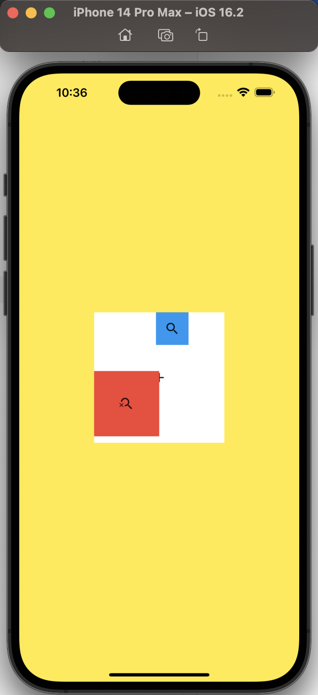
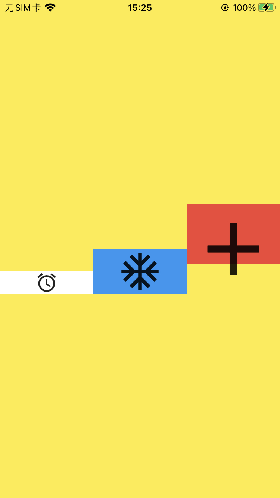
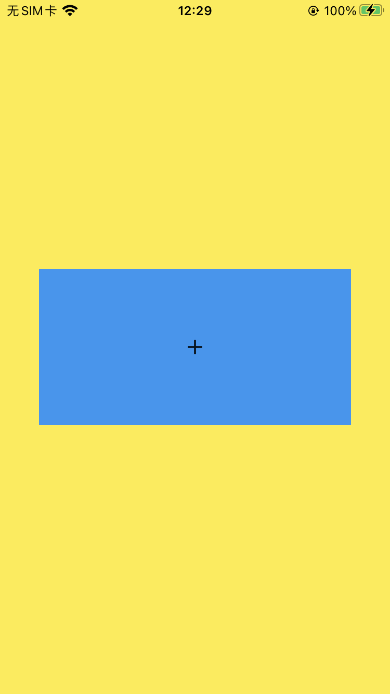
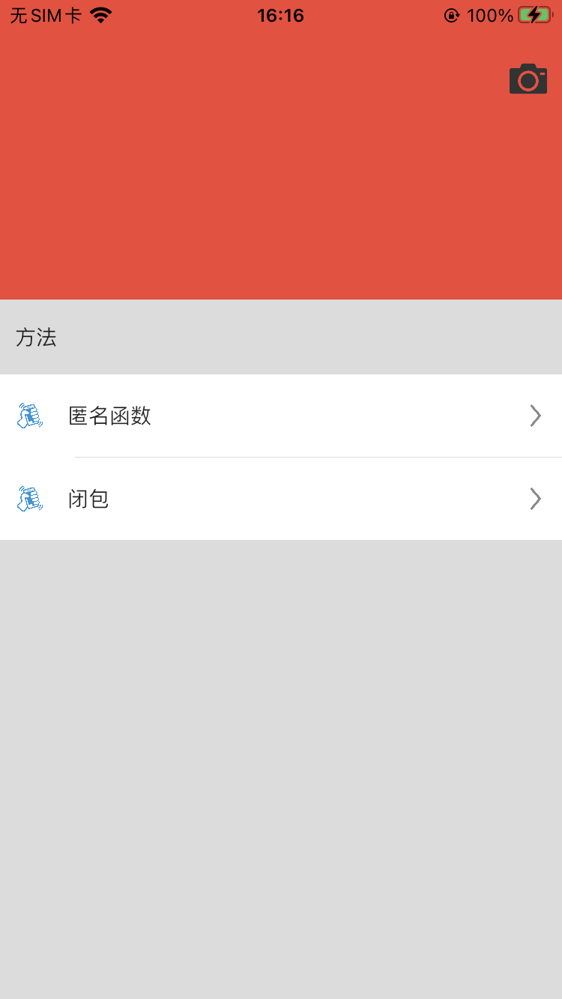

# 布局

弹性盒子布局，方向布局，没有设置宽高的话会根据内容撑起宽高

## 布局页面

整体布局，小部件布局，小部件传递数据展示。

简单的widgets构建复杂大型的widgets。

布局思想：小部件布局越简单越好。

小部件和小部件排列只有三种方式：

1. 横着
2. 竖着
3. 叠着

## 组件选择逻辑

### 单孩子SingleChildRenderObjectWidget

#### 居中Center

#### 内边距padding

```dart
Padding(
  padding: const EdgeInsets.symmetric(horizontal: 15, vertical: 20),
  child: Container(),
);
```

## EdgeInsets

`EdgeInsets`是一个不可变的类，用于表示在四个方向上的内边距：上、下、左、右。`EdgeInsets`类提供了一些构造函数，用于在不同情况下创建边距。

`EdgeInsets.symmetric`是`EdgeInsets`类的一个构造函数，允许对水平方向和垂直方向分别指定边距。意味着可以为左右两侧设置相同的边距，为上下两侧设置相同的边距，但上下和左右之间的边距可以不同。

```dart
margin: const EdgeInsets.symmetric(horizontal: 15, vertical: 20),
```

上面代码的意思是：

- 在水平方向（左右两侧）设置15单位的边距。
- 在垂直方向（上下两侧）设置20单位的边距。

这个边距通常用于`Container`、`Padding`、`DecoratedBox`等widget，以创建它们与其它元素之间的空间。

`const`关键字表示这个`EdgeInsets`对象是编译时常量，这意味着它的值在编译时就已经确定，且在运行时不会改变。使用`const`可以提高性能，因为这样的对象可以在编译时创建，然后在多个地方复用，而不需要在每次构建widget时都重新创建一个新的对象。

#### 组合型装饰container 容器布局

### 多孩子MultiChildRenderObjectWidget

- 多层布局
  - stack层叠布局
- 单层布局
  - flow 流式布局
  - flex弹性布局
  - 等等

## Stack层叠布局

多层布局，主轴是z轴，前 --> 后（内 --> 外）。

```dart
import 'package:flutter/material.dart';

class StackDemo extends StatelessWidget {
  const StackDemo({Key? key}) : super(key: key);

  @override
  Widget build(BuildContext context) {
    return Container(
      color: Colors.yellow,
      alignment: const Alignment(0, 0),
      child: Stack(
        children: [
          Positioned(
            child: Container(
            color: Colors.white,
            width: 200,
            height: 200,
            child: const Icon(Icons.add),
          	),
          ),
          Positioned(
            child: Container(
              color: Colors.red,
              width: 100,
              height: 100,
              child: const Icon(Icons.search_off),
            ),
            left: 0,
            bottom: 10,
          ),
          Positioned(
            child: Container(
              color: Colors.blue,
              width: 50,
              height: 50,
              child: const Icon(Icons.search),
              // margin: EdgeInsets.only(right: 20),
            ),
            right: 55,
          ),
        ],
      ),
    );
  }
}
```

运行效果图



### Positioned

修改Stack中的部件，使用Positioned，Positioned有left，top，right，bottom4个属性。参数是像素位置，绝对位置。

## Flex弹性布局/填充布局

### Row 横向布局

从左到右

```dart
import 'package:flutter/material.dart';

class RowDemo extends StatelessWidget {
  const RowDemo({Key? key}) : super(key: key);

  @override
  Widget build(BuildContext context) {
    return Container(
      color: Colors.yellow,
      alignment: const Alignment(0.0, 0.0), //中心点
      child: Row(
        textDirection: TextDirection.rtl, //仅在Row布局中改变主轴方向，从右向左
        mainAxisAlignment: MainAxisAlignment.spaceEvenly, //主轴对齐方式
        crossAxisAlignment: CrossAxisAlignment.baseline, //交叉轴
        textBaseline: TextBaseline.alphabetic,
        children: [
          // Container(color: Colors.red,child: Icon(Icons.add,size: 120,)),
          // Container(child: Icon(Icons.ac_unit,size: 60,),color: Colors.blue,),
          // Container(child: Icon(Icons.access_alarm,size: 30,),color: Colors.white,),
          Expanded(
            child: Container(
              height: 80,
              color: Colors.red,
              child: const Icon(
                Icons.add,
                size: 120,
              ),
            ),
          ),
          Expanded(
            child: Container(
              color: Colors.blue,
              child: const Icon(
                Icons.ac_unit,
                size: 60,
              ),
            ),
          ),
          Expanded(
            child: Container(
              color: Colors.white,
              child: const Icon(
                Icons.access_alarm,
                size: 30,
              ),
            ),
          ),
        ],
      ),
    );
  }
}
```

运行效果



### Column 纵向布局

从上到下

#### mainAxisAlignment主轴对齐方式

Row是x轴，Column是y轴。

是一个枚举。

主轴开始位置是main start，结束位置是main end。

- start 从主轴开始的方向对齐，Row是左对齐 Column是上对齐

- end 向主轴结束的方向对齐，Row是右对齐 Column是下对齐

- center 主轴方向居中对齐

- spaceBetween剩下的空间平均分布到小部件之间

- spaceAround剩下的空间平均分布到小部件周围。

  部件a的左边右边和部件b的左边右边和部件c的左边右边一样。

- spaceEvenly空间均匀，剩下的空间和小部件一起平分。

​		部件a的左边部件b的左边部件c的左边一样。部件a的右边和部件b的右边和部件c的右边一样。

```dart
Row(
  //主轴时spaceBetween，往两边分散
  mainAxisAlignment: MainAxisAlignment.spaceBetween,
  children: [
    //left
    Container(
      padding: const EdgeInsets.all(10),
      child: Row(
        children: const [
          //图标
          Image(
            image: AssetImage('images/badge.png'),
            width: 20,
          ),
          //间隙
          SizedBox(
            width: 15,
          ),
          //title
          Text("账户："),
          SizedBox(
            width: 5,
          ),
          Text("现金"),
        ],
      ),
    ),
    //right
    Container(
      padding: const EdgeInsets.all(10),
      child: const Image(
        image: AssetImage('images/icon_right.png'),
        width: 15,
      ),
    ),
  ],
),
```

#### crossAxisAlignment交叉轴

垂直于主轴方向的。Row是y轴，Column是x轴。

交叉轴开始位置是cross start，结束位置是cross end。

- start 向交叉开始的方向对齐
- end 向交叉轴结束的方向对齐
- center 交叉轴方向居中对齐
- stretch 填满交叉轴方向
- baseline 文字 底部对齐
  - 需要配合文件的基准线`textBaseline: TextBaseline.alphabetic,`

#### textDirection: TextDirection.rtl, 

改变主轴方向，Row从右向左，Column从下到上

### VerticalDirection定义子节点的摆放顺序

默认是down从上到下进行摆放，up是从下到上进行摆放。

### flex占比

flex 参数控制在 `Row`/`Column` 中 `Expanded` 或 `Flexible` 子项分配可用剩余空间的比例。`flex: 2` 和 `flex: 5` 的区别就是按比率分配宽度：总 flex = 2 + 5 = 7，名字栏占 2/7，进度条占 5/7（前提是两者都用 Expanded 或 Flexible，并且其它兄弟节点占用的固定宽度已扣除）。

要点：
- 只有在使用 `Expanded` 或 `Flexible` 时生效，控制“剩余”空间的分配。
- 固定宽度控件（如 `Container`、`SizedBox`）会先占位，剩下的才按 flex 分配。
- 如果子控件有最小/最大固有尺寸，布局会受约束影响，最终宽度可能不是严格的比例。
- 想让子项可收缩或保留固有大小，可用 `Flexible(fit: FlexFit.loose, ...)`。

示例（说明可用宽度的计算）：

```dart
// 假设 Row 可用宽度 totalWidth，固定宽度之和 fixed = 24 + 8 + 8 + 50 等
// 可分配宽度 = totalWidth - fixed
// 名称宽度 = 可分配宽度 * 2 / 7
// 进度条宽度 = 可分配宽度 * 5 / 7

Row(
  children: [
    // 序号（固定宽度）
    Container(width: 24, height: 24),
    SizedBox(width: 8),
    // 名称，flex:2
    Expanded(
      flex: 2,
      child: Text('餐饮'),
    ),
    SizedBox(width: 8),
    // 进度条，flex:5
    Expanded(
      flex: 5,
      child: LinearProgressIndicator(value: 0.6),
    ),
    SizedBox(width: 8),
    // 百分比（固定宽度）
    SizedBox(width: 50, child: Text('60%')),
  ],
)
```

## Expanded填充布局

Expanded：自动拉伸。**主轴方向不会剩下间隙**，将被Expanded包装的部件进行拉伸和压缩，不够用的时候自动换行（文字自动换行）。横竖屏会使用到。

- 主轴如果是横向的：设置height有用，width没有意义。
- 主轴如果是竖着的：设置height没有意义，width有用。

每一个UI部件都可以看成一个矩形的盒子，每一个盒子都有外边距Margin和内边距padding。

```dart
padding: const EdgeInsets.all(30),//内边距
margin: const EdgeInsets.all(20),//外边距
//margin: const EdgeInsets.only(left: 5, right: 5, top: 20),
```

`Expanded`使用与类似与Column，Row，Flex等展示多个组件集合的组件，Expanded包含的组件可以占据剩余的空间。


类似上图效果，在一个Row组件里面展示3个Container组件，固定了后两个组件的宽高，第一个组件就撑满屏幕，占据剩余的控件。

```dart
Row(
  mainAxisAlignment: MainAxisAlignment.end,
  mainAxisSize: MainAxisSize.max,
  children: <Widget>[
    Expanded(// Expanded包一下，可以撑满剩余空间
      child: Container(
        color: Colors.amber,
        height: 100,
      ),
    ),
    Container(
      width: 50,
      height: 100,
      color: Colors.red,
    ),
    Container(
      width: 50,
      height: 100,
      color: Colors.cyan,
    )
  ],
),
```

## 部件的alignment属性

可以定位 

范围：-1.0到1.0

x=0 y=0为中心

## AspectRatio 宽高比

它的设置影响父部件。

如果父部件宽高都给了，就无效了。**宽高只给一个时有效**。

AspectRatio里面不要再写子部件了。

```dart
import 'package:flutter/material.dart';

class AspectRatioDemo extends StatelessWidget {
  const AspectRatioDemo({Key? key}) : super(key: key);

  @override
  Widget build(BuildContext context) {
    return Container(
      color: Colors.yellow,
      width: 300,
      height: 300,
      alignment: const Alignment(0, 0),
      child: Container(
        color: Colors.blue,
        //如果宽高都给了，就无效了。
        // width: 140,
        height: 150,
        child: const AspectRatio(
          aspectRatio: 2 / 1, //宽高比
          child: Icon(Icons.add),
        ),
      ),
    );
  }
}
```

运行效果：



## 刘海屏

Flutter官方针对子部件已经默认适配了刘海屏 上下左右都有适配屏幕。

如果想顶上去可以使用MediaQuery.removePadding里面有removeTop

```dart
import 'package:flutter/material.dart';

class MinePage extends StatefulWidget {
  const MinePage({Key? key}) : super(key: key);

  @override
  State<MinePage> createState() => _MinePageState();
}

class _MinePageState extends State<MinePage> {
  @override
  Widget build(BuildContext context) {
    return Scaffold(
      body: Container(
        color: themeColor,
        child: Stack(
          children: [
            //列表
            MediaQuery.removePadding(
              context: context,
              removeTop: true,
              child: ListView(
                children: [
                  Container(
                    height: 200,
                    color: Colors.red,
                  ),
                  listViewSection('方法'), //分割线
                  const DiscoverCell(
                    imageName: defaultImageName,
                    title: '匿名函数',
                  ),
                  lineWidget(),
                  const DiscoverCell(
                    imageName: defaultImageName,
                    title: '闭包',
                  ),
                ],
              ),
            ),
            //相机
            Container(
              margin: const EdgeInsets.only(top: 40, right: 10),
              height: 25,
              child: Row(
                mainAxisAlignment: MainAxisAlignment.end,
                children: const [
                  Image(image: AssetImage('images/相机.png')),
                ],
              ),
            ),
          ],
        ),
      ),
    );
  }
}
```

运行效果



### SafeArea

整个应用中都使用这个安全距离，可以底部使用SafeArea widget。SafeArea widget会自动调整其子widget的位置，以避免被系统UI覆盖。

```dart
@override
Widget build(BuildContext context) {
  return Scaffold(
    body: SafeArea(
      top: false,
      child: ***,
    ),
}
```
