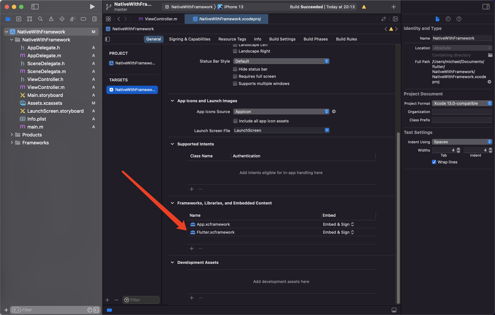

# 混合开发与引擎

## Flutter项目调用原生的功能（相机，相册）

## 通讯

### MethodChannel 

主要传递方法调用，一次通讯

methodChannel调用invokeMethod：发送消息

methodChannel调用setMethodCallHandler：设置回调

### BasicMessageChannel 

持续通讯，收到消息之后还可以回复消息。

### EventChannel 

数据流 持续通讯

创建：Channel构造方法有name，

发：invoke方法名，

接收回调：setMethodCallHandler，setMessageHandler

## 混合工程自动化

工程自动化重点是写脚本。

flutter工程，iOS工程，android工程。不需要配置环境。

混合工程一般单独的工程，flutter是module，iOS也有一个native工程。

## 混合开发 原生项目嵌入Flutter

AS创建`Flutter Module`。

`.android`和`.ios`是隐藏文件，调试用的，里面不要写代码，不会打包进去。

### 1、原生有flutter环境

比较重，不建议。有渲染引擎`Flutter.framework`也要进内存。

iOS没有flutter，需要使用pod。

Xcode创建工程，`pod init`创建pod。

```sh
#flutter插件路径
flutter_application_path = '../flutter_module' 
# 加载函数 参数1:flutter路径 2:iOS 3:这是flutter工程 4:podhelper.rb
load File.join(flutter_application_path,'.iOS','Flutter','podhelper.rb')

platform :ios, '9.0'

target 'NativeDemo' do
  # 安装
  install_all_flutter_pods(flutter_application_path)#flutter依赖的库也加载进来
  use_frameworks!

  # Pods for NativeDemo

end
```

`pod install`之后，native就有了flutter的东西了。

修改了flutter代码，AS编译或者Xcode清空缓存运行。

### 2、原生没有flutter环境

#### 2.1 framework混合开发

打包成framework直接给native使用。

1. 终端进入flutter module目录

2. `flutter build ios-framework --output=../flutter_app`

   构建混合工程

   1. Debug调试
   2. Profile介于发布和调试，既有release性能，又有debug的调试功能。
   3. Release发布

   `Flutter.xcframework`和flutter环境有关。

   `App.xcframework`和自己写的flutter代码页面有关。

   多个flutter module只需要一个`Flutter.xcframework`，和不同的`App.xcframework`。

3. 集成framework

   

#### 2.2 cocoapods混合工程

1. 终端进入flutter module目录

2. `flutter build ios-framework --cocoapods --output=../flutter_app`

   构建混合工程

   1. Debug调试
   2. Profile介于发布和调试，既有release性能，又有debug的调试功能。
   3. Release发布

   `Flutter.podspec`和flutter环境有关，从cocoapods上下载。

   `App.xcframework`和自己写的flutter代码页面有关。

   多个flutter module只需要一个`Flutter.xcframework`，和不同的`App.xcframework`。

3. 把文件拖进native工程

4. 创建podfile，添加`pod 'Flutter',:podspec => 'Debug/Flutter.podspec'`，然后pod install。

5. 配置App.xcframework

flutter只要做了更改，原生就需要更新，需要一个代码仓库，flutter把module开发完之后，代码push，仓库把代码工程打包编译成native使用的framework。

借用GitHub，Actions自己写脚本代码CI就可以实现上面的功能。

## 引擎

下载引擎：https://github.com/flutter/engine

路径不要有中文

三方工作所在目录需要有可执行权限

flutter版本：

```shell
➜  ~ flutter channel 
Flutter channels:
  master//主分支
  dev		//正在开发
  beta	//新特性
* stable//稳定版
➜  ~ 
```

### 编译引擎

GN构建文件

1. 进入路径`路径/engine_download/src/flutter/tools`

```bash
# iOS
# 真机debug
./gn --ios --unoptimized
# 真机release ( , ) 
./gn --ios --unoptimized --runtime-mode=release 
# 模拟器版本
./gn --ios --simulator --unoptimized
# 主机端(Mac)构建
./gn --unoptimized
```

Ninja编译

1. 先安装ant：`brew install ant`

2. 进入路径`路径/engine_download/src/out`

3. ```bash
   ninja -C host_debug_unopt && ninja -C ios_debug_sim_unopt && ninja -C ios_debug_unopt && ninja -C ios_release_unopt
   ```

4. 

