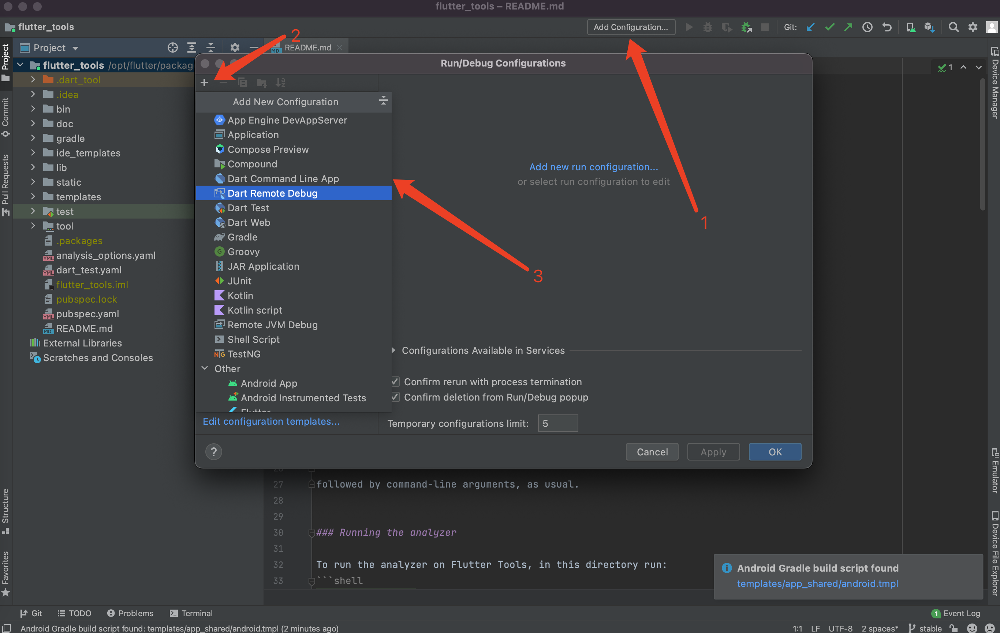
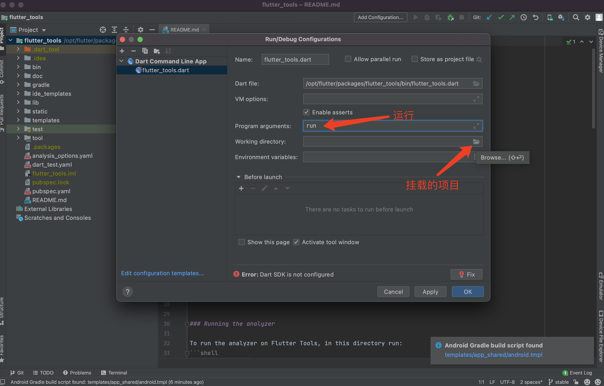
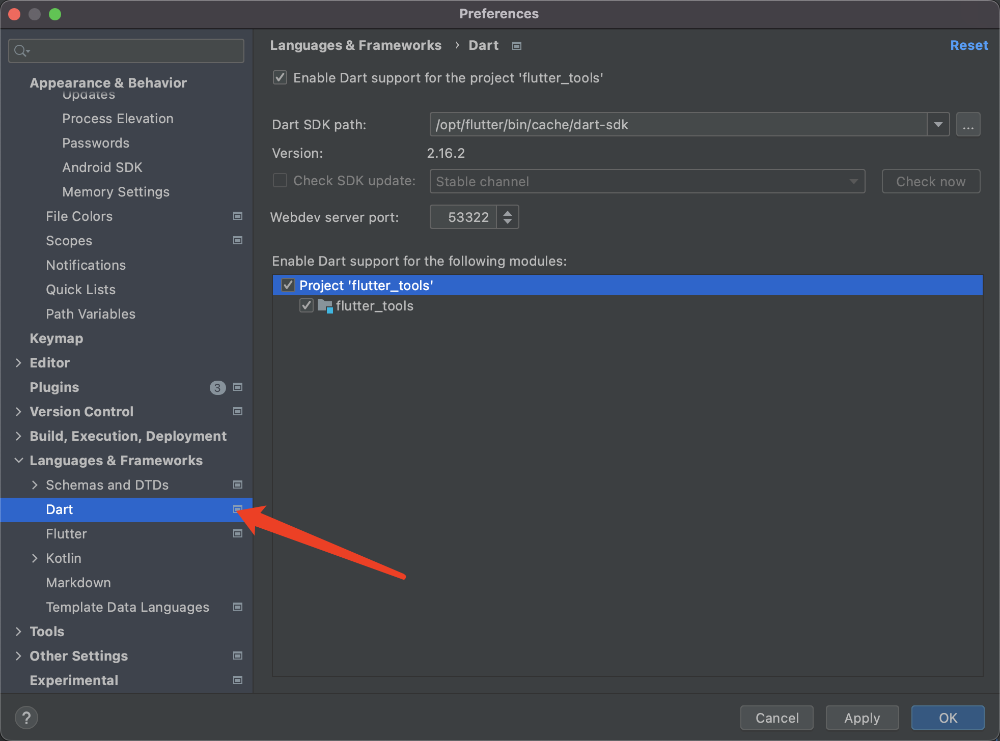

# 热重载挂载

/opt/flutter/packages/flutter_tools也是一个项目工程

用as打开，需要配置。

## 配置dart-sdk路径

然后运行flutter_tools

## 三个端

增量渲染，找到修改的dart文件（增量文件），以文件为单位。

DartSever通过网络请求把代码给Dart虚拟机

dart虚拟机再给手机客户端Flutter framework渲染引擎。

