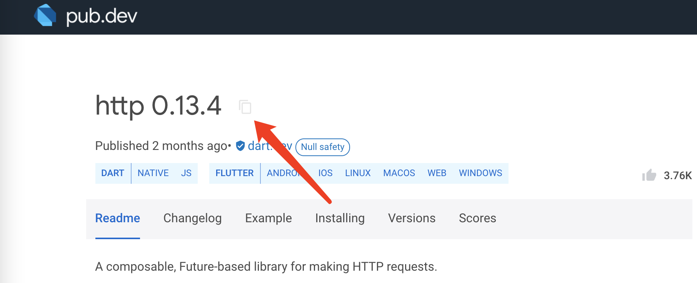
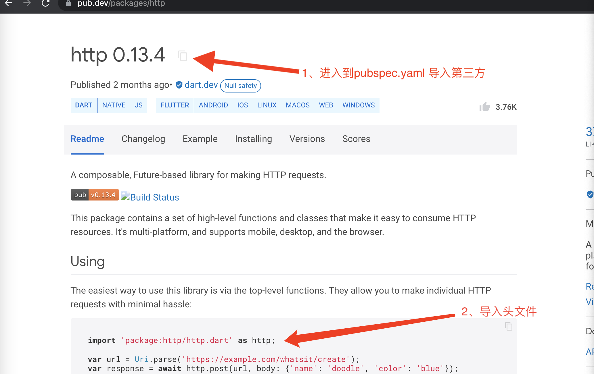

没有服务器时，制作假数据。使用`rap2.taobao.org/`。

Mock.js生成随机数据值

`randomuser.me/documentation#howto`生成假用户信息

数据库：http://rap2.taobao.org/
Mock：http://mockjs.com/
假用户信息：https://randomuser.me/
Dart包：https://pub.dev/

# 请求网络

**pub.dev**里面是所有的三方库，dart原生库。

网络请求库：

1. dio
2. http

无论哪种三方的网络请求，自己都要封装，不然更改第三方的时候要全部修改，地方太多。

切换第三方只需要把封装好的给改一下就可以了。

拷贝`http: ^0.13.4`

然后进入到pubspec.yaml 导入

#### 使用

导入头文件

网络请求是异步的

调用的时候不需要等，去做别的。

异步如果有返回值的，一般返回`Future`。未来的数据。

先保存代码 然后回调的时候再调用。使用then。

异步不等于多线程

线程是由CPU调度。

多线程一定是异步的，但是异步不一定是多线程。

任务A 任务B 任务C 可以是一个线程A，是异步的，但是同一个线程。

