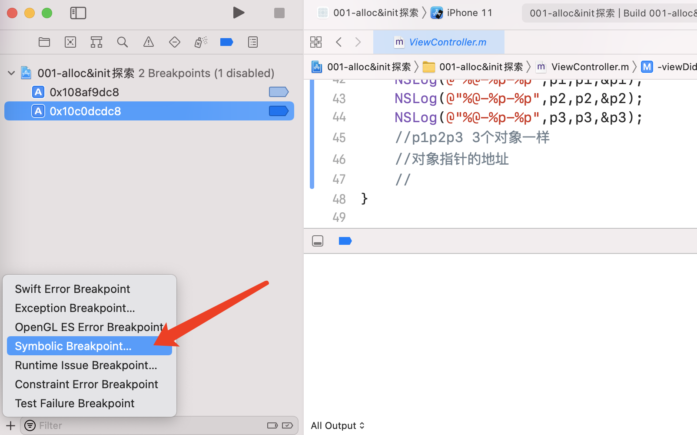

# 底层探索分析的三种方法

### 1 符号断点定位

已知方法，加符号断点

下一个符号断点：




符号断点可能有很多，需要先注掉，当进入到项目的断点时，再解开符号断点。


```
libobjc.A.dylib`_objc_rootAlloc:
```

看到哪个库，然后去找源码。


### 2 按住Ctrl 和下一步（step into），就可以点击进入


然后就可以看到调用哪个方法，然后加一个符号断点。

### 3 汇编

1. 先打断点然后设置

>Xcode-->Debug Workflow-->Always Show Disassembly

找到调用方法然后下符号断点

函数返回值放在x0寄存器

xcrun

1. 终端打开对应main.m文件
2. 输入`scrun -sdk iphoneos clang -arch arm64e -rewrite-objc main.m -o main.cpp`

clang -rewrite-objc main.m -o main.cpp


