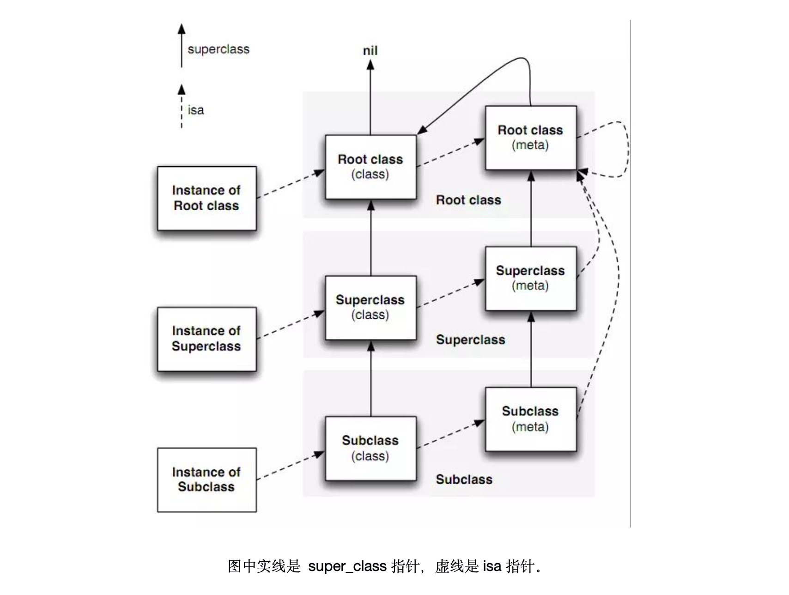
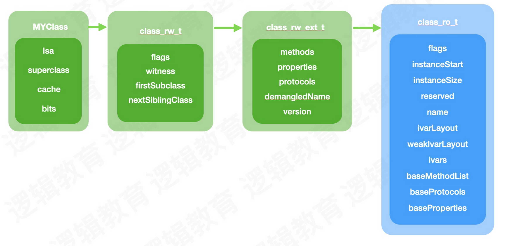

## 类的底层

类的底层 结构体指针

```c++
typedef struct objc_class *Class;
```

类在内存中有且只有一个。

```objective-c
LGPerson *p = [LGPerson alloc];
```

`p/x p`拿到指针地址

然后`x/4gx`得到地址

然后isa&掩码0x00007ffffffffff8

Xcode控制台：

>**(lldb) p/x p**
>
>(LGPerson *) $0 = 0x0000000100744610
>
>**(lldb) x/4gx 0x0000000100744610**
>
>0x100744610: 0x011d800100008365 0x0000000000000000
>
>0x100744620: 0x0000000000000000 0x0000000000000000
>
>**(lldb) p/x 0x011d800100008365&0x00007ffffffffff8**
>
>(long) $1 = 0x0000000100008360
>
>**(lldb) po 0x0000000100008360**
>
>LGPerson
>
>**(lldb)** 

x/4gx 类

>**(lldb) x/4gx 0x0000000100008360**
>
>0x100008360: 0x0000000100008338 0x00007fff8071a088
>
>0x100008370: 0x00007fff2030baa0 0x0000802c00000000
>
>**(lldb)** 

说明类也有相应内存结构

类会和我们的对象 无限开辟 内存不止有一个类

## isa指针

#### isa 的走位

实例对象的isa指向类对象

类对象的isa指向元类。

**任何元类的isa都指向根元类，根元类的isa指向根元类自己。**

对象 isa -> 类 isa -> 元类(系统生成的) isa -> 根元类 isa -> 根元类（NSObject）

根类（NSObject） isa -> 根元类 isa



#### 继承链

两个方法：

1. `object_getClass`得到isa指向的类。
2. `class_getSuperclass`得到父类。

类有继承链。Teacher类的父类是Person类。Person父类NSObject，NSObject父类nil。

元类也有继承链，Teacher元类的父类是Person元类。

根元类的父类是NSObject，万物皆来自NSObject。根元类是系统创建的，虚的 看不到。

对象没有继承，只有类有继承。

元类的父类就是父类的元类。

# 元类

元类也是类对象，其中isa指向根元类，superClass指向父元类。

##### 为什么要设计metaclass

复用消息机制。实例对象的方法等信息存储到类对象中，那么类方法就要设计一个一样的机制来存储，**存储类的类方法**，所以引入元类。

方法的存储：

- 实例方法存在类里面。
- 类方法存在元类里面。

```c++
Method class_getClassMethod(Class cls, SEL sel)
{
    if (!cls  ||  !sel) return nil;
    return class_getInstanceMethod(cls->getMeta(), sel);
}
```

**在底层没有类方法**，类方法底层是元类的对象方法。类也是对象。

# 类的结构

## objc_class

`x/4gx Person.class`发现类有内存结构

类对象的数据结构objc_class，继承objc_object 结构体，所以包含 isa 指针

对象person 类HHPerson

id是一个`objc_object *`指针

class是`objc_class *`指针地址

class里面有四个成员变量：

1. Class ISA;//指向元类	8字节

2. Class superclass;// 指向父类    8字节

3. cache_t cache;  // （大小和内存成员变量有关，方法在方法区，static存储在全局区，所以static的不需要管。8字节） 

   方法的缓存列表

   有很多bucket

   1. bucket_t    保存方法缓存，
      1. SEL key
      2. IMP

4. bits 数据

   class_ro_t

   1. 成员变量列表

   class_rw_t

   1. 方法列表
   2. 协议列表
   3. 属性列表

拿到首地址，内存平移 拿到结构体中指定内存内容。

objc_class结构体的定义如下：

```c++
struct objc_class : objc_object {
  objc_class(const objc_class&) = delete;
  objc_class(objc_class&&) = delete;
  void operator=(const objc_class&) = delete;
  void operator=(objc_class&&) = delete;
  
    //类的结构：
    // Class ISA;//隐藏属性 继承自objc_object。类也是对象。isa指向元类。8字节
    //父类
    Class superclass;//8字节
    cache_t cache;         //16字节    // formerly cache pointer and vtable
    //methodlist，ivarlist，propertylist，protocols等等
    class_data_bits_t bits;    // class_rw_t * plus custom rr/alloc flags

    Class getSuperclass() const {
			//省略代码
    }

    void setSuperclass(Class newSuperclass) {
			//省略代码
    }

    class_rw_t *data() const {
        return bits.data();
    }
    void setData(class_rw_t *newData) {
        bits.setData(newData);
    }

  /**
  省略代码...
  */
};
```

## 结构体内存大小：

方法在方法区，方法不需要管，只和内存成员变量有关。static存储在全局区，所以static的不需要管。

## cache_t

```c++
struct cache_t {
private:
    explicit_atomic<uintptr_t> _bucketsAndMaybeMask;//8字节
    union {
        struct {
            explicit_atomic<mask_t>    _maybeMask;//4
#if __LP64__
            uint16_t                   _flags;//2
#endif
            uint16_t                   _occupied;//2
        };
        explicit_atomic<preopt_cache_t *> _originalPreoptCache;//8
    };
  //下面的代码省略
};
```

## class_data_bits_t

```c++
struct class_data_bits_t {
    friend objc_class;

    // Values are the FAST_ flags above.
    uintptr_t bits;
	private:
	    /**
    省略代码...
    */
  public:

    class_rw_t* data() const {
        return (class_rw_t *)(bits & FAST_DATA_MASK);
    }
    void setData(class_rw_t *newData)
    {
        ASSERT(!data()  ||  (newData->flags & (RW_REALIZING | RW_FUTURE)));
        // Set during realization or construction only. No locking needed.
        // Use a store-release fence because there may be concurrent
        // readers of data and data's contents.
        uintptr_t newBits = (bits & ~FAST_DATA_MASK) | (uintptr_t)newData;
        atomic_thread_fence(memory_order_release);
        bits = newBits;
    }

    // Get the class's ro data, even in the presence of concurrent realization.
    // fixme this isn't really safe without a compiler barrier at least
    // and probably a memory barrier when realizeClass changes the data field
    const class_ro_t *safe_ro() const {
        class_rw_t *maybe_rw = data();
        if (maybe_rw->flags & RW_REALIZED) {
            // maybe_rw is rw
            return maybe_rw->ro();
        } else {
            // maybe_rw is actually ro
            return (class_ro_t *)maybe_rw;
        }
    }

    /**
    省略代码...
    */
};
```

### class_rw_t

```c++
struct class_rw_t {
    // Be warned that Symbolication knows the layout of this structure.
    uint32_t flags;
    uint16_t witness;
#if SUPPORT_INDEXED_ISA
    uint16_t index;
#endif

    explicit_atomic<uintptr_t> ro_or_rw_ext;

    Class firstSubclass;//子类
    Class nextSiblingClass;
  
  //获取class_rw_ext_t
  	class_rw_ext_t *ext() const {
        return get_ro_or_rwe().dyn_cast<class_rw_ext_t *>(&ro_or_rw_ext);
    }
	//创建class_rw_ext_t
    class_rw_ext_t *extAllocIfNeeded() {
        auto v = get_ro_or_rwe();
        if (fastpath(v.is<class_rw_ext_t *>())) {
            return v.get<class_rw_ext_t *>(&ro_or_rw_ext);
        } else {
            return extAlloc(v.get<const class_ro_t *>(&ro_or_rw_ext));
        }
    }

    class_rw_ext_t *deepCopy(const class_ro_t *ro) {
        return extAlloc(ro, true);
    }
  
  //成员变量存在class_ro_t里面
      const class_ro_t *ro() const {
        auto v = get_ro_or_rwe();
        if (slowpath(v.is<class_rw_ext_t *>())) {
            return v.get<class_rw_ext_t *>(&ro_or_rw_ext)->ro;
        }
        return v.get<const class_ro_t *>(&ro_or_rw_ext);
    }

    void set_ro(const class_ro_t *ro) {
        auto v = get_ro_or_rwe();
        if (v.is<class_rw_ext_t *>()) {
            v.get<class_rw_ext_t *>(&ro_or_rw_ext)->ro = ro;
        } else {
            set_ro_or_rwe(ro);
        }
    }
  //方法列表
      const method_array_t methods() const {
        auto v = get_ro_or_rwe();
        if (v.is<class_rw_ext_t *>()) {//先判断类里面有没有rwe，如果有rwe，则在rwe里面返回method
            return v.get<class_rw_ext_t *>(&ro_or_rw_ext)->methods;
        } else {//没有rwe，则从ro里面返回method
            return method_array_t{v.get<const class_ro_t *>(&ro_or_rw_ext)->baseMethods()};
        }
    }
//属性列表
    const property_array_t properties() const {
        auto v = get_ro_or_rwe();
        if (v.is<class_rw_ext_t *>()) {
            return v.get<class_rw_ext_t *>(&ro_or_rw_ext)->properties;
        } else {
            return property_array_t{v.get<const class_ro_t *>(&ro_or_rw_ext)->baseProperties};
        }
    }
//协议列表
    const protocol_array_t protocols() const {
        auto v = get_ro_or_rwe();
        if (v.is<class_rw_ext_t *>()) {
            return v.get<class_rw_ext_t *>(&ro_or_rw_ext)->protocols;
        } else {
            return protocol_array_t{v.get<const class_ro_t *>(&ro_or_rw_ext)->baseProtocols};
        }
    }
};
```

### class_ro_t

```c++
struct class_ro_t {
  	//成员变量
    uint32_t flags;
    uint32_t instanceStart;
    uint32_t instanceSize;
#ifdef __LP64__
    uint32_t reserved;
#endif

    union {
        const uint8_t * ivarLayout;
        Class nonMetaclass;
    };

    explicit_atomic<const char *> name;
    WrappedPtr<method_list_t, method_list_t::Ptrauth> baseMethods;
    protocol_list_t * baseProtocols;
  	property_list_t *baseProperties;
    const ivar_list_t * ivars;
    const uint8_t * weakIvarLayout;
  
  

    // This field exists only when RO_HAS_SWIFT_INITIALIZER is set.
    _objc_swiftMetadataInitializer __ptrauth_objc_method_list_imp _swiftMetadataInitializer_NEVER_USE[0];

    _objc_swiftMetadataInitializer swiftMetadataInitializer() const {
        if (flags & RO_HAS_SWIFT_INITIALIZER) {
            return _swiftMetadataInitializer_NEVER_USE[0];
        } else {
            return nil;
        }
    }

    const char *getName() const {
        return name.load(std::memory_order_acquire);
    }

    class_ro_t *duplicate() const {
        bool hasSwiftInitializer = flags & RO_HAS_SWIFT_INITIALIZER;

        size_t size = sizeof(*this);
        if (hasSwiftInitializer)
            size += sizeof(_swiftMetadataInitializer_NEVER_USE[0]);

        class_ro_t *ro = (class_ro_t *)memdup(this, size);

        if (hasSwiftInitializer)
            ro->_swiftMetadataInitializer_NEVER_USE[0] = this->_swiftMetadataInitializer_NEVER_USE[0];

#if __has_feature(ptrauth_calls)
        // Re-sign the method list pointer.
        ro->baseMethods = baseMethods;
#endif

        return ro;
    }

    Class getNonMetaclass() const {
        ASSERT(flags & RO_META);
        return nonMetaclass;
    }

    const uint8_t *getIvarLayout() const {
        if (flags & RO_META)
            return nullptr;
        return ivarLayout;
    }
};
```

## 探索类

```
int main(int argc, const char * argv[]) {
    @autoreleasepool {

        // 类的内存结构
        // 8 * 3 = 24
        LGPerson *p1 = [[LGPerson alloc] init];
    		//打断点
        // class_data_bits_t
    }
    return 0;
}
```

#### lldb调试

>打印地址
>
>**(lldb) p/x LGPerson.class**
>
>(Class) $0 = 0x0000000100008380 LGPerson
>
>偏移两个地址
>
>**(lldb) p (class_data_bits_t \*)0x00000001000083a0**
>
>(class_data_bits_t *) $1 = 0x00000001000083a0
>
>获取data
>
>**(lldb) p $1->data()**
>
>(class_rw_t *) $2 = 0x000000010060d880
>
>**(lldb) p \*$2**
>
>(class_rw_t) $3 = {
>
> flags = 2148007936
>
> witness = 1
>
> ro_or_rw_ext = {
>
>  std::__1::atomic<unsigned long> = {
>
>   Value = 4295000344
>
>  }
>
> }
>
> firstSubclass = nil
>
> nextSiblingClass = NSUUID
>
>}
>
>**(lldb) p $3.ro()**
>
>(const class_ro_t *) $4 = 0x0000000100008118
>
>**(lldb) p \*$4**
>
>(const class_ro_t) $5 = {
>
> flags = 0
>
> instanceStart = 8
>
> instanceSize = 32
>
> reserved = 0
>
>  = {
>
>  ivarLayout = 0x0000000000000000
>
>  nonMetaclass = nil
>
> }
>
> name = {
>
>  std::__1::atomic<const char *> = "LGPerson" {
>
>   Value = 0x0000000100003eb8 "LGPerson"
>
>  }
>
> }
>
> baseMethodList = 0x0000000100008160
>
> baseProtocols = nil
>
> ivars = 0x00000001000081f8
>
> weakIvarLayout = 0x0000000000000000
>
> baseProperties = 0x0000000100008260
>
> _swiftMetadataInitializer_NEVER_USE = {}
>
>}
>
>**(lldb) p $5**
>
>(const class_ro_t) $5 = {
>
> flags = 0
>
> instanceStart = 8
>
> instanceSize = 32
>
> reserved = 0
>
>  = {
>
>  ivarLayout = 0x0000000000000000
>
>  nonMetaclass = nil
>
> }
>
> name = {
>
>  std::__1::atomic<const char *> = "LGPerson" {
>
>   Value = 0x0000000100003eb8 "LGPerson"
>
>  }
>
> }
>
> baseMethodList = 0x0000000100008160
>
> baseProtocols = nil
>
> ivars = 0x00000001000081f8
>
> weakIvarLayout = 0x0000000000000000
>
> baseProperties = 0x0000000100008260
>
> _swiftMetadataInitializer_NEVER_USE = {}
>
>}
>
>**(lldb) p $5.ivars**
>
>(const ivar_list_t *const) $6 = 0x00000001000081f8
>
>**(lldb) p \*$6**
>
>(const ivar_list_t) $7 = {
>
> entsize_list_tt<ivar_t, ivar_list_t, 0, PointerModifierNop> = (entsizeAndFlags = 32, count = 3)
>
>}
>
>**(lldb) p $7.get(0)**
>
>(ivar_t) $8 = {
>
> offset = 0x0000000100008318
>
> name = 0x0000000100003f19 "subject"
>
> type = 0x0000000100003f63 "@\"NSString\""
>
> alignment_raw = 3
>
> size = 8
>
>}
>
>**(lldb) p $7.get(1)**
>
>(ivar_t) $9 = {
>
> offset = 0x0000000100008320
>
> name = 0x0000000100003f21 "_name"
>
> type = 0x0000000100003f63 "@\"NSString\""
>
> alignment_raw = 3
>
> size = 8
>
>}
>
>**(lldb) p $7.get(2)**
>
>(ivar_t) $10 = {
>
> offset = 0x0000000100008328
>
> name = 0x0000000100003f27 "_hobby"
>
> type = 0x0000000100003f63 "@\"NSString\""
>
> alignment_raw = 3
>
> size = 8
>
>}
>
>**(lldb)** 

**class_data_bits_t**在类里面，不是在对象里面。

firstSubclass为什么是nil：懒加载

## ivar在哪里

实例变量（成员变量）和属性的区别：

属性在`class_rw_t`里。

成员变量在`class_ro_t`里。

通过clang查看cpp。属性生成`_变量名`和set，get方法

setter方法是内存赋值。基类方法`objc_setProperty`

## 查找方法实现IMP

找不到则_objc_msgForward

```c++
__attribute__((flatten))
IMP class_getMethodImplementation(Class cls, SEL sel)
{
    IMP imp;

    if (!cls  ||  !sel) return nil;

    lockdebug_assert_no_locks_locked_except({ &loadMethodLock });

    imp = lookUpImpOrNilTryCache(nil, sel, cls, LOOKUP_INITIALIZE | LOOKUP_RESOLVER);

    // Translate forwarding function to C-callable external version
    if (!imp) {
        return _objc_msgForward;//消息转发
    }

    return imp;
}
```

## 类可以动态添加方法，不能添加成员变量

要修改类的结构的问题。

在上面的objc_class结构体中，ivars是objc_ivar_list（成员变量列表）指针；methodLists是指向objc_method_list指针的指针。

在Runtime中，objc_class结构体大小是固定的，不可能往这个结构体中添加数据，只能修改。

所以ivars指向的是一个固定区域，只能修改成员变量值，不能增加成员变量个数。methodList是一个二维数组，所以可以修改*methodLists的值来增加成员方法，虽没办法扩展methodLists指向的内存区域，却可以改变这个内存区域的值（存储的是指针）。因此，可以动态添加方法，不能添加成员变量。

- class_ro_t：只读，不允许修改。编译的时候生成的，类在编译的时候，存放实例变量、属性、方法、协议等。是纯净的内存空间Clean Memory，内存不够的时候，移除没有使用的。
- class_rw_t：可读可写，运行时分配的存储容量，运行的时候把ro放在rw里面。
- class_rw_ext_t：并不是每个类都有class_rw_ext_t，使用runtime添加协议、属性、方法会有rwe，或者使用分类的时候（分类和本类必须都是非懒加载类）。如果把ro的数据拷贝一份，这样浪费内存，把class_ro_t中允许被修改的部分拷贝到class_rw_ext_t，class_ro_t里面的内容还在。节省内存。
  - 所以类和分类不是必须写load方法的时候，不要写load方法，减少内存消耗。因为会有class_rw_ext_t。




## 总结

类里面的ro里面存的成员变量。

类的实例方法、属性、协议 存在类对象rw里面。

类方法存在元类里面。
