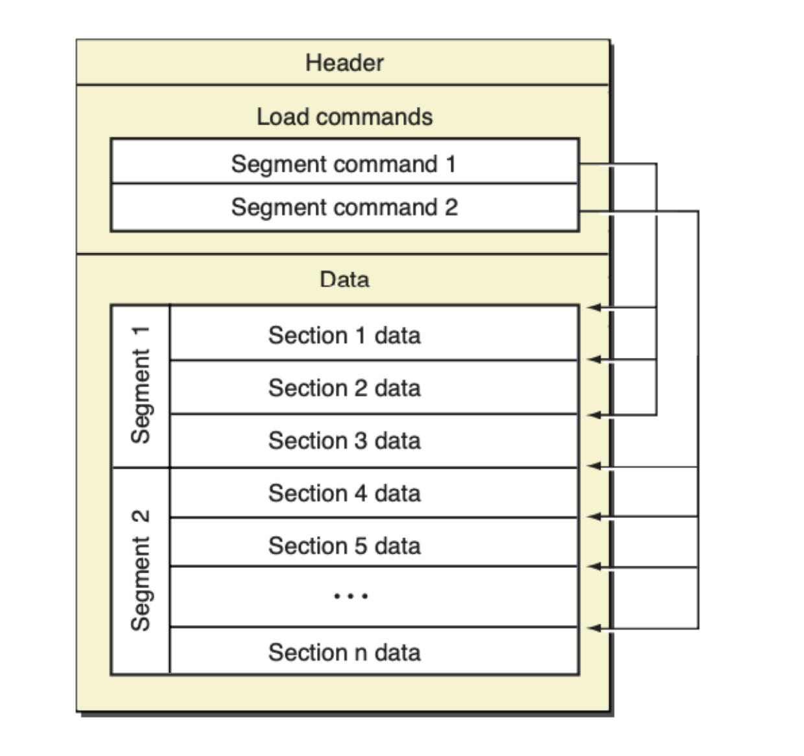
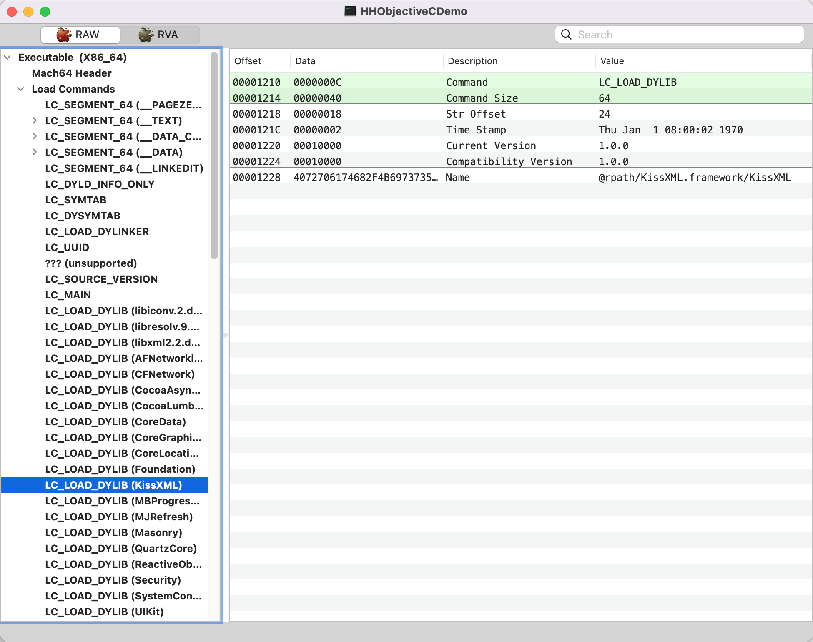
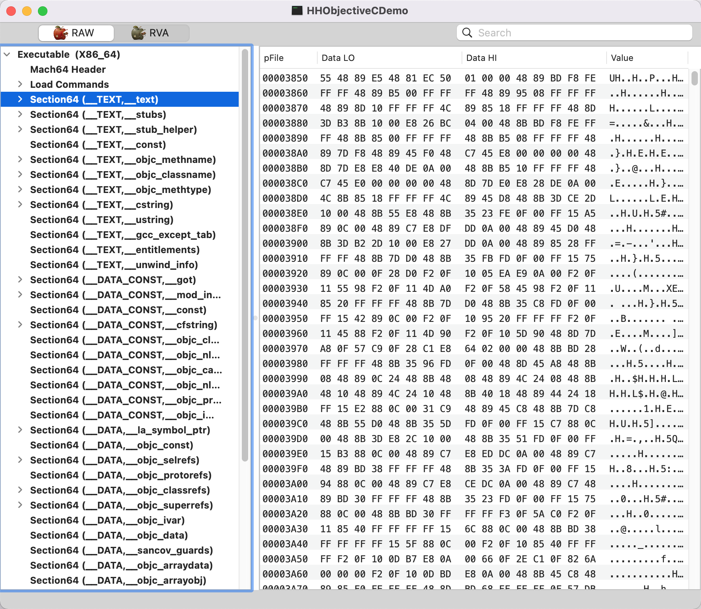

# Mach-O

我们打开了一个App，可以理解在手机的操作系统上运行了一个App进程。而进程是特殊文件在内存中加载得到的结果，这种特殊文件必须是操作系统可理解的。

在unix中，可运行的程序会编译成一个二进制文件，unix对于二进制文件，有一个标准的格式叫ElF。苹果定制了一个属于苹果的格式，这个就是Mach-O格式。

Mach-O 其实是Mach Object文件格式的缩写，是 mac 以及 iOS 上可执行文件的格式， 类似于 windows上的 PE 格式 (Portable Executable ), linux 上的 elf 格式 (Executable and Linking Format) 。

但是Mach-O不仅仅是只是可执行文件的格式标准，还是macOS和iOS中一些其他文件的标准格式。

常见的Mach-O格式有下面几种可执行文件： 

- 静态库、动态库文件(.a .dylib .framework等)
- dyld（动态连接器）
- .dsym文件（符号表）
- bundle资源文件
- 目标文件(编译输出的.0文件)

Mach-O总的来说可以说是苹果的一种文件标准的格式。

预编译 #import插入到指定的位置，替换宏定义等等。

编译阶段：词法分析 语法分析 语义分析

汇编阶段：生成机器指令 .o

链接：静态链接 动态链接

以下以可执行文件为重点去讲述Mach-O

## 可执行文件

我们开发的app，编译打包后，就会生成一个可执行的，Mach-O格式的二进制文件。

对于macOS和iOS中的App，其生成可执行二进制文件从支持的架构分为两种：

1. 单架构的二进制文件
2. 胖二进制文件

单架构的二进制文件就是运行于单个架构(如x86,ARM64等)的二进制文件。而胖二进制就是一个二进制文件里面包含多个单架构的二进制文件。

## Mach-O内容

- VM Address : Virtual Memory Address, 段的虚拟内存地址，在内存中的位置 
- VM Size : Virtual Memory Size, 段的虚拟内存大小, 占用多少内存 
- File Offset : 段在文件中的偏移量 
- File Size : 段在文件中的大小 
- ASLR

以mac中的计算器App为例，用MachOView查看，可以看到这是一个Fat Binary类型的可执行文件，也就是我们平常说的胖二进制文件。里面包含了两个Executable二进制文件，每一个Excutable里面的格式可以参照单个架构的Mach-O的格式。当我们点击app的时候，就会从中选合适的Excutable加载到内存中。

## 单个Excutable的格式总体如下：

1. ASLR

2. _pageZero

3. Header

4. Load Commands

5. Text代码段

6. Data数据段

   里面会有符号表（间接符号表），访问NSLog。

7. Symbol Table（符号表）自定定义的

8. Dynamic Symbol Table

   Indirect Symbols间接符号，外部动态库符号 系统的符号

   符号绑定

对于上面的图片，单架构的可执行文件Mach-O文件格式的内部结构总体如下：

从图中可知，Mach-O大概分为三个部分

- mach-header 
- load commands 

- Data 

下面简单的说下各个部分的作用是什么。

### 1. mach_header

文件头mach_header 位于 Mach-O 文件的头部，有以下作用：

- 表明该文件是 Mach-O 格式
- 标明文件类型，CPU 架构等信息，指定目标架构
- 标明load commands数量等
- 其他的文件属性信息
- 文件头信息影响后续的文件结构安排 

Products文件夹下的`.app`文件显示包内容，可执行文件在MachOView中整体如下

### 2. load commands

加载的指令，依赖的库Foundation

load commands记录地址信息

**load commands是一张包含很多内容的表。内容包括区域的位置、符号表、动态符号表等**。 这一部分存储的是加载指令，指导操作系统该如何把可执行文件加载到内存中。有以下作用

- 指导data部分的数据应该怎么加载
- 指导dyld加载哪些库
- 指明符号表地址
- 其他

<table> 
  <tr><th>表头1</th><th>表头2</th></tr>
    <tr><td>LC_SEGMENT_64</td><td>将文件中（32位或64位）的段映射到进程地址空间中</td></tr>
    <tr><td>LC_DYLD_INFO_ONLY</td><td>动态链接相关信息</td></tr>
    <tr><td>LC_SYMTAB</td> <td>符号地址</td></tr>
    <tr><td>LC_DYSYMTAB</td> <td>动态符号表地址</td></tr>
    <tr><td>LC_LOAD_DYLINKER</td> <td>dyld加载</td></tr>
    <tr><td>LC_UUID</td> <td>文件的UUID</td></tr>
    <tr><td>LC_VERSION_MIN_MACOSX</td> <td>支持最低的操作系统版本</td></tr>
    <tr><td>LC_SOURCE_VERSION</td> <td>源代码版本</td></tr>
    <tr><td>LC_MAIN</td> <td>设置程序主线程的入口地址和栈大小</td></tr>
    <tr><td>LC_LOAD_DYLIB</td> <td>依赖库的路径，包含三方库</td></tr>
    <tr><td>LC_FUNCTION_STARTS</td> <td>函数起始地址表</td></tr>
    <tr><td>LC_CODE_SIGNATURE</td> <td>代码签名</td></tr>
</table>
在MachOView中整体如下

### 3. Data数据段

**data区主要就是负责代码和数据记录的。Mach-O 是以 Segment 这种结构来组织数据的，一个 Segment 可以包含 0 个或多个 Section。根据 Segment 是映射的哪一个 Load Command，Segment 中 section 就可以被解读为是是代码，常量或者一些其他的数据类型。在装载在内存中时，也是根据 Segment 做内存映射的。** 

这一部分存储的数据区域，包含程序运行的一切数据，表明数据加载到什么位置。部分数据如

- 代码数据
- 运行时的类数据
- 符号表，动态符号表
- 其他数据

在MachOView中整体如下

对于Data区域的文档，可以按照Segment和section划分。Segment和section的关系有点像操作系统中的段和页的概念。

这里section可以简单为Segment的子节点，而Data中的数据是以Segment为单位划分的。常见的Segment有

1. __PAGEZERO。一段随机大小，不可访问的空间
2. __TEXT。代码区
3. __DATA。数据区域
4. __LINKEDIT；包含了方法和变量的元数据，代码签名等信息

### image镜像文件

UIKit，Foundation都是镜像文件

编译完成之后的mach-o到内存中就叫镜像。

image list第0个是项目本身在内存中的地址（machO地址）。
