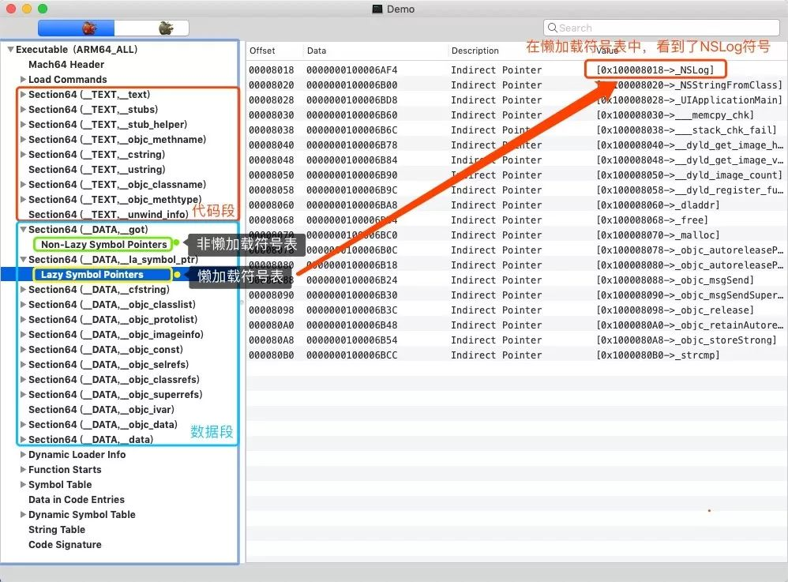
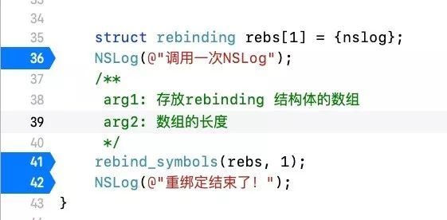
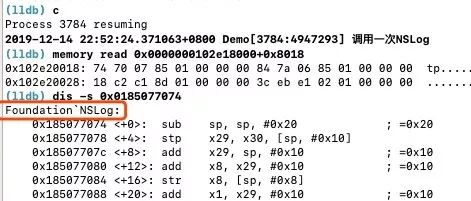
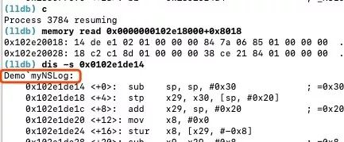
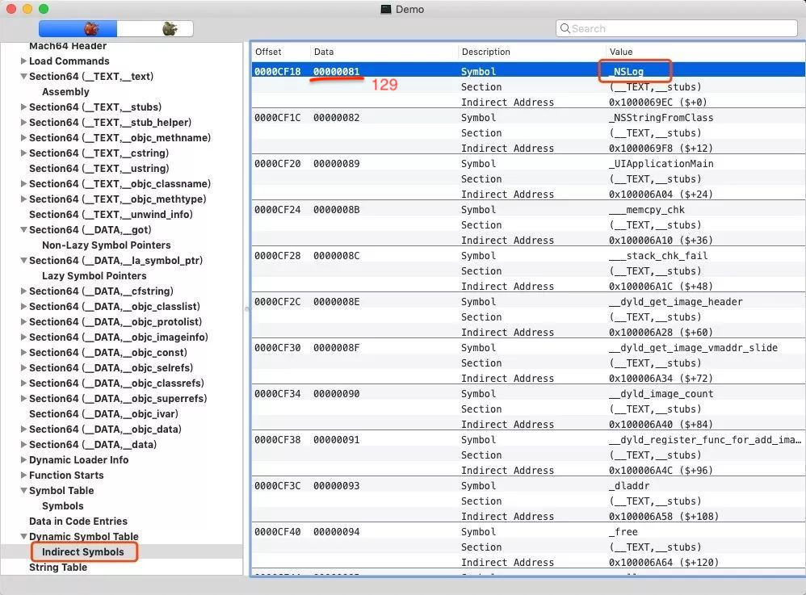
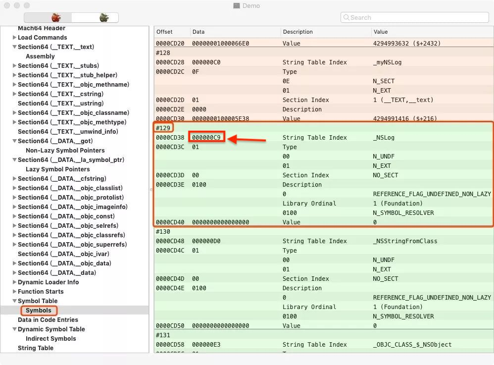
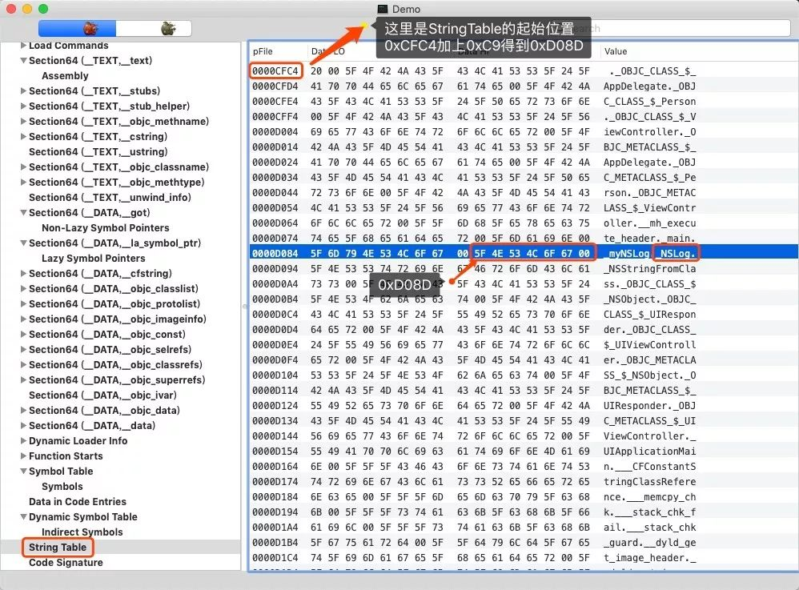
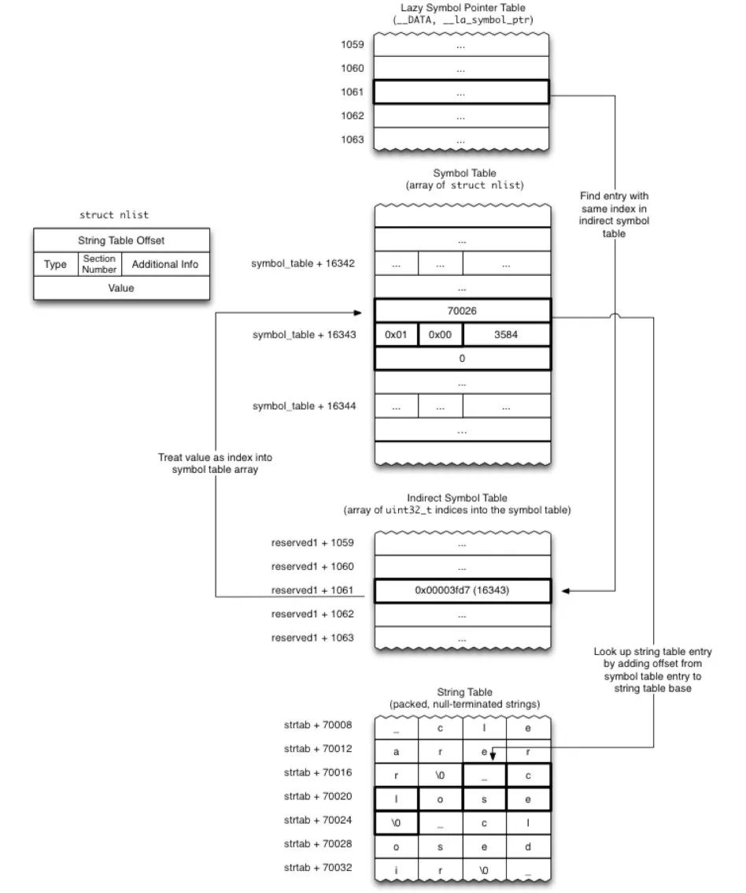

# fishhook

Hook意思是钩子，像钩子一样挂钩程序，来扩展程序的功能或者改变程序运行的流程。

逆向中经常是用于改变程序运行流程的一种技术。

Facebook 提供的一个动态修改链接 mach-O 文件的工具 fishhook。它利用 MachO 文件加载原理，通过修改懒加载和非懒加载两个表的指针达到 C 函数 HOOK 的目的。

## fishhook简单使用

### 它所提供的接口

fishhook只有两个文件 “fishhook.h” 和 “fishhook.c”。它提供的接口仅有一个结构体和两个函数：

**rebinding 结构体**用来确定你要 HOOK 的函数和要交换的函数地址。

```c
struct rebinding {
  constchar *name;//需要HOOK的函数名称，C字符串
  void *replacement;//新函数的地址
  void **replaced;//原始函数地址的指针！
};
```

> 注意replaced：在使用该结构体时，由于函数内部要修改外部指针变量所保存的值，所以这里是指针的指针（二级指针）。

rebind_symbols和 rebind_symbols_image 函数用来 HOOK 的两个方法。只不过后者是指定某个**镜像文件**的时候使用。所以一般我们直接使用前者。

> 镜像文件：比如 NSLog 函数是在 Fundation 框架中，那么 Fundation 在内存中就是一个镜像文件。

```c
int rebind_symbols(struct rebinding rebindings[], size_t rebindings_nel);
int rebind_symbols_image(void*header,intptr_t slide,struct rebinding rebindings[],size_t rebindings_nel);
```

### HOOK一下NSLog

我们新建一个 SingleView 的项目。在 ViewDidLoad 中对系统的 **NSLog** 函数进行 HOOK 。

```objective-c

#pragma mark - 更改系统的NSLog函数
//函数指针，用来保存原始的函数地址
static void(*sys_nslog)(NSString *format,...);

//定义一个新函数。HOOK成功后NSLog调用时，会来到这里
void myNSLog(NSString *format,...) {
    format = [format stringByAppendingString:@"\n 勾上了\n"];
    //调用系统的NSLog，HOOK成功后sys_nslog指针保存的是Fundation中NSLog的地址
    sys_nslog(format);
}

#pragma mark -
void func(const char *str){
    printf("%s",str);
}

static void(*funcP)(const char *);
void newFunc(const char *str){
    printf("勾上了");
}

- (void)viewDidLoad {
    [super viewDidLoad];
    // Do any additional setup after loading the view.
    //rebinding结构体
    struct rebinding nslog;
    nslog.name = "NSLog";//需要HOOK的函数名称
    nslog.replacement = myNSLog;//新函数的地址
    nslog.replaced = (void *)&sys_nslog;//保存 原始函数地址 的指针

    struct rebinding refunc;
    refunc.name = "func";
    refunc.replacement = newFunc;
    refunc.replaced = (void *)&funcP;
//    struct rebinding rebs[1] = {refunc};

    //准备数组，将一个或多个 rebinding 结构体放进去。
    struct rebinding rebs[1] = {nslog};

    /**
     用于重新绑定符号
     参数1:存放rebinding 结构体的数组
     参数2:数组的长度
     */
    rebind_symbols(rebs, 1);
}

- (void)touchesBegan:(NSSet<UITouch *> *)touches withEvent:(UIEvent *)event {
    func("hello");
    NSLog(@"hello");
}
```

运行之后，可以发现 NSLog 的函数调用已经被 HOOK 成功了！但是HOOK 自定义的函数，发现怎么都 HOOK 不到。

系统函数能 HOOK 成功，自定义的却 HOOK 不到呢？so~，往下看...

## MachO

首先我们要了解一个东西。我们写好的代码，生成的 iOS 程序其实是一个可执行文件。这个文件格式是 MachO 格式，所以一般我们称其为 **MachO** 文件。

这个文件里面包含的就是数据和指令。比如你定义的类、方法、全局变量、方法实现等等。我们为什么要讨论 MachO？因为结合上面的疑问我们思考一个问题：**自定义函数和系统函数，在文件位置上有什么区别？**

- **自定义函数**在本 MachO 文件中，自定义函数在本镜像文件中。
- **系统函数**在系统框架中，在运行时刻进入内存，系统函数在系统的动态库中，比如 NSLog 在 Fundation 这个镜像文件中。

那既然如此我们就可以得到这样的结论：自定义的函数，在编译时刻，编译器就可以确定函数的实现地址（在 MachO 文件中的偏移地址）。但是系统函数是没办法知道的。那么在 CPU 执行我们的代码的时候，我们是如何告诉 CPU ，我们需要调用系统函数。以及如何知道系统函数的地址的呢？这里就要提到 PIC 技术了。

## PIC（Position Independ code）技术

PIC翻译过来就是位置独立代码。

> 说人话：比如当你的程序要调用一个 MachO 外部函数的时候，编译器是没办法知道该函数的地址的。所以它在 MachO 文件里面生成一个列表，列表里面放指针。让当前的系统函数调用指向这个列表里面对应的指针。等到我们的 MachO 文件加载进入内存时，再将系统函数的真实地址，一个一个的赋值给列表中的指针。

- 那么这个列表，我们称为**符号表**。
- 这里面的指针，我们称为**符号**。
- 给里面的指针赋值的过程，我们称为**符号绑定**。

那么说到这里，我想很多童鞋已经猜到了。fishhook 之所以 HOOK 不了自定义的函数，就是因为**自定义的函数没有通过符号寻找地址这个过程，而系统函数是通过符号去绑定实现地址的**。fishhook 就是利用这一点，去修改了系统函数的符号达到 HOOK 的目的。其实我们通过fishhook 的函数名称就不难看出来 **rebind_symbols** 符号重绑定。

## fishHook原理探索

### 观察符号绑定和重绑定过程

#### 分析MachO文件

我们将刚才的 MachO 文件放入到 MachOView 里面分析一下。可以看到下图。



#### 找到符号偏移地址

在这里面我们就可以清晰的看到符号表在文件中长啥样了。并且最重要的是能够看出符号在文件中的偏移位置。


有了这个偏移值，我们可以在项目运行的时候，通过LLDB，观察的符号的绑定和重绑定过程。

#### 动态调试

1、来到我们原来的代码，在这几行打上断点并运行。



2、第一次断点触发时,我们利用 **LLDB** 查看符号中的值。


首先查看 MachO 文件的地址：通过 `image list`指令，查看所有镜像文件（ MachO 文件）的地址。


然后通过 `memory read`指令读取内存。因为符号是指针，所以读取8个字节的数据。


但是这里面存放的到底是不是 NSLog 的真实地址呢？我们如何查看。

我们可以利用 `dis-s`查看反汇编。由于 iOS 的小端模式，所以读数据从右往左读。比如：图中数据 `d0 ea e10201000000`那么读取出来的地址是 `0x0102e1ead0`


然后我们通过汇编发现，这里并不是 NSLog 的地址。如果是，这里会显示 Fundation 框架中的 NSLog 函数（等下会看到现象）。其原因是因为 NSLog 是懒加载符号，此时是第一次调用，还没有绑定符号。此时如果跟汇编，我们最终会看到`dyld_stub_binder`函数的调用。所以，我们过掉断点。

3、来到第二个断点处


我们重复上面的步骤，查看符号的内存数据，然后取出里面的值，通过 dis 反汇编查看。你会发现此刻已经绑定了符号。可以清晰的看到里面是 NSLog 的实现地址了。（这个过程就是符号绑定！）



接下来，我们来看看 rebind_symbols 之后，我们的符号表里面保存的地址变成了啥？

4、来到第三个断点处（第42行）


我们重复上面的步骤，查看符号的内存数据，然后取出里面的值，通过 dis 反汇编查看。你会发现此刻符号内的数据已经替换成了自定义的函数地址了。（符号重绑定成功！）



经过一系列动态调试，我们可以观察到符号绑定和重绑定的全部过程。但是，fishhook 是怎么通过我们传给它的一个字符就找到了我们 NSLog 的符号的呢？我们往下看...

### 通过符号找到字符串

我们还是来到 MachOView 里面，注意，我们数一下，NSLog 这个符号，在懒加载符号表里面是第几个？很明显第一个。


所以，与懒加载表对应的另外一张表就出来了。indirect Symbols。懒加载表里面 NSLog 是第一个，那么它在 indirect Symbols 表里面也就是第一个。



接下来，将 indirect Symbols 里面对应的 Data 值换算成为10进制。


0x81 的十进制是 129 .为什么要转换这个数据，因为它又是另外一个列表的角标。

这个列表就是 Symbols ，我们查看一下。



那么到了 Symbols 里面就接近我们最终的字符常量了。注意在 Symbols 里面有 String Table 的 Index 值。这里是 0xC9。这就说明，在 String Table 里面，偏移 0xC9 的地址就是我们NSLog字符。


我们来到 String Table 里面查看一下。我们通过**起始位置加上偏移**便可以定位到 NSLog 字符了。



函数名称在字符表里面都是5F也就是 _ 开始 然后00也就是 . 结束! 这也就是为什么你给 fishhook 一个系统函数名称，它能够帮你顺利 HOOK 到系统函数的原理了。通过上面一顿分析，我相信官方的图你也能看懂了。官方是以 close 函数为例：



## 总结

修改外部符号（例：NSLog）的绑定。

通过`NSLog`字符串如何找到符号并修改：

1. 拿到NSLog字符串，去machO的`String Table`里面找`NSLog`，用`.`来分割。得到`String Table Index`。
2. 通过`String Table index`去`Symbol Table`的`Symbols`（总表：内部符号和外部符号都有），定位到NSLog，得到符号表的偏移值（`Symbols Index`）
3. 通过`Symbols Index`去找`Indirect Symbols`得到该符号在`Indirect Symbols`中的顺序（偏移值）。
4. 由于`Lazy Symbol Pointers`的Index和`Indirect Symbols`一一对应，所以很容易就找到了对应的符号。
5. 最后修改`Lazy Symbol Pointers`里面的值。（因为外部符号的调用，都是找桩，桩去寻找`Lazy Symbol`里面的地址执行）

在`Lazy Symbol Pointers`懒加载符号表，修改了符号地址，把NSLog符号地址改为了自己应用程序image中自己定义方法MyNslog的地址。

## 后记

刚才我们通过动态调试加 MachOView 的分析梳理了整个符号绑定以及重绑定的过程。这个过程也是 fishhook 能够 HOOK 系统函数的原理。

## fishhook 工具用处

举个实际的运用场景：比如最近抖音团队分享的二进制重排启动优化。在这个优化的过程中，我们如何定位到启动时所有的OC 方法？我想你已经猜到了，通过 objc_msgSend 函数的 HOOK 。

- 埋点
  - Hook拦截用户手势交互或者进入某个指定页面等应用接口，进行用户行为统计分析
- 应用加固
  - 防止黑客通过Hook技术破解/攻破应用，来加固应用
- 应用隔离
  - 通过Hook技术拦截系统/应用接口，避免数据泄漏