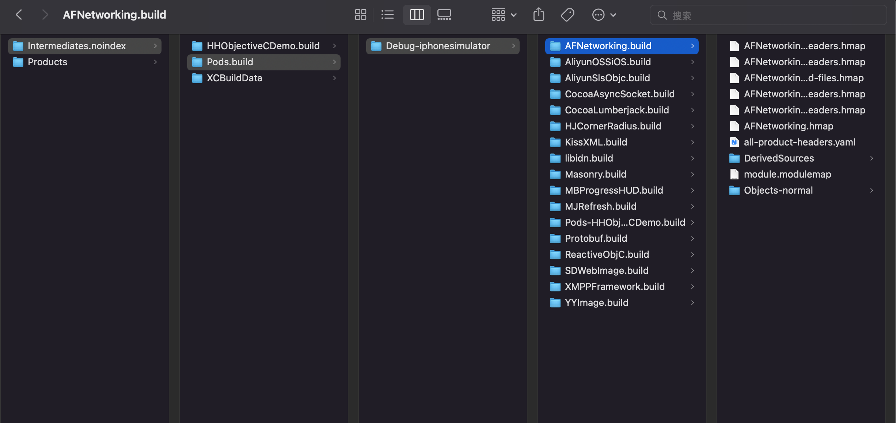

# hmap

全称headerMap头文件映射。

减少Xcode编译的时间，加快编译。

Key-value.  ViewController.h - 目录+ViewController.h

podfile每次编译对每个三方库都作为target都会生成hmap文件。每生成一个hmap文件需要0.1秒。

AFNetworking-project-headers.hmap：以引号方式引入头文件。

headers.hmap路径放到HEADER_SEARCH_PATHS，则变成<>引入方式。

USER_HEADER_SEARCH_PATHS，引号引入方式。

头文件参与文件的编译。

1. 正常引入

   预处理的时候，通过头文件绝对路径，把.h直接写入.m中。

   通过路径，设置头文件查找的目录和头文件的名称

   clang默认

2. module方式引入`#improt<UIKit.h>`

   普通：不同的.m都引入的一个头文件，所有的.m文件都包含同样的头文件内容，重复编译。

   module：通过module方式把一部分头文件包裹在一起，打包作为模块，进行预编译，把模块的头文件成二进制，再编译.m文件，使用时直接把二进制放到.m中。加快编译速度，节省时间，避免符号重复问题。

## 如何生成hmap

Key  ViewController.h

Prefix 目录

Suffix ViewController.h

## import和include

`improt = include + # pragma once`，只编译一次。
