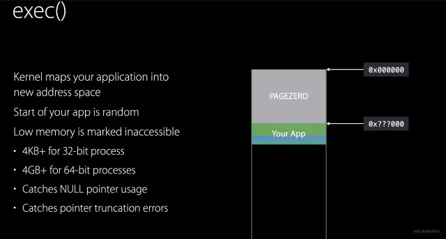
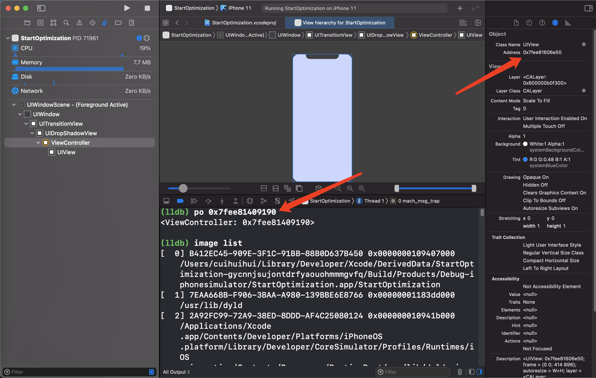
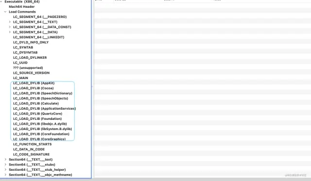
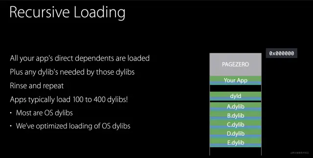

# 应用程序加载

底层基础库。并不是所有的都是从0开始写的。例如：UIKit，Foundation，libobjc，libDispath，libsystem等等。

## 加载到内存

dyld编译器，动态链接器。

库 映射到 内存，images。

在load方法中打断点，然后bt，查看堆栈，最下面的是dyld_start。

## 1. 加载到内存

当我们点击App的时候，操作系统就会在手机上开辟一段虚拟内存空间，然后加载Mach-O格式的二进制文件。如下

其中图中类似于管道的部分可以理解为系统为程序分配的内存空间。然后把我们的可执行文件加载到内存中。

### ASLR（随机偏移地址）

Address Space Layout Random （ASLR：随机偏移地址），地址空间布局随机化 , 是一种针对缓冲区溢出的安全保护技术，通过对堆、栈、共享库映射等线性区布局的随机化，通过增加攻击者预测目的地址的难度，防止攻击者指针定位攻击代码位置，达到阻止溢出攻击的一种技术 

注意图中有一个PAGEZERO的区域，这个是苹果的ASLR技术，也就是地址空间布局**随机化**。当编译出一个App的时候，生成的Mach-O文件的内容地址是固定的。ASLR技术在每次运行App的时候，都会加上一个PAGEZERO，PAGEZERO的大小都是随机的。加上PAGEZERO以后，Mach-O里面的地址都会需要加上相对的偏移，这样可以增加App的攻击难度。

程序每次运行在内存中的时候，在内存的首地址都会发生变化，基地址不一样。在虚拟地址前面加一个偏移量（ASLR）。

在虚拟内存地址出现之后就出现了ASLR。

`image list`查看第一个就是程序运行的基地址（起始地址）。

1. 早期

​		早期启动一个应用程序是将整块的加载进内存里。

​		好处：

​		代码在当前程序中的偏移地址确定，物理地址不知道。只有运行之后才知道。代码的访问：基地址加偏移地址。比较安全。

2. 出现虚拟地址之后

​		应用程序访问数据永远都是从0x000fcc（举例）开始，因为是虚拟地址。固定。所以只要知道偏移地址 通过内存地址访问，安全系数降低了。因为安全漏洞所以出现了ASLR。

​		在每次启动程序的时候在地址前加ASLR。ASLR值是随机的。虚拟内存加一个偏移值，为了保证像早期模拟物理地址有一个随机的开始位置。

### 虚拟内存和物理内存

0x7fee81409190 不是内存中的真实地址 是虚拟地址

0x7fee81409190-ASLR不是真实物理地址

如果是的话，再开启一个app能不能访问这个地址？所以是虚拟表里的地址。

### 物理内存时代

安全问题：早期应用程序之间是可以访问的，因为用的物理地址进行的数据读写，所以当前应用可以读取别的应用的数据。

内存不足：早期操作系统，有一个内存条，将整个应用程序加载到内存中，是物理地址，加载应用程序多的时候会内存不够用。每一个应用在内存中的位置不确定，随机的。

### 虚拟内存

虚拟地址映射到物理地址。

程序访问的是虚拟地址。CPU访问的是物理地址。

好处：解决安全问题（app之间隔离）

### 虚拟内存的分段管理

好处：解决内存不够用问题，内存更大化的利用

软件的发展速度比硬件快，大量的大型程序产生，所以没法同时运行多个项目，内存不够用。

大型软件，用户使用的时候，如果一次把软件加载进去不划算，用户使用的时候不会使用应用的所有功能，将整个应用程序放到内存里浪费。

应用程序加载到内存的时候 使用**懒加载**。不是将整个应用程序一次加载进去，将应用程序分成一小块一小块。启动应用的时候，把启动时候需要的代码载入内存中，用到新的功能的时候再把新的功能代码载入内存。用户用到哪一块就加载哪一块儿。

用到哪里就加载哪里的内存，分段就会造成不连续的问题：

用户打开一个应用，会将用到的载入到内存。不会整个的载入。用户打开另一个应用，同理将用到的载入内存。用户来回切换不同的应用，不同应用不同模块就会载入到内存。内存地址不连续。不知道分配到内存的哪个地方。

在内存条里面排列的数据是打开的不同应用程序用的不同模块。随机的。应用程序访问内存中数据的时候在内存中就是乱序的。物理地址是乱序的，不连续的。

### 虚拟表

不需要管理物理地址，CPU有一个硬件MMU（内存管理单元），作用是翻译地址。

程序找映射表，虚拟地址和物理地址的映射关系。虚拟地址连续的。虚拟地址从表中找到对应的物理地址中的数据。一块儿一块儿的映射，速度快 提升执行效率。所以需要一个分页page。iOS一页是16K，mac一页是4K。

需要的才加载，所以很少内存不足的问题，不需要清理内存。本身有内存覆盖的算法。

程序访问内存数据的时候 是连续的，实际的地址是乱序的。中间有一个表格：应用程序访问的虚拟内存地址 做映射，地址翻译，寻找真实物理地址。 翻译工作是CPU和操作系统配合处理的。

安全问题：

每次只能访问一页地址。

应用程序访问的是虚拟地址，接触不了物理地址。当前应用程序只映射了当前应用的地址，访问不了别的应用的地址。进程和进程之间通过**地址映射表**做了相对的隔离。

### 共享缓存区

保证进程数据独立，iOS的共享缓存库UIKit foundation 是共有的，每个进程都可以访问。共享缓存 也是放内存中的。在内存的一个位置。

不同app访问共享缓存区的物理地址一样，虚拟地址不一样（因为ASLR）。

## 2. 调用dyld进程加载dylib

把Mach-O当作一个image加载到虚拟内存后，会启动dyld进程，根据load commonds里面的加载命令，加载需要的动态库。以Mac上的计算器app为例，加载命令在Mach-O如下

dyld根据这些加载命令把这些第三方库加载到虚拟内存中，加载后如下

## 3. 修复处理

### Rebase重定向

**针对本地函数，例如viewDidLoad:**

在编译过程中，Mach-O文件的文件引用。由于签名和ASLR技术加载了PAGEZERO区域，所以文件里面的内容都会有偏移。这时候就需要修正文件里面的指针引用。Rebase过程就是对于文件里面的指针一个修正过程。

文件中的数据访问内存地址都是随机的，虚拟内存出现后，虚拟内存地址是固定的从0开始，不安全，通过偏移地址就可以访问，所以出现ASLR。每次生成的虚拟页表不从0开始，从一个随机值起始位置开始。每次应用起始位置都不同。

ASLR+`viewDidLoad在mach-o文件中的偏移值`就可以得到`viewDidLoad`地址，自定义test函数同样。

外部的函数`NSLog`得不到，`NSLog`在Fundation里面，和machO文件无关。

image镜像文件通过dyld（动态链接器）加载。Fundation通过dyld加载。`NSLog`地址通过dyld得到。

**通过ASLR+偏移就可以找到代码的动作就叫rebase重定位动作。**

### binding绑定（懒加载绑定）

**针对外部的函数，例如NSLog。**

执行的时候把函数地址和项目中符号绑定。

一旦执行就绑定，NSLog是懒绑定，用的时候才绑定。

生成本地macho文件 代码和数据。里面有符号表，是一个指针。执行的时候发现外部符号会找符号。如果符号没绑定地址则在内存共享缓存空间找外部动态库，然后绑定。以后就可以直接找。

#### PIC技术（外部地址绑定，外部符号表绑定）

内部文件访问函数的时候，通过内部符号访问外部。

一般除了`dyld_stub_binder`是非懒加载绑定，其它的都是懒加载绑定。

**外部函数都会生成符号表。通过符号表就可以找到绑定的空间。**

在编译过程，可执行文件对动态库的方法调用是只声明了符号。在调用dyld把这些动态库在加载到内存后，需要去相应的动态库中链接对应的方法，找到其指针，然后对可执行文件中的指针执行修复。Bind过程中就是把这些指向动态库的指针进行修复。

### Objc

大部分修复操作都已经在Rebase和Bind中做了，这一部分的工作主要是做Objc运行时的处理。如加载category里面的方法到类中，这一部分在苹果开源的objc库中可以找到相关内容。

## 4.Initalizers

这一个阶段基本就是执行c++的初始化，OC load方法。执行完以后。由dyld调用程序中的main函数

## 5.执行main函数

执行main函数，开始一个RunLoop，保持程序的不断运行，然后开始执行我们程序中AppDelegate中的代码。

按照苹果官方的PPT，加载可程序后执行的总体步骤如下：

>Load dylibs --- Rebase --- Bind --- ObjC --- Initializers