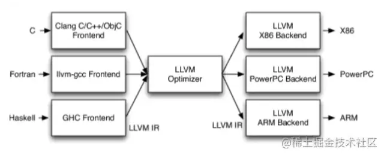

dyld链接之后

_read_images镜像文件

​	SEL和IMP绑定修复

llvm编译阶段SEL IMP绑定

## App编译

1. 解释型语言 python 

   读到就执行

2. 编译型语言 C  需要编译器

   翻译成CPU认识的语言，二进制可执行文件 机器语言，然后执行
   
   编译之后就是汇编代码，再底层就是01了。

## llvm编译器

当我们在Xcode上编写代码，如何生成一个可执行的文件呢？对于一个通用编译流程，如下：

>开始 --- 预处理 --- 编译、优化 --- 汇编 --- 链接程序 --- 结束

在Xcode中使用LLVM架构流程化处理上面的步骤，我们无需操心。但是作为开发者，我们可以理解一下LLVM的基本的流程。

LLVM的总体架构如下所示，分为前端，中间层，后端等




在iOS中，结合编译流程与LLVM，各个步骤如下：

### 前端：

读源代码，词法分析，语法分析，生成AST（LLVM：IR（.ll文件））语法提醒等。

**1. 预处理**

在预处理的阶段中，根据语言选择编译器前端。如对于OC，会调用编译器前端Clang首先预处理我们代码。这一步会进行将宏替换到代码中、删除注释、处理预编译命令等工作

**2. 编译、优化**

在这个阶段，在编译器前前端处理以下步骤

1. 词法分析
2. 语法分析
3. 静态分析
4. 为每一个文件生成中间代码IR

### 优化器：

根据一个又一个pass（节点）进行优化

优化器负责进行各种优化。程序员写的逻辑代码，会优化，不要的代码优化。

改善代码的运行时间，例如消除冗余计算等等。

### 后端：

根据不同的架构生成对应的可执行文件

优化后的代码翻译 变成二进制。生成机器语言。

不同设备不同语言：

不同设备CPU不一样，读的二进制指令集不一样。不同的语言C java，在不同设备上可以执行，需要前端后端都处理。设备对应后端，语言对应前端。分离。

**3. 汇编**

拿到第二个步骤的IR文件后，LLVM中间层LLVM Optimizer就会对每一个IR文件进行一些优化，如尾递归优化、循环优化、全局变量优化。

优化完成后，LLVM会调用汇编生成器将每一个IR文件转化成汇编代码。再根据部署的平台选择对应的编译器后端，将汇编转变生成产物，也就是一个个.o文件了（二进制文件）。

**4. 链接程序**

在上面步骤中，生成了一个个.o文件。在我们正常开发中，一个文件通常会引用别的文件或是库,链接过程会将多个目标文以及所需的库文件链接成最终的可执行文件,也就是Mach-O的文件。对于动态库，链接构成中不会把库加载进来，而是会把动态库的相关信息写入到可执行文件中。

经过上述步骤，我们开发的代码会生成一个Mach-O格式的可执行文件。

### LLVM好处：

前后端分离，扩展性强。

## clang

LLVM大项目的子项目，对源代码进行词法分析，语法分析，语义分析。

# 编译流程

创建main.m文件

```
int main(int argc, const char * argv[]) {
    return 0;
}
```

编译指令`clang -ccc-print-phases main.m `

编译流程：

```
               +- 0: input, "main.m", objective-c
            +- 1: preprocessor, {0}, objective-c-cpp-output
         +- 2: compiler, {1}, ir
      +- 3: backend, {2}, assembler
   +- 4: assembler, {3}, object
+- 5: linker, {4}, image
6: bind-arch, "x86_64", {5}, image
```

0. 读取代码
1. 预处理 宏替换 .h文件导入
2. 编译（前端做的） 语法分析 词法分析 检测， 生成IR代码。
3. 后端： 通过pass（节点）优化 生成汇编代码
4. 汇编生成目标文件代码。
5. link 链接 生成image镜像。从磁盘执行到内存中，就是镜像。
6. 根据不同架构生成不同可执行文件。

有头文件和宏

```
#import <stdio.h>
#define C 30
int main(int argc, const char * argv[]) {
    int a = 10;
    int b = 20;
    printf("%d",a + b + C);
    return 0;
}
```

#### 预处理阶段

`clang -E main.m >> main1.m`

增加typedef，只是加别名，增加可读性 容易理解，typedef不是预处理

```
#import <stdio.h>
#define C 30
typedef  int HH_INT_64;
int main(int argc, const char * argv[]) {
    HH_INT_64 a = 10;
    HH_INT_64 b = 20;
    printf("%d",a + b + C);
    return 0;
}
```

#### 编译

`clang -fmodules -fsyntax-only -Xclang -ast-dump main.m` 生成语法树

`clang -fmodules -fsyntax-only -Xclang -dump-tokens main.m`

词法分析（token）：把代码分割，每个词都分割。

语法分析（AST）：生成AST语法树，检验语法是否正确 

#### 生成优化 IR代码

`clang -S -fobjc-arc -emit-llvm main.m`

`clang -Os -S -fobjc-arc -emit-llvm main.m -o main.ll`编译优化

生成main.ll文件

#### Xcode编译器优化


#### 生成优化bitcode代码

`clang -emit-llvm -c main.ll -o main.bc`

苹果适配不同设备架构

#### 最终生成汇编代码

优化等级：

``clang -S -fobjc-arc main.bc -o main.s``

`clang -S -fobjc-arc main.ll -o main1.s`

`clang -S -fobjc-arc main.m -o main2.s`生成代码最多，上面两个生成代码差不多

`clang -Os -S -fobjc-arc main.bc -o main3.s`//最大化优化

#### 生成目标文件（汇编器）

`clang -fmodules -c main.s -o main.o`生成.o目标文件

#### 链接

使用的printf在外部的哪个动态库是链接，打个标记。

生成了可执行文件

`clang mian.o -o main`

#### 绑定

执行的时候把函数地址和项目中符号绑定。

dyld_stub_binder

一旦执行就绑定，NSLog是懒绑定 用的时候才绑定。

生成本地macho文件 代码和数据。里面有符号表，是一个指针。执行的时候发现外部符号会找符号。如果符号没绑定地址则在内存共享缓存空间找外部动态库，然后绑定。以后就可以直接找。

**外部函数都会生成符号表。通过符号表就可以找到绑定的空间。**
