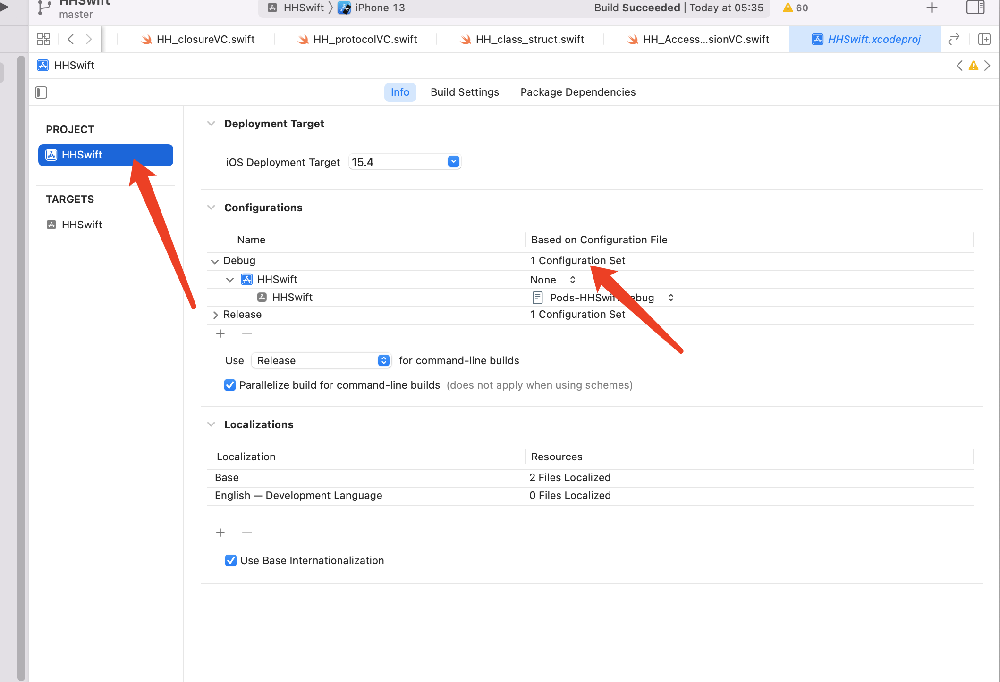
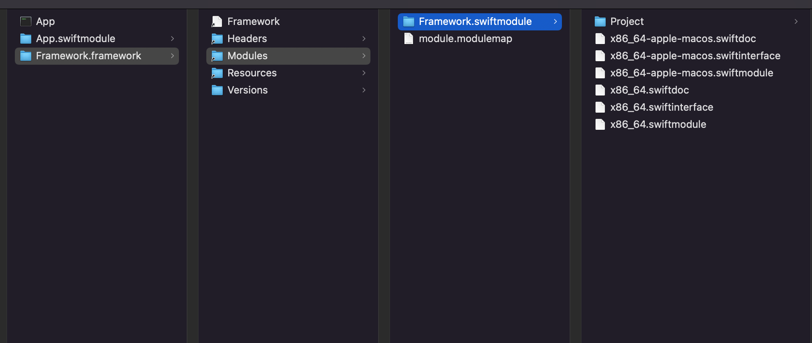

```sh
# "${SOURCE_ROOT}/Products"
#  ${BUILT_PRODUCTS_DIR}

# 产物所在目录
echo "${BUILT_PRODUCTS_DIR}"
echo "${OTHER_LDFLAGS}---"
echo ${SOURCE_ROOT}

#rm -rf 删除Products文件目录
rm -rf "${SOURCE_ROOT}/Products"

#从BUILT_PRODUCTS_DIR目录拷贝文件到Products
cp -Rv -- "${BUILT_PRODUCTS_DIR}/" "${SOURCE_ROOT}/Products"
```



不能在同一个文件定义同一个key，可以创建不同的文件，导入。




swiftinterface兼容不同swift版本编译器，所以swiftinterface比swiftmodule要慢一点。


```swift
import Foundation

// 动态库
// runtime -> 性能下降
// swift 1.0 -》 2.0
@frozen
public struct Teacher {
    public init() {}
    // swift -》静态语言 -〉内存
    public var Kody = "11111112312312"
    //int
    public var Cat = 2
}
```

加了@frozen就是静态（冻住），不加就是运行

swift库版本从1.0更新到2.0的时候，把不需要更改的冻住，不用重新编译。


module是用来管理一组头文件的。

