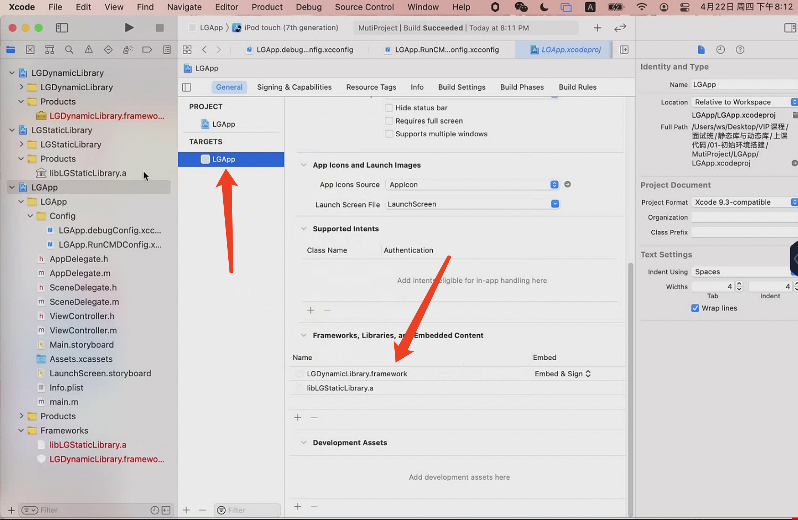
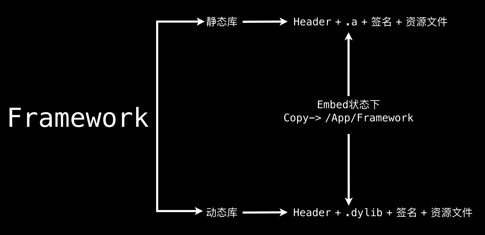
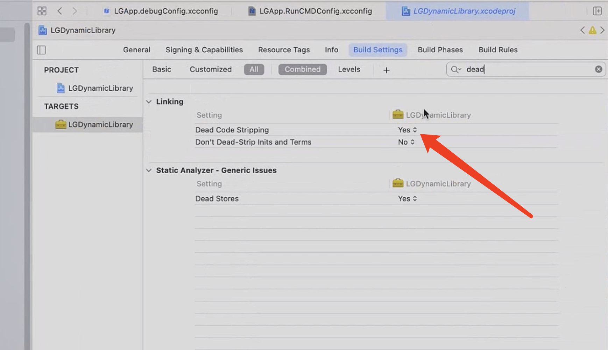
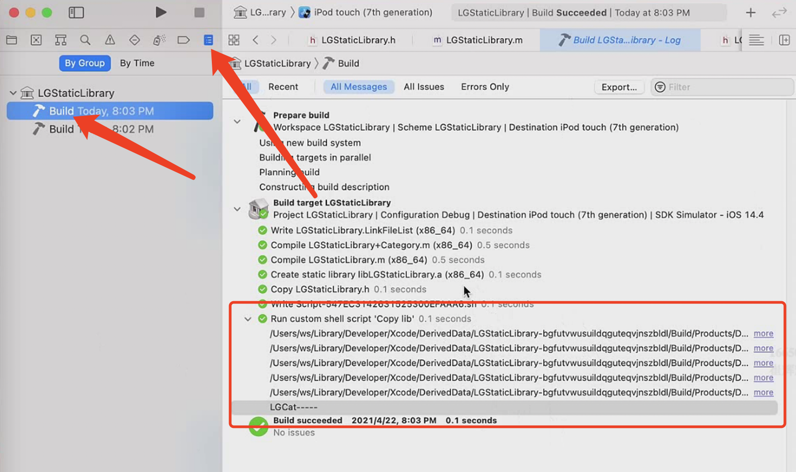
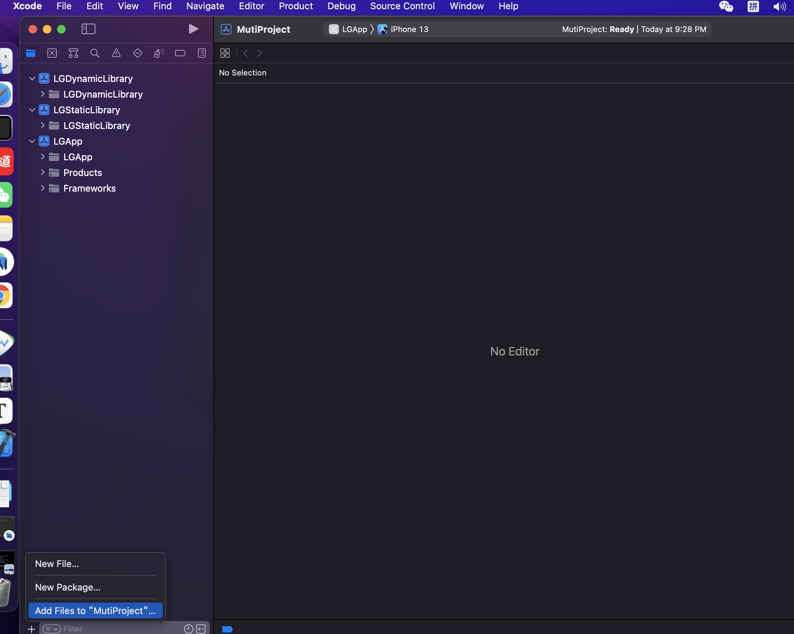
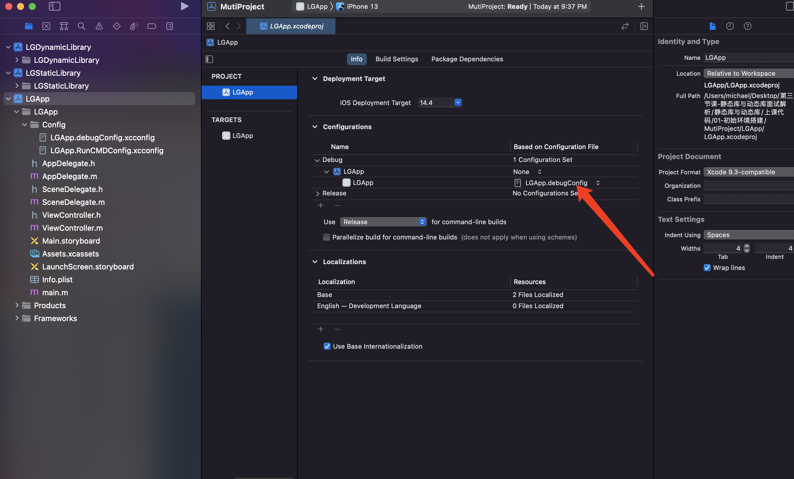

# 动态库静态库

库：可执行的二进制文件。能够被操作系统加载到内存。

## 静态库（.a .so .dll）

静态库即静态链接库：可以简单的看成⼀群⽬标⽂件（.o文件）的集合，即很多⽬标⽂件经过压缩打包后形成的⽂件。Windows 下的 .lib，Linux 和Mac下的 .a。Mac独有的.framework。

缺点：

浪费内存和磁盘空间，模块更新困难，浪费响应的性能。

## 动态库

与静态库相反，动态库在编译时并不会被拷⻉到⽬标程序中，⽬标程序中只会存储指向动态库的引⽤。等到程序运⾏时，动态库才会被真正加载进来。格式有：.framework、.dylib、.tdb。

一个已经链接完全的镜像image。大部分苹果的库都是动态库。共享那个动态库。减少包的大小。

缺点：

会导致⼀些性能损失。但是可以优化，⽐如延迟绑定(Lazy Binding)技术

动态库是运行的时候通过dyld动态链接的。app冷启动的时候会有影响，所以最好不要超过6个。

## 动态库和静态库的区别是什么?

静态库 ：根据.o文件分开 -》.o文件的合集.a -〉链接 -》可执行文件/动态库

动态库： 所有的代码和所有的符号都是放到一起，编译连接的最终产物，不能再链接修改，不能再合并。

静态库是动态库的前身，动态库是静态库链接之后的产物。

静态库可以链接成动态库。

## 静态库链接到主程序，动态库和静态库存放在什么位置

动态库是链接最终产物，动态库没法和项目合并，所以需要在App的目录里去保存动态库。动态库放到app指定的目录（主项目framework目录）下面。链接动态库通过路径链接。 

静态库是.o文件的合集，所以可以和项目.a一起链接形成整个 App。链接到主程序代码合并。

## 把动态库静态库拷贝到主项目

把静态库动态库加入，workspace编译主工程也会触动动态库静态库编译

注：动态库需要选择Embed&Sign拷贝到framework指定到路径下，静态库不需要，因为静态库编译链接之后和主工程合并一起了。



## Framework

Mac OS/iOS 平台还可以使⽤ Framework。framework是文件格式，目录。Framework 实际上是⼀种打包⽅式，**将库的⼆进制⽂件，头⽂件和有关的资源⽂件打包到⼀起，⽅便管理和分发。**

静态库：Header + .a源文件 + 签名 + 资源文件 + Modules

动态库：Header + .dylb源文件 + 签名 + 资源文件



Framework 和系统的 UIKit.Framework 还是有很⼤区别。系统的Framework 不需要拷⻉到⽬标程序中，我们⾃⼰做出来的 Framework 哪怕是动态的，最后也还是要拷⻉到 App 中（App 和 Extension 的 Bundle 是共的），因此苹果⼜把这种 Framework 称为 Embedded Framework。

## Embedded Framework

开发中使⽤的动态库会被放⼊到ipa下的framework⽬录下，基于沙盒运⾏。不同的App使⽤相同的动态库，并不会只在系统中存在⼀份。⽽是会在多个App中各⾃打包、签名、加载⼀份。

## XCFramework

多架构 模拟器，手机。上架的时候需要把模拟器架构剥离。库文件会小。

静态库链接之后已经合并，所以静态库不需要剥离。

XCFramework：是苹果官⽅推荐的、⽀持的，可以更⽅便的表示⼀个多个平台和架构的分发⼆进制库的格式。

需要Xcode11以上⽀持。是为更好的⽀持Mac Catalyst和ARM芯⽚的macOS。专⻔在2019年提出的framework的另⼀种先进格式。Xcode会自动选择哪个架构。

iOS/iPad：arm64

iOS/iPad Simulator：x86_64 arm64

Mac Catalyst: x86_64 arm64

Mac: x86_64 arm64

和传统的framework相⽐：

1. 可以⽤单个.xcframework⽂件提供多个平台的分发⼆进制⽂件；
2. 与Fat Header相⽐，可以按照平台划分，可以包含相同架构的不同平台的⽂件；
3. 在使⽤时，不需要再通过脚本去剥离不需要的架构体系。

## -ObjC参数与-force_load

##### 针对链接器，链接加载静态库.o生成动态库.dylib的几个级别

1. -noall_load

​	默认的，没有使用的话就不加载。

​	静态库进行链接的时候，链接库扫描的时候

2. -all_load

​	把所有的代码全部加载进来

3. -ObjC

   只加载所有与OC相关的代码

4. -force_load <file> 下面跟上路径

   指定的静态库才会完全加载进来。

   两个静态库产生符号冲突的时候，可以通过force_load哪个库作为主链接。

-noall_load和-all_load是针对链接器，app里面有没有用到静态库的代码（以类来判断）。使用到了就加载，没有使用就不加载。

静态库中有分类，分类是动态创建的，链接器把分类给剥离干掉。所以需要设置级别-force_load。

## dead strip

代码剥离。针对符号。全局符号，导出符号才可以。静态的本地符号不会。

链接器会剥离下面：

1. 没有被入口函数使用
2. 不能成为导出符号

-all_load针对静态库，dead strip针对文件，两个可以同时使用。



## 什么是tbd文件，在日常开发中那些应用场景?

只有动态库才有tbd格式文件。

动态库链接的路径

tbd本质是动态库配置文件：

1. targets:支持的架构
2. install-name:动态库路径，哪个路径下找动态库
3. exports:下的symbols: 导出符号（动态库哪些符号暴露给外面使用的）。

## 要减小App的体积，应该使用静态库还是动态库，为什么?

按常理 分发体积 动态库要比静态库小。因为静态库每个.o文件都有Mach header，Segment，Section，blob。动态库是放在一起的，只有一个。所以动态库小。

有一种情况 静态库.o 所占的空间 没有达到对齐所在的空间比动态库小。静态库里面的代码比较少的时候。

静态库.o里面代码的存放不用对齐，例如本身占2个字节，对齐之后要占8个字节。

最终链接产物  代码的存放 要对齐 2 8


主工程，动态库，静态库

探究符号信息，代码信息。

手动：

打开静态库，编译，Products文件夹中的.a文件。

来到.a路径下，终端`nm -pa .a文件的路径`查看macho中的符号表信息。

自动：

写脚本，编译后的.a文件拷贝到sourceRoot路径。

Build Phases --> Copy lib --> Shell /bin/sh

```sh
rm -rf -- "${SOURCE_ROOT}/Products"

mkdir -p  -- "${SOURCE_ROOT}/Products"

cp -Rv -- "${BUILT_PRODUCTS_DIR}/" "${SOURCE_ROOT}/Products"

echo 'LGCat-----'
```

编译后查看



上面输出的符号表信息不清晰

## 工程配置

打开主工程，Xcode菜单栏选择File --> Save As WorkSpace生成`.xcworkspace`工作空间。

然后把其它动态库静态库添加进来。



## xcconfig

创建Config目录，创建xcconfig文件

主工程创建Configuration Setting File文件，xcconfing是控制build setting的。可以把输出结果

编译需要配置



只能配置一个config文件，所以需要include。


`nm -pa .a静态库文件路径` a是查看macho文件里面的所有符号表 p是不排序

`objdump -macho -d ${LGSTATICLIBRARY_PATH}`：查看machO代码段里面保存的代码 -d:打印代码段里面的内容


