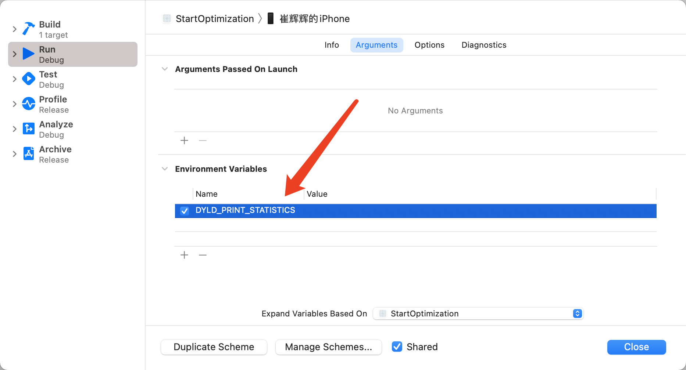
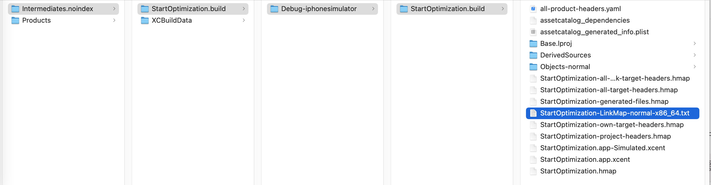
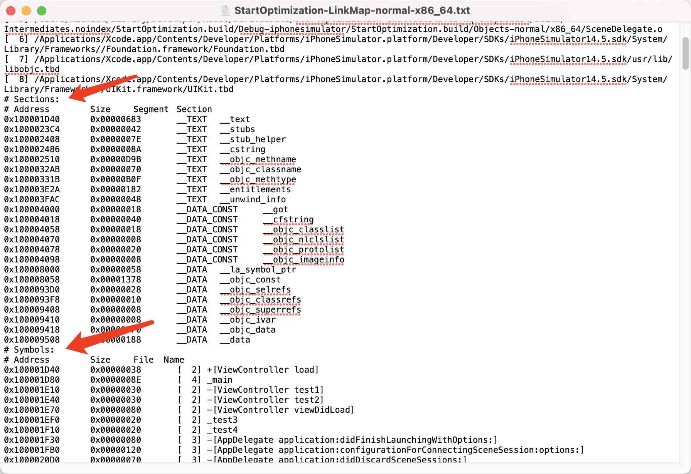
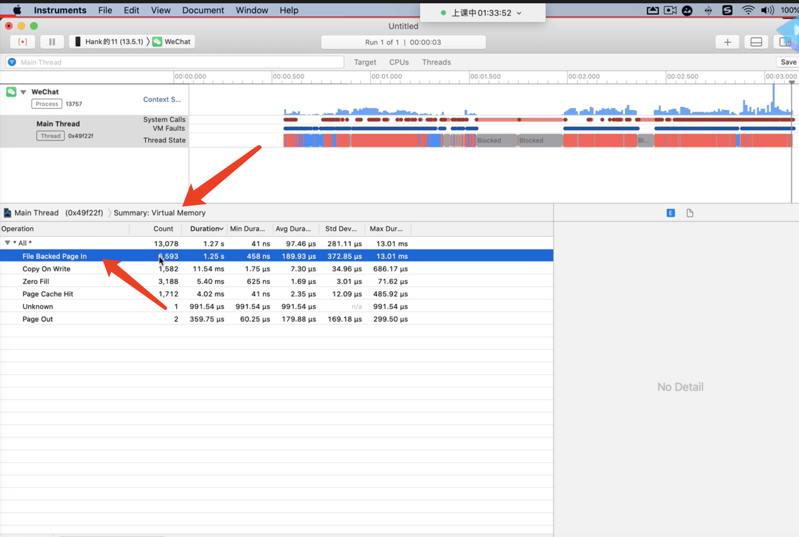

# 应用启动优化

启动分两个部分：main之前（pre-main），main之后。

iOS提供了可以检测pre-main阶段时间的方法

最早接触程序员自己写的代码是load里面。

加载动态库，加载类的时间。main之前做的事 自己没法监控，**dyld**在加载应用程序的时候，就能监控应用跑起来的耗时（pre main耗时）。

dyld检测需要配置环境变量：

注：dyld3的DYLD_PRINT_STATISTICS设置这个变量，可以看到启动大概时长。不过dyld4失效了。

运行之后控制台打印

>**Total pre-main time: 69.53 milliseconds (100.0%)**
>
>​     **dylib loading time: 211.87 milliseconds (304.7%)**
>
>​    **rebase/binding time: 126687488.7 seconds (330773939.4%)**
>
>​      **ObjC setup time: 15.84 milliseconds (22.7%)**
>
>​      **initializer time: 59.59 milliseconds (85.7%)**
>
>​      **slowest intializers :**
>
>​       **libSystem.B.dylib :  3.74 milliseconds (5.3%)**
>
>  **libBacktraceRecording.dylib :  6.98 milliseconds (10.0%)**
>
>​        **libobjc.A.dylib :  1.45 milliseconds (2.0%)**
>
>​        **CoreFoundation :  1.75 milliseconds (2.5%)**
>
>  **libMainThreadChecker.dylib : 39.64 milliseconds (57.0%)**
>
>​       **StartOptimization :  2.89 milliseconds (4.1%)**

说明：

1. dylib loading time：动态库的载入耗时

   系统的在共享缓存，自己的没有在共享缓存，所以减少自定义的动态库。

   苹果建议自己的动态库不要超过六个。6个以上尽可能**动态库合并**。

2. rebase/binding time：重绑定

   关于虚拟内存。

3. ObjC setup time：OC类注册

   runtime需要维护映射表。类名与类都需要注册到表。category等。

   减少类等定义。找工具把没用的文件删除。

4.  initializer time：注册的方法 执行load、构造函数的耗时

   不要做延迟加载的事情，把消耗的事情放到子线程。

上面都是资源的浪费，类，动态库。

真正优化是业务逻辑。第一个页面出现越早越好。

在业务层面

- 去除无用的代码，主线程加载数据
- 启动时刻发挥CPU优势：多开线程，异步，同时执行数据，CPU达到最大利用。
- 数据多的时候，可以给假数据。

1. 动态库的加载 链接绑定  和类的个数 方法的个数项目的大小有关。
2. 二进制优化

绑定是运行时期，链接是编译时期。启动的时候是运行。

# 启动优化  二进制

**二进制重新排列**

方法在内存中的排列顺序和执行顺序不是一致的。

代码存放的顺序和什么有关：

和写代码的顺序有关，和文件排列顺序有关。和执行顺序没有关系。

通过link map文件能够找到编译之后**代码存放**的顺序

在Targets设置中 Build Settings 搜索link map 将Write Link Map File设置为Yes。写入link map文件。

commond+B编译之后项目Products文件下的项目.app向上找两个文件夹，

打开之后

##### Sections

mach-o里的几个东西：Address内存地址	Size大小    	Segment段	Section节

Segment有两个

1. __TEXT 存代码。只读的
2. __DATA_CONST 数据段（例：静态变量）可读可写

##### Symbols：符号

代码实现的排列顺序

每一个方法的名称。

Address在文件中的偏移地址 Address+ASLR就是在内存中的地址	

Size大小    	

File文件 Name

Name 编译的文件顺序，顺序和Build Phases中的Compile Sources文件一致，文件中写代码的顺序。

有可能启动时候，某一个文件中只需要一个方法，其它都不需要。

把启动时候需要的方法都放到前面，后面的顺序就随便不需要管。这样就能大量**减少pageFault**的时间。此时就需要**二进制重排**。

#### 用户使用的时候 内存是怎么加载的：

#### 内存分页管理

用户使用哪一块儿，加载哪一块儿。就是内存分页管理。一块儿一块儿的数据就是一页一页的数据。

一页数据大小是16K。

例：用户使用微信聊天，打开朋友圈就加载朋友圈代码，加载过程是毫秒级别的，感知不到耗时的。

##### 缺页异常（缺页中断）pagefalut

每一页加载的时候称为缺页异常。

用户使用应用程序的时候 点来点去，点到某一块的时候，要去读数据内容。从页表中找，如果没有加载，操作系统会触发缺页异常，当前进程会阻塞，把这一页16K数据安排到物理内存中，然后记录映射，然后把阻塞的进程打开。

耗时毫秒级别的，可以忽略不计，很少在这里优化。

但是有一种情况：冷启动的时候，物理内存已经没有应用的数据了，启动应用，需要加载大量代码到内存，应用会有大量的缺页异常产生，同时有大量缺页异常（几百页）就会有感知，这种情况耗时不可以忽略。

刚把应用程序杀死，物理内存还在。

读的数据不在内存里面就会缺页异常，操作系统处理。把那一页加载到内存。但是手机打开一段时间后，内存里面基本没有空间，都有数据，所以要页面置换。

##### 查看缺页异常

commond+i

##### 如何优化pagefault：

##### 页面置换

加入到哪里就是页面置换。

当前内存条中的数据满了，把活跃的数据覆盖到不活跃的数据上面（系统的算法）。所以iOS内存警告很少。

先打开微信，再打开十几个应用，再打开微信会发现微信重新加载，因为微信被置换了。

每一个应用的虚拟内存是4个G的空间，访问内存空间的时候可能会访问小于或者大于当前应用程序虚拟内存的空间，访问没有数据的内存就指向空。在物理地址是一个小块的空地址。

#### 进程通讯

系统提供的专门的接口。发送数据。共享缓存空间的数据。

## 优化

二进制重排为什么能加快启动速度：减少了缺页中断次数（pagefault）。

##### 优化冷启动时候的缺页异常

每一页数据并不能保证都是启动时刻需要的代码，有可能只是少量代码是启动时候需要载入的。

启动时候载入一千页，可能只有两页是启动时刻需要加载的。其他的代码都是正好和启动代码放到了一起，就直接加载进来了。

**将所有启动时刻需要的代码找出来，全部放在前面几页。也就是二进制重排。**启动时候需要调用的方法全部写入到order文件中

.order就是给编译器看的。编译器根据order文件对二进制进行排列。

1. 来到工程根目录
2. 新建一个文件，hh.order，里面写符号。里面可以写不能识别的方法。没有的方法符号就忽略。
3. Build Settings搜索order File 输入`./hh.order` 其中`./`代表当前根目录，按照hh.order文件的符号顺序排列二进制。将应用程序的符号排列进行修改和替换。
4. 打开linkMap.txt文件查看 确定重新排列了。

##### 问题：

需要的是启动时刻的符号，启动时候方法的调用顺序。

因为方法里面还会嵌套方法，不是简单的一个方法。一系列的方法。

方法还会嵌套函数，函数里还有block。所以需要启动时候调的哪些方法。

方法：

1. hook所有的方法，C函数，block，C++构造函数等等。
2. clang插桩 编译的时候clang会读所有的代码，clang会覆盖所有方法block回调。
3. clang有自带的审查代码插桩功能。
   1. 问题，clang会把循环也给hook

## clang插桩

怎么知道启动时需要的方法，需要clang插桩。可以hook一切。

用官方的clang文档 接口

#### 第一步：编译的时候添加

C

在`Build Settings`搜索`Other C Flags`添加`-fsanitize-coverage=func,trace-pc-guard`标记，只拦截方法。

配置完成之后要把它删除掉。

Swift 

`Build Settings`搜索`other swift`添加`-sanitize-coverage=func`和`-sanitize=undefined`

排列二进制：

代码实现的二进制

#### 第二步：两个回调方法

`__sanitizer_cov_trace_pc_guard_init`：里面反应了项目中符号的个数

`__sanitizer_cov_trace_pc_guard`：HOOK一切的回调函数

打开汇编调试，当点击屏幕touchBegain方法被调起的时候，马上就来到了`__sanitizer_cov_trace_pc_guard`回调函数

只要添加clang插桩标记，那么编译器就会在所有方法，函数，block实现的**边缘**添加代码`__sanitizer_cov_trace_pc_guard()`，相当于修改了二进制文件实现。

编译器会读所有的代码，所以是编译器在所有方法的前面插入这个回调。

#### 第三步：符号名字以及顺序 生成order文件

#### 第四步：

Build Settings搜索order File 输入`./hh.order` 其中`./`代表当前根目录，按照hh.order文件的符号顺序排列二进制。将应用程序的符号排列进行修改和替换。

或者xcconfig中添加order file变量

## 效果

经测试，提升了11秒。

