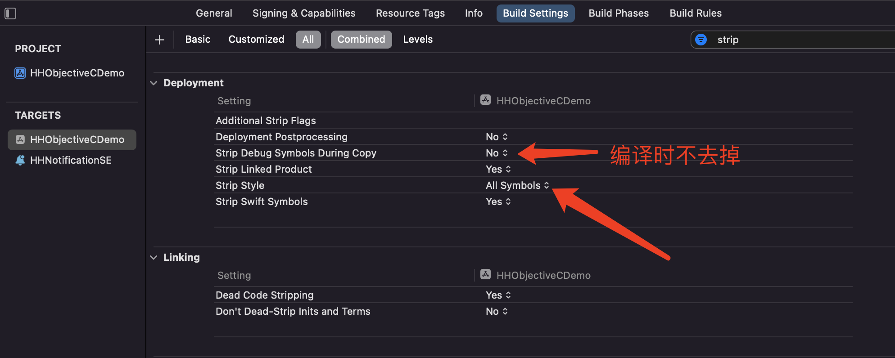
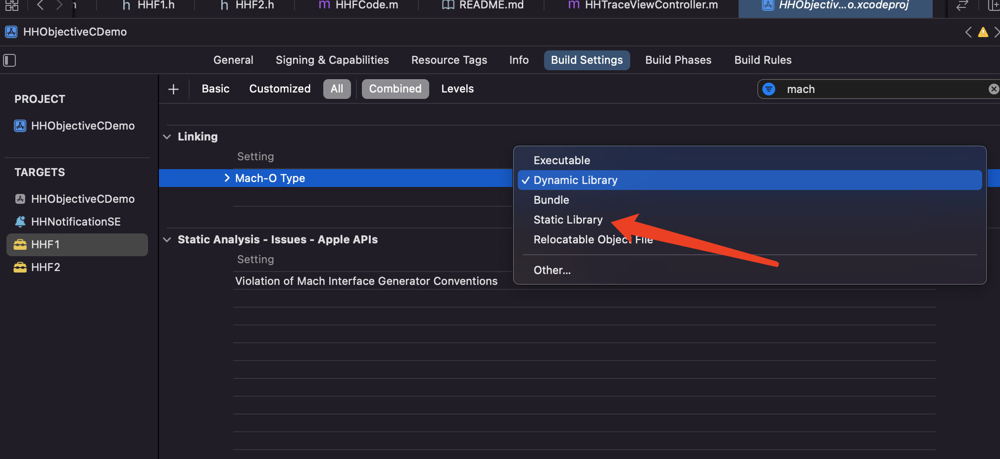

# 符号表

iOS定义的方法，变量都有名称。名称会生成符号表保存。

## 符号表两个

1. 本地符号Symbol Table（符号表）自定定义的
1. 外部间接符号`Dynamic Symbol Table`中的`Indirect Symbols`间接符号。外部动态库符号、系统的符号。和Lazy Symbol 有关联，一一对应。

## 符号绑定

符号绑定，绑定的是外部符号。dyld绑定NSLog符号。把NSLog的真实地址告诉应用。

动态库里面的符号（Fundation）绑定在外部间接符号表里`Dynamic Symbol Table`。

`Lazy Symbol Pointers`（用到了才加载）和`Non-Lazy Symbol Pointers`（应用程序一加载就应用）

`Symbols Stubs`外部符号的桩，每一个`Lazy Symbol Pointers`外部符号都有一个对应的`Symlos Stubs`外部符号的桩。

调用外部函数的时候首先调用桩代码，在`Lazy Symbol Pointers`里找地址代码执行。

### 每次调用外部符号：

例如找NSLog

1. 找桩（里面会根据符号表里面的值调用）。桩在machO的`Section64（_TEXT, _stubs）`的`Symbols Stubs`中。
2. 根据桩的Data执行找`Lazy Symbol Pointers`，找`Lazy Symbol Pointers`表里面的Data去执行。
3. 符号表里面的值（默认是执行dyld_binder）
4. 首次调用：dyld_binder会改变符号表里面的值，指向真实地址。

之后第二次调用，只会执行前三步。

上面的流程就是修改符号表。

程序第一次使用NSLog是去找NSLog的桩，通过桩在符号表找地址去执行绑定。第二次还是会去找桩，在懒加载符号表，不会再执行绑定操作，直接找到NSLog的实现。

## 1、OC动态语言

通过类的名称和方法的名称就可以调用类和方法，名称保存在machO的`Section64（_TEXT,_objc_methodname）`和`Section64（_TEXT,_objc_classname）`里面。

## 2、swift动态派发

## 3、C函数没有动态特性，C函数是地址。

## 去掉符号表中的符号

去掉符号好处：安装包减小，应用更加安全。

## 全局符号

动态库：全局符号（导出符号），动态库会用到。

在app里面：本地全局符号都可以去掉，间接符号表中的符号不能去掉。

## 恢复符号

## 通过函数调用栈找名字

知道方法的地址和machO的image list的首地址

## 符号冲突

### 动态库

动态库的方法调用，先找库，再去里面找符号。动态库不存在符号冲突。

### 静态库

1. 当静态库没有使用的符号，那么静态库不会被链接。
2. 链接器找到符号后，相同的符号就不会再找了。谁先链接，使用谁。

分类没有链接，因为分类是动态创建的。给链接器添加参数，`项目 ---> TARGETS ---> Build Settings ---> Other Link Flags ---> -ObjC`，让链接器加载所有和OC相关的代码。

