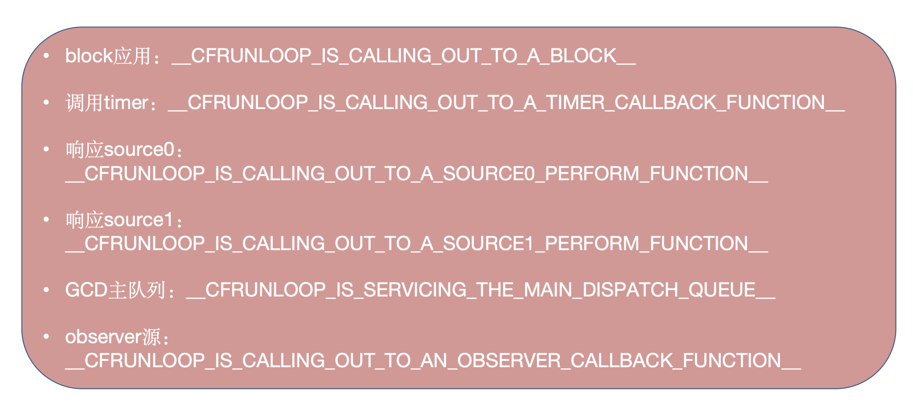

# Runloop

runloop使用的时候结合多线程。

UI模式只能被触摸事件唤醒。

线程不是对象，而是底层的机制，程序员管理不了，是CPU管理的。线程一旦没有任务就over了，线程执行不完就可以一直存在，保住线程。

runloop死循环能够保住线程。

**RunLoop与线程**

- RunLoop和线程的关系：一个RunLoop对应着一条唯一的线程

- 问题：如何让子线程不死

  回答：给这条子线程开启一个RunLoop

- RunLoop的创建：主线程RunLoop已经创建好了，子线程的runloop需要手动创建

- RunLoop的生命周期：在第一次获取时创建，在线程结束时销毁

## 作用

1. runloop是一个运行循环，保证程序持续运行不退出！

   没有RunLoop,那么程序一启动就会退出。有了Runoop，那么相当于在内部有一个死循环，能够保证程序的持续运行

   main函数中的RunLoop，在UIApplication函数内部就启动了一个RunLoop 该函数返回一个int类型的值。这个默认启动的RunLoop是跟主线程相关联的

   首先我们通过Xcode创建一个Command Line Tool project。发现Xcode给我们自动生成了main.m,包含如下代码：

   ```objectivec
   #import <Foundation/Foundation.h>
   int main(int argc, const char * argv[]) {
       @autoreleasepool {
           // insert code here...
           NSLog(@"Hello, World!");
       }
       return 0;
   }
   ```

   运行后，控制台输出Hello,World!然后程序就退出了。

   然而，我们在创建的iOS程序，main.m中包含的代码如下：

   ```objectivec
   int main(int argc, char * argv[]) {
       @autoreleasepool {
           return UIApplicationMain(argc, argv, nil, NSStringFromClass([AppDelegate class]));
       }
   }
   ```

   运行后，程序并不会退出，而是一直处于运行状态，等待用户响应。当我们把main函数稍作修改，如下：

   ```objectivec
   int main(int argc, char * argv[]) {
       @autoreleasepool {
           int i = UIApplicationMain(argc, argv, nil, NSStringFromClass([AppDelegate class]));
           return i;
       }
   }
   ```

   给`return i;`这一行加上断点。发现并不会被断点断住。说明并没有执行到这一步，即上一步还没有结束。为什么会这样呢，那就引出了今天的主角：**RunLoop！因为UIApplicationMain函数内部帮我创建了一个RunLoop “运行循环”**，来保证线程不会退出，能随时处理事件和消息。

- 负责监听事件: 触摸(UI界面的交互)事件，定时器事件（timer），selector事件（选择器performSelector），网络事件.

  - 	NSDefaultRunLoopMode -- 时钟,网络事件
  - 	NSRunLoopCommonModes -- 用户交互(UI事件处理)

- 节省cpu资源，提升程序的性能：该做事就做事，该休息就休息。

  runloop大致的代码逻辑：

  ```jsx
  function loop() {
      initialize();
      do {
          var message = get_next_message();
          process_message(message);
      } while (message != quit);
  }
  ```

  会有一个`do while`循环来等待message，并处理message，只有当while条件不满足时（比如传入 quit 的消息），才会退出循环，让函数返回。而RunLoop内对其进行了进一步的优化：它能很好的管理事件和消息，并且让线程在没有处理消息时休眠以避免资源占用、在有消息到来时立刻被唤醒。

  - runloop和while(true)的区别
    1. while(true)要一直检测条件是否满足，消耗CPU性能。这是死循环。
    2. runloop有任务的时候干活 没任务的时候休眠。通过线程节约资源。占用CPU很少。
       1. 无任务的时候谁休眠：线程休眠。
       2. runloop有状态：退出，进入前台，进入后台，聚焦等等。

- 负责渲染屏幕上的所有UI(一次RunLoop循环需要渲染屏幕上所有UI变化的点!)

https://developer.apple.com/library/archive/documentation/Cocoa/Conceptual/Multithreading/RunLoopManagement/RunLoopManagement.html#//apple_ref/doc/uid/10000057i-CH16-SW1

RunLoop对象

- 在iOS开发中有两套api来访问RunLoop
- Foundation框架【NSRunLoop】和CoreFoundation框架【CFRunLoopRef】都代表着RunLoop对象，它们是等价的，可以互相转换。NSRunLoop是基于CFRunLoopRef的一层OC包装。

**参考资料**

苹果官方文档

https://developer.apple.com/library/mac/documentation/Cocoa/Conceptual/Multithreading/RunLoopManagement/RunLoopManagement.html

CFRunLoopRef开源代码下载地址：

https://opensource.apple.com/tarballs/CF/

## RunLoop相关类

**五个相关的类**

a.CFRunLoopRef

b.CFRunLoopModeRef【RunLoop的运行模式】

c.CFRunLoopSourceRef【RunLoop要处理的事件源】

d.CFRunLoopTimerRef【Timer事件】

e.CFRunLoopObserverRef【RunLoop的观察者（监听者）】

RunLoop要想跑起来，它的内部必须要有一个mode,这个mode里面必须有source\observer\timer，至少要有其中的一个。

**运行原理图**


Port事件，自定义perform事件，timer事件，GCD，通知事件，用户交互的UI事件都会牵扯runloop。



主线程runloop默认创建，子线程runloop需要手动创建和开启。

## Runloop 执行方式（三种）

1. [[NSRunLoop currentRunLoop] run];//不可取，会让线程进入永久循环，不能退出。失控。底层无限去调用第三种方式。
2. [[NSRunLoop currentRunLoop] runUntilDate:[NSDate distantFuture]];//超时时间，runloop处理完之后或者到了指定时间，就会结束，用的时候还需要手动开启。底层也是调用第三种方式，只是加了一个时间限制。
3. [[NSRunLoop currentRunLoop] runMode:NSDefaultRunLoopMode beforeDate:[NSDate distantFuture]];//单次调用

这三种 最底层调用的是同一个api。

## CFRunloopRun

do-while循环。如果不是完成或者结束状态，则一直循环run，监听CFRunLoopRunSpecific返回结果。

```c
void CFRunLoopRun(void) {    /* DOES CALLOUT */
    int32_t result;//结果，控制是否循环
    do {
        result = CFRunLoopRunSpecific(CFRunLoopGetCurrent(), kCFRunLoopDefaultMode, 1.0e10, false);
        CHECK_FOR_FORK();
    } while (kCFRunLoopRunStopped != result && kCFRunLoopRunFinished != result);
}
```

状态：

```c
SInt32 CFRunLoopRunSpecific(CFRunLoopRef rl, CFStringRef modeName, CFTimeInterval seconds, Boolean returnAfterSourceHandled) {     /* DOES CALLOUT */
    CHECK_FOR_FORK();
    if (__CFRunLoopIsDeallocating(rl)) return kCFRunLoopRunFinished;
    __CFRunLoopLock(rl);
    //根据modeName找到本次运行的mode
    CFRunLoopModeRef currentMode = __CFRunLoopFindMode(rl, modeName, false);
    //如果没找到 || mode中没有注册任何事件，则就此停止，不进入循环
    if (NULL == currentMode || __CFRunLoopModeIsEmpty(rl, currentMode, rl->_currentMode)) {
        Boolean did = false;
        if (currentMode) __CFRunLoopModeUnlock(currentMode);
        __CFRunLoopUnlock(rl);
        return did ? kCFRunLoopRunHandledSource : kCFRunLoopRunFinished;
    }
    volatile _per_run_data *previousPerRun = __CFRunLoopPushPerRunData(rl);
    //取上一次运行的mode
    CFRunLoopModeRef previousMode = rl->_currentMode;
    //如果本次mode和上次的mode一致
    rl->_currentMode = currentMode;
    //初始化一个result为kCFRunLoopRunFinished
    int32_t result = kCFRunLoopRunFinished;
    
    if (currentMode->_observerMask & kCFRunLoopEntry )
        /// 1. 通知 Observers: RunLoop 即将进入 loop。
        __CFRunLoopDoObservers(rl, currentMode, kCFRunLoopEntry);
    result = __CFRunLoopRun(rl, currentMode, seconds, returnAfterSourceHandled, previousMode);
    if (currentMode->_observerMask & kCFRunLoopExit )
        /// 10. 通知 Observers: RunLoop 即将退出。
        __CFRunLoopDoObservers(rl, currentMode, kCFRunLoopExit);
    
    __CFRunLoopModeUnlock(currentMode);
    __CFRunLoopPopPerRunData(rl, previousPerRun);
    rl->_currentMode = previousMode;
    __CFRunLoopUnlock(rl);
    return result;
}
```

**所有item事务的处理依赖于mode在runloop中run。**


### __CFRunLoopRun

```c
/* rl, rlm are locked on entrance and exit */
/**
 *  运行run loop
 *
 *  @param rl              运行的RunLoop对象
 *  @param rlm             运行的mode
 *  @param seconds         run loop超时时间
 *  @param stopAfterHandle true:run loop处理完事件就退出  false:一直运行直到超时或者被手动终止
 *  @param previousMode    上一次运行的mode
 *
 *  @return 返回4种状态
 */

static int32_t __CFRunLoopRun(CFRunLoopRef rl, CFRunLoopModeRef rlm, CFTimeInterval seconds, Boolean stopAfterHandle, CFRunLoopModeRef previousMode) {
    
    //获取系统启动后的CPU运行时间，用于控制超时时间
    uint64_t startTSR = mach_absolute_time();
    
    // 判断当前runloop的状态是否关闭
    if (__CFRunLoopIsStopped(rl)) {
        __CFRunLoopUnsetStopped(rl);
        return kCFRunLoopRunStopped;
    } else if (rlm->_stopped) {
        rlm->_stopped = false;
        return kCFRunLoopRunStopped;
    }
    
    //mach端口，在内核中，消息在端口之间传递。 初始为0
    mach_port_name_t dispatchPort = MACH_PORT_NULL;
    //判断是否为主线程
    Boolean libdispatchQSafe = pthread_main_np() && ((HANDLE_DISPATCH_ON_BASE_INVOCATION_ONLY && NULL == previousMode) || (!HANDLE_DISPATCH_ON_BASE_INVOCATION_ONLY && 0 == _CFGetTSD(__CFTSDKeyIsInGCDMainQ)));
    //如果在主线程 && runloop是主线程的runloop && 该mode是commonMode，则给mach端口赋值为主线程收发消息的端口
    if (libdispatchQSafe && (CFRunLoopGetMain() == rl) && CFSetContainsValue(rl->_commonModes, rlm->_name)) dispatchPort = _dispatch_get_main_queue_port_4CF();
    
#if USE_DISPATCH_SOURCE_FOR_TIMERS
    mach_port_name_t modeQueuePort = MACH_PORT_NULL;
    if (rlm->_queue) {
        //mode赋值为dispatch端口_dispatch_runloop_root_queue_perform_4CF
        modeQueuePort = _dispatch_runloop_root_queue_get_port_4CF(rlm->_queue);
        if (!modeQueuePort) {
            CRASH("Unable to get port for run loop mode queue (%d)", -1);
        }
    }
#endif
    
    dispatch_source_t timeout_timer = NULL;
    struct __timeout_context *timeout_context = (struct __timeout_context *)malloc(sizeof(*timeout_context));
    if (seconds <= 0.0) { // instant timeout
        seconds = 0.0;
        timeout_context->termTSR = 0ULL;
        // 1.0e10 == 1* 10^10
    } else if (seconds <= TIMER_INTERVAL_LIMIT) {
        //seconds为超时时间，超时时执行__CFRunLoopTimeout函数
        dispatch_queue_t queue = dispatch_get_global_queue(DISPATCH_QUEUE_PRIORITY_HIGH, DISPATCH_QUEUE_OVERCOMMIT);
        timeout_timer = dispatch_source_create(DISPATCH_SOURCE_TYPE_TIMER, 0, 0, queue);
        dispatch_retain(timeout_timer);
        timeout_context->ds = timeout_timer;
        timeout_context->rl = (CFRunLoopRef)CFRetain(rl);
        timeout_context->termTSR = startTSR + __CFTimeIntervalToTSR(seconds);
        dispatch_set_context(timeout_timer, timeout_context); // source gets ownership of context
        dispatch_source_set_event_handler_f(timeout_timer, __CFRunLoopTimeout);
        dispatch_source_set_cancel_handler_f(timeout_timer, __CFRunLoopTimeoutCancel);
        uint64_t ns_at = (uint64_t)((__CFTSRToTimeInterval(startTSR) + seconds) * 1000000000ULL);
        dispatch_source_set_timer(timeout_timer, dispatch_time(1, ns_at), DISPATCH_TIME_FOREVER, 1000ULL);
        dispatch_resume(timeout_timer);
    } else { // infinite timeout
        //永不超时 - 永动机
        seconds = 9999999999.0;
        timeout_context->termTSR = UINT64_MAX;
    }
    
    //标志位默认为true
    Boolean didDispatchPortLastTime = true;
    //记录最后runloop状态，用于return
    int32_t retVal = 0;
    
    // itmes
 		//所有的事务
    do {
        //初始化一个存放内核消息的缓冲池
        uint8_t msg_buffer[3 * 1024];
#if DEPLOYMENT_TARGET_MACOSX || DEPLOYMENT_TARGET_EMBEDDED || DEPLOYMENT_TARGET_EMBEDDED_MINI
        mach_msg_header_t *msg = NULL;
        mach_port_t livePort = MACH_PORT_NULL;
#elif DEPLOYMENT_TARGET_WINDOWS
        HANDLE livePort = NULL;
        Boolean windowsMessageReceived = false;
#endif
        //取所有需要监听的port
        __CFPortSet waitSet = rlm->_portSet;
        
        //设置RunLoop为可以被唤醒状态
        __CFRunLoopUnsetIgnoreWakeUps(rl);
        
        /// 2. 通知 Observers: RunLoop 即将触发 Timer 回调。
        if (rlm->_observerMask & kCFRunLoopBeforeTimers) __CFRunLoopDoObservers(rl, rlm, kCFRunLoopBeforeTimers);
        if (rlm->_observerMask & kCFRunLoopBeforeSources)
            /// 3. 通知 Observers: RunLoop 即将触发 Source0 (非port) 回调。
            __CFRunLoopDoObservers(rl, rlm, kCFRunLoopBeforeSources);
        
        /// 执行被加入的block
        __CFRunLoopDoBlocks(rl, rlm);
        /// 4. RunLoop 触发 Source0 (非port) 回调。
        Boolean sourceHandledThisLoop = __CFRunLoopDoSources0(rl, rlm, stopAfterHandle);
        if (sourceHandledThisLoop) {
            /// 执行被加入的block
            __CFRunLoopDoBlocks(rl, rlm);
        }
        
        //如果没有Sources0事件处理 并且 没有超时，poll为false
        //如果有Sources0事件处理 或者 超时，poll都为true
        Boolean poll = sourceHandledThisLoop || (0ULL == timeout_context->termTSR);
        //第一次do..whil循环不会走该分支，因为didDispatchPortLastTime初始化是true
        if (MACH_PORT_NULL != dispatchPort && !didDispatchPortLastTime) {
#if DEPLOYMENT_TARGET_MACOSX || DEPLOYMENT_TARGET_EMBEDDED || DEPLOYMENT_TARGET_EMBEDDED_MINI
            //从缓冲区读取消息
            msg = (mach_msg_header_t *)msg_buffer;
            /// 5. 如果有 Source1 (基于port) 处于 ready 状态，直接处理这个 Source1 然后跳转去处理消息。
            if (__CFRunLoopServiceMachPort(dispatchPort, &msg, sizeof(msg_buffer), &livePort, 0)) {
                //如果接收到了消息的话，前往第9步开始处理msg
                goto handle_msg;
            }
#elif DEPLOYMENT_TARGET_WINDOWS
            if (__CFRunLoopWaitForMultipleObjects(NULL, &dispatchPort, 0, 0, &livePort, NULL)) {
                goto handle_msg;
            }
#endif
        }
        
        didDispatchPortLastTime = false;
        /// 6.通知 Observers: RunLoop 的线程即将进入休眠(sleep)。
        if (!poll && (rlm->_observerMask & kCFRunLoopBeforeWaiting)) __CFRunLoopDoObservers(rl, rlm, kCFRunLoopBeforeWaiting);
        //设置RunLoop为休眠状态
        __CFRunLoopSetSleeping(rl);
        // do not do any user callouts after this point (after notifying of sleeping)
        
        // Must push the local-to-this-activation ports in on every loop
        // iteration, as this mode could be run re-entrantly and we don't
        // want these ports to get serviced.
        
        __CFPortSetInsert(dispatchPort, waitSet);
        
        __CFRunLoopModeUnlock(rlm);
        __CFRunLoopUnlock(rl);
        
#if DEPLOYMENT_TARGET_MACOSX || DEPLOYMENT_TARGET_EMBEDDED || DEPLOYMENT_TARGET_EMBEDDED_MINI
#if USE_DISPATCH_SOURCE_FOR_TIMERS
        
        //这里有个内循环，用于接收等待端口的消息
        //进入此循环后，线程进入休眠，直到收到新消息才跳出该循环，继续执行run loop
        do {
            if (kCFUseCollectableAllocator) {
                objc_clear_stack(0);
                memset(msg_buffer, 0, sizeof(msg_buffer));
            }
            
            msg = (mach_msg_header_t *)msg_buffer;
            //7.接收waitSet端口的消息
            __CFRunLoopServiceMachPort(waitSet, &msg, sizeof(msg_buffer), &livePort, poll ? 0 : TIMEOUT_INFINITY);
            //收到消息之后，livePort的值为msg->msgh_local_port，
            if (modeQueuePort != MACH_PORT_NULL && livePort == modeQueuePort) {
                // Drain the internal queue. If one of the callout blocks sets the timerFired flag, break out and service the timer.
                while (_dispatch_runloop_root_queue_perform_4CF(rlm->_queue));
                if (rlm->_timerFired) {
                    // Leave livePort as the queue port, and service timers below
                    rlm->_timerFired = false;
                    break;
                } else {
                    if (msg && msg != (mach_msg_header_t *)msg_buffer) free(msg);
                }
            } else {
                // Go ahead and leave the inner loop.
                break;
            }
        } while (1);
#else
        if (kCFUseCollectableAllocator) {
            objc_clear_stack(0);
            memset(msg_buffer, 0, sizeof(msg_buffer));
        }
        msg = (mach_msg_header_t *)msg_buffer;
        /// 7. 调用 mach_msg 等待接受 mach_port 的消息。线程将进入休眠, 直到被下面某一个事件唤醒。
        /// • 一个基于 port 的Source 的事件。
        /// • 一个 Timer 到时间了
        /// • RunLoop 自身的超时时间到了
        /// • 被其他什么调用者手动唤醒
        
        // mach 事务 - 指令 
        __CFRunLoopServiceMachPort(waitSet, &msg, sizeof(msg_buffer), &livePort, poll ? 0 : TIMEOUT_INFINITY);
#endif
        
        
#elif DEPLOYMENT_TARGET_WINDOWS
        // Here, use the app-supplied message queue mask. They will set this if they are interested in having this run loop receive windows messages.
        __CFRunLoopWaitForMultipleObjects(waitSet, NULL, poll ? 0 : TIMEOUT_INFINITY, rlm->_msgQMask, &livePort, &windowsMessageReceived);
#endif
        
        __CFRunLoopLock(rl);
        __CFRunLoopModeLock(rlm);
        
        // Must remove the local-to-this-activation ports in on every loop
        // iteration, as this mode could be run re-entrantly and we don't
        // want these ports to get serviced. Also, we don't want them left
        // in there if this function returns.
        
        __CFPortSetRemove(dispatchPort, waitSet);
        
        __CFRunLoopSetIgnoreWakeUps(rl);
        
        // user callouts now OK again
        //取消runloop的休眠状态
        __CFRunLoopUnsetSleeping(rl);
        /// 8. 通知 Observers: RunLoop 的线程刚刚被唤醒了。
        if (!poll && (rlm->_observerMask & kCFRunLoopAfterWaiting)) __CFRunLoopDoObservers(rl, rlm, kCFRunLoopAfterWaiting);
        
        /// 收到消息，处理消息。
    handle_msg:;
        __CFRunLoopSetIgnoreWakeUps(rl);
        
#if DEPLOYMENT_TARGET_WINDOWS
        if (windowsMessageReceived) {
            // These Win32 APIs cause a callout, so make sure we're unlocked first and relocked after
            __CFRunLoopModeUnlock(rlm);
            __CFRunLoopUnlock(rl);
            
            if (rlm->_msgPump) {
                rlm->_msgPump();
            } else {
                MSG msg;
                if (PeekMessage(&msg, NULL, 0, 0, PM_REMOVE | PM_NOYIELD)) {
                    TranslateMessage(&msg);
                    DispatchMessage(&msg);
                }
            }
            
            __CFRunLoopLock(rl);
            __CFRunLoopModeLock(rlm);
            sourceHandledThisLoop = true;
            
            // To prevent starvation of sources other than the message queue, we check again to see if any other sources need to be serviced
            // Use 0 for the mask so windows messages are ignored this time. Also use 0 for the timeout, because we're just checking to see if the things are signalled right now -- we will wait on them again later.
            // NOTE: Ignore the dispatch source (it's not in the wait set anymore) and also don't run the observers here since we are polling.
            __CFRunLoopSetSleeping(rl);
            __CFRunLoopModeUnlock(rlm);
            __CFRunLoopUnlock(rl);
            
            __CFRunLoopWaitForMultipleObjects(waitSet, NULL, 0, 0, &livePort, NULL);
            
            __CFRunLoopLock(rl);
            __CFRunLoopModeLock(rlm);
            __CFRunLoopUnsetSleeping(rl);
            // If we have a new live port then it will be handled below as normal
        }
        
        
#endif
        if (MACH_PORT_NULL == livePort) {
            CFRUNLOOP_WAKEUP_FOR_NOTHING();
            // handle nothing
        } else if (livePort == rl->_wakeUpPort) {
            CFRUNLOOP_WAKEUP_FOR_WAKEUP();
            // do nothing on Mac OS
#if DEPLOYMENT_TARGET_WINDOWS
            // Always reset the wake up port, or risk spinning forever
            ResetEvent(rl->_wakeUpPort);
#endif
        }
#if USE_DISPATCH_SOURCE_FOR_TIMERS
        else if (modeQueuePort != MACH_PORT_NULL && livePort == modeQueuePort) {
            CFRUNLOOP_WAKEUP_FOR_TIMER();
            /// 9.1 如果一个 Timer 到时间了，触发这个Timer的回调。
            if (!__CFRunLoopDoTimers(rl, rlm, mach_absolute_time())) {
                // Re-arm the next timer, because we apparently fired early
                __CFArmNextTimerInMode(rlm, rl);
            }
        }
#endif
#if USE_MK_TIMER_TOO
        else if (rlm->_timerPort != MACH_PORT_NULL && livePort == rlm->_timerPort) {
            CFRUNLOOP_WAKEUP_FOR_TIMER();
            // On Windows, we have observed an issue where the timer port is set before the time which we requested it to be set. For example, we set the fire time to be TSR 167646765860, but it is actually observed firing at TSR 167646764145, which is 1715 ticks early. The result is that, when __CFRunLoopDoTimers checks to see if any of the run loop timers should be firing, it appears to be 'too early' for the next timer, and no timers are handled.
            // In this case, the timer port has been automatically reset (since it was returned from MsgWaitForMultipleObjectsEx), and if we do not re-arm it, then no timers will ever be serviced again unless something adjusts the timer list (e.g. adding or removing timers). The fix for the issue is to reset the timer here if CFRunLoopDoTimers did not handle a timer itself. 9308754
            if (!__CFRunLoopDoTimers(rl, rlm, mach_absolute_time())) {
                // Re-arm the next timer
                __CFArmNextTimerInMode(rlm, rl);
            }
        }
#endif
        /// 9.2 如果有dispatch到main_queue的block，执行block
        else if (livePort == dispatchPort) {
            CFRUNLOOP_WAKEUP_FOR_DISPATCH();
            __CFRunLoopModeUnlock(rlm);
            __CFRunLoopUnlock(rl);
            _CFSetTSD(__CFTSDKeyIsInGCDMainQ, (void *)6, NULL);
#if DEPLOYMENT_TARGET_WINDOWS
            void *msg = 0;
#endif
            __CFRUNLOOP_IS_SERVICING_THE_MAIN_DISPATCH_QUEUE__(msg);
            _CFSetTSD(__CFTSDKeyIsInGCDMainQ, (void *)0, NULL);
            __CFRunLoopLock(rl);
            __CFRunLoopModeLock(rlm);
            sourceHandledThisLoop = true;
            didDispatchPortLastTime = true;
        } else {
            /// 9.3 如果一个 Source1 (基于port) 发出事件了，处理这个事件
            CFRUNLOOP_WAKEUP_FOR_SOURCE();
            // Despite the name, this works for windows handles as well
            CFRunLoopSourceRef rls = __CFRunLoopModeFindSourceForMachPort(rl, rlm, livePort);
            if (rls) {
#if DEPLOYMENT_TARGET_MACOSX || DEPLOYMENT_TARGET_EMBEDDED || DEPLOYMENT_TARGET_EMBEDDED_MINI
                mach_msg_header_t *reply = NULL;
                sourceHandledThisLoop = __CFRunLoopDoSource1(rl, rlm, rls, msg, msg->msgh_size, &reply) || sourceHandledThisLoop;
                if (NULL != reply) {
                    (void)mach_msg(reply, MACH_SEND_MSG, reply->msgh_size, 0, MACH_PORT_NULL, 0, MACH_PORT_NULL);
                    CFAllocatorDeallocate(kCFAllocatorSystemDefault, reply);
                }
#elif DEPLOYMENT_TARGET_WINDOWS
                sourceHandledThisLoop = __CFRunLoopDoSource1(rl, rlm, rls) || sourceHandledThisLoop;
#endif
            }
        }
#if DEPLOYMENT_TARGET_MACOSX || DEPLOYMENT_TARGET_EMBEDDED || DEPLOYMENT_TARGET_EMBEDDED_MINI
        if (msg && msg != (mach_msg_header_t *)msg_buffer) free(msg);
#endif
        
        /// 执行加入到Loop的block
        __CFRunLoopDoBlocks(rl, rlm);
        
        if (sourceHandledThisLoop && stopAfterHandle) {
            /// 进入loop时参数说处理完事件就返回。
            retVal = kCFRunLoopRunHandledSource;
        } else if (timeout_context->termTSR < mach_absolute_time()) {
            /// 超出传入参数标记的超时时间了
            retVal = kCFRunLoopRunTimedOut;
        } else if (__CFRunLoopIsStopped(rl)) {
            /// 被外部调用者强制停止了
            __CFRunLoopUnsetStopped(rl);
            retVal = kCFRunLoopRunStopped;
        } else if (rlm->_stopped) {
            /// 自动停止了
            rlm->_stopped = false;
            retVal = kCFRunLoopRunStopped;
        } else if (__CFRunLoopModeIsEmpty(rl, rlm, previousMode)) {
            /// source/timer/observer一个都没有了
            retVal = kCFRunLoopRunFinished;
        }
        /// 如果没超时，mode里没空，loop也没被停止，那继续loop。
    } while (0 == retVal);
    
    if (timeout_timer) {
        dispatch_source_cancel(timeout_timer);
        dispatch_release(timeout_timer);
    } else {
        free(timeout_context);
    }
    
    return retVal;
}
```

先判断runloop是否停止了，然后判断时间限制。时间默认是遥远的未来。

runloop也有超时时间，超时了就取消。

#### 执行timer

1. timer依赖mode去run
2. runloop run的时候：
3. 遍历timers
4. __CFRunLoopDoTimer
   1. 根据mode拿到runloop中的timer
   2. 执行回调`__CFRUNLOOP_IS_CALLING_OUT_TO_A_TIMER_CALLBACK_FUNCTION__`

```c
// rl and rlm are locked on entry and exit
static Boolean __CFRunLoopDoTimers(CFRunLoopRef rl, CFRunLoopModeRef rlm, uint64_t limitTSR) {    /* DOES CALLOUT */
    Boolean timerHandled = false;
    CFMutableArrayRef timers = NULL;
  //先找到runloop里的所有timer，可能不止一个
    for (CFIndex idx = 0, cnt = rlm->_timers ? CFArrayGetCount(rlm->_timers) : 0; idx < cnt; idx++) {
        CFRunLoopTimerRef rlt = (CFRunLoopTimerRef)CFArrayGetValueAtIndex(rlm->_timers, idx);
        
        if (__CFIsValid(rlt) && !__CFRunLoopTimerIsFiring(rlt)) {
            if (rlt->_fireTSR <= limitTSR) {
                if (!timers) timers = CFArrayCreateMutable(kCFAllocatorSystemDefault, 0, &kCFTypeArrayCallBacks);
                CFArrayAppendValue(timers, rlt);
            }
        }
    }
    
  //遍历 执行。__CFRunLoopDoTimer
    for (CFIndex idx = 0, cnt = timers ? CFArrayGetCount(timers) : 0; idx < cnt; idx++) {
        CFRunLoopTimerRef rlt = (CFRunLoopTimerRef)CFArrayGetValueAtIndex(timers, idx);
        Boolean did = __CFRunLoopDoTimer(rl, rlm, rlt);
        timerHandled = timerHandled || did;
    }
    if (timers) CFRelease(timers);
    return timerHandled;
}
```

### Runloop 退出方式

### Runloop 循环

NSRunLoop 内置循环

循环问题：临时对象

runloop 避免这个事情

Mach Port如何进行跨线程通讯 

Mach IPC：基于Mach内核实现进程间通讯（一个app向另一个app做分享的时候就是跨进程通讯）

Mach IPC被抽象三种操作：messages、ports and port sets。

Mach Port：跨线程通讯

runloop进入休眠状态本质是被Mach端口阻塞住了，需要其它的给它发送消息，RunLoopWakeUp中调用__CFSendTrivialMachMessage，__CFSendTrivialMachMessage方法中有MACH_SEND_MSG发送消息。

RunLoopWakeUp通过端口唤醒线程。

machPort是最基础的api，socket是基于它实现的

`  [[NSRunLoop currentRunLoop] addPort:[NSPort port] forMode:NSRunLoopCommonModes];`在底层会自动的创建source1。

##### 唤醒runloop4种方式


1. Timer fire
2. Source 1
3. 手动wake up
4. 处于超时状态

## runloop应用

### NSTimer

### RunLoop性能优化

TableView的Cell 中的内容加载如何做性能优化，ImageView显示：控制方法在特定的模式下可用。

网络加载图片 -- 子线程 (因为耗时 所以丢在子线程)

更新UI  放在主线程

如果更新UI 也是一个耗时操作!! 怎么办??

问题: 
	tableview的Cell 中如何做性能优化   -->  加载图片的性能优化!!!
		如果加载本地图片 是一个耗时的操作!怎么办??

**思想**

1. 添加一个监听者CFRunLoopObserverRef
   1. 获取当前RunLoop
   2. 创建一个CFRunLoopObserverRef观察者， 回调方法是遍历任务数组，取出任务，执行任务，加载耗时操作数据。
      1. 执行一个任务就从数组中删除该任务
      2. 执行完一个任务就会回调 更新UI。
   3. 当前RunLoop在kCFRunLoopDefaultMode添加观察者。
2. 在cell的代理方法中添加task任务，并且有任务执行的回调，添加图片。
   1. 如果任务大于一屏或者规定的某个最大数时，数组中移除最先添加的任务，任务数不会大于最大值。

**扩展**

定义两个任务数组

可以在kCFRunLoopDefaultMode中处理耗时任务

在kCFRunLoopCommonModes中处理不耗时的任务

### 获取用户点击事件

主线程没有操作的时候进入休眠，**休眠的本质是阻塞当前线程**。

屏幕的点击事件：阻塞之后还能点击，因为另一个线程唤醒了主线程。


找到点击事件的端口，就可以拦截用户的点击，所以就获取用户点击触摸行为数据。

### PerformSelector

1. ```objective-c
   [self performSelector:@selector(test) withObject:nil];
   ```

   和runloop没有任何关系，与当前runloop开不开启没有任何关系，都会执行test。 是NSObject方法，底层调用objc_msgSend来查找方法执行 借助NSInvocation执行。

2. ```objective-c
   [self performSelector:@selector(test) onThread:[NSThread currentThread] withObject:nil waitUntilDone:YES];
   ```

   //NO代表当前runloop没有退出 是否需要一直等 

   //是NO的时候就像runloop注册了source事件源。NO不会退出runloop，YES的话就会退出runloop。

   //YES直接执行在当前线程

   run方法没有执行完，调用`[self performSelector:@selector(test) onThread:self.thread withObject:nil waitUntilDone:YES modes:@[NSDefaultRunLoopMode]];` 方法时新线程还在，把YES换NO,像这样：`[self performSelector:@selector(test) onThread:self.thread withObject:nil waitUntilDone:NO modes:@[NSDefaultRunLoopMode]];`就不执行了。
   
3. ```objective-c
   //在没有获取RunLoop的子线程进行测试验证
   - (void)performSelectorTest {
       NSThread *thread = [[NSThread alloc] initWithTarget:self selector:@selector(run) object:nil];
       self.thread = thread;
       [thread start];
   }
   
   - (void)run {
   //    [self performSelector:@selector(test) onThread:self.thread withObject:nil waitUntilDone:YES modes:@[NSDefaultRunLoopMode]];
   
       [self performSelector:@selector(test) withObject:nil afterDelay:0];
       [[NSRunLoop currentRunLoop] run];
   
       //和runloop有关系 有delay -- timer 注册定时器满足延时的需要。注册timer事件在当前runloop中，想要test执行，必须得打开runloop。
   
       //afterDelay为0的时候等同于下面这句 是一次性任务 执行完成之后 就没有事件源输入源保证runloop有任务去做。
   
          [NSTimer scheduledTimerWithTimeInterval:1.0f repeats:NO block:^(NSTimer * _Nonnull timer) {
               [self test];
          }];
   }
   ```

### 常驻线程：在子线程中开启一个runloop

### 自动释放池

第一次创建：进入runloop的时候

最后一次释放：runloop退出的时候

其它创建和释放：当runloop即将休眠的时候会把之前的自动释放池释放，然后重新创建一个新的释放池


