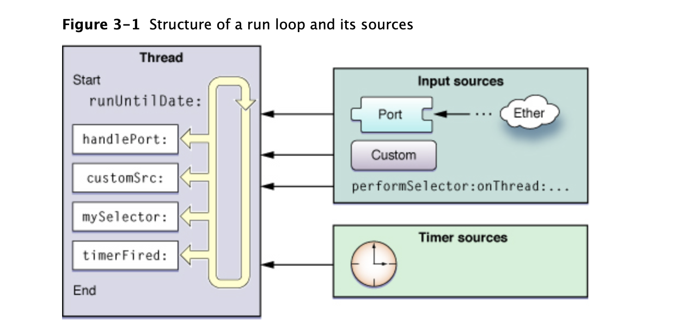
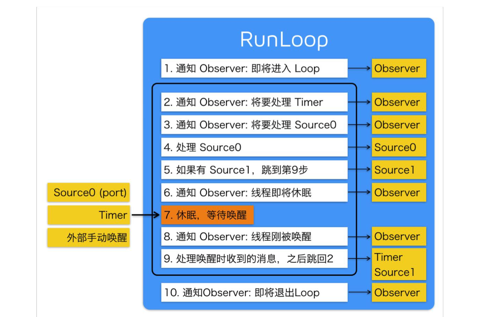
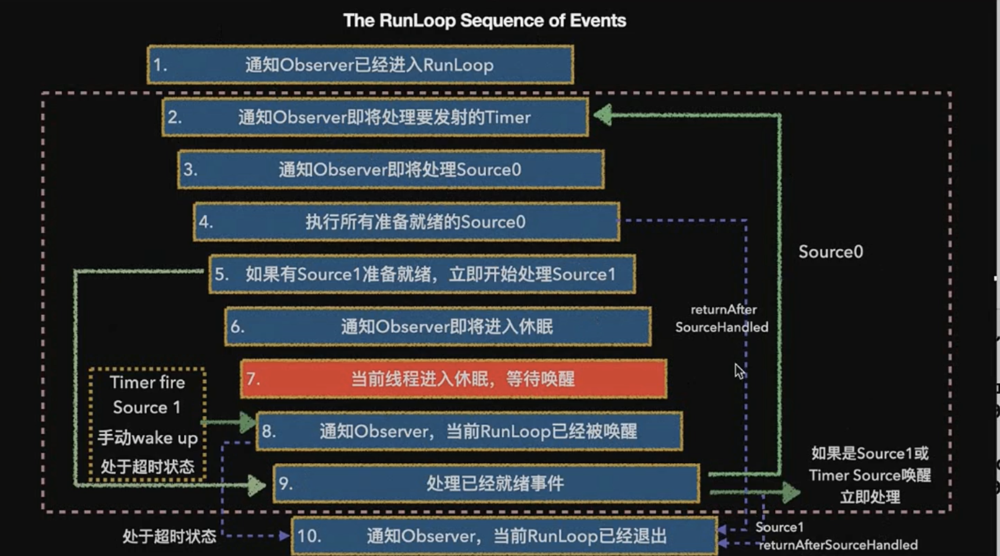
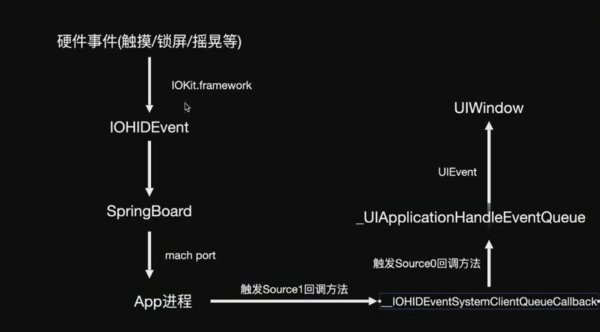

# Runloop

runloop使用的时候结合多线程。

UI模式只能被触摸事件唤醒。

线程不是对象，而是底层的机制，程序员管理不了，是CPU管理的。线程一旦没有任务就over了，线程执行不完就可以一直存在，保住线程。

runloop死循环能够保住线程。

**RunLoop与线程**

- RunLoop和线程的关系：一个RunLoop对应着一条唯一的线程

- 如何让子线程不死

  给这条子线程开启一个RunLoop

- RunLoop的创建：主线程RunLoop已经创建好了，子线程的runloop需要手动创建

- RunLoop的生命周期：在第一次获取时创建，在线程结束时销毁

## 作用

1. runloop是一个运行循环，保证程序持续运行不退出！

   没有RunLoop,那么程序一启动就会退出。有了Runoop，那么相当于在内部有一个死循环，能够保证程序的持续运行

   main函数中的RunLoop，在UIApplication函数内部就启动了一个RunLoop 该函数返回一个int类型的值。这个默认启动的RunLoop是跟主线程相关联的

   首先我们通过Xcode创建一个Command Line Tool project。发现Xcode给我们自动生成了main.m,包含如下代码：

   ```objectivec
   #import <Foundation/Foundation.h>
   int main(int argc, const char * argv[]) {
       @autoreleasepool {
           // insert code here...
           NSLog(@"Hello, World!");
       }
       return 0;
   }
   ```

   运行后，控制台输出Hello,World!然后程序就退出了。

   然而，我们在创建的iOS程序，main.m中包含的代码如下：

   ```objectivec
   int main(int argc, char * argv[]) {
       @autoreleasepool {
           return UIApplicationMain(argc, argv, nil, NSStringFromClass([AppDelegate class]));
       }
   }
   ```

   运行后，程序并不会退出，而是一直处于运行状态，等待用户响应。当我们把main函数稍作修改，如下：

   ```objectivec
   int main(int argc, char * argv[]) {
       @autoreleasepool {
           int i = UIApplicationMain(argc, argv, nil, NSStringFromClass([AppDelegate class]));
           return i;
       }
   }
   ```

   给`return i;`这一行加上断点。发现并不会被断点断住。说明并没有执行到这一步，即上一步还没有结束。为什么会这样呢，那就引出了今天的主角：**RunLoop！因为UIApplicationMain函数内部帮我创建了一个RunLoop “运行循环”**，来保证线程不会退出，能随时处理事件和消息。

- 负责监听事件: 触摸(UI界面的交互)事件，定时器事件（timer），selector事件（选择器performSelector），网络事件.

  - 	NSDefaultRunLoopMode -- 时钟,网络事件
  - 	NSRunLoopCommonModes -- 用户交互(UI事件处理)

- 节省cpu资源，提升程序的性能：该做事就做事，该休息就休息。

  runloop大致的代码逻辑：

  ```jsx
  function loop() {
      initialize();
      do {
          var message = get_next_message();
          process_message(message);
      } while (message != quit);
  }
  ```

  会有一个`do while`循环来等待message，并处理message，只有当while条件不满足时（比如传入 quit 的消息），才会退出循环，让函数返回。而RunLoop内对其进行了进一步的优化：它能很好的管理事件和消息，并且让线程在没有处理消息时休眠以避免资源占用、在有消息到来时立刻被唤醒。

  - runloop和while(true)的区别
    1. while(true)要一直检测条件是否满足，消耗CPU性能。这是死循环。
    2. runloop有任务的时候干活 没任务的时候休眠。通过线程节约资源。占用CPU很少。
       1. 无任务的时候谁休眠：线程休眠。
       2. runloop有状态：退出，进入前台，进入后台，聚焦等等。

- 负责渲染屏幕上的所有UI(一次RunLoop循环需要渲染屏幕上所有UI变化的点!)

## RunLoop相关类

**五个相关的类**

1. CFRunLoopRef
2. CFRunLoopModeRef【RunLoop的运行模式】
3. CFRunLoopSourceRef【RunLoop要处理的事件源】
4. CFRunLoopTimerRef【Timer事件】
5. CFRunLoopObserverRef【RunLoop的观察者（监听者）】

RunLoop要想跑起来，它的内部必须要有一个mode,这个mode里面必须有source\observer\timer，至少要有其中的一个。

**运行原理图**



## runloop的item

- block应用：`__CFRUNLOOP_IS_CALLING_OUT_TO_A_BLOCK__ `
- 调用timer：`__CFRUNLOOP_IS_CALLING_OUT_TO_A_TIMER_CALLBACK_FUNCTION__ `
- 响应source0：`__CFRUNLOOP_IS_CALLING_OUT_TO_A_SOURCE0_PERFORM_FUNCTION__ `
- 响应source1：`__CFRUNLOOP_IS_CALLING_OUT_TO_A_SOURCE1_PERFORM_FUNCTION__ `
- GCD主队列：`__CFRUNLOOP_IS_SERVICING_THE_MAIN_DISPATCH_QUEUE__ `
- observer源：`__CFRUNLOOP_IS_CALLING_OUT_TO_AN_OBSERVER_CALLBACK_FUNCTION__`

Port事件，自定义perform事件，timer事件，GCD，通知事件，用户交互的UI事件都会牵扯runloop。

主线程runloop默认创建，子线程runloop需要手动创建和开启。

## Runloop 执行方式（三种）

1. [[NSRunLoop currentRunLoop] run];//不可取，会让线程进入永久循环，不能退出。失控。底层无限去调用第三种方式。
2. [[NSRunLoop currentRunLoop] runUntilDate:[NSDate distantFuture]];//超时时间，runloop处理完之后或者到了指定时间，就会结束，用的时候还需要手动开启。底层也是调用第三种方式，只是加了一个时间限制。
3. [[NSRunLoop currentRunLoop] runMode:NSDefaultRunLoopMode beforeDate:[NSDate distantFuture]];//单次调用

这三种 最底层调用的是同一个api。

## runloop内部执行过程

### CFRunloopRun

do-while循环。如果不是完成或者结束状态，则一直循环run，监听CFRunLoopRunSpecific返回结果。

```c
void CFRunLoopRun(void) {    /* DOES CALLOUT */
    int32_t result;//结果，控制是否循环
    do {
        result = CFRunLoopRunSpecific(CFRunLoopGetCurrent(), kCFRunLoopDefaultMode, 1.0e10, false);
        CHECK_FOR_FORK();
    } while (kCFRunLoopRunStopped != result && kCFRunLoopRunFinished != result);
}
```

### CFRunLoopRunSpecific状态

```c
SInt32 CFRunLoopRunSpecific(CFRunLoopRef rl, CFStringRef modeName, CFTimeInterval seconds, Boolean returnAfterSourceHandled) {     /* DOES CALLOUT */
    CHECK_FOR_FORK();
    if (__CFRunLoopIsDeallocating(rl)) return kCFRunLoopRunFinished;
    __CFRunLoopLock(rl);
    
    /// 首先根据modeName找到对应mode
    CFRunLoopModeRef currentMode = __CFRunLoopFindMode(rl, modeName, false);
    
    /// 通知 Observers: RunLoop 即将进入 loop。
    __CFRunLoopDoObservers(rl, currentMode, kCFRunLoopEntry);
    
    /// 内部函数，进入loop
    result = __CFRunLoopRun(rl, currentMode, seconds, returnAfterSourceHandled, previousMode);
    
    /// 通知 Observers: RunLoop 即将退出。
    __CFRunLoopDoObservers(rl, currentMode, kCFRunLoopExit);
    
    return result;
}
```

**所有item事务的处理依赖于mode在runloop中run。**



### __CFRunLoopRun

```c
/* rl, rlm are locked on entrance and exit */
/**
 *  运行run loop
 *
 *  @param rl              运行的RunLoop对象
 *  @param rlm             运行的mode
 *  @param seconds         run loop超时时间
 *  @param stopAfterHandle true:run loop处理完事件就退出  false:一直运行直到超时或者被手动终止
 *  @param previousMode    上一次运行的mode
 *
 *  @return 返回4种状态
 */

static int32_t __CFRunLoopRun(CFRunLoopRef rl, CFRunLoopModeRef rlm, CFTimeInterval seconds, Boolean stopAfterHandle, CFRunLoopModeRef previousMode) {
    
    int32_t retVal = 0;
    
    do {  // itmes do
        
        /// 通知 Observers: 即将处理timer事件
        __CFRunLoopDoObservers(rl, rlm, kCFRunLoopBeforeTimers);
        
        /// 通知 Observers: 即将处理Source事件
        __CFRunLoopDoObservers(rl, rlm, kCFRunLoopBeforeSources)
        
        /// 处理Blocks
        __CFRunLoopDoBlocks(rl, rlm);
        
        /// 处理sources0
        Boolean sourceHandledThisLoop = __CFRunLoopDoSources0(rl, rlm, stopAfterHandle);
        
        /// 处理sources0返回为YES
        if (sourceHandledThisLoop) {
            /// 处理Blocks
            __CFRunLoopDoBlocks(rl, rlm);
        }
        
        
        /// 判断有无端口消息(Source1)
        if (__CFRunLoopServiceMachPort(dispatchPort, &msg, sizeof(msg_buffer), &livePort, 0, &voucherState, NULL)) {
            /// 处理消息
            goto handle_msg;
        }
        
        /// 通知 Observers: 即将进入休眠
        __CFRunLoopDoObservers(rl, rlm, kCFRunLoopBeforeWaiting);
        __CFRunLoopSetSleeping(rl);
        
        /// 等待被唤醒
        __CFRunLoopServiceMachPort(waitSet, &msg, sizeof(msg_buffer), &livePort, poll ? 0 : TIMEOUT_INFINITY, &voucherState, &voucherCopy);
        
        
        // user callouts now OK again
        __CFRunLoopUnsetSleeping(rl);
        
        /// 通知 Observers: 被唤醒，结束休眠
        __CFRunLoopDoObservers(rl, rlm, kCFRunLoopAfterWaiting);
        
    handle_msg:
        if (被Timer唤醒) {
            /// 处理Timers
            __CFRunLoopDoTimers(rl, rlm, mach_absolute_time())；
        } else if (被GCD唤醒) {
            /// 处理gcd
            __CFRUNLOOP_IS_SERVICING_THE_MAIN_DISPATCH_QUEUE__(msg);
        } else if (被Source1唤醒) {
            /// 被Source1唤醒，处理Source1
            __CFRunLoopDoSource1(rl, rlm, rls, msg, msg->msgh_size, &reply)
        }
        
        /// 处理block
        __CFRunLoopDoBlocks(rl, rlm);
        
        
        if (sourceHandledThisLoop && stopAfterHandle) {
            retVal = kCFRunLoopRunHandledSource;
        } else if (timeout_context->termTSR < mach_absolute_time()) {
            retVal = kCFRunLoopRunTimedOut;
        } else if (__CFRunLoopIsStopped(rl)) {
            __CFRunLoopUnsetStopped(rl);
            retVal = kCFRunLoopRunStopped;
        } else if (rlm->_stopped) {
            rlm->_stopped = false;
            retVal = kCFRunLoopRunStopped;
        } else if (__CFRunLoopModeIsEmpty(rl, rlm, previousMode)) {
            retVal = kCFRunLoopRunFinished;
        }
        
    } while (0 == retVal);
    
    return retVal;
}
```

先判断runloop是否停止了，然后判断时间限制。时间默认是遥远的未来。

runloop也有超时时间，超时了就取消。

## Runloop 循环

NSRunLoop 内置循环

循环问题：临时对象

runloop 避免这个事情

Mach Port如何进行跨线程通讯 

Mach IPC：基于Mach内核实现进程间通讯（一个app向另一个app做分享的时候就是跨进程通讯）

Mach IPC被抽象三种操作：messages、ports and port sets。

Mach Port：跨线程通讯

runloop进入休眠状态本质是被Mach端口阻塞住了，需要其它的给它发送消息，RunLoopWakeUp中调用__CFSendTrivialMachMessage，__CFSendTrivialMachMessage方法中有MACH_SEND_MSG发送消息。

RunLoopWakeUp通过端口唤醒线程。

machPort是最基础的api，socket是基于它实现的

`  [[NSRunLoop currentRunLoop] addPort:[NSPort port] forMode:NSRunLoopCommonModes];`在底层会自动的创建source1。

## 唤醒runloop4种方式



1. Timer fire
2. Source 1
3. 手动wake up
4. 处于超时状态

## runloop应用

### NSTimer

### RunLoop性能优化

TableView的Cell 中的内容加载如何做性能优化，ImageView显示：控制方法在特定的模式下可用。

网络加载图片 -- 子线程 (因为耗时 所以丢在子线程)

更新UI  放在主线程

如果更新UI 也是一个耗时操作!! 怎么办??

问题: 
	tableview的Cell 中如何做性能优化   -->  加载图片的性能优化!!!
		如果加载本地图片 是一个耗时的操作!怎么办??

**思想**

1. 添加一个监听者CFRunLoopObserverRef
   1. 获取当前RunLoop
   2. 创建一个CFRunLoopObserverRef观察者， 回调方法是遍历任务数组，取出任务，执行任务，加载耗时操作数据。
      1. 执行一个任务就从数组中删除该任务
      2. 执行完一个任务就会回调 更新UI。
   3. 当前RunLoop在kCFRunLoopDefaultMode添加观察者。
2. 在cell的代理方法中添加task任务，并且有任务执行的回调，添加图片。
   1. 如果任务大于一屏或者规定的某个最大数时，数组中移除最先添加的任务，任务数不会大于最大值。

**扩展**

定义两个任务数组

可以在kCFRunLoopDefaultMode中处理耗时任务

在kCFRunLoopCommonModes中处理不耗时的任务

### 获取用户点击事件

主线程没有操作的时候进入休眠，**休眠的本质是阻塞当前线程**。

屏幕的点击事件：阻塞之后还能点击，因为另一个线程唤醒了主线程。



找到点击事件的端口，就可以拦截用户的点击，所以就获取用户点击触摸行为数据。

### PerformSelector

1. ```objective-c
   [self performSelector:@selector(test) withObject:nil];
   ```

   和runloop没有任何关系，与当前runloop开不开启没有任何关系，都会执行test。 是NSObject方法，底层调用objc_msgSend来查找方法执行 借助NSInvocation执行。

2. ```objective-c
   [self performSelector:@selector(test) onThread:[NSThread currentThread] withObject:nil waitUntilDone:YES];
   ```

   //NO代表当前runloop没有退出 是否需要一直等 

   //是NO的时候就像runloop注册了source事件源。NO不会退出runloop，YES的话就会退出runloop。

   //YES直接执行在当前线程

   run方法没有执行完，调用`[self performSelector:@selector(test) onThread:self.thread withObject:nil waitUntilDone:YES modes:@[NSDefaultRunLoopMode]];` 方法时新线程还在，把YES换NO,像这样：`[self performSelector:@selector(test) onThread:self.thread withObject:nil waitUntilDone:NO modes:@[NSDefaultRunLoopMode]];`就不执行了。
   
3. ```objective-c
   //在没有获取RunLoop的子线程进行测试验证
   - (void)performSelectorTest {
       NSThread *thread = [[NSThread alloc] initWithTarget:self selector:@selector(run) object:nil];
       self.thread = thread;
       [thread start];
   }
   
   - (void)run {
   //    [self performSelector:@selector(test) onThread:self.thread withObject:nil waitUntilDone:YES modes:@[NSDefaultRunLoopMode]];
   
       [self performSelector:@selector(test) withObject:nil afterDelay:0];
       [[NSRunLoop currentRunLoop] run];
   
       //和runloop有关系 有delay -- timer 注册定时器满足延时的需要。注册timer事件在当前runloop中，想要test执行，必须得打开runloop。
   
       //afterDelay为0的时候等同于下面这句 是一次性任务 执行完成之后 就没有事件源输入源保证runloop有任务去做。
   
          [NSTimer scheduledTimerWithTimeInterval:1.0f repeats:NO block:^(NSTimer * _Nonnull timer) {
               [self test];
          }];
   }
   ```

### 常驻线程：在子线程中开启一个runloop

### 自动释放池

第一次创建：进入runloop的时候

最后一次释放：runloop退出的时候

其它创建和释放：当runloop即将休眠的时候会把之前的自动释放池释放，然后重新创建一个新的释放池


