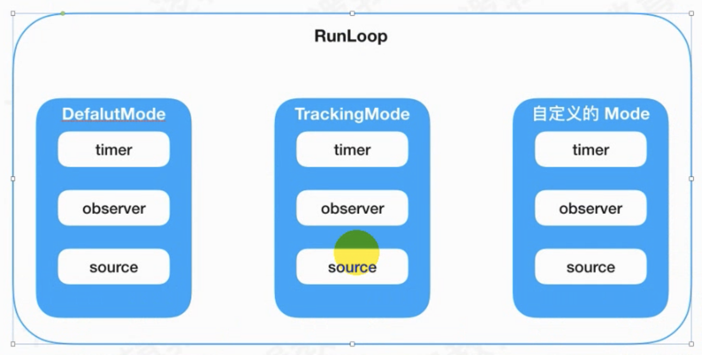

# CFRunLoopModeRef

1. CFRunLoopModeRef代表着RunLoop的运行模式。

2. 每个RunLoop中有若干个Mode，每个Mode中又存在着若干个Observer、Source和Timer等等。

3. 每次runloop启动的时候，只能指定一个mode，这个mode被称为该RunLoop的CurrentMode。

4. 如果需要切换mode，只能先退出当前RunLoop，再重新指定一个mode进入。

   这样做主要是为了分隔开不同组的 Source/Timer/Observer，让其互不影响。

   不同的mode之间是不能够通讯的。

   添加timer是添加在DefalutMode，在触摸的时候失效。

   即想在DefalutMode下接收到timer的回调事件，又想在TrackingMode下接收到回调事件。所以把timer复制到TrackingMode一份儿。两种模式都有同一个timer。处于不同的模式下都有正确的事件回调。

5. 系统默认注册了5个mode：

   1. kCFRunLoopDefaultMode：App的默认Mode，通常主线程是在这个Mode下运行。

   2. UITrackingRunLoopMode：界面跟踪 Mode，用于 ScrollView 追踪触摸滑动，保证界面滑动时不受其他 Mode 影响。

   3. UIInitializationRunLoopMode: 在刚启动 App 时第进入的第一个 Mode，启动完成后就不再使用。

   4. GSEventReceiveRunLoopMode: 接受系统事件的内部 Mode，通常用不到。仅仅包含了一个Source0和一个Source1。

   5. kCFRunLoopCommonModes: 这是一个占位用的Mode

      它里面sources0/sources1/observers/timers都是null，可见这是一个占位的 Mode，没有实际作用，不是一种真正的Mode。

      kCFRunLoopCommonModes**是一个集合set**，包含kCFRunLoopDefaultMode，UITrackingRunLoopMode。如果是CommMode会循环给所有mode添加事件处理，同步每一个mode。
      
      一个 Mode 可以将自己标记为”Common”属性（通过将其 ModeName 添加到 RunLoop 的 “commonModes” 中）。每当 RunLoop 的内容发生变化时，RunLoop 都会自动将 _commonModeItems 里的 Source/Observer/Timer 同步到具有 “Common” 标记的所有Mode里。


```c
typedef struct __CFRunLoopMode *CFRunLoopModeRef;

struct __CFRunLoopMode {
    CFRuntimeBase _base;
    pthread_mutex_t _lock;    /* must have the run loop locked before locking this */
    CFStringRef _name;
    Boolean _stopped;
    char _padding[3];
    CFMutableSetRef _sources0;
    CFMutableSetRef _sources1;
    CFMutableArrayRef _observers;
    CFMutableArrayRef _timers;
    CFMutableDictionaryRef _portToV1SourceMap;
    __CFPortSet _portSet;
    CFIndex _observerMask;
		...
};
```

一个runloop可以有多个mode模式。



runloop如果要执行，依赖于：要有事件

1. 输入源
   1. port
2. source
   1. source0 
      - 底层CFSocket通讯
   2. Source1 
      1. mach_msg消息
      2. 触摸事件的传递。source1传递给source0 传递给当前app。
3. 定时器：timer

```
    [[NSRunLoop currentRunLoop] addTimer:<#(nonnull NSTimer *)#> forMode:<#(nonnull NSRunLoopMode)#>];
```

线程和runloop在dict里键值绑定。

- 线程和runloop是一一绑定关系。
- CFRunloop和CFRunloopMode是一对多关系，一个runloop有多种mode。
- CFRunloopMode和item是一对多关系，一个mode下可能有多个相关的事务item。

common mode items 也是一个集合。由CFRunloopSource，CFRunloopTimer，CFRunloopObserver，等事件组成的。