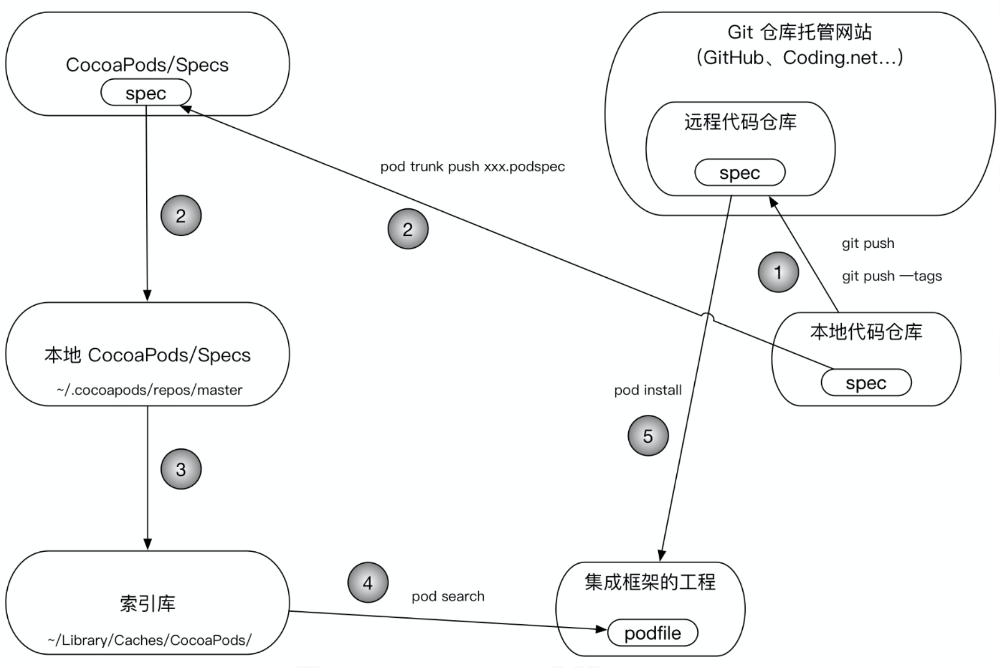

# CocoaPods原理



## 本地代码仓库

有一个本地代码仓库，向cocoapods上面上传代码和拉取代码。

拉取代码需要安装cocoapods。

.cocoapods是隐藏文件

本地仓库文件地址：/Users/cuihuihui/.cocoapods/repos

pod search AFNetworking 就是在.cocoapods/repos本地资源库找到索引Specs，

AFNetworking.podspec.json

本地索引库里面很多.spec文件，pod search搜索到时候不是直接在本地索引库查找的，有一个检索的索引文件json格式的。键值对。找到之后根据.spec中的框架地址，从github下载源码。不是直接从github上找并下载的。

.podspec文件：里面记录一些邮箱，框架名称，版本号，框架地址url，homepage，作者，source：项目地址，tag：版本。

#### 项目安装框架源码

项目里面有一个podfile，根据podfile查找。podfile会在github上找源码 根据GitHub远程索引库（里面有很多索引文件.spec文件，不是源码）。

使用的时候 pod setup更新 本地索引库 把远程索引库po到本地。需要经常跟新索引库。

# 抽成本地的

先抽成本地的，本地的私有索引库。然后提交远程。

1. cd到本地的Lib文件夹，也可以是其它任意文件夹。

2. `pod lib create GroupShadowTableView`

   Cloning `https://github.com/CocoaPods/pod-template.git` into `GroupShadowTableView`.从github上面clone一个pod模版，创建仓库。

   Configuring GroupShadowTableView template. 下面就是一些配置。

   模版执行完之后 

   - What platform do you want to use?? [ iOS / macOS ] 选择iOS
   - What language do you want to use?? [ Swift / ObjC ] 输入语言swift/Objc 
   - Would you like to include a demo application with your library? [ Yes / No ]是否包含demo 选择Yes
   - Which testing frameworks will you use? [ Specta / Kiwi / None ] 测试framework 选None 选其它的会创建其它的模版
   - Would you like to do view based testing? [ Yes / No ] 基础测试文件 选No
   - What is your class prefix? 选择文件前缀  自己定义HH
     然后就创建好了，项目会自动打开。

创建好之后 里面自动有一个.podspec文件。因为前面选择 了Yes，所以里面 有Delegate和 Viewcontroller 方便测试。

Pods里面的Development Pods的文件夹下有一个GroupShadowTableView文件夹，也就是`ReplaceMe.m`文件所在的位置，在/Lib/GroupShadowTableView/GroupShadowTableView/Classes该文件夹中放自己抽取的代码，以及自己写的代码。再把ReplaceMe.m文件删除。

然后 在终端cd Podfile文件路径cd /Users/cuihuihui/Documents/github/Lib/GroupShadowTableView/Example 然后pod install安装。

**一定要记得pod install** 不然Development Pods文件夹下没有文件，本地无法使用。

##### 注

Developer Pods放本地库文件，还未提交远程之前，提交远程之后使用远程库，会删除Developer Pods文件夹下的本地库文件

## 依赖其它第三方库

编译之后可能会出错，因为少了依赖的第三方框架AFN，MJ，Masnory等。

Pods/Development Pods/自己代码文件夹/Pod/.podspec。里面有一个Pod文件夹，Pod文件夹中有一个.podspec文件，添加需要的第三方：

```
  s.dependency 'AFNetworking'
  s.dependency 'Masonry'
  s.dependency 'LGMacroAndCategoryModule'//自己写的也可以引入

  s.prefix_header_contents = '#import "Masonry.h"','#import "UIKit+AFNetworking.h"','#import "LGMacros.h"'
```

把依赖的第三方在.podspec文件中添加上，然后pod install安装。

每次修改都要进行`pod install`。

编译成功，至此，本地库就已经做好了。

#### 添加依赖的本地库

```
use_frameworks!

platform :ios, '9.0'

target 'LGCommonUIModule_Example' do
  pod 'LGCommonUIModule', :path => '../'
  pod 'LGMacroAndCategoryModule', :path => '../../LGMacroAndCategoryModule'//本地库
end
```

需要在Podfile文件指定路径，Podfile文件里面pod 'GroupShadowTableView', :path => '../'。

:path指定的是本地路径。

../是上级文件夹路径。

可以在其它项目中 pod刚才做好的本地库。进行使用。使用本地库的时候，**注意path的路径要修改正确**。 `../`是上级目录。路径是相对于Podfile的路径

其它的模块同理
终端cd到Lib文件夹
`pod lib create HHHomePage` 创建模版。
拖入文件 `Pod install` 安装
把依赖的第三方引入

本地的库就已经完成了。

#### 找不到资源文件

代码放在Classes文件夹中，图片Images.xcassets放在Assets文件夹中

加载图片需要换bundle

```objective-c
    NSString *bundlePath = [[NSBundle bundleForClass:[self class]].resourcePath stringByAppendingPathComponent:@"/LGModuleTest.bundle"];
    NSBundle *resoure_bundle = [NSBundle bundleWithPath:bundlePath];
    
    self.imageView.image = [UIImage imageNamed:@"share_wechat" inBundle:resoure_bundle compatibleWithTraitCollection:nil];
```

同时还需要修改Pods/Development Pods/自己代码文件夹/Pod/.podspec文件下的resource_bundles

```
   s.resource_bundles = {
     'LGModuleTest' => ['LGModuleTest/Assets/*']
   }
```

每次修改最后都**需要pod install**。

同样json文件一样 需要配置bundle。xib也需要配置bundle

```objective-c
    NSString *bundlePath = [[NSBundle bundleForClass:[self class]].resourcePath stringByAppendingPathComponent:@"/LGHomeModule.bundle"];
    NSString *path = [[NSBundle bundleWithPath:bundlePath] pathForResource:[NSString stringWithFormat:@"Home_TableView_Response_%@", channelId] ofType:@"json"];
```

## 做成远程的

本地的索引库，其他人使用的话用不了你本地电脑上的。所以做成远程的。

使用码云。

创建一个仓库，仓库名必须跟框架名一样，选择导入已有项目，然后创建。

cd本地仓库文件夹

 git remote add origin https://github.com/huicuihui/GroupShadowTableView.git 后面的https地址是github当前仓库地址。
git push -u origin master
提交到远程。

这时在github远程上是没有刚才新增的文件的。没有源码，因为没有保存，提交。

git add .添加到缓存
git commit -m ‘初始化’
git push origin master。提交到远程的master分支。

### 重要的部分

要找远程索引库，向远程索引库提交.spec文件，根据.spec文件中地址找框架源码。本地索引库也有.spec文件，里面也有远程地址。
所以就要修改.spec文件。

- name

- version版本号

- summary描述

- s.description 可以修改也可以不改

- s.homepage 主页地址 远程库的地址。是github就写github地址，是码云就写gitee地址。（如果是私有的，地址只需要写到自己的github地址，不需要写项目具体地址）

- s.source 重要：框架源码地址，找框架源码的时候就是根据这个找的。这个地址错了就找不到了。github就写github，码云就写gitee，可以直接复制仓库地址。

- s.source_files 资源的文件（哪些文件是需要的，根据这个去找）。/**/* 代表 ：所有文件，文件夹中的所有文件。

  ```
  例：s.source_files = 'HHGroupShadowTableView/Classes/**/*'
  ```

  找的Classes下的文件

———

把spec文件提交
提交到本地。

终端打印`pod repo`，master显示github上的源地址.

如果用的是码云或者是其它的源地址，要在podfile文件中指定source，写上source ‘https://gifted.com/huicuihui/Spec.git’ 在这里面找。
另外还要有source ‘https://github.com/CocoaPods/Specs.git’ 因为还有其他的第三方在github上。

本地端索引库地址：/Users/cuihuihui/.cocoapods/repos。里面的master是github上的索引。

私有库是提交到本地索引库的，本地端的spec文件会自动的同步远程索引库。
向本地提交一个spec文件，本地的spec文件会 自动的向远程端同步。

### 提交

pod repo HHSpec HHGroupShadowTableView.podspec

pod repo 不成功，因为pod库有一个版本号，github上需要打标签。
git tag 0.1.0 打tag。0.1.0和.podspec中的版本号一致。
git tag命令可以查看tag。
git push --tags 提交到远程。

提交 pod repo push HHSpec HHTools.podspec，提交的时候会验证.spec本地索引库是否写对。
如果引用其它第三方可能提交不上去，就不使用pod repo push这个指令提交，改为直接复制一个其它的本地索引库文件，然后改一下名字，版本，描述等等，修改.podspec文件。

提交远程仓库报错：

>cuihuihui@cuihuihuideMacBook-Pro HHGroupShadowTableView % pod repo push HHGroupShadowTableView.podspec
>
>
>
>Validating spec
>
>-> HHGroupShadowTableView (0.1.0)
>
>\- WARN | summary: The summary is not meaningful.
>
>\- WARN | description: The description is shorter than the summary.
>
>\- ERROR | [iOS] unknown: Encountered an unknown error (/usr/bin/xcrun simctl list -j devices
>
>
>
>xcrun: error: invalid active developer path (/Library/Developer/CommandLineTools), missing xcrun at: /Library/Developer/CommandLineTools/usr/bin/xcrun
>
>) during validation.
>
>
>
>[!] The `HHGroupShadowTableView.podspec` specification does not validate.

需要在终端使用xcode-select --install来Install Command Line Developer Tools。

继续提交报错

>cuihuihui@cuihuihuideMacBook-Pro HHGroupShadowTableView % pod repo push HHGroupShadowTableView.podspec
>
>
>
>Validating spec
>
>-> HHGroupShadowTableView (0.1.0)
>
>\- WARN | summary: The summary is not meaningful.
>
>\- WARN | description: The description is shorter than the summary.
>
>\- ERROR | [iOS] unknown: Encountered an unknown error (/usr/bin/xcrun simctl list -j devices
>
>
>
>xcrun: error: unable to find utility "simctl", not a developer tool or in PATH
>
>) during validation.
>
>
>
>[!] The `HHGroupShadowTableView.podspec` specification does not validate.

现在本地已经有这个框架类了。

注

1. pod trunk register 805988356@qq.com 'huicuihui' --description='huihuiPro'

   注册账号

2. pod trunk push HHGroupShadowTableView.podspec 要先cd进入当前文件夹

3. pod trunk push HHGroupShadowTableView.podspec --allow-warnings 如果有警告的话 需要在后面添加--allow-warnings去ignore警告

pod search HHTools 就可以搜索到了。
然后就可以重新pod intall安装远程的库。
