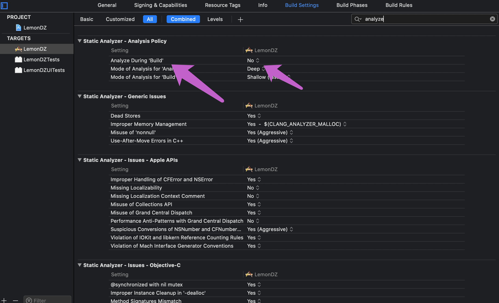
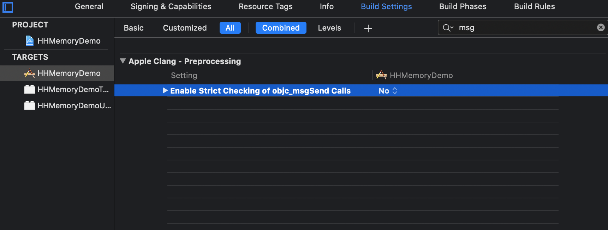

# 内存检测

1. 静态检测

   1. Product-Analyze就能分析内存泄漏问题

      CG这种C语言 或者fopen打开文件流 但是没有关闭文件流也会内存泄漏 

      NSArray里插入空的字符串也会内存泄漏

   2. 编译的时候就检测内存分析

      

2. 动态检测instrument/MLeakFinder

   系统：Product-Profile里面有很多工具，Leak

   第三方：MLeakFinder

3. 析构方法打印NSLog

## 自己实现

需求分析：

UIViewController是否释放

情况比较多，只考虑pop/push

思路分析：

明确生命周期 viewWillAppear(push进来了).  viewDidDisappear（pop出去了 出栈）

确定对象是否存活，存活说明有泄漏，没存活说明正常释放了。

代码实现

面向切片编AOP（分类+runtime）

工具类

### Hook生命周期

viewWillAppear

viewDidDisappear 延迟发送一个消息 如果消息处理者是nil的话 就什么都不发生。反之消息接收者有值 就响应消息。

Method Swizzling

### 怎么知道当前vc的状态

给当前的ViewController绑定一个属性。

Runtime提示打开

### 总结：

- NSObject+HHSwizzling里有两个方法

  willDealloc用来检测对象是否存活，延迟监听 是否释放

  \+ (**void**)swizzleSEL:(**SEL**)originSEL withSEL:(**SEL**)swizzlingSEL 用来做方法交换

- UIViewController+HHLeaksTest

  交换方法

  viewWillAppear   关联属性  标识当前的状态

  viewDidDisappear   判断状态 检测。   willDealloc

- UINavigationController+HHLeaksTest

  主要标识VC是否出栈

