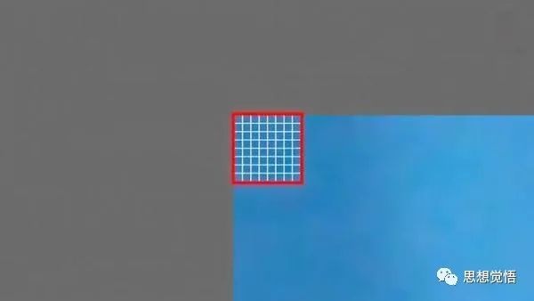
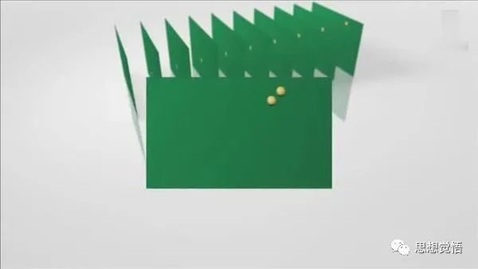
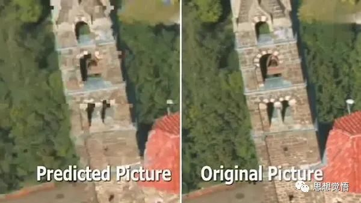
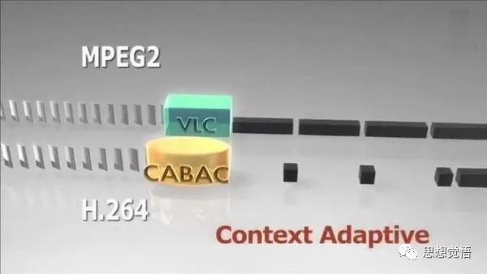

# H264

## H264数据结构

视频由视频帧组成，图像达到一秒16帧以上就认为是视频。

在网络传输时图片很大，一次传输不了一整张图片，所以每一个图片又可以分成很多片。

片有片头（网络传输序号）和片数据。

每一片有很多一个宏块。宏块包括：宏块类型、宏块预测、残差数据。

宏块又可以分成子块。

宏块是H264编码的基本单位。每个宏块选择合适的模式。

编码完成后会得到一个一个的流单元NALU（SPS、PPS、I Frame、P Frame、B Frame）。

H264码流组成，从大到小排序依次是:

> H264视频序列、图像、片组、片、NALU、宏块、像素。

## NALU

NALU从十六进制转为二进制

- 第1位为禁位，不需要
- 第2到3位为参考级别，不需要
- 第4到8位为流nal单元类型

## H264码流数据单元NALU

H.264原始码流(裸流)是由一个接一个NALU组成，它的功能分为两层，VCL(视频编码层)和 NAL(网络提取层)。

1. VCL：包括核心压缩引擎和块，宏块和片的语法级别定义，设计目标是尽可能地独立于网络进行高效的编码。
2. NAL：负责将VCL产生的比特字符串适配到各种各样的网络和多元环境中，覆盖了所有片级以上的语法级别。

在VCL进行数据传输或存储之前，这些编码的VCL数据，被映射或封装进NAL单元。（NALU）

### H.264 NALU结构：

1. `StartCode`

    `Start Code` 用于标示这是一个NALU 单元的开始，必须是`"00 00 00 01`" 或`"00 00 01"`开头。

2. `NALU Header`

   一组对应于视频编码的NALU头部信息

3. 切片数据`RBSP`

   一个原始字节序列负荷(RBSP,Raw Byte Sequence Payload)

既然H164中的都是NALU数据，那么NALU是怎么来的呢？

首先我们来看两张图：

一帧图片经过 H.264 编码器之后，就被编码为一个或多个片（slice），而装载着这些片（slice）的载体，就是 NALU 了。

H264压缩技术主要采用了以下几种方法对视频数据进行压缩。包括：

- 帧内预测压缩，解决的是空域数据冗余问题。
- 帧间预测压缩（运动估计与补偿），解决的是时域数据冗余问题。
- 整数离散余弦变换（DCT），将空间上的相关性变为频域上无关的数据然后进行量化。
- CABAC压缩。

下面我们就来分析一下H264的编码原理：

## 宏块划分

当每一帧图像被送到 H264 编码器的缓冲区中。编码器先要为每一幅图片划分宏块。

我们以下面这张图为例

H264默认是使用 `16X16` 大小的区域作为一个宏块，也可以划分成更小的 `8X8`的大小。

宏块划分好了之后，就会计算宏块内的像素值

依次循环划分，等到将一帧图像宏块划分和像素计算完毕后就是这样子的：

## 划分子块

H264对比较平坦的图像使用 `16X16` 大小的宏块。但为了更高的压缩率，还可以在 `16X16` 的宏块上更划分出更小的子块。

子块的大小可以是 `8X16`､ `16X8`､ `8X8`､ `4X8`､ `8X4`､ `4X4`非常的灵活。

## 帧分组GOF(Group of Frame)

宏块划分好后，就可以对H264编码器缓存中的所有图片进行分组了。

我们知道视频的压缩原理就是去掉冗余数据，而视频的冗余数据主要是时间冗余和空间冗余两大类，而时间冗余又是最大的。

为什么时间冗余的数据是最大的呢？因为我们通过摄像头每秒中抓取几十帧的画像，而这些画像大部分情况下都是有相关性的，这些关联特别密切的帧，其实我们只需要保存一帧的数据，其它帧都可以通过这一帧再按某种规则预测出来，所以说视频数据在时间上的冗余是最多的。这也是为什么会有I帧、P帧以及B帧的缘由。

**什么叫一组帧?**
 就是一个I帧到下一个I帧.这一组的数据.包括B帧/P帧.我们称为GOF.

那么为了达到通过某几帧图像来预测后面几帧图像的目的，那么我们就需要对帧进行分组，将一些相似的帧划分在一组。

如果在一秒钟内有30帧，这30帧可以画成一组。如果摄像机或者镜头它一分钟之内它都没有发生大的变化，那也可以把这一分钟内所有的帧画做一组。

那么如何判定某些帧关系密切，可以划为一组呢？我们来看一下例子，下面是捕获的一组运动的台球的视频帧，台球从右上角滚到了左下角。

H264编码器会按顺序，每次取出两幅相邻的帧进行宏块比较，计算两帧的相似度，如图：

宏块比较

通过宏块扫描与宏块搜索如果发现这两个帧的关联度是非常高的，那么这几帧就可以划分为一组。

> 其算法是：在相邻几幅图像画面中，一般有差别的像素只有10%以内的点,亮度差值变化不超过2%，而色度差值的变化只有1%以内，我们认为这样的图可以分到一组。

在这样一组帧中，经过编码后，我们只保留第一帖的完整数据，其它帧都通过参考上一帧计算出来。我们称第一帧为IDR／I帧，其它帧我们称为P／B帧，这样编码后的数据帧组我们称为GOP。

### I帧: 关键帧,采用帧内压缩技术.

保留了一张完整视频帧，解码关键。

- 举个例子,如果摄像头对着你拍摄,1秒之内,实际你发生的变化是非常少的.1秒钟之内实际少很少有大幅度的变化.摄像机一般一秒钟会抓取几十帧的数据.比如像动画,就是25帧/s,一般视频文件都是在30帧/s左右.对于一些要求比较高的,对动作的精细度有要求,想要捕捉到完整的动作的,高级的摄像机一般是60帧/s.那些对于一组帧的它的变化很小.为了便于压缩数据,那怎么办了?将第一帧完整的保存下来.如果没有这个关键帧后面解码数据,是完成不了的.所以I帧特别关键.

### P帧: 向前参考帧.压缩时只参考前一个帧.属于帧间压缩技术.

不同的数据。保存和前一帧图片不同的数据，如果一样就不保存。

向前参考帧，差异数据，解码需要依赖I帧

- 视频的第一帧会被作为关键帧完整保存下来.而后面的帧会向前依赖.也就是第二帧依赖于第一个帧.后面所有的帧只存储于前一帧的差异.这样就能将数据大大的减少.从而达到一个高压缩率的效果.

### B帧: 双向参考帧,压缩时即参考前一帧也参考后一帧.帧间压缩技术.

相同的数据。向前向后（双向）参考帧，保存更少的数据

实时互动时考虑舍弃B帧，泛型娱乐对实时性要求不高时B帧压缩更高。

- B帧,即参考前一帧,也参考后一帧.这样就使得它的压缩率更高.存储的数据量更小.如果B帧的数量越多,你的压缩率就越高.这是B帧的优点,但是B帧最大的缺点是,如果是实时互动的直播,那时与B帧就要参考后面的帧才能解码,那在网络中就要等待后面的帧传输过来.这就与网络有关了.如果网络状态很好的话,解码会比较快,如果网络不好时解码会稍微慢一些.丢包时还需要重传.对实时互动的直播,一般不会使用B帧.
- 如果在泛娱乐的直播中,可以接受一定度的延时,需要比较高的压缩比就可以使用B帧.
- 如果我们在实时互动的直播,我们需要提高时效性,这时就不能使用B帧了.

### SPS/PPS

SPS/PPS实际上就是存储GOP的参数.

**SPS: (Sequence Parameter Set,序列参数集)存放帧数,参考帧数目,解码图像尺寸,帧场编码模式选择标识等**.

- 一组帧的参数集.

**PPS:(Picture Parameter Set,图像参数集).存放熵编码模式选择标识,片组数目,初始量化参数和去方块滤波系数调整标识等.(与图像相关的信息)**

- 熵编码模式,片组数目等这些我们会在后面的内容讲解到.大家在这里主要了解到SPS/PPS即可.

大家只要记住,在一组帧之前我们首先收到的是SPS/PPS数据.如果没有这组参数的话,我们是无法解码.

如果我们在解码时发生错误,首先要检查是否有SPS/PPS.如果没有,是因为对端没有发送过来还是因为对端在发送过程中丢失了.

SPS/PPS数据,我们也把其归类到I帧.这2组数据是绝对不能丢的.

**VideoToolBox硬编码H264帧（I帧），手动添加了SPS和PPS。所以解码时需要使用SPS/PPS数据来对解码器进行初始化。**

### 视频花屏/卡顿原因

我们在观看视频时,会遇到花屏或者卡顿现象.那这个与我们刚刚所讲的GOF就息息相关了.

- 如果GOP分组中的P帧丢失就会造成解码端的图像发生错误.
- 为了避免花屏问题的发生,一般如果发现P帧或者I帧丢失.就不显示本GOP内的所有帧.只到下一个I帧来后重新刷新图像.
- 如果H264码流中I帧错误或者丢失，就会导致错误传递，P帧B帧单独是完成不了解码工作，解码错误会产生花屏现象。
- 当这时因为没有刷新屏幕.丢包的这一组帧全部扔掉了.图像就会卡在哪里不动.这就是卡顿的原因.

**所以总结起来,花屏是因为你丢了P帧或者I帧.导致解码错误. 而卡顿是因为为了怕花屏,将整组错误的GOP数据扔掉了.直达下一组正确的GOP再重新刷屏.而这中间的时间差,就是我们所感受的卡顿.**

## H264编码

H.264是在MPEG-4技术的基础之上建立起来的，其编解码流程主要包括5个部分：帧间和帧内预测（Estimation）、变换（Transform）和反变换、量化（Quantization）和反量化、环路滤波（Loop Filter）、
熵编码（Entropy Coding）。

### 1、帧间预测压缩，解决的是时域冗余问题

摄像头在一段时间内所捕捉的数据没有较大变化，针对这**一时间内的相同数据压缩掉**，就叫时域数据压缩。

我们把**运动估计与补偿称**为帧间压缩技术，它解决的是视频帧在时间上的数据冗余。

在H264编码器中将帧分组后，就要计算帧组内物体的运动矢量了。

H264编码器首先按顺序从缓冲区头部取出两帧视频数据，然后进行宏块扫描。当发现其中一幅图片中有物体时，就在另一幅图的邻近位置（搜索窗口中）进行搜索。
如果此时在另一幅图中找到该物体，那么就可以计算出物体的运动矢量了。

以上面台球的例子为例，下面这幅图就是搜索后的台球移动的位置。

台球运动补偿

通过两帧图像中台球位置相差，就可以计算出台图运行的方向和距离。H264依次把每一帧中球移动的距离和方向都记录下来就成了下面的样子：

运动矢量计算出来后，将相同部分（也就是绿色部分）减去，就得到了补偿数据。
我们最终只需要将补偿数据进行压缩保存，以后在解码时就可以恢复原图了。压缩补偿后的数据只需要记录很少的一点数据，因而达到了压缩的目的。

### 2、帧内预测压缩

帧内预测压缩，解决的是空域数据冗余问题。

什么是空域数据：就是这幅图里数据在宽高空间内包含了很多颜色、光亮，**人的肉眼很难察觉的数据**，对于这些数据，我们可以认作冗余，直接压缩掉。有损压缩。

宏块预测模式信息得到预测图，通过预测图与原图的差得到一个结果（残差值），加上残差值就得到原图。

上面我们说了运动补偿解决的是视频数据在时间上的冗余问题，那么视频数据在空间上的冗余问题该怎么解决呢？这就是帧内预测压缩所要解决的问题。

**人眼对图象都有一个识别度，对低频的亮度很敏感，对高频的亮度不太敏感**。所以基于一些研究，可以将一幅图像中人眼不敏感的数据去除掉。这样就提出了帧内预测技术。

H264编码器在对一幅图像被划分好宏块后，对每个宏块可以进行各种模式的预测。找出与原图最接近的一种预测模式。

我们通过一张图看下都有哪些预测模式，针对宏块大小的不同，有不同的预测模式,**注意箭头的角度大小不同代表不同的预测模式。**

H264帧内预测模式

在实际应用中，我们查看图片的时候，将图片不断放大之后会看到图片会变模糊，有很多小方块似的马赛克出现，这大概就是帧内预测的效果。

下面这张图就是通过采样宏块的左边和上边的像素值，然后通过9种预测模式预测出来的宏块像素结果：

帧内预测后的图像与原始图像的对比如下：

通过帧内预测之后，将原始图像与帧内预测后的图像相减得残差值。再将我们之前得到的预测模式信息一起保存起来，这样我们就可以在解码时恢复原图了。

这样通过存取小量的残差数据和预测模式就解决了视频数据上的空间冗余问题。

### 3、对残差数据做整数离散余弦变换DCT

整数离散余弦变换（DCT），将空间上相关性变为频域上无关的数据然后进行量化

经过帧内与帧间的压缩后，虽然数据有大幅减少，但还有优化的空间。

可以将残差数据做整数离散余弦变换，去掉数据的相关性，进一步压缩数据。如下图所示，左侧为原数据的宏块，右侧为计算出的残差数据的宏块。

将残差数据宏块数字化后如下图所示：

我们可以看到宏块数字化后的表格数字是杂乱无章，没有规律可言的。我们将残差数据宏块进行 DCT 转换，结果如下图：

我们可以看出经过DCT转换后，我们的宏块数据变得有规律了，从左上角到右下角，数据越来越小。对于DCT转换的原理感兴趣的童鞋可以自行搜索了解，这里就不做多的详细讲解了，大概就是经过DCT转换出来的数据，从左上角到右下角，出现的频率越来约高。那么根据人眼对低频敏感对高频敏感这个原理，省掉右下部分的一些值的话，对人眼来说，看起来实际上是没什么区别的。

### 4、CABAC无损压缩

帧内压缩是属于有损压缩技术。也就是说图像被压缩后，无法完全复原。而CABAC则属于无损压缩技术。

**高频短码，低频长码，加上上下文**。

无损压缩技术大家最熟悉的可能就是哈夫曼编码了，给高频的词一个短码，给低频词一个长码从而达到数据压缩的目的。MPEG-2中使用的VLC就是这种算法，我们以 A-Z 作为例子，假如A属于高频数据，Z属于低频数据。
那么我们用一个短码代表A，为了区分则用一个长码代表Z，那么VLC这三个字母则可以通过查询对应的字母码表示出来。如图：

在早期的Android系统中，谷歌因为内存原因将图片的哈夫曼压缩给屏蔽了，所以如果开发者想要使用哈夫曼算法对图片进行压缩的话需要做一些扩展。

CABAC也是给高频数据短码，给低频数据长码。同时还会根据上下文相关性进行压缩，这种方式又比VLC高效很多。其效果如图：

