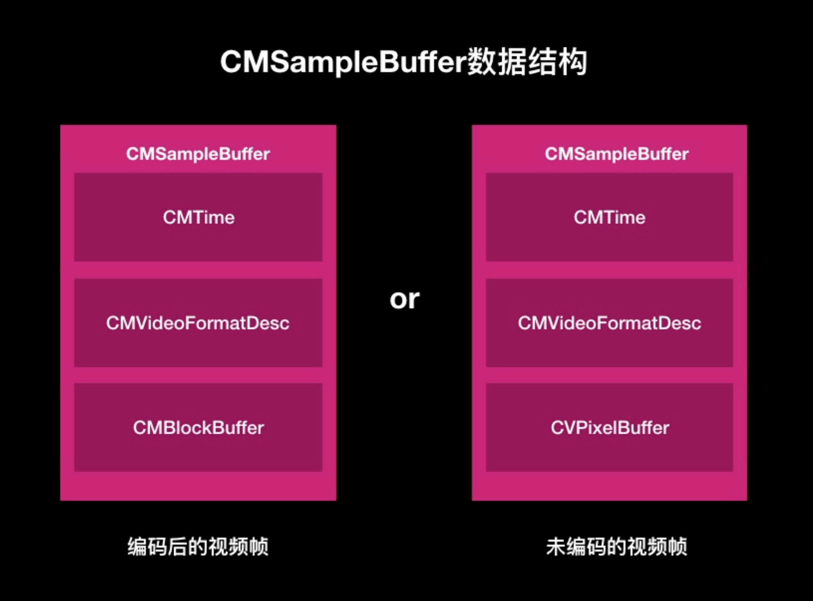

# 视频解码

## 解码思路

1. 解析数据（NALU Unit 流单元）I帧P帧B帧

   既然流数据NALU，一个接一个，所以需要实时解码。

   首先需要对数据解析，分析NALU数据，前面4个字节时起始位，标识一个NALU的开始，所以从第5位才开始来获取，从第五位才是NALU数据类型。

   获取到第5位数据，转化为十进制，然后根据表格判断它的数据类型。

   判断好数据类型，才能将NALU送入解码器。SPS/PPS只要获取就可以了，是不需要解码的。

   `CVPixelBufferRef`保存的是解码后的数据或者未编码前的数据。

2. 初始化解码器

3. 将解析后的H264流数据（NALU Unit）输入到解码器

4. 解码完成后的回调，输出解码数据

5. 解码数据显示，用到OpenGL ES

## 解码三个核心函数

1. 创建session，`VTDecompressionSessionCreate`
2. 解码一个frame，`VTDecompressionSessionDecodeFrame`
3. 销毁解码session，`VTDecompressionSessionInvalidate`

## 原理分析

解码解的是H264原始码流，H264原始码流由一个一个流数据（NALU）组成。

- I帧：保留了一张完整视频帧，解码关键
- P帧：向前参考帧，差异数据，解码需要依赖I帧
- B帧：双向参考帧，解码时即需要I帧，也需要P帧

**如果H264码流中I帧错误或者丢失，就会导致错误传递，P帧B帧单独是完成不了解码工作，解码错误会产生花屏现象。**

**VideoToolBox硬编码H264帧（I帧），手动添加了SPS和PPS。所以解码时需要使用SPS/PPS数据来对解码器进行初始化。**

## VideoToolBox基本概念

VideoToolBox基于coreMedia，coreVideo，coreFundation框架C语言API。

三种类型会话：编码，解码，像素移动。

从coreMedia，coreVideo框架衍生出时间或帧管理数据类型，CMTime，CVPixelBufferRef。

CMVideoFormatDescriptionRef：视频格式描述。包括编码尺寸，视频尺寸。

## CMSampleBufferRef

CMBlockBufferRef里面是frame帧

CVPixelBufferRef里面存储的不是RGB而是YUV信息

OpenGLES默认的颜色体系是RGB，需要YUV转换RGB。所以需要两个纹理。

图片数据只有Y数据，可以显示，但是是黑白的，加上UV信息图片才会变成彩色的。

视频由2个图层构成：Y图层和UV图层。

视频渲染就是纹理的渲染，也就是片元着色器填充。width * height正方形（渲染2个纹理）。

