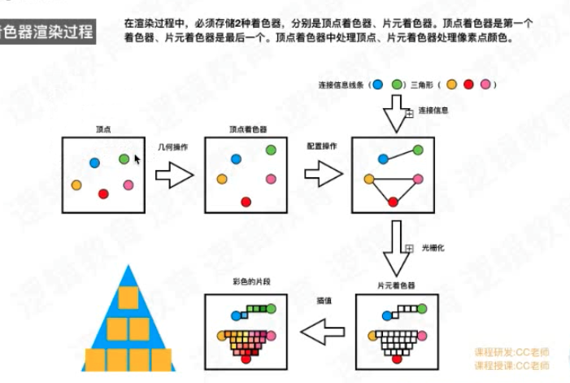
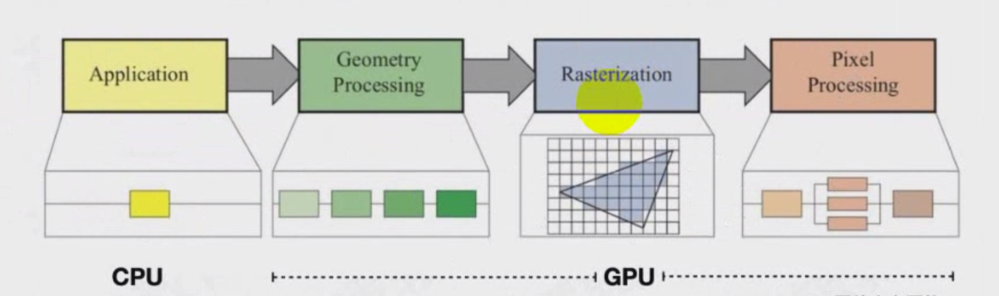

# 图片到底如何加载

### **图片的渲染流程**

在iOS中使用 `UIImage`和`UIImageView`来加载图片，他俩遵守经典的`MVC`架构，`UIImage`是数据相当于`Model`，`UIImageView`是视图相当于`View`。

`UIImage`负责`加载图片`，`UIImageView`负责`渲染图片`。

图片的渲染流程分为`3个阶段`:`加载(Load)，解码（Decoder)和渲染(Render)`


在每个阶段都会有相对应的`缓冲区`:`数据缓冲区(DataBuffer)，图像缓冲区(imageBuffer)和帧缓冲区(framebuffer)`。

我们以加载一个图片的尺寸为:`2048 px * 1536 px`，在磁盘上的大小为:`590kb`的图片为例，来分析前两个阶段的缓冲区。

#### 图片加载的工作流程

iOS从磁盘加载一张图片，使用UIImageView显示在屏幕上，加载流程如下:

1. 我们使用 +imageWithContentsOfFile:(使用Image I/O创建CGImageRef内存映射数据)方法从磁盘中加载一张图片，此时，图像尚未解码。在这个过程中先从磁盘拷贝数据到内核缓冲区，再从内核缓冲区复制数据到用户空间

2. 生成UIImageView，把图像数据赋值给UIImageView，如果图像数据未解码(PNG/JPG)，解码为位图数据

3. 隐式CATransaction 捕获到UIImageView layer树的变化。

4. 在主线程的下一个 runloop 到来时，Core Animation 提交了这个隐式的 transaction ，这个过程可能会对图片进行 copy 操作，如果数据没有字节对齐，Core Animation会再拷贝一份数据，进行字节对齐，可能会涉及到以下操作:

   • 分配内存缓冲区用于管理文件 IO 和解压缩操作

   • 将文件数据从磁盘读到内存中

   • 将压缩的图片数据解码成未压缩的位图形式，这是一个非常耗时的 CPU 操作，并且解码出来的图片体积与图片的宽高有关系，而与图片原来的体积无关

   • 最后 Core Animation 中CALayer使用未压缩的位图数据渲染 UIImageView 的图层

   • CPU计算好图片的Frame,对图片解压之后.就会交给GPU,GPU处理位图数据，进行渲染

5. 渲染流程

   - GPU获取图片的坐标
   - 将坐标交给顶点着色器VertexShader (顶点计算)
   - 将图片光栅化(获取图片对应屏幕上的像素点，实际绘制或填充每个顶点之间的像素)
   - 片元着色器FragmentShader计算(计算每个像素点的最终显示的颜色值)
   - 从帧缓存区中渲染到屏幕上

> 可以看到在上面这个工作流程中体现了CPU和GPU的互相配合
>
> 

#### 为什么需要解压缩？

图片的解压缩是需要消耗大量CPU时间的，那为什么还需要对图片进行解压缩操作呢？ 首先需要了解到什么是位图:

```
位图（Bitmap），又称栅格图（英语：Raster graphics）或点阵图，是使用像素阵列(Pixel-array/Dot-matrix点阵)来表示的图像。
```

其实，位图就是一个像素数组，数组中的每个像素就代表着图片中的一个点。我们在应用中经常用到的 JPEG 和 PNG 图片就是位图。

获取图片的原始像素数据,用以下代码:

```
UIImage *image = [UIImage imageNamed:@"text.png"];
CFDataRef rawData = CGDataProviderCopyData(CGImageGetDataProvider(image.CGImage));
```

解压缩后的图片大小与原始文件大小之间没有任何关系，而只与图片的像素有关： **解压缩后的图片大小 = 图片的像素宽 \* 图片的像素高  \* 每个像素所占的字节数**

事实上，不管是 JPEG 还是 PNG 图片，都是一种压缩的位图图形格式。只不过 PNG 图片是无损压缩，并且支持 alpha 通道，而 JPEG 图片则是有损压缩，可以指定 0-100% 的压缩比。值得一提的是，在苹果的 SDK 中专门提供了两个函数用来生成 PNG 和 JPEG 图片：

```
// return image as PNG. May return nil if image has no CGImageRef or invalid bitmap format
UIKIT_EXTERN NSData * __nullable UIImagePNGRepresentation(UIImage * __nonnull image);

// return image as JPEG. May return nil if image has no CGImageRef or invalid bitmap format. compression is 0(most)..1(least)                           
UIKIT_EXTERN NSData * __nullable UIImageJPEGRepresentation(UIImage * __nonnull image, CGFloat compressionQuality);   
```

> 总结:在将磁盘中的图片渲染到屏幕之前，必须先要得到图片的原始像素数据，才能执行后续的绘制操作，这就是为什么需要对图片解压缩的原因。

#### 解压缩原理

当未解压缩的图片将要渲染到屏幕时，系统会在主线程对图片进行解压缩，而如果图片已经解压缩了，系统就不会再对图片进行解压缩。因此，也就有了业内的解决方案，在子线程提前对图片进行强制解压缩。

而强制解压缩的原理就是对图片进行重新绘制，得到一张新的解压缩后的位图。其中，用到的最核心的函数是 CGBitmapContextCreate：

```
CG_EXTERN CGContextRef __nullable CGBitmapContextCreate(void * __nullable data,
    size_t width, size_t height, size_t bitsPerComponent, size_t bytesPerRow,
    CGColorSpaceRef cg_nullable space, uint32_t bitmapInfo)
    CG_AVAILABLE_STARTING(__MAC_10_0, __IPHONE_2_0);
```

这个函数用于创建一个位图上下文，用来绘制一张宽 width 像素，高 height 像素的位图。

- **data** ：如果不为 NULL ，那么它应该指向一块大小至少为 bytesPerRow * height 字节的内存；如果 为 NULL ，那么系统就会为我们自动分配和释放所需的内存，所以一般指定 NULL 即可；
- **width 和 height** ：位图的宽度和高度，分别赋值为图片的像素宽度和像素高度即可；
- **bitsPerComponent** ：像素的每个颜色分量使用的 bit 数，在 RGB 颜色空间下指定 8 即可；
- **bytesPerRow** ：位图的每一行使用的字节数，大小至少为 width * bytes per pixel 字节。有意思的是，当我们指定 0 时，系统不仅会为我们自动计算，而且还会进行 cache line alignment 的优化，更多信息可以查看[为什么CoreAnimation要字节对齐？](https://link.juejin.cn?target=https%3A%2F%2Fstackoverflow.com%2Fquestions%2F23790837%2Fwhat-is-byte-alignment-cache-line-alignment-for-core-animation-why-it-matters) [为什么我的图像的每行字节数超过其每像素的字节数乘以其宽度？](https://link.juejin.cn?target=https%3A%2F%2Fstackoverflow.com%2Fquestions%2F15935074%2Fwhy-is-my-images-bytes-per-row-more-than-its-bytes-per-pixel-times-its-width)

#### YYImage\SDWebImage开源框架实现

用于解压缩图片的函数 YYCGImageCreateDecodedCopy 存在于 YYImageCoder 类中，核心代码如下

```
CGImageRef YYCGImageCreateDecodedCopy(CGImageRef imageRef, BOOL decodeForDisplay) {
    ...

    if (decodeForDisplay) { // decode with redraw (may lose some precision)
        CGImageAlphaInfo alphaInfo = CGImageGetAlphaInfo(imageRef) & kCGBitmapAlphaInfoMask;

        BOOL hasAlpha = NO;
        if (alphaInfo == kCGImageAlphaPremultipliedLast ||
            alphaInfo == kCGImageAlphaPremultipliedFirst ||
            alphaInfo == kCGImageAlphaLast ||
            alphaInfo == kCGImageAlphaFirst) {
            hasAlpha = YES;
        }

        // BGRA8888 (premultiplied) or BGRX8888
        // same as UIGraphicsBeginImageContext() and -[UIView drawRect:]
        CGBitmapInfo bitmapInfo = kCGBitmapByteOrder32Host;
        bitmapInfo |= hasAlpha ? kCGImageAlphaPremultipliedFirst : kCGImageAlphaNoneSkipFirst;

        CGContextRef context = CGBitmapContextCreate(NULL, width, height, 8, 0, YYCGColorSpaceGetDeviceRGB(), bitmapInfo);
        if (!context) return NULL;

        CGContextDrawImage(context, CGRectMake(0, 0, width, height), imageRef); // decode
        CGImageRef newImage = CGBitmapContextCreateImage(context);
        CFRelease(context);

        return newImage;
    } else {
        ...
    }
}
```

YYImage加载流程:

- 获取图片二进制数据
- 创建一个CGImageRef对象
- 使用CGBitmapContextCreate()方法创建一个上下文对象
- 使用CGContextDrawImage()方法绘制到上下文
- 使用CGBitmapContextCreateImage()生成CGImageRef对象。
- 最后使用imageWithCGImage()方法将CGImage转化为UIImage。

SDWebImage 中对图片的解压缩过程与上述完全一致，只是传递给 CGBitmapContextCreate 函数的部分参数存在细微的差别。

性能对比:

解压PNG图片,SDWebImage>YYImage 解压JPEG图片,SDWebImage<YYImage

#### 总结

1. 图片文件只有在确认要显示时,CPU才会对齐进行解压缩.因为解压是非常消耗性能的事情.解压过的图片就不会重复解压,会缓存起来.
2. UIImage有两种缓存，一种是UIImage类的缓存，这种缓存保证imageNamed初始化的UIImage只会被解码一次。另一种是UIImage对象的缓存，这种缓存保证只要UIImage没有被释放，就不会再解码。
3. 图片渲染到屏幕的过程: 读取文件->计算Frame->图片解码->解码后纹理图片位图数据通过数据总线交给GPU->GPU获取图片Frame->顶点变换计算->光栅化->根据纹理坐标获取每个像素点的颜色值(如果出现透明值需要将每个像素点的颜色*透明度值)->渲染到帧缓存区->渲染到屏幕

#### **DataBuffer**

`DataBuffer`只是一种包含`一系列字节`的缓冲区。通常以某些`元数据`开头,`元数据`描述了存储在数据缓冲区中的图像大小，包含图形数据本身，`图像数据以某种形式编码` 如 JPEG压缩或PNG，这意味着，`该字节并不直接描述图像中像素的任何内容`。此时的 `DataBuffer`大小为 `590kb`。

##### **SD源码分析**

在`SDWebImage`中，图片加载完成后，在 `sd_imageFormatForImageData`的方法中，是通过`DataBuffer`的`第一个字节`来判断图片的格式的。

```
    uint8_t c;
    [data getBytes:&c length:1];
    switch (c) {
        case 0xFF:
            return SDImageFormatJPEG;
        case 0x89:
            return SDImageFormatPNG;
        case 0x47:
            retur SDImageFormatGIF;
        case 0x49:
        case 0x4D:
            return SDImageFormatTIFF;
        ......
   }
```

#### **ImageBuffer**

在`图片加载`完后，需要将`Data Buffer`的`JPEG，PNG或其他编码的数据`，转换为`每个像素`的`图像信息`，这个过程，称为`Decoder(解码)`，将`像素信息`存放在`ImageBuffer`。

##### **占用内存大小**

图片占用的内存大小与`图像的尺寸有关`，与它的`文件大小无关`，在iOS`SRGB`显示格式中`(4byte空间显示一个像素)`，如果解析所有的像素，需要 `2048 px * 1536 px * 4 byte/px = 10MB`的空间，此时的 `ImageBuffer`的大小为`10MB`。

在`ImageBuffer`解析完后，提交给`frameBuffer`进行渲染显示。

总的来说，图片加载过程和消耗的内存如下图所示：


##### **Xcode测试**

在`Xcode`工程中，当push新页面的时候，只加载一个图片。

加载前内存值:


加载后内存值：


大多数情况下，我们并不需要如此高精度的显示图片，占用了这么多的内存，能否减少加载图片时占用的内存值呢?

### **如何减少图像占用内存**

#### **向下采样**

在苹果官方文档中，建议我们使用`向下采样（Downsampleing)`的技术，来加载图片，减少`ImageBuffer`的大小。


方法如下：

```
func downsample(imageAt imageURL: URL, to pointSize:CGSize, scale:CGFloat) ->UIImage {
    let imageSourcesOptions = [kCGImageSourceShouldCache: false] as CFDictionary

    let imageSource = CGImageSourceCreateWithURL(imageURL as CFURL, imageSourcesOptions)!
    let maxDimensionInPixels = max(pointSize.width, pointSize.height) * scale
    let downsampleOptions = [
            kCGImageSourceCreateThumbnailFromImageAlways: true,
            kCGImageSourceShouldCacheImmediately: true,
            kCGImageSourceCreateThumbnailWithTransform: true,
            kCGImageSourceThumbnailMaxPixelSize:maxDimensionInPixels
        ] as CFDictionary
    let downsampledImage = CGImageSourceCreateThumbnailAtIndex(imageSource, 0, downsampleOptions)!

    return UIImage(cgImage: downsampledImage)
 }
```

我们来测试一下:

```
   let imageStr = Bundle.main.path(forResource: "view_site.jpeg", ofType: nil)
   let imageURL =  URL(string: "file://" + (imageStr ?? ""))
   guard let imgURL = imageURL else {
       return
   }
   imageView.image = downsample(imageAt:imgURL , to: CGSize(width: 200, height: 200), scale: UIScreen.main.scale)
```


加载之前时是`13M`，加载之后是 `17M`，效果是很明显的，节省了大约 `5M`的内存空间。

`在对图片进行解码时，我们应首选向下采样技术`。

##### **SD源码分析解码过程**

在`SDWebIamge`中，一共有3种类型的解码器：`SDImageIOCoder, SDImageGIFCoder, SDImageAPNGCoder`，根据`DataBuffer`的编码类型，使用相对应的编码器。

在 `-(UIImage *)decodedImageWithData:(NSData *)data`方法中，配置解码参数，开始进行解码操作。

在 `+ (UIImage *)createFrameAtIndex:(NSUInteger)index source:(CGImageSourceRef)source scale:(CGFloat)scale preserveAspectRatio:(BOOL)preserveAspectRatio thumbnailSize:(CGSize)thumbnailSize options:(NSDictionary )options` 中，完成图像解码


#### **选择正确的图片渲染格式**

##### **渲染格式**

在 iOS中，渲染图片格式有4种

- `Alpha 8 Format`:`1字节`显示`1像素`，擅长显示单色调的图片。
- `Luminance and alpha 8 format`: 亮度和 alpha 8 格式，`2字节`显示`1像素`，擅长显示有透明度的单色调图片。
- `SRGB Format`: 4个字节显示`1像素`。
- `Wide Format`: 广色域格式，8个字节显示`1像素`。适用于高精度图片，

##### **如何正确的选择渲染格式**

正确的思路是：`不选择渲染格式，让渲染格式选择你`。

使用 `UIGraphicsImageRender`来替换`UIGraphicsBeginImageContextWithOptions`，前者在`iOS12`以后，会自动选择渲染格式，后者默认都会选择`SRGB Format`。

```
func render() -> UIImage{
   let bounds = CGRect(x: 0, y: 0, width: 300, height: 100)
   let render = UIGraphicsImageRenderer(size: bounds.size)
   let image = render.image { context in
       UIColor.blue.setFill()
           let path = UIBezierPath(roundedRect: bounds, byRoundingCorners: UIRectCorner.allCorners, cornerRadii: CGSize(width: 20, height: 20))
       path.addClip()
       UIRectFill(bounds)
    }
    return image
}
```

此时，系统为自动选择`Alpha 8 Format`格式，内容空间占用，将会减少`75%`。

#### **减少后备存储器的使用**

##### **减少或者不使用 draw(rect:) 方法**

在需要绘制带有子视图的View时，不使用 `draw(rect:)`方法，使用`系统的View属性`或者`添加子视图`的方式，将绘制工作交给系统来处理。

背景色直接通过`UIView.backgroundColor`设置，而非使用`draw(rect:)`

### **如何在列表中加载图片**

我们在开发中，一般会对图片进行`子线程异步加载`，在后台进行 `解码和下采样`。在列表中，有时会加载很多图片，此时应该注意`线程爆炸`问题。

#### **线程爆炸**

当我们要求`系统去做比CPU能够做的工作更多的工作时`就会发生这种情况，比如我们要显示`8张图片`，但我们只有`两个CPU`，就不能一次完成所有这些工作，无法在不存在的CPU上进行并行处理，

`为了避免向一个全局队列中异步的分配任务时发生死锁`，`GCD`将创建**新线程**来捕捉我们要求它所做的工作，然后CPU将花费大量时间，在这些`线程`之间进行`切换`，尝试在所有工作上取得我们要求操作系统为我们做的`渐进式进展`，在这些线程之间`不停切换`，实际上是相当大的开销，现在`不是简单地将工作分派到全局异步队列之一`，而是`创建一个串行队列`，

在预取的方法中，异步的将工作分派到该队列，它的确意味着单个图像的加载，可能要比以前晚，才能开始取得进展，但CPU将花费更少的时间，在它可以做的小任务之间来回切换。

在`SDWebImage`中，解码的队列 `_coderQueue.maxConcurrentOperationCount = 1`就是一个串行队列。这样就很好的解决了`多图片异步解码`时，`线程爆炸`问题。

1. UIImageView怎么加载

2. 网络或磁盘获取的图片png/jpeg 压缩过后的图片。

   解压缩 还原成位图。

   不是立马解压缩，确定需要显示，然后才解压缩。

   位图：

   一张图片有成千上万个像素点，每一个像素点还原成红R绿G蓝B，透明度。默认1.

   解压缩原理：

   利用CoreGraphics对图片进行重新绘制。

   解压缩之后怎么显示

   UIImageView UIView背后都是一个layer，有一个显示树，图层树。

3. 显示都交给GPU GPU怎么处理图片

   GPU做了什么	获取图片的坐标 

   1. 获取顶点着色器
   2. 获取片元着色器

# 图像图形渲染流程

## 着色器渲染流程



显示器上如何显示：



1. 先确定顶点信息 交给顶点着色器

   图片在什么位置显示 （iOS坐标转换屏幕坐标）

   图片/视频帧位置确定

   iOS核心动画的旋转/缩放/平移 底层在顶点着色器用算法方式算好实现。

2. 图元装配

3. 光栅化

   图片在屏幕上的像素点

4. 执行片元着色器（高度并发GPU）

​		一个图片/图形/屏幕上任何事物 都是由像素点组成

​		需要片元着色器处理图片范围内每一个像素点颜色值。

​		例：1200个像素点 片元着色器需要执行1200次。一个着色器只处理一个像素点。所以CPU不够用，循环太多 手机会卡。CPU无法完成，需要GPU。

​		GPU有很多计算单元，能实现高并发。CPU是多核 切换时间片模拟并发。

5. 渲染缓冲区、帧缓冲区

   最后的结果放在帧缓冲区中。

# OpenGL_ES做什么

1. 动画效果
2. 图片进行滤镜处理/特效处理
3. 视频中加入滤镜/特效处理

OpenGL没有正方形多边形，只提供了点、线段、三角形

如何构成圆形：通过三角形，三角形够多够细。三角形可以构成任何图形。

cocos2d 也是用OpenGLES。做模型/场景 渲染。

# 特效滤镜如何实现

图片基本原理

简单：颜色

滤镜处理其实就是影响每一个像素点的颜色。

# 渲染一张正方形的图片

正方形由两个三角形组成。一个三角形需要三组顶点数据，两个三角形就需要6组顶点数据。

# 使用可编程管线实现特效

# 视频中实现特效的处理

1. 滤镜

   黑白滤镜

   饱和度

   对比度

2. 特效

3. 贴纸

4. 场景特效

# 灵魂出窍滤镜算法实现思路

图片上处理灵魂缩放的特效

灵魂出窍滤镜：是两个层的叠加，并且上面的那层随着时间的推移，会逐渐放大且不透明度逐渐降低。这里也用到了放大的效果，我们这次用片元着色器来实现。

两部分组成：

1. 原始图层。没变化
2. 放大的 透明度变低的图层

两者结合。

.vsh 叫 vertex shader 顶点着色器

vec4 叫四维向量。包括x，y，z，w。x 横坐标，y纵坐标，z深度值，w缩放

vec2 二维向量。纹理坐标。图片的坐标

#### 注

vsh/fsh 有开发者自行编译链接执行，不能有中文注释，否则编译无法通过。


