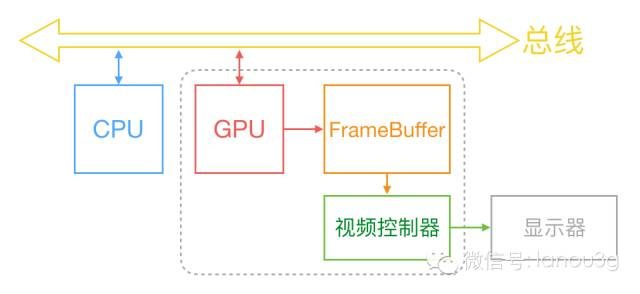
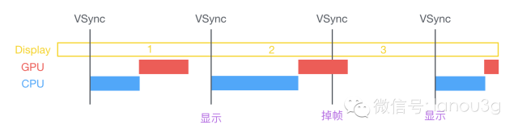

# 屏幕显示图像的原理

# 垂直同步信号和水平同步信号

首先从过去的 CRT 显示器原理说起。CRT 的电子枪按照上面方式，从上到下一行行扫描，扫描完成后显示器就呈现一帧画面，随后电子枪回到初始位置继续下一次扫描。

为了把显示器的显示过程和系统的视频控制器进行同步，显示器（或者其他硬件）会用硬件时钟产生一系列的定时信号。

当电子枪换到新的一行，准备进行扫描时，显示器会发出一个水平同步信号（horizonal synchronization），简称 **HSync；**

而当一帧画面绘制完成后，电子枪回复到原位，准备画下一帧前，显示器会发出一个垂直同步信号（vertical synchronization），简称 VSync。

显示器通常以固定频率进行刷新，这个刷新率就是 **VSync** 信号产生的频率。

尽管现在的设备大都是液晶显示屏了，但原理仍然没有变。

通常来说，计算机系统中 CPU、GPU、显示器是以上面这种方式协同工作的。

- CPU：在 VSync 信号到来后，系统图形服务会通过 CADisplayLink 等机制通知 App，App 主线程开始在 CPU 中计算显示内容，比如视图的创建、布局计算、图片解码、文本绘制等。随后 CPU 会将需要绘制纹理图片通过数据总线交给 GPU。
- GPU：纹理混合、顶点变换与计算、像素点的填充计算、将渲染结果放入帧缓冲区。等待下一次 VSync 信号到来时显示到屏幕上。
- Frame Buffer：帧缓存区。（两个缓存区，来回的切换，性能加强。）
- Video Controller（视频控制器）：随后视频控制器会按照 VSync 信号逐行读取帧缓冲区的数据，经过可能的数模转换传递给显示器显示。
- Monitor（显示器）：进行显示。
- 时钟信号：垂直同步信号 V-Sync / 水平同步信号 H-Sync
- iOS 设备双缓冲机制：显示系统通常会引入两个帧缓冲区，双缓冲机制

# 双缓冲区Frame Buffer

在最简单的情况下，帧缓冲区只有一个，这时帧缓冲区的读取和刷新都都会有比较大的效率问题。

为了解决效率问题，显示系统通常会引入两个缓冲区，即双缓冲机制。

在这种情况下，GPU 会预先渲染好一帧放入一个缓冲区内，让视频控制器读取，当下一帧渲染好后，GPU 会直接把视频控制器的指针指向第二个缓冲器。

**如此一来效率会有很大的提升。**

双缓冲虽然能解决效率问题，但会引入一个新的问题：屏幕撕裂。

# 屏幕撕裂

现象：显示的过程 上半部分和下半部分断层脱节

当视频控制器还未读取完成时，即屏幕内容刚显示一半时，GPU 将新的一帧内容提交到帧缓冲区并把两个缓冲区进行交换后，视频控制器就会把新的一帧数据的下半段显示到屏幕上，造成画面撕裂现象，如下图：

单一缓存模式下（CPU->内存->GPU（帧缓冲区））CPU和GPU协作过程中，新的数据就来了，新一帧的数据覆盖了上一帧数据。

解决：通过双缓冲区的交替解决和垂直同步信号机制。

# 垂直同步信号

为了防止在绘制某一帧数据的时候，新一帧数据的影响，GPU 通常有一个机制叫做垂直同步（V-Sync）。某一帧数据没有渲染完最后一个像素，不会发垂直同步信号。显示器发垂直同步信号表明这次绘制完成，才开始下一帧的渲染和缓冲区更新。

这样能解决画面撕裂现象，也增加了画面流畅度，但需要消费更多的计算资源，也会带来部分延迟。

# 卡顿掉帧原理和解决方案

**界面卡顿的原因：**

要显示新的一帧，由于垂直同步的机制，如果在一个 VSync 时间内，CPU 或者 GPU 没有完成内容提交，则那一帧就会被丢弃，缓冲区还是旧的一帧，重复的显示旧帧。

从上面的图中可以看到，CPU 和 GPU 不论哪个阻碍了显示流程，都会造成掉帧现象。所以开发时，也需要分别对 CPU 和 GPU 压力进行评估和优化。

卡顿原因：任务量超过硬件CPU GPU能力，CPU/GPU渲染计算耗时较长导致掉帧。

1秒60帧。屏幕高刷120帧。

解决：

1. 建议降低界面复杂度。层级少。

2. 通过垂直同步信号和双缓存，强制同步屏幕刷新

   代价：屏幕撕裂，掉帧

### **GPU 资源消耗原因和解决方案**

相对于 CPU 来说，GPU 能干的事情比较单一：接收提交的纹理（Texture）和顶点描述（三角形），应用变换（transform）、混合并渲染，然后输出到屏幕上。

通常你所能看到的内容，主要也就是**纹理（图片）和形状（三角模拟的矢量图形）**两类。

**纹理的渲染**

所有的 Bitmap，包括图片、文本、栅格化的内容，最终都要由内存提交到显存，绑定为 GPU Texture。

不论是提交到显存的过程，还是 GPU 调整和渲染 Texture 的过程，都要消耗不少 GPU 资源。

当在较短时间显示大量图片时（比如 TableView 存在非常多的图片并且快速滑动时），CPU 占用率很低，GPU 占用非常高，界面仍然会掉帧。

避免这种情况的方法只能是尽量**减少在短时间内大量图片的显示，尽可能将多张图片合成为一张进行显示**。

当图片过大，超过 GPU 的最大纹理尺寸时，图片需要先由 CPU 进行预处理，这对 CPU 和 GPU 都会带来额外的资源消耗。

目前来说，iPhone 4S 以上机型，纹理尺寸上限都是 4096x4096

**所以，尽量不要让图片和视图的大小超过这个值。**

**视图的混合 (Composing)**

当多个视图（或者说 CALayer）重叠在一起显示时，GPU 会首先把他们混合到一起。如果视图结构过于复杂，混合的过程也会消耗很多 GPU 资源。

为了减轻这种情况的 GPU 消耗，应用应当尽量**减少视图数量和层次**，并在不透明的视图里标明 opaque 属性以避免无用的 Alpha 通道合成。

当然，这也可以用上面的方法，**把多个视图预先渲染为一张图片来显示**。

**图形的生成。**

CALayer 的 border、圆角、阴影、遮罩（mask），CASharpLayer 的矢量图形显示，通常会触发离屏渲染（offscreen rendering），而离屏渲染通常发生在 GPU 中。

当一个列表视图中出现大量圆角的 CALayer，并且快速滑动时，可以观察到 GPU 资源已经占满，而 CPU 资源消耗很少。

这时界面仍然能正常滑动，但平均帧数会降到很低。为了避免这种情况，可以尝试开启 CALayer.shouldRasterize 属性，但这会把原本离屏渲染的操作转嫁到 CPU 上去。

对于只需要圆角的某些场合，也可以用一张已经绘制好的圆角图片覆盖到原本视图上面来模拟相同的视觉效果。

最彻底的解决办法，就是**把需要显示的图形在后台线程绘制为图片**，避免使用圆角、阴影、遮罩等属性。