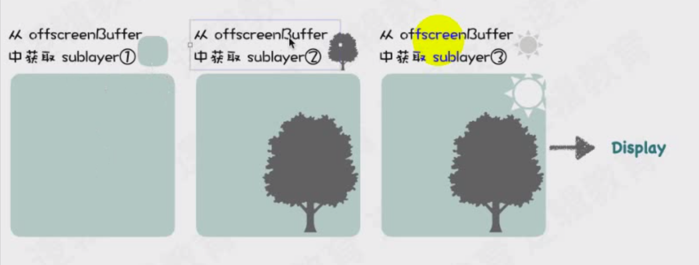

# CPU中央处理器单元

负责运算/控制核心

用处：

1. 逻辑性强的

图片的解码由CPU完成

# GPU图片处理单元

绘图计算 微处理器

1. 人脸识别 AVFoundation 硬件加速器就是GPU
2. 渲染视图view
3. 音视频开发 编码解码
4. Metal图形处理

用处：

1. 简单重复高并发的计算

CPU只负责解码，GPU负责计算。

CPU和GPU都有一个缓存区，GPU叫帧缓存区，GPU从帧缓冲区获取数据渲染。

# 图形显示过程

光栅扫描显示，通过图像的像素阵列组成。

一行一行的扫描

图像不是直接显示在屏幕上的，有一个帧缓冲区，帧缓存存储器。

## 帧缓冲区：

- 颜色缓存区
- 深度缓存区 （多个图片重叠，确定哪个显示在上面）

透明度：通过计算得到颜色，存放在帧缓存区中。

## 视频控制器：

视频控制器会把帧缓存区的数据显示在屏幕上。

# iOS下的渲染框架

## 核心动画

# 离屏渲染

离屏渲染检测：

模拟器 --- Debug --- Color Off-screen Rendered 可以查看哪些离屏渲染。

### 离屏渲染本质：

1. 普通渲染：帧缓冲区（必须存在）。
2. 离屏渲染：比普通渲染 多开辟**x个离屏渲染缓存区**（空间浪费，叠加计算），造成性能问题。

### 离屏渲染原因：

1. 没有办法通过普通渲染得到，会触发离屏渲染

   **无法一次性渲染解决问题，需要分步骤完成。**分步骤完成需要存储临时处理中间结果（离屏缓存区），然后合并（帧缓存区）。

2. 主动打开光栅化 shouldRasterize，如果复用的话可以离屏渲染

   shouldRasterize光栅化使用建议：

   - 如果layer不能被**复用**，则没有必要打开光栅化。
   - 如果layer不是**静态**的，需要被频繁修改（例：处于动画之中），那么开启离屏渲染反而影响效率。
   - 离屏渲染缓存内容有**时间限制**，缓存内容100ms内容如果没有被使用，那么它就会丢弃，无法进行复用了。
   - 离屏渲染缓存**空间有限**，超过2.5倍屏幕像素大小的话，也会失效，且无法进行复用了。

### 触发离屏渲染的几种情况：

1. 使用了mask的layer（layer.mask）
2. 需要进行裁剪的layer（layer.masksToBounds / view.clipsToBounds）
3. 设置了组透明度为YES，并且透明度不为1的layer（layer.allowsGroupOpacity / layer.opacity）
4. 添加了投影的layer（layer.shadow*）
5. 采用了光栅化的layer（layer.shouldRasterize）
6. 绘制了文字的layer（UILabel，CATextLayer，Core Text等）

圆角触发的离屏渲染

如果图片有三层，就会触发离屏渲染

1. 图片存在背景颜色
2. 图片层
3. border

从3个离屏缓存区获取图层，绘制圆角

**把最后的结果放到帧缓存区中。**

画家算法：先绘制离屏幕较远的图层，然后再绘制距离屏幕较近的图层（根据深度值，确定绘制的顺序）