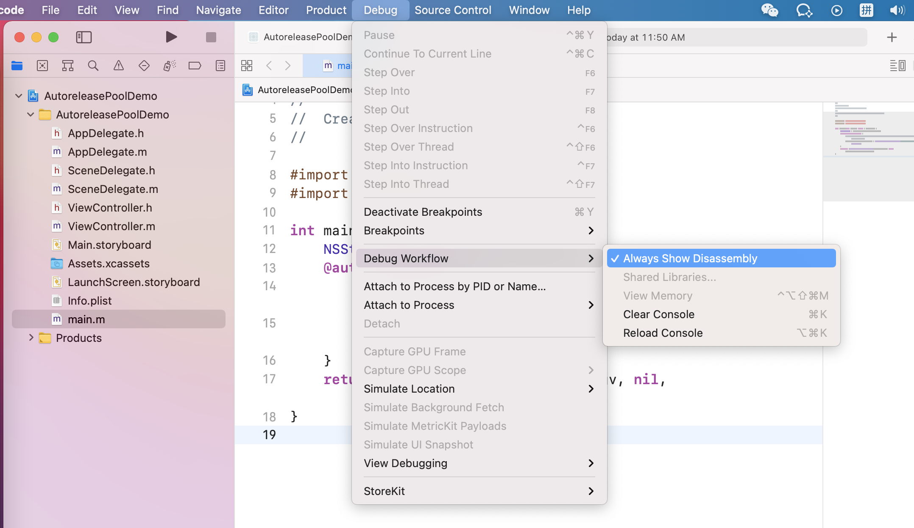

# 自动释放池

Autorelease Pool可以延后发送release消息给一个对象。相当于说这个对象在“一定时期”内都有效，“一定时期”后再release这个对象。

AutoreleasePool是OC中的⼀种内存⾃动回收机制，它可以延迟加⼊AutoreleasePool中的变量release的时机。在正常情况下，创建的变量会在超出其作⽤域的时候release，但是如果将变量加⼊AutoreleasePool，那么release将延迟执⾏。

## Autorelease Pool几个要点：

autorelease pool是一个NSAutoreleasePool对象。

程序里的所有autorelease pool是以桟（stack）的形式组织的。新创建的pool位于桟的最顶端。当发送autorelease消息给一个对象时，这个对象被加到栈顶的那个pool中。发送drain给一个pool时，这个pool里所有对象都会收到release消息，而且如果这个pool不是位于栈顶，那么位于这个pool“上端”的所有pool也会受到drain消息。

一个对象被加到一个pool很多次，只要多次发送autorelease消息给这个对象就可以；同时，当这个pool被回收时，这个对象也会收到同样多次release消息。简单地可以认为接收autorelease消息等同于：接收一个retain消息，同时加入到一个pool里；这个pool用来存放这些暂缓回收的对象；一旦这个pool被回收（drain），那么pool里面的对象会收到同样次数的release消息。

### 自动释放池是什么,如何工作

自动释放池是一个对象，对象的结构是

当向一个对象发送一个autorelease消息时，Cocoa就会将该对象的一个引用放入到最新的自动释放池。 它仍然是个正当的对象，因此**自动释放池定义的作用域内**的其它对象可以向它发送消息。当程序执行到作用域结束的位置时， 自动释放池就会被释放，池中的所有对象也就被释放

## autoreleasepool的创建和销毁时机

系统添加了两个Observer，它们都触发了`_wrapRunLoopWithAutoreleasePoolHandler`回调。

- <CFRunLoopObserver 0x60400013edc0>：activities = 0x1, repeats = Yes, order = -2147483647 它的**activities = 0x1**，而0x1转换为10进制1，表示监听的`kCFRunLoopEntry`
- `<CFRunLoopObserver 0x60400013ec80>`：activities = 0xa0, repeats = Yes, order = 2147483647  它的**activities = 0xa0**，而0xa0转换为10进制160，160其实是`kCFRunLoopBeforeWaiting` | `kCFRunLoopExit`，也就是32+128

第一个Observer监听`kCFRunLoopEntry`(即将进入RunLoop)其回调内会调用 `_objc_autoreleasePoolPush()` 创建自动释放池,其 order 是-2147483647，优先级最高，保证创建释放池发生在其他所有回调之前。

第二个 Observer 监视了`kCFRunLoopBeforeWaiting`（） 其回调内会调用`_objc_autoreleasePoolPop()` 和 `_objc_autoreleasePoolPush()` 释放旧的AutoreleasePool并创建新AutoreleasePool；`kCFRunLoopExit`(即将退出RunLoop) 其回调内会调用 `_objc_autoreleasePoolPop()`来释放自动释放池。这个 Observer 的 order 是 2147483647，优先级最低，保证其释放池子发生在其他所有回调之后。

```
自动释放池的创建和释放，销毁的时机如下所示：
kCFRunLoopEntry; // 进入runloop之前，创建一个自动释放池。每次开始runloop的时候创建哨兵对象。 
kCFRunLoopBeforeWaiting; // 休眠之前，销毁之前的自动释放池，创建一个新的自动释放池
kCFRunLoopExit; // 退出runloop之前，销毁自动释放池
```

autoreleasepool 是一个结构体，里面包含构造函数`autoreleasepoolPush` 与析构函数`autoreleasepoolPop`。

构造函数里面调用autoreleasePush操作，将autolease修饰的对象入栈到autoreleasepoolPage。

autoreleasepoolPage占用**4096**个字节，里面除了自己本身的变量，接下来就是存放autolease修饰的对象了。

每次写一个autoleasepool，那么首先就将autoleasepool的地址作为Pool_Boundary，入栈(当然了，是在runloop的observer检测到runloop状态为entry的时候)，然后将autolease修饰的对象入栈，放不下的话，新增一个autoreleasepoolPage，通过child指针指向下一页，就是一个双向链表。

在runloop状态变为 Beforwaiting的时候(将要休眠)做一次autoreleasepoolPop，找到autoreleasepoolPage，一层一层的做release操作，直到Pool_Boundary结束，然后在做一次autoreleasepoolPush。

runloop的observe检测到exit状态，做一次autoreleasepoolPop操作，满足内存管理的黄金法则。

关键词：autoreleasepoolPage autoreleasepoolPush autoreleasepoolPop
所以，要想彻底搞清楚，首先要搞懂Runloop，然后再去搞懂内存管理

具体什么时候释放可以和RunLoop一起答

### 什么时候用@autoreleasepool

UIKit框架已经帮你自动创建一个autorelease pool。大部分时候，可以直接使用这个pool，不必自己创建；所以给一个对象发送autorelease消息，那么这个对象会加到这个UIKit自动创建的pool里。

某些时候，可能需要创建一个pool：

1. 写基于命令行的的程序时，就是没有UI框架，如AppKit等Cocoa框架时。
2. 写循环，循环里面包含了大量临时创建的对象。那么创建自己的pool可以减少程序占用的内存峰值。（如果使用UIKit的pool，那么这些临时变量可能一直在这个pool里，只要这个pool受到drain消息；完全不使用autorelease pool应该也是可以的，可能只是要发一些release消息给这些临时变量，所以使用autorelease pool还是方便一些）
3. 创建了新的线程。（非Cocoa程序创建线程时才需要）,子线程runloop默认不启动，所以不会开启一个autoreleasePool，需要手动启动或者添加。
4. 长时间在后台运行的任务。

使用alloc和init消息来创建pool，发送drain消息则表示这个pool不再使用。pool的创建和drain要在同一上下文中，比如循环体内。

### @autoreleasepool底层原理

思路

1. clang 形成中间形态cpp，查看底层本质

clang -rewrite-objc main.m -o main.cpp

```c++
int main(int argc, char * argv[]) {
    /* @autoreleasepool */ {
        __AtAutoreleasePool __autoreleasepool;
    }
    return 0;
}
```

`@autoreleasepool`变成了下面：

```c++
    /* @autoreleasepool */ {
        __AtAutoreleasePool __autoreleasepool;
    }
```

上面代码相当于__AtAutoreleasePool构造函数，出了作用域就调用__AtAutoreleasePool析构函数。

__AtAutoreleasePool是一个结构体

```c++
struct __AtAutoreleasePool {
  //构造函数
  __AtAutoreleasePool() {atautoreleasepoolobj = objc_autoreleasePoolPush();}
  //析构函数
  ~__AtAutoreleasePool() {objc_autoreleasePoolPop(atautoreleasepoolobj);}
  //成员变量
  void * atautoreleasepoolobj;
};
```

`__AtAutoreleasePool __autoreleasepool; `

等价于下面两行

```c++
  __AtAutoreleasePool() {atautoreleasepoolobj = objc_autoreleasePoolPush();}
  ~__AtAutoreleasePool() {objc_autoreleasePoolPop(atautoreleasepoolobj);}
```

`objc_autoreleasePoolPush()`和`objc_autoreleasePoolPop(atautoreleasepoolobj)两个`方法

2. 汇编

先打断点然后设置



3. 程序员的自我修养（书籍）

#### 入栈push

objc_autoreleasePoolPush底层源码

```c++
void *
objc_autoreleasePoolPush(void)
{
    return AutoreleasePoolPage::push();
}
```

push函数

```c++
    static inline void *push() 
    {
        id *dest;
        if (slowpath(DebugPoolAllocation)) {//debug模式 慢速
            // Each autorelease pool starts on a new pool page.
            //添加创建内存页
            dest = autoreleaseNewPage(POOL_BOUNDARY);
        } else {//快速
            dest = autoreleaseFast(POOL_BOUNDARY);
        }
        ASSERT(dest == EMPTY_POOL_PLACEHOLDER || *dest == POOL_BOUNDARY);
        return dest;
    }
```

添加创建内存页debug模式 慢速（不重要）

```c++
    static __attribute__((noinline))
    id *autoreleaseNewPage(id obj)
    {
        AutoreleasePoolPage *page = hotPage();
        if (page) return autoreleaseFullPage(obj, page);
        else return autoreleaseNoPage(obj);//创建NoPage页面
    }
```

快速（重要）

```c++
    static inline id *autoreleaseFast(id obj)
    {
        AutoreleasePoolPage *page = hotPage();
        if (page && !page->full()) {//如果有页面了，并且没有满 就add
            return page->add(obj);
        } else if (page) {//有页面 但是满了
            return autoreleaseFullPage(obj, page);
        } else {//没有页面 就创建
            return autoreleaseNoPage(obj);
        }
    }
```

add

next指针不断的平移

```c++
    id *add(id obj)
    {
        ASSERT(!full());
        unprotect();
        id *ret = next;  // faster than `return next-1` because of aliasing
        *next++ = obj;//nexi指针不断的平移，把obj放进去。
        protect();
        return ret;
    }
```

autoreleaseFullPage满了

```c++
    static __attribute__((noinline))
    id *autoreleaseFullPage(id obj, AutoreleasePoolPage *page)
    {
        // The hot page is full. 
        // Step to the next non-full page, adding a new page if necessary.
        // Then add the object to that page.
        ASSERT(page == hotPage());
        ASSERT(page->full()  ||  DebugPoolAllocation);
        //循环 递归 找到最后一个子页面 然后添加newPage
        do {
            if (page->child) page = page->child;
            else page = new AutoreleasePoolPage(page);
        } while (page->full());

        setHotPage(page);
        return page->add(obj);
    }
```

创建一个AutoreleasePoolPage

```c++
    static __attribute__((noinline))
    id *autoreleaseNoPage(id obj)
    {

      /*
      省略代码
      */

        // Install the first page.
        AutoreleasePoolPage *page = new AutoreleasePoolPage(nil);//创建 初始化
        setHotPage(page);//设置活动页面
        
        // Push a boundary on behalf of the previously-placeholder'd pool.
      	//添加哨兵对象，边界
        if (pushExtraBoundary) {
            page->add(POOL_BOUNDARY);
        }
        
        // Push the requested object or pool.
     	  //添加要释放的对象
        return page->add(obj);
    }
```


AutoreleasePoolPage构造函数初始化，底层调的AutoreleasePoolPageData

打印AutoreleasePoolPage的sizeof是56，AutoreleasePoolPageData的成员变量下面会有讲解。

自动释放池有很多页。上面是成员变量，下面是压栈的对象。第一个对象是哨兵对象。之后进行压栈对象。

为什么要分页：

压栈出栈频繁，如果是整个页面，所有对象都在一页里，操作繁杂度大，管理不便利。（例：公司老总管理所有的员工不方便，让几个leader去管理）。如果局部发生问题，整个都会受影响，分页影响小。

分页的话，内存可以不连续。利用率效率大。

分页：

测试：自动释放池加505个NSObject对象，分页了，当前页为hot。加504个对象就满了。

一页的大小：505*8+56=4096。2的12次方，1024乘以4等于4K。504个对象和一个哨兵对象。AutoreleasePoolPage类定义里面有SIZE

第一页满了之后，后面新增页，新增页没有哨兵对象。只有第一页有一个哨兵对象。

```c++
	AutoreleasePoolPage(AutoreleasePoolPage *newParent) :
		AutoreleasePoolPageData(begin(),/*begin()从56开始，自动释放池自身成员变量56，要从下面开始*/
								objc_thread_self(),/*线程*/
								newParent,
								newParent ? 1+newParent->depth : 0,/*深度加1*/
								newParent ? newParent->hiwat : 0)
    { 
        if (parent) {//双向链表
            parent->check();
            ASSERT(!parent->child);
            parent->unprotect();
            parent->child = this;
            parent->protect();
        }
        protect();
    }
```

#### 出栈pop

```
NEVER_INLINE
void
objc_autoreleasePoolPop(void *ctxt)
{
    AutoreleasePoolPage::pop(ctxt);
}
```

是否是hotPage页面，不断的移出去进行调整。

```c++
    static inline void
    pop(void *token)
    {
        AutoreleasePoolPage *page;
        id *stop;
        if (token == (void*)EMPTY_POOL_PLACEHOLDER) {
            // Popping the top-level placeholder pool.
            page = hotPage();//是否是hotPage页面，
            if (!page) {
                // Pool was never used. Clear the placeholder.
                return setHotPage(nil);
            }
            // Pool was used. Pop its contents normally.
            // Pool pages remain allocated for re-use as usual.
            page = coldPage();
            token = page->begin();
        } else {
            page = pageForPointer(token);
        }

        stop = (id *)token;
        if (*stop != POOL_BOUNDARY) {
            if (stop == page->begin()  &&  !page->parent) {
                // Start of coldest page may correctly not be POOL_BOUNDARY:
                // 1. top-level pool is popped, leaving the cold page in place
                // 2. an object is autoreleased with no pool
            } else {
                // Error. For bincompat purposes this is not 
                // fatal in executables built with old SDKs.
                return badPop(token);
            }
        }

        if (slowpath(PrintPoolHiwat || DebugPoolAllocation || DebugMissingPools)) {
            return popPageDebug(token, page, stop);
        }

        return popPage<false>(token, page, stop);
    }
```

先拿到parent，因为把当前页移除kill，parent就成为了hot页面。把parent设置为hotPage。

kill方法是把栈中的置为nil，先入后出，栈结构。

判断是否都移除：是否等于哨兵边界。

```c++
    template<bool allowDebug>
    static void
    popPage(void *token, AutoreleasePoolPage *page, id *stop)
    {
        if (allowDebug && PrintPoolHiwat) printHiwat();

        page->releaseUntil(stop);

        // memory: delete empty children
        if (allowDebug && DebugPoolAllocation  &&  page->empty()) {
            // special case: delete everything during page-per-pool debugging
            AutoreleasePoolPage *parent = page->parent;
            page->kill();
            setHotPage(parent);
        } else if (allowDebug && DebugMissingPools  &&  page->empty()  &&  !page->parent) {
            // special case: delete everything for pop(top)
            // when debugging missing autorelease pools
            page->kill();
            setHotPage(nil);
        } else if (page->child) {
            // hysteresis: keep one empty child if page is more than half full
            if (page->lessThanHalfFull()) {
                page->child->kill();
            }
            else if (page->child->child) {
                page->child->child->kill();
            }
        }
    }
```

### AutoreleasePoolPageData

```c++
/***********************************************************************
   Autorelease pool implementation

   A thread's autorelease pool is a stack of pointers. 
   Each pointer is either an object to release, or POOL_BOUNDARY which is 
     an autorelease pool boundary.
   A pool token is a pointer to the POOL_BOUNDARY for that pool. When 
     the pool is popped, every object hotter than the sentinel is released.
   The stack is divided into a doubly-linked list of pages. Pages are added 
     and deleted as necessary. 
   Thread-local storage points to the hot page, where newly autoreleased 
     objects are stored. 
**********************************************************************/
/*
中文注释：
是一个栈的结构，自动释放池跟线程有关系，也会跟runloop有关系。
自动释放池管理的是对象。
自动释放池会为运行循环产生的对象进行管理。运行循环的一些状态会管理自动释放池是否清理对象。
POOL_BOUNDARY：哨兵对象，自动释放池边界。自动释放池就是不断的压栈出栈，不能无限制的出栈，需要有一个边界。如果没有边界，就会破坏别人的结构。可能释放多，访问就会出现野指针。防止出现错误。添加对象从哪个地方开始添加，倾倒对象的时候倾倒到什么地方为止。因为内存是连续的，一直清理的话 可能把不应该清理的对象清理了。会发生内存结构不完整。
hot页面：当前正在操作的页面。
stack栈绑定的是一个双向链表结构。是一个内存页的形式。所以自动释放池AutoreleasePoolPage是一个双向链表。
内存页的分页处理：整个内存是非常大的连续内存，获取的时候比较长，容易发生问题。为了降低风险，进行内存分页。
对对象的处理只对所在页有影响，不会影响其它页，影响小。
*/
class AutoreleasePoolPage : private AutoreleasePoolPageData
{
public://一页大小
  static size_t const SIZE =
#if PROTECT_AUTORELEASEPOOL
	PAGE_MAX_SIZE;  // must be multiple of vm page size
#else
  PAGE_MIN_SIZE;  // size and alignment, power of 2
#endif
  
	//中间代码省略
}
```

哨兵对象也是一个对象。

初始化

```c++
class AutoreleasePoolPage;
struct AutoreleasePoolPageData
{
	magic_t const magic;//16字节 是一个结构体 依赖里面成员变量的大小
	__unsafe_unretained id *next;//指针8个字节
	pthread_t const thread;//8个字节
	AutoreleasePoolPage * const parent;//8个字节
	AutoreleasePoolPage *child;//8字节
	uint32_t const depth;//4个字节
	uint32_t hiwat;//4个字节

  //构造函数
	AutoreleasePoolPageData(__unsafe_unretained id* _next, pthread_t _thread, AutoreleasePoolPage* _parent, uint32_t _depth, uint32_t _hiwat)
		: magic(), next(_next), thread(_thread),
		  parent(_parent), child(nil),
		  depth(_depth), hiwat(_hiwat)
	{
	}
};
```

解释：

- magic用来校验AutoreleasePoolPage的结构是否完整
- next指向最新添加的autoreleased对象的下一个位置，初始化时指向begin
- thread指向当前线程
- parent指向父节点，第一个节点的parent值为nil
- child指向子节点，最后一个节点的child值为nil
- depth代表深度，从0开始，往后递增1。多少页。
- hiwat代表high water mark 最大入栈数量标记

### ARC设置MRC

关闭ARC


### 面试题

1. 临时变量什么时候释放

   作用域的范围

2. 自动释放池能否嵌套使用

   可以

MRC加了autorelease的才会加入autoreleasePool

ARC不需要加autorelease

alloc new copy mutablecopy为前缀，llvm编译不会加入自动释放池
