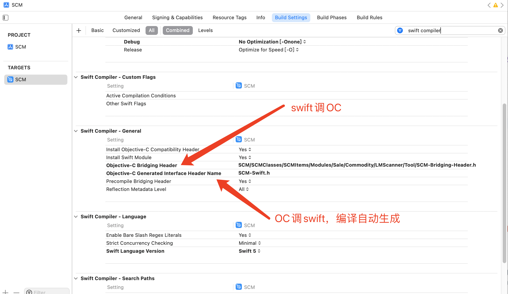
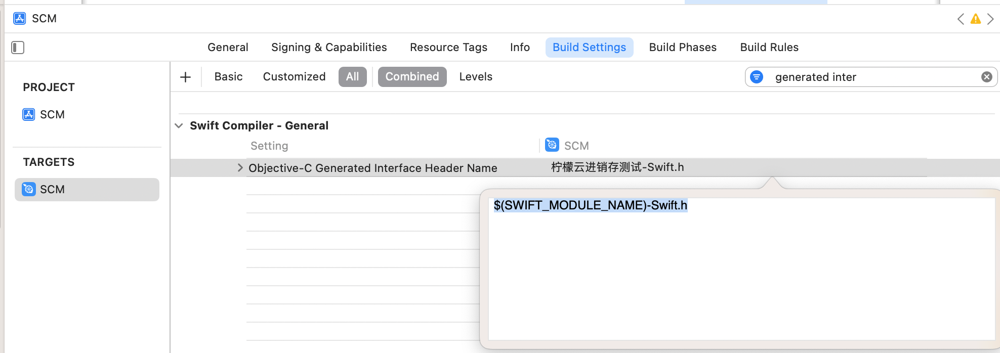

# OC和swift混编

## swift调OC

Swift项目创建OC文件。使用`项目名-Bridging-Header.h`桥接文件。一组暴露给swift的头文件。类似散头文件，通过一个头文件映射一组头文件。

`项目名-Bridging-Header.h`桥接文件中引入OC头文件用`#import`，引入C头文件用`#include`。

swift的framework默认创建了一个散头文件module.modulemap。

TRAGETS --> Build Setting --> Objective-C Bridging Header



### 1、OC的Block和Swift的闭包相互调用 

我们在OC中定义的Block，在Swift中是如何调用的那？我们来看一下 

#### OC

HHTestOC.h

```objective-c
#import <Foundation/Foundation.h>

NS_ASSUME_NONNULL_BEGIN

typedef void(^ResultBlock)(NSError *error);

@interface HHTestOC : NSObject

+ (void)testBlockCall:(ResultBlock)block;

@end

NS_ASSUME_NONNULL_END
```

HHTestOC.m

```objective-c
#import "HHTestOC.h"

@implementation HHTestOC

+ (void)testBlockCall:(ResultBlock)block {
    NSError *error = [NSError errorWithDomain:NSURLErrorDomain code:400 userInfo:nil];
    block(error);
}

@end
```

#### swift

```swift
func swiftOC() {
    HHTestOC.testBlockCall{ error in
        let errorcast = error as NSError
    }
}
```

### 2、Swift调用C

HHTestC.h

```c
#ifndef HHTestC_h
#define HHTestC_h

#include <stdio.h>

int lg_add(int a, int b);//暴露

int TesctCFUnction(int callBack(int a, int b));

#endif /* HHTestC_h */
```

HHTestC.c

```c
#include "HHTestC.h"

int lg_add(int a, int b){
    return a + b;
}

int TesctCFUnction(int callBack(int a, int b)){
    return callBack(10, 20);
}
```

swift调用C/C++

```swift
// MARK: swift调用C
// 方法一：
var value = lg_add(10, 20)

// 方法二：符号映射。
// 编译器字段 @_silgen_name ,其实是Swift的⼀个隐藏符号，作⽤是将某个C/C++语⾔ 函数直接映射为Swift函数。
// lg_add映射为swift_lg_add
@_silgen_name("lg_add")
func swift_lg_add(a: Int32, b: Int32) -> Int32
var value1 = swift_lg_add(a: 10, b: 20)
```

swift

```swift
func swiftC() {
    //方式一
    TesctCFUnction{(a: Int32, b: Int32) -> Int32 in
        return a + b
    }
    // 方式二
    let closure: @convention(c)(Int32, Int32) -> Int32 = {(a: Int32, b: Int32) -> Int32 in
        return a + b
    }
    let result = TesctCFUnction(closure)
}
```

### @convention ： 用于修饰函数类型 

- 修饰Swift中的函数类型（调用 C 函数的时候） 
- 调用 OC 方法是，修饰 Swift 函数类型 

## OC调swift

通过`项目名 -Swift.h`文件。把swift代码翻译了头文件。编译的时候放到macho中变成OC符号。

名字可以修改，例：`SCM-Swift.h`。

OC调用的时候`#import <SCM-Swift.h>`引入头文件即可。



注：

不继承NSObject的纯swift类不能被OC所访问

swift中的属性和方法如果需要给OC使用，需要前面加`@objc`修饰。（用@objcMembers直接修饰在class前面，系统会自自动给class对象的属性、方法前面添加@objec来表明它们是可以被OC访问的。）

### OC调用swift的enum

必须定义出`Int`类型，前面加`@objc`才能调用(毕竟swift的枚举比OC强大太多)

```java
@objc enum CPLineType: Int {
case schoolToHome = 0
case homeToSchool
case return
}
```

### Subclass

对于自定义的类而言，Objective-C 的类，不能继承自 Swift 的类， Swift 类可以继承自 OC 的类。
