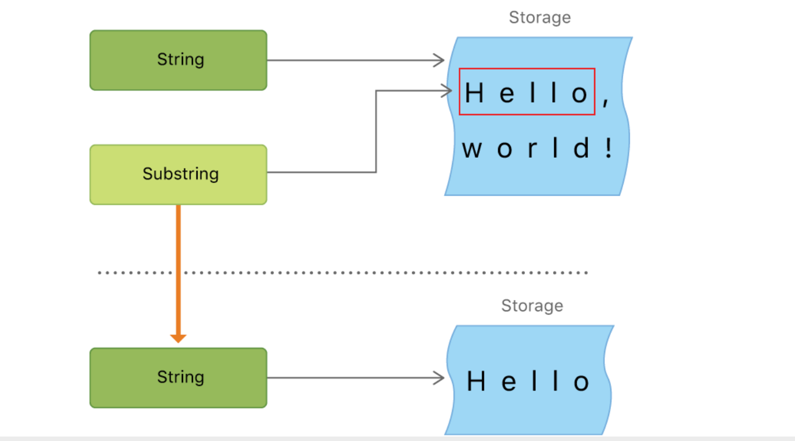

# 数据类型

## String

### 初始化

```swift
///字面量
var emptyStr = ""
///初始化器
var anotherEmptyStr = String()

///是否为空串
if emptyStr.isEmpty {
}
```

### 内存存储

```swift
//变量内存地址，查看内存地址存的内容
//小字符串
var empty = "asd"
print(empty)//对于小字符串，优先直接存在内存地址里面。针对英文总共能存F（15）个字符串

//大字符串
//原生字符串  地址信息+偏移量=字符串的信息
var str = "fjdksljfdsklfjdsfjhgjkhjkgsd"
```

### 字面量

```swift
///字符串字面量是被双引号包裹的固定顺序文本字符，swift会为str常量推断类型为String
let str = "some string"

///多行字面量
///多行字面量是用三个双引号扩起来的一系列字符
///多行字符串字面量把所有行包括在引号内，开始和结束默认不会有换行符
///行的末尾加反斜杠（\）就会显示行
let softWrappedQuotation = """

the wihdkjsf;klj, "fdskl
fdsf?" fkjld. \

"fkdsl;"
"""
print(softWrappedQuotation)
```

### 字符串插值

- 字符串插值是一种从混合常量、变量、字面量和表达式的字符串字面量构造新 String 值的方法

- 每一个你插入到字符串字面量的元素都要被**一对圆括号包裹，然后使用反斜杠前缀**

- 类似于 NSString 的 stringWithFormat 方法，但是更简便，更强大

```swift
let multiplier = 3
let message = "\(multiplier) times 2.5 is \(Double(multiplier) * 2.5)"
print(message)//3 times 2.5 is 7.5
```

### 字符串索引

- 每一个 String 值都有相关的索引类型， String.Index，它相当于每个 Character 在字符串中的位置
- startIndex 属性来访问 String 中第一个 Character 的位置。 
- endIndex 属性就是 String中最后一个字符后一个的位置，endIndex 属性并不是字符串下标脚本的合法实际参数
- 如果 String 为空，则 startIndex 与 endIndex 相等
- 使用 index(before:) 和 index(after:) 方法来访问给定索引的前后
- 访问给定索引更远的索引，可以使用index(_:offffsetBy:)
- 使用 indices 属性来访问字符串中每个字符的索引

```swift
// MARK: String.Index 因为存储的字符是变长的，步长不一样。int和汉字不一样
var str1 = "Hello hsf"
print(str1.index(str1.startIndex, offsetBy: 1))//输出index Index类型
print(str1[str1.index(str1.startIndex, offsetBy: 1)])//输出e
print(str1[str1.index(str1.endIndex, offsetBy: -1)])//输出最后一个字符
//Index和startIndex本质 64位的位域信息
//1. encodedOffset:偏移
//2. transcoded offset
```

```swift
let greeting = "Guten Tag!"
print(greeting[greeting.startIndex])//G
print(greeting[greeting.index(before: greeting.endIndex)])//!
print(greeting[greeting.index(after: greeting.startIndex)])//u
let index = greeting.index(greeting.startIndex, offsetBy: 7)
print(greeting[index])//a
```

### 插入insert

- 插入字符，使用 insert(_:at:) 方法
- 插入另一个字符串的内容到特定的索引，使用 insert(contentsOf:at:) 方法

```swift
var welcome = "hello"
welcome.insert("!", at: welcome.endIndex)
welcome.insert(contentsOf: " there", at: welcome.index(before: welcome.endIndex))
```

### 删除remove

• 移除字符，使用 remove(at:)方法

• 移除一小段特定范围的字符串，使用 removeSubrange(_:) 方法

```swift
welcome.remove(at: welcome.index(before: welcome.endIndex))//删除最后一个字符
print(welcome)//hello there
let range = welcome.index(welcome.endIndex, offsetBy: -6)..<welcome.endIndex
welcome.removeSubrange(range)
print(welcome)//hello
```

### Substring子字符串

- 使用下标或者类似 prefifix(_:) 的方法得到的子字符串是 Substring 类型
- Substring 拥有 String 的大部分方法
- Substring 可以转成 String 类型
- 子字符串重用一部分原字符串的内存
- 修改字符串或者子字符串之前都不需要花费拷贝内存的代价
- String 和 Substring 都遵循 StringProtocol 协议，也就是说它基本上能很方便地兼容所有接受 StringProtocol 值的字符串操作函数



### 字符串是值类型

String 值在传递给方法或者函数的时候会被复制过去 

赋值给常量或者变量的时候也是一样

Swift 编译器优化了字符串使用的资源，实际上拷贝只会在确实需要的时候才进行

```swift
var str: String = "abc"
var str1 = str
print(str == str1)  //true
str += "def"
print(str)          //abcdef
print(str1)         //abc
print(str == str1)  //false
```

### 字符串比较

- 字符串和字符相等性(==和!=) 
- 前缀相等性 hasPrefix(_:) 
- 后缀相等性 hasSuffix(_:)

### `Character` 和 `String` 

`Character` 和 `String` 是两个不同的类型，分别用于表示单个字符和一系列字符。

#### `Character`

- **定义**：`Character` 表示单个字符，可以是一个字母、数字、符号或其他字符。
- **使用场景**：用于表示和操作单个字符。
- **存储**：`Character` 实际上是一个扩展的 Unicode 标量，可以表示任何有效的 Unicode 字符，包括由多个 Unicode 标量组成的字符（如一些 emoji）。
- **示例**：
  ```swift
  let char: Character = "A"
  let emoji: Character = "😊"
  ```

### `String`

- **定义**：`String` 表示一系列字符的集合，可以包含零个或多个字符。
- **使用场景**：用于表示和操作文本。
- **存储**：`String` 是一个复杂的数据结构，支持高效的字符串操作，包含 Unicode 编码和字符串操作优化。
- **示例**：
  
  ```swift
  let str: String = "Hello, World!"
  let emptyStr: String = ""
  ```

### 主要区别

1. **类型**：
   - `Character` 表示单个字符。
   - `String` 表示一系列字符。

2. **初始化**：
   - `Character` 只能用单个字符初始化。
   - `String` 可以用零个、一个或多个字符初始化。

3. **操作**：
   - `Character` 主要用于表示和操作单个字符。
   - `String` 提供了丰富的字符串操作方法，如拼接、分割、查找、替换等。

### 示例对比

1. **定义和初始化**：
   
   ```swift
   let char: Character = "A"          // 单个字符
   let emoji: Character = "😊"        // 单个 emoji
   
   let str: String = "Hello"          // 字符串
   let emptyStr: String = ""          // 空字符串
   ```
   
2. **字符串拼接**：
   ```swift
   let firstChar: Character = "H"
   let secondChar: Character = "i"
   let combinedStr: String = String(firstChar) + String(secondChar)  // "Hi"
   ```

3. **字符遍历**：
   ```swift
   let greeting: String = "Hello"
   for char in greeting {
       print(char)  // 依次打印 "H", "e", "l", "l", "o"
   }
   ```

4. **检查字符是否在字符串中**：
   ```swift
   let searchStr: String = "Hello, World!"
   let searchChar: Character = "W"
   let containsChar = searchStr.contains(searchChar)  // true
   ```

### 总结

- 使用 `Character` 来表示和操作单个字符。
- 使用 `String` 来表示和操作一系列字符或文本。

## Tuple

元组可以存储固定数量的各种类型的元素，而不需要创建自定义类。

元组把多个值合并成单一的复合型的值

元组内的值可以是任何类型，并且不必是同一类型

```swift
//定义一个error错误
let error = (1, "没有权限")
print(error.0)
print(error.1)
```

### 元素命名

元组中的每一个元素可以指定对应的元素名称

如果没有指定名称的元素也可以使用下标的方式来引用

```swift
let error = (errorCode: 1, errorMessage: "没有权限")
print(error.errorCode)
print(error.errorMessage)
```

### Tuple修改

用var定义的元组是可变元组，let定义的是不可变元组

无论是可变还是不可变元组，元组在创建后就不能增加和删除元素

可以对可变元组的元素进行修改，但是不能改变其类型

any类型可以改为任意类型

```swift
var error: (Any, String) = (1, "没有权限")
error.0 = 2
print(error)
error.0 = "adc"
print(error)	
```

```swift
var error: (errorCode: Int, errorMessage: Any) = (errorCode: 1, errorMessage: "没有权限")
error.errorCode = 2
print(error)
error.errorMessage = 3
print(error)
```

### Tuple分解

可以将一个元组的内容分解成单独的常量或变量

如果只需要使用其中的一部分数据，不需要的数据可以用下划线`_`代替

```swift
let error = (1, "没有权限")
let (_, errorMessage) = error
print(errorMessage)
```

### Tuple作为函数返回值

返回值的Tuple可以在函数的返回类型部分被命名

```swift
func writeToFile(conent: String) -> (errorCode: Int, errorMessage: String) {
  return (1, "没有权限")
}
```

## Array

### 创建数组

#### 字面量创建

```swift
let array = [1, 2, 3, 4]
```

字面量创建空数组

创建空数组的时候必须携带类型信息

如果内容已经提供了类型信息，比如说作为函数的实际参数或者已经分类了的变量或常量，你可以通过空数组字面量来创建一个空数组

```swift
let array = []//报错：Empty collection literal requires an explicit type
```

#### 初始化器

使用初始化器有两种方式

- `[类型]()`
- `Array<类型>()`

```swift
var myArray = [String]()
var myArray2 = Array<String>()
```

##### 初始化器参数

```swift
let fiveZs = Array(repeating: "Z", count: 5)
print(fiveZs)//["Z", "Z", "Z", "Z", "Z"]

let numbers = [Int](0...7)
print(numbers)//[0, 1, 2, 3, 4, 5, 6, 7]

let persons = ["zhangsan" : 27, "lisi" : 28, "wangwu" : 29]
let names = [String](persons.keys)
print(names)//["lisi", "wangwu", "zhangsan"]
```

### 数组遍历

#### forEach

无法使用 break 或 continue 跳出或者跳过循环

使用 return 只能退出当前一次循环的执行体

```swift
let numbers = [Int](0...7)
numbers.forEach { num in
	if num == 3 {
		break//报错：Unlabeled 'break' is only allowed inside a loop or switch, a labeled break is required to exit an if or do
	}
	print(num * 10)
}


let numbers = [Int](0...7)
numbers.forEach { num in
	if num == 3 {
		return
	}
	print(num * 10)//0 10 20 40 50 60 70
}
```

##### 使用$0

```swift
cell.contentView.subviews.forEach { $0.removeFromSuperview() }
```

#### For-In 同时得到索引和值 enumerated()

```swift
let numbers = [Int](2...7)
for (index, num) in numbers.enumerated() {
  print("the index is: \(index)")
  print(num * 10)
}
```

#### 使用 Iterator 遍历数组

```swift
let numbers = [Int](2...7)
var numIterator = numbers.makeIterator()
while let num = numIterator.next() {
  print(num * 10)
}
```

### 索引

- startIndex 返回第一个元素的位置，对于数组来说，永远都是 0。
- endIndex 返回最后一个元素索引 +1 的位置，对于数组来说，等同于count 。
- 如果数组为空，startIndex 等于 endIndex 。

#### indices 获取数组的索引区间

```swift
let numbers = [Int](2...7)
for i in numbers.indices {
  print(numbers[i])
}
```

### contains判断是否包含指定元素

contains(_:) 判断数组是否包含给定元素

contains(where:) 判断数组是否包含符合给定条件的元素

### 判断所有元素是否符合某个条件

• allSatisfy(_:) 判断数组的每一个元素都符合给定的条件

```swift
let array = [10, 20, 45, 30, 98, 101, 30, 4]
print(array.allSatisfy({ $0 > 10 }))//false
print(array.allSatisfy({ $0 >= 4 }))//true
```

### 查找元素

- first 返回数组第一个元素（optional），如果数组为空，返回 nil 。
- last 返回数组最后一个元素（optional），如果数组为空，返回 nil。
- first(where:) 返回数组第一个符合给定条件的元素（optional）。
- last(where:) 返回数组最后一个符合给定条件的元素（optional）。

```swift
let array = [10, 20, 45, 30, 98, 101, 30, 4]
print(array.first)//Optional(10)
print(array.last)//Optional(4)
print(array.first(where: { $0 > 25 }))//Optional(45)
print(array.last(where: { $0 > 25 }))//Optional(30)
```

### 查找索引

- firstIndex(of:) 返回给定的元素在数组中出现的第一个位置（optional） 
- lastIndex(of:) 返回给定的元素在数组中出现的最后一个位置（optional）

```swift
var array = [10, 20, 45, 30, 98, 101, 30, 4]
print(array.firstIndex(of: 30))//Optional(3)
print(array.lastIndex(of: 20))//Optional(1)
```

- firstIndex(where:) 返回符合条件的第一个元素的位置（optional）
- lastIndex(where:) 返回符合条件的最后一个元素的位置（optional）

```swift
var array = [10, 20, 45, 30, 98, 101, 30, 4]
print(array.firstIndex(where: { $0 > 25 }))//Optional(2)
print(array.lastIndex(where: { $0 > 25 }))//Optional(6)
```

### 查找最大最小元素

- min() 返回数组中最小的元素
- max() 返回数组中最大的元素
- min(by:) 利用给定的方式比较元素并返回数组中的最小元素
- max(by:) 利用给定的方式比较元素并返回数组中的最大元素

```swift
var array = [(45,"error1"),(23,"error2"),(30,"error3")]
print(array.min { a, b in a.0 < b.0 })	//Optional((23, "error2"))
print(array.max { a, b in a.0 < b.0 })	//Optional((45, "error1"))
```

### append

- append(_:) 在末尾添加一个元素
- append(contentsOf: ) 在末尾添加多个元素

```swift
var array = [Int](2...7)
array.append(100)
array.append(contentsOf: 200...204)
print(array)//[2, 3, 4, 5, 6, 7, 100, 200, 201, 202, 203, 204]
```

### insert

- insert(_:at:) 在指定的位置插入一个元素

  ```swift
  var array = [1, 2, 4]
  array.insert(3, at: 2)  // 现在数组是 [1, 2, 3, 4]
  ```
- insert(contentsOf: at:) 在指定位置插入多个元素

### ArraySlice

ArraySlice 是数组或者其他 ArraySlice 的一段连续切片，**和原数组共享内存**。

当要**改变 ArraySlice 的时候，ArraySlice 会 copy 出来，形成单独内存**。

ArraySlice 拥有和 Array 基本完全类似的方法


#### 通过 drop 得到 ArraySlice

- dropFirst(:) “移除”原数组前面指定个数的元素得到一个 ArraySlice
- dropLast(:) “移除”原数组后面指定个数的元素得到一个 ArraySlice
- drop(:) “移除”原数组符合指定条件的元素得到一个 ArraySlice

```swift
var array = [5, 2, 10, 1, 0, 100, 46, 99]
array.dropFirst()
array.dropFirst(3)
array.dropLast()
array.dropLast(3)
print(array.drop { $0 < 15 })//[100, 46, 99]
```

#### 通过 prefifix 得到 ArraySlice

- prefifix() 获取数组前面指定个数的元素组成的 ArraySlice

- prefifix(upTo: ) 获取数组到指定位置（不包含指定位置）前面的元素组成的 ArraySlice

- prefifix(through: ) 获取数组到指定位置（包含指定位置）前面的元素组成的 ArraySlice
- prefifix(while: ) 获取数组前面符合条件的元素（到第一个不符合条件的元素截止）组成的 ArraySlice

```swift
var array = [5, 2, 10, 1, 0, 100, 46, 99]
array.prefix(4)// [5, 2, 10, 1]
array.prefix(upTo: 4)// [5, 2, 10, 1]
array.prefix(through: 4)// [5, 2, 10, 1, 0]
print(array.prefix { $0 < 10 })//
```

#### 通过 suffix 得到 ArraySlice

- suffix() 获取数组后面指定个数的元素组成的 ArraySlice
- suffix(from: ) 获取数组从指定位置到结尾（包含指定位置）的元素组成的 ArraySlice

```swift
var array = [5, 2, 10, 1, 0, 100, 46, 99]
array.suffix(3)// [100, 46, 99]
array.suffix(from: 4)// [0, 100, 46, 99]
```

#### 通过 Range 得到 ArraySlice

通过对数组下标指定 Range 获取 ArraySlice，可以使用闭区间、半开半闭区间、单侧区间、甚至可以只使用 … 来获取整个数组组成的 ArraySlice 。

```swift
var array = [5, 2, 10, 1, 0, 100, 46, 99]
array[3...5]//[1, 0, 100]
array[3..<5]//[1, 0]
array[...2]//[5, 2, 10]
array[6...]//[46, 99]
array[...]//[5, 2, 10, 1, 0, 100, 46, 99]
```

#### ArraySlice 转为 Array

ArraySlice 无法直接赋值给一个 Array 的常量或变量，需要使用 Array(slice) 。

#### ArraySlice 和原 Array 相互独立

ArraySlice 和原 Array 是相互独立的，它们添加删除元素不会影响对方。

#### 数组元素的随机化

shuffle() 在原数组上将数组元素打乱，只能作用在数组变量上。

shuffled() 返回原数组的随机化数组，可以作用在数组变量和常量上。

#### 数组的逆序

reverse() 在原数组上将数组逆序，只能作用在数组**变量**上。

reversed() 返回原数组的逆序“集合表示”，可以作用在数组变量和常量上，该方法不会分配新内存空间

#### 数组的分组

partition(by belongsInSecondPartition: (Element) throws -> Bool) 将数组以某个条件分组，数组前半部分都是不符合条件的元素，数组后半部分都是符合条件的元素。

```swift
var array = [10, 20, 45, 30, 98, 101, 30, 4]
let index = array.partition { element -> Bool in
	element > 30
}
print(array)//[10, 20, 4, 30, 30, 101, 98, 45]
let partition1 = array[..<index]
let partition2 = array[index...]
print(partition1)//[10, 20, 4, 30, 30]
print(partition2)//[101, 98, 45]
```

#### 数组的排序

sort() 在原数组上将元素排序，只能作用于数组变量。

sorted() 返回原数组的排序结果数组，可以作用在数组变量和常量上。

#### 交换数组两个元素

```swift
var array = [10, 20, 45, 30, 98, 101, 30, 4]
array.swapAt(array.startIndex, array.endIndex - 1)
print(array)//[4, 20, 45, 30, 98, 101, 30, 10]
```

#### 字符串数组拼接

joined() 拼接字符串数组里的所有元素为一个字符串

joined(separator:) 以给定的分隔符拼接字符串数组里的所有元素为一个字符串

```swift
var array = ["hello", "word"]
print(array.joined())//helloword
print(array.joined(separator: ","))//hello,word
```

#### 元素为 Sequence 数组的拼接

joined() 拼接数组里的所有元素为一个更大的 Sequence

joined(separator:) 以给定的分隔符拼接数组里的所有元素为一个更大的 Sequence

```swift
let ranges = [0..<3, 8..<10, 15..<17]
for range in ranges {
  print(range)//0..<3 8..<10 15..<17
}
for i in ranges.joined() {
  print(i) //0 1 2 8 9 15 16
}
```

```swift
let nestedNumbers = [[1,2,3], [4,5,6], [7,8,9]]
let joined = nestedNumbers.joined(separator: [-1,-2])
print(Array(joined))//[1, 2, 3, -1, -2, 4, 5, 6, -1, -2, 7, 8, 9]
```

### 数组的协议结构

`Sequence -> Collection -> RangeReplaceableCollection -> Array`

## Sequence

序列 (sequence) 代表的是一系列具有相同类型的值，可以对这些值进行迭代。

```swift
public protocol Sequence {

    /// A type representing the sequence's elements.
    associatedtype Element where Self.Element == Self.Iterator.Element

    /// A type that provides the sequence's iteration interface and
    /// encapsulates its iteration state.
    associatedtype Iterator : IteratorProtocol

    /// Returns an iterator over the elements of this sequence.
    func makeIterator() -> Self.Iterator

    var underestimatedCount: Int { get }

    func withContiguousStorageIfAvailable<R>(_ body: (_ buffer: UnsafeBufferPointer<Self.Element>) throws -> R) rethrows -> R?
}
```

### IteratorProtocol

Sequence 通过创建一个迭代器来提供对元素的访问。迭代器每次产生一个序列的值，并且当遍历序列时对遍历状态进行管理。

当序列被耗尽时，next() 应该返回 nil 。

```swift
public protocol IteratorProtocol {
    /// The type of element traversed by the iterator.
    associatedtype Element//关联类型
    /// - Returns: The next element in the underlying sequence, if a next element
    ///   exists; otherwise, `nil`.
    mutating func next() -> Self.Element?//不断的产生元素
}
```

### for_in

```swift
func for_in() {
    let numbers = [2,3,4,5,6]
    //for in也是语法糖 编译之后创建Iterator迭代器，调用iterator.next
    for num in numbers{
        print(num)
    }
}
```

## 自定义Sequence

```swift
struct LGIterator: IteratorProtocol{
    typealias Element = Int
    let sequence: LGSequence
    init(_ sequence: LGSequence) {
        self.sequence = sequence
    }
    var count = 0

    //遍历的时候，返回的元素
    mutating func next() -> Int? {
        guard count < self.sequence.arrayCount else {
            return nil
        }
        count += 1
        return count
    }
}

struct LGSequence: Sequence {
    typealias Element = Int
    var arrayCount: Int
    func makeIterator() -> LGIterator {
        return LGIterator(self)
    }
}

//test
func test() {
    let seq = LGSequence(arrayCount: 10)
    for element in seq{
        print(element)
    }
}
```

```swift
// MARK: 无限的集合
struct HHIterator: IteratorProtocol{
    let value: Int
    func next() -> Int? {
        return value
    }
}
func test() {
    let Iterator = HHIterator(value: 10)
    while let x = Iterator.next(){
        print(x)//会不断的输出10 一直卡死
    }
}
```

## Collection

Collection 是满足下面条件的 Sequence

- 稳定的 Sequence，能够被多次遍历且保持一致
- 除了线性遍历以外，集合中的元素也可以通过下标索引的方式被获取到
- 和 Sequence 不同，Collection 类型不能是无限的

## set

集合的三个特性

- 确定性 ：给定一个集合，任给一个元素，该元素或者属于或者不属于该集合，二者必居其一。
- 互斥性 ： 一个集合中，任何两个元素都认为是不相同的，即每个元素只能出现一次。
- 无序性 ： 一个集合中，每个元素的地位都是相同的，元素之间是无序的。

### Swift 里面的集合

Swift 的集合类型写做 Set<Element>，这里的 Element 是 Set 要储存的类型。不同与数组，集合没有等价的简写。

#### 创建 Set

- 使用初始化器语法来创建一个确定类型的空 Set
- 使用数组字面量创建 Set

```swift
var letters = Set<Character>()
letters.insert("C")
print(letters)//["C"]

var course: Set<String> = ["Match", "English", "History"]
course.insert("History")
print(course)//["Match", "English", "History"]
```

#### Set 类型的哈希值

为了能让类型储存在 Set 当中，它必须是可哈希的——就是说类型必须提供**计算它自身哈希值**的方法。

所有 Swift 的基础类型（比如 String, Int, Double, Bool）默认都是可哈希的，并且可用于 Set 或者Dictionary 的键。

##### 自定义类型需要实现 Hashable 协议

```swift
struct Person {
    var name: String
    var age: Int
}

extension Person: Hashable {
    func hash(into hasher: inout Hasher) {
        hasher.combine(name)
        hasher.combine(age)
    }
}

var personSet = Set<Person>()
personSet.insert(Person(name: "zhangsan", age: 28))
```

## Dictionary

- 字典储存无序的互相关联的**同一类型的键**和**同一类型的值**的集合

- 字典类型的全写方式 Dictionary<Key, Value>，简写方式 [Key: Value]

- 字典的 key 必须是可哈希的

### 创建空字典

```swift
//初始化器方式
var dict1 = Dictionary<String, Int>()
//简写方式
var dict2 = [String: Int]()
//字面量方式
var dict3: Dictionary<String, Int> = [:]
let dict = ["SerialNo":18, "SerialNote":19, "FlowId":20]
```

### count 和 isEmpty

使用只读属性`count`找出 Dictionary 拥有多少元素

使用布尔量 isEmpty 属性检查字典是否为空
