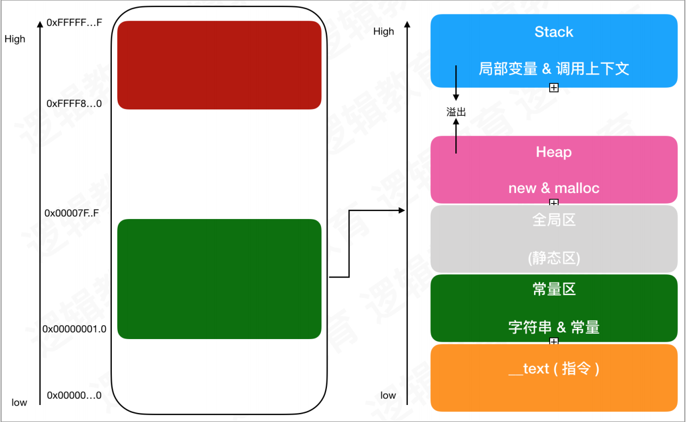
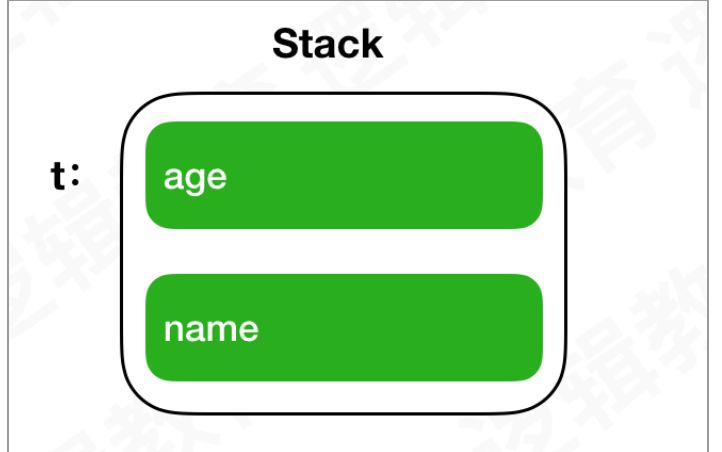
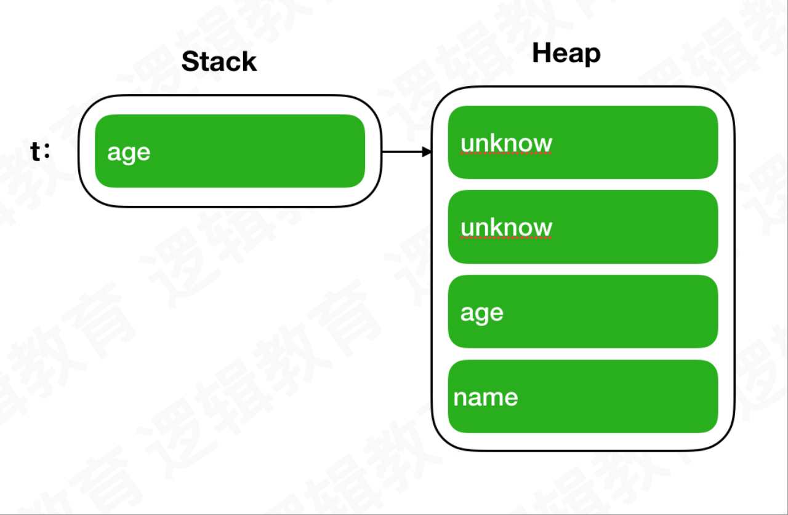

# class与struct

## class 、struct的相同点

- 定义存储值的属性（存储属性 计算属性）
- 定义方法
- 定义下标，以使用下标语法提供对其值的访问
- 定义初始化器
- 使用 **extension** 来拓展功能
- 遵循协议来提供某种功能

## class 、struct的区别

class 是引用类型,可以继承;

struct 是值类型, 不可以继承;

类型转换使您能够在运行时检查和解释类实例的类型 

类有析构函数用来释放其分配的资源 （和init对应的deinit），结构体没有。

引用计数允许对一个类实例有多个引用 

struct在小数据模型传递和拷贝时比 class 要更安全，在多线程和网络请求时保证数据不被修改;

```swift
let queue = DispatchQueue.global()

var teachers = ["Cat", "Hank", "Kody"]

//捕获列表
//var teachers = teachers
queue.async { [teachers] in
    let count = teachers.count
    for index in 0 ..< count {
        print("\(teachers[index])")
        Thread.sleep(forTimeInterval: 1)
    }
}

queue.async {
    Thread.sleep(forTimeInterval: 0.5)
    teachers.remove(at: 0)
}
```

通过对这段代码的修改我们就可以得到想要的结果，并且不会crash。因为此时在新的线程中会`copy`出一份新的`teachers`。所以当线程会`copy`值类型内容时是线程安全的，其他情况会存在线程不安全的隐患，我们使用时应当注意。

## 引用类型 值类型

类是引用类型，结构体是值类型。也就意味着一个类类型的变量并不直接存储具体的实例对象，是对当前存储具体实例**内存地址的引用**。 

类类型的变量中存储的是地址，那么值类型存储的就是具体的实例（或者说具体的值）。

其实引用类型就相当于在线的 Excel ，当我们把这个链接共享给别人的时候，别人的修改我们是能够看到的；值类型就相当于本地的 Excel ,当我们把本地的 Excel 传递给别人的时候，就相当于重新复制了一份给别人，至于他们对于内容的修改我们是无法感知的。 

另外引用类型和值类型还有一个最直观的区别就是存储的位置不同：

**一般情况，值类型存储的在栈上，引用类型存储在堆上。** 

## 内存区域

首先我们对内存区域来一个基本概念的认知，大家看下面这张图 

一般操作的是绿色的区域

如果堆和栈重合 则堆栈溢出。



栈区（stack）: 局部变量和函数运行过程中的上下文 

```swift
//test是一个函数 函数放在栈区
func test(){
	//我们在函数内部声明的age变量是一个局部变量 age在栈区
	var age: Int = 10
	print(age)
} 
```

Heap: 存储所有对象 

Global: 存储全局变量；常量；代码区 

Segment & Section: Mach-O 文件有多个段（ Segment ），每个段有不同的功能。然后每个段又分为很多小的 Section 

不同Section存储的内容：

- TEXT.text ： 机器码 
- TEXT.cstring ： 硬编码的字符串 
- TEXT.const： 初始化过的常量 
- Text，_swift5_types：存放的是class、enum、struct地址信息。
- DATA.data： 初始化过的可变的（静态/全局）数据 
- DATA.const： 没有初始化过的常量 
- DATA.bss： 没有初始化的（静态/全局）变量
- DATA.common： 没有初始化过的符号声明 

我们来看例子 

```swift
class LGPerson{
    var age = 18
    var name = "fdksl"
}

struct LGTeacher{
    var age = 18
    var name = "Kody"
  	var p = LGPerson()//添加一个p
}

func test(){
    var t = LGTeacher()//移动栈指针 分配内存。添加了p之后t结构体仍然在栈上，只是t中的p的内容是在堆上。
    print("end")
}//作用域结束之后 栈指针移动，销毁内存

test()
// 结构体里创建引用类型，不影响结构体存储位置。
```

接下来使用命令 查看内存地址 

> frame varibale -L xxx 

当前结构体在内存当中的分布示意图： 




如果我们把其他条件不变，将 strcut 修改成 class 的情况我们来看一下：

此时t在堆空间上开辟内存空间。



```swift
class LGTeacher{
    var age = 18
    var name = "Kody"
}

func test(){
  //实例对象内存分配
  //1. 栈上 分配8字节 给t
  //2. 堆空间上寻找合适的内存区域 内存地址返回
  //3. t指向堆区的内存地址
  //离开作用域 堆内存销毁
  //1. 查找把内存块重新插入到堆内存中
  //2. 销毁栈上指针t
    var t = LGTeacher()
    print("end")
}
```

这里我们也可以通过github上StructVsClassPerformance这个案例来直观的测试当前结构体和类的时间分配。

创建结构体比类使用的时间要短，类在堆上分配比较繁琐，类有引用计数，对类的使用也有消耗，**所以尽可能优先使用结构体**（在栈上，线程安全）。

## 类的初始化器规则

当前的类编译器默认不会自动提供成员初始化器，但是对于结构体来说编译器会提供默认的初始化方法。（前提是我们自己没有指定初始化器）！ 

```swift
// MARK: 类定义
class LGTeacher{
  //如果没有初始化值的话 会报错，因为空安全
  var age: Int = 1
  var name: String = "fsd"
}
```

```swift
// MARK: 结构体定义
struct LGTeacher{
  var age: Int
  var name: String
}

var t = LGTeacher(age: <#T##Int#>, name: <#T##String#>)//结构体默认初始化器
```

Swift 中创建类和结构体的实例时必须为所有的存储属性设置一个合适的初始值。所以类 LGPerson 必须要提供对应的指定初始化器，同时也可以为当前的类提供便捷初始化器。

初始化器有多个

```swift
class LGTeacher{
  var age: Int
  var name: String
    
    init(_ age: Int, _ name: String) {//初始化器，把所有成员写进去
        self.age = age
        self.name = name
    }
    
    init(_ age: Int) {
        self.age = age
        self.name = ""
    }
    
    init(_ name: String) {
        self.age = 18
        self.name = name
    }
}

var t = LGTeacher(<#T##age: Int##Int#>)
```

### convenience便捷初始化器

如果希望使用一个默认的初始化器的时候，控制api入口。所以通常有一个指定初始化器，其它的初始化器叫便捷初始化器。

**便捷初始化器必须从相同的类里调用另一个初始化器。**

```swift
class LGPerson{
  var age: Int 
  var name: String 
  init(_ age: Int, _ name: String) {//初始化器，把所有成员写进去
    self.age = age 
    self.name = name 
  }
  
   //便捷初始化器
   convenience init() {
       self.init(18, "dfkk")
    }
  
  	// 便捷创建LGTeacher
    convenience init(_ age: Int) {
        self.init(18, "dfkk") // 必须先调用初始化器，然后才能再赋值。
        self.age = age
        self.name = ""
    }
}
```

```swift
class SCMAuthorizedUpgradeView: UIView {
    override init(frame: CGRect) {
      super.init(frame: frame)
    }
    convenience init(frame: CGRect, asId: String) {
      self.init(frame:frame)
      /// 其它代码
    }
}
```

### 继承

当我们派生出一个子类 LGTeacher ,并指定一个指定初始化器之后会出现什么问题

```swift
class LGPerson{
  var age: Int
  var name: String
    
    init(_ age: Int, _ name: String) {
        self.age = age
        self.name = name
    }
    
    /// 便捷创建
    convenience init(_ age: Int) {
        self.init(18, "dfkk")
        self.age = age
        self.name = ""
    }
    
//    convenience init(_ name: String) {
//        self.age = 18
//        self.name = name
//    }
//
   convenience init() {
       self.init(18, "dfkk")
    }
}

//初始化为了确保成员变量访问安全
class LGTeacher: LGPerson{
    var subjectName: String
    //指定化的初始化器
    init(_ subjectName: String){
        self.subjectName = subjectName
        super.init(18, "hh")
    }
}
```

这里我们记住： 

- **便捷初始化器必须先委托同类中的其它初始化器，然后再为任意属性赋新值**（包括同类里定义的属性）。如果没这么做，便捷构初始化器赋予的新值将被自己类中其它指定初始化器所覆盖。 

- **初始化器在第一阶段初始化完成之前，不能调用任何实例方法、不能读取任何实例属性的值，也不能引用 self作为值。** 初始化内存结构，为了安全。

- 继承关系的时候：

  - 指定初始化器必须保证在向上委托给父类初始化器之前，**其所在类引入的所有属性（子类中的属性）都要初始化完成。** 

  - **指定初始化器必须先向上委托父类初始化器，然后才能为继承的属性设置新值。**如果不这样做，指定初始化器赋予的新值将被父类中的初始化器所覆盖 


### 可失败初始化器

当前因为参数的不合法或者外部条件的不满足，存在初始化失败的情况。

`return nil`语句来表明可失败初始化器在何种情况下会触发初始化失败。

```swift
class LGPerson{
    var age: Int
    var name: String
    init?(age: Int, name: String) {
        if age < 18 {return nil}
        self.age = age
        self.name = name
    }
    
    convenience init?() {
        self.init(age: 18, name: "Kody")
    }
}
```

#### 继承中的可失败初始化

```swift
class Tab: UIScrollView {
    var items: [String]
    var itemButtons: [UIButton]
    //选中的item
    var selectedItemButton: UIButton!
    var indicatorView: UIView!
    var normalColor: UIColor?
    
    //可失败初始化器
    init? (items: [String]) {
        if items.count == 0 {
            return nil
        }
        //必须得先把自己的属性先赋值，!和?的属性可以后面再赋值
        self.items = items
        itemButtons = []
        super.init(frame: .zero)
//        self.createViews()
    }
    
    required init?(coder: NSCoder) {
        fatalError("init(coder:) has not been implemented")
    }
}
```

### 必要初始化器

在类的初始化器前添加`required`修饰符来表明所有该类的**子类**都必须实现该初始化器。

```swift
class LGPerson{
    var age: Int
    var name: String
    required init(age: Int, name: String) {
        self.age = age
        self.name = name
    }
    
    convenience init() {
        self.init(age: 18, name: "Kody")
    }
}

class LGTeacher: LGPerson{
    var subjectName: String
    
    init(subjectName: String) {
        self.subjectName = subjectName
        super.init(age: 18, name: "Kody")
    }
    
    convenience init() {
        self.init(subjectName: "[Unnamed]")
    }
  
  	/// 如果在子类没有提供就会报错
    required init(age: Int, name: String) {
      fatalError("init(age:name:) has not been implemented")
    }
}
```

## 类的生命周期

iOS开发的语言不管是OC还是Swift，**后端**都是通过LLVM进行编译的：

OC通过**clang 编译器**编译成 IR，然后再生成可执行文件 .o(这里也就是我们的机器码) 。

Swift通过**Swift 编译器**编译成 IR，然后在生成可执行文件。 

## swift编译流程

Swift Code（Swift代码）--> 语法分析变成抽象语法树（AST）  --> 语意分析（类型检查 安全正确） --> SIL --> IR --> 经过LLVM变成机器码（Machine Code）（x86 arm64等）

### SIL

swift中间语言代码，分为两种：

1. 原生的，没有开启优化选项。
2. 经过优化后的优化代码。

### 编译命令

```shell
// 分析输出AST 抽象语法树
swiftc main.swift -dump-parse

// 分析并且检查类型输出AST
swiftc main.swift -dump-ast

// 生成中间体语言（SIL），未优化
swiftc main.swift -emit-silgen

// 生成中间体语言（SIL），优化后的
swiftc main.swift -emit-sil

// 生成LLVM中间体语言 （.ll文件）
swiftc main.swift -emit-ir 

// 生成LLVM中间体语言 （.bc文件）
swiftc main.swift -emit-bc 

// 生成汇编
swiftc main.swift -emit-assembly 

// 编译生成可执行.out文件
swiftc -o main.o main.swift
```

@main： 入口函数， @标识符

%0： 寄存器（开发中的常量，不可以更改），是虚拟的，跑到设备上才是真的寄存器 

`xcrun swift-demangle`还原混淆

## Swift 对象内存分配 

通过打开汇编调试查看流程

- 编译器为每个实例对象生存`__allocating_init` -----> `swift_allocObject` -----> `_swift_allocObject_` -----> 

`swift_slowAlloc` -----> `Malloc`申请堆区内存空间（8字节对齐）

### swift对象内存结构

Swift 对象的内存结构 HeapObject，有两个属性：一个是Metadata 类似OC的isa 8字节，一个是 RefCount ，位域 默认占用 16 字节大小。 

```swift
struct HeapObject{
    var metadata: UnsafeRawPointer
    var refcounted1: UInt32
    var refcounted2: UInt32
}
```

### swift 类的数据结构 

1. Metadata类似OC的isa
2. refcount

```swift
struct Metadata{ 
    var kind: Int 
    var superClass: Any.Type 
    var cacheData: (Int, Int) 
    var data: Int 
    var classFlags: Int32 
    var instanceAddressPoint: UInt32 
    var instanceSize: UInt32 
    var instanceAlignmentMask: UInt16 
    var reserved: UInt16 
    var classSize: UInt32 
    var classAddressPoint: UInt32 
    var typeDescriptor: UnsafeMutableRawPointer 
    var iVarDestroyer: UnsafeRawPointer 
}
```

