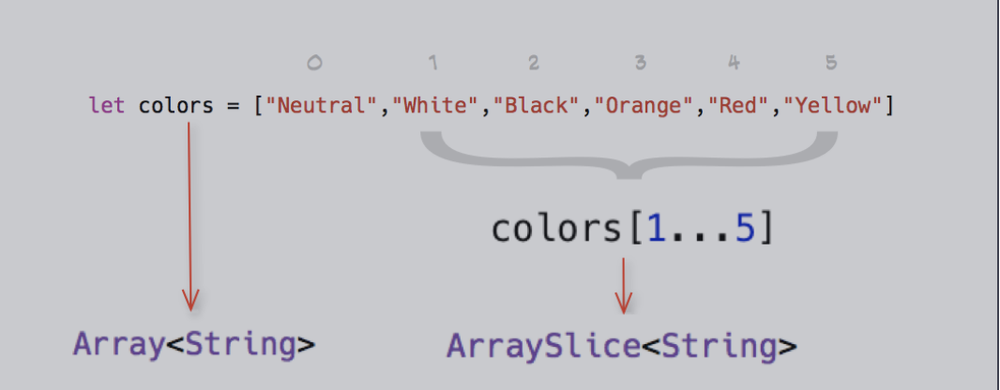

## 数组

### 创建数组

#### 字面量创建

```swift
let array = [1, 2, 3, 4]
```

字面量创建空数组

创建空数组的时候必须携带类型信息

如果内容已经提供了类型信息，比如说作为函数的实际参数或者已经分类了的变量或常量，你可以通过空数组字面量来创建一个空数组

```swift
let array = []//报错：Empty collection literal requires an explicit type
```

#### 初始化器

使用初始化器有两种方式

- `[类型]()`
- `Array<类型>()`

```swift
var myArray = [String]()
var myArray2 = Array<String>()
```

##### 初始化器参数

```swift
let fiveZs = Array(repeating: "Z", count: 5)
print(fiveZs)//["Z", "Z", "Z", "Z", "Z"]

let numbers = [Int](0...7)
print(numbers)//[0, 1, 2, 3, 4, 5, 6, 7]

let persons = ["zhangsan" : 27, "lisi" : 28, "wangwu" : 29]
let names = [String](persons.keys)
print(names)//["lisi", "wangwu", "zhangsan"]
```

### 数组遍历

#### For-In

#### forEach方法

无法使用 break 或 continue 跳出或者跳过循环

使用 return 只能退出当前一次循环的执行体

```swift
let numbers = [Int](0...7)
numbers.forEach { num in
	if num == 3 {
		break//报错：Unlabeled 'break' is only allowed inside a loop or switch, a labeled break is required to exit an if or do
	}
	print(num * 10)
}


let numbers = [Int](0...7)
numbers.forEach { num in
	if num == 3 {
		return
	}
	print(num * 10)//0 10 20 40 50 60 70
}
```

#### 同时得到索引和值 enumerated()

```swift
let numbers = [Int](2...7)
for (index, num) in numbers.enumerated() {
  print("the index is: \(index)")
  print(num * 10)
}
```

#### 使用 Iterator 遍历数组

```swift
let numbers = [Int](2...7)
var numIterator = numbers.makeIterator()
while let num = numIterator.next() {
  print(num * 10)
}
```

### 索引

- startIndex 返回第一个元素的位置，对于数组来说，永远都是 0。
- endIndex 返回最后一个元素索引 +1 的位置，对于数组来说，等同于count 。
- 如果数组为空，startIndex 等于 endIndex 。

#### indices 获取数组的索引区间

```swift
let numbers = [Int](2...7)
for i in numbers.indices {
  print(numbers[i])
}
```

### 数组的查找操作

#### 判断是否包含指定元素

contains(_:) 判断数组是否包含给定元素

contains(where:) 判断数组是否包含符合给定条件的元素

#### 判断所有元素是否符合某个条件

• allSatisfy(_:) 判断数组的每一个元素都符合给定的条件

```swift
let array = [10, 20, 45, 30, 98, 101, 30, 4]
print(array.allSatisfy({ $0 > 10 }))//false
print(array.allSatisfy({ $0 >= 4 }))//true
```

#### 查找元素

- first 返回数组第一个元素（optional），如果数组为空，返回 nil 。
- last 返回数组最后一个元素（optional），如果数组为空，返回 nil。
- first(where:) 返回数组第一个符合给定条件的元素（optional）。
- last(where:) 返回数组最后一个符合给定条件的元素（optional）。

```swift
let array = [10, 20, 45, 30, 98, 101, 30, 4]
print(array.first)//Optional(10)
print(array.last)//Optional(4)
print(array.first(where: { $0 > 25 }))//Optional(45)
print(array.last(where: { $0 > 25 }))//Optional(30)
```

#### 查找索引

- firstIndex(of:) 返回给定的元素在数组中出现的第一个位置（optional） 
- lastIndex(of:) 返回给定的元素在数组中出现的最后一个位置（optional）

```swift
var array = [10, 20, 45, 30, 98, 101, 30, 4]
print(array.firstIndex(of: 30))//Optional(3)
print(array.lastIndex(of: 20))//Optional(1)
```

- firstIndex(where:) 返回符合条件的第一个元素的位置（optional）
- lastIndex(where:) 返回符合条件的最后一个元素的位置（optional）

```swift
var array = [10, 20, 45, 30, 98, 101, 30, 4]
print(array.firstIndex(where: { $0 > 25 }))//Optional(2)
print(array.lastIndex(where: { $0 > 25 }))//Optional(6)
```

#### 查找最大最小元素

- min() 返回数组中最小的元素
- max() 返回数组中最大的元素
- min(by:) 利用给定的方式比较元素并返回数组中的最小元素
- max(by:) 利用给定的方式比较元素并返回数组中的最大元素

```swift
var array = [(45,"error1"),(23,"error2"),(30,"error3")]
print(array.min { a, b in a.0 < b.0 })	//Optional((23, "error2"))
print(array.max { a, b in a.0 < b.0 })	//Optional((45, "error1"))
```

### 在末尾添加

- append(_:) 在末尾添加一个元素
- append(contentsOf: ) 在末尾添加多个元素

```swift
var array = [Int](2...7)
array.append(100)
array.append(contentsOf: 200...204)
print(array)//[2, 3, 4, 5, 6, 7, 100, 200, 201, 202, 203, 204]
```

### 在任意位置插入

- insert(_:at:) 在指定的位置插入一个元素
- insert(contentsOf: at:) 在指定位置插入多个元素

### ArraySlice

#### 移除多个元素

ArraySlice 是数组或者其他 ArraySlice 的一段连续切片，和原数组共享内存。

当要改变 ArraySlice 的时候，ArraySlice 会 copy 出来，形成单独内存。

ArraySlice 拥有和 Array 基本完全类似的方法



#### 通过 drop 得到 ArraySlice

- dropFirst(:) “移除”原数组前面指定个数的元素得到一个 ArraySlice
- dropLast(:) “移除”原数组后面指定个数的元素得到一个 ArraySlice
- drop(:) “移除”原数组符合指定条件的元素得到一个 ArraySlice

```swift
var array = [5, 2, 10, 1, 0, 100, 46, 99]
array.dropFirst()
array.dropFirst(3)
array.dropLast()
array.dropLast(3)
print(array.drop { $0 < 15 })//[100, 46, 99]
```

#### 通过 prefifix 得到 ArraySlice

- prefifix() 获取数组前面指定个数的元素组成的 ArraySlice

- prefifix(upTo: ) 获取数组到指定位置（不包含指定位置）前面的元素组成的 ArraySlice

- prefifix(through: ) 获取数组到指定位置（包含指定位置）前面的元素组成的 ArraySlice
- prefifix(while: ) 获取数组前面符合条件的元素（到第一个不符合条件的元素截止）组成的 ArraySlice

```swift
var array = [5, 2, 10, 1, 0, 100, 46, 99]
array.prefix(4)// [5, 2, 10, 1]
array.prefix(upTo: 4)// [5, 2, 10, 1]
array.prefix(through: 4)// [5, 2, 10, 1, 0]
print(array.prefix { $0 < 10 })//
```

#### 通过 sufix 得到 ArraySlice

- sufix() 获取数组后面指定个数的元素组成的 ArraySlice
- sufix(from: ) 获取数组从指定位置到结尾（包含指定位置）的元素组成的 ArraySlice

```swift
var array = [5, 2, 10, 1, 0, 100, 46, 99]
array.sufix(3)// [100, 46, 99]
array.sufix(from: 4)// [100, 46, 99]
```

#### 通过 Range 得到 ArraySlice

通过对数组下标指定 Range 获取 ArraySlice，可以使用闭区间、半开半闭区间、单侧区

间、甚至可以只使用 … 来获取整个数组组成的 ArraySlice 。

```swift
var array = [5, 2, 10, 1, 0, 100, 46, 99]
array[3...5]//[1, 0, 100]
array[3..<5]//[1, 0]
array[...2]//[5, 2, 10]
array[6...]//[46, 99]
array[...]//[5, 2, 10, 1, 0, 100, 46, 99]
```

#### ArraySlice 转为 Array

ArraySlice 无法直接赋值给一个 Array 的常量或变量，需要使用 Array(slice) 。

#### ArraySlice 和原 Array 相互独立

ArraySlice 和原 Array 是相互独立的，它们添加删除元素不会影响对方。

#### 数组元素的随机化

shuffle() 在原数组上将数组元素打乱，只能作用在数组变量上。

shuffled() 返回原数组的随机化数组，可以作用在数组变量和常量上。

#### 数组的逆序

reverse() 在原数组上将数组逆序，只能作用在数组变量上。

reversed() 返回原数组的逆序“集合表示”，可以作用在数组变量和常量上，该方法不会分配新内存空间

#### 数组的分组

partition(by belongsInSecondPartition: (Element) throws -> Bool) 将数组以某个条件分组，数组前半部分都是不符合条件的元素，数组后半部分都是符合条件的元素。

```swift
var array = [10, 20, 45, 30, 98, 101, 30, 4]
let index = array.partition { element -> Bool in
	element > 30
}
print(array)//[10, 20, 4, 30, 30, 101, 98, 45]
let partition1 = array[..<index]
let partition2 = array[index...]
print(partition1)//[10, 20, 4, 30, 30]
print(partition2)//[101, 98, 45]
```

#### 数组的排序

sort() 在原数组上将元素排序，只能作用于数组变量。

sorted() 返回原数组的排序结果数组，可以作用在数组变量和常量上。

#### 交换数组两个元素

```swift
var array = [10, 20, 45, 30, 98, 101, 30, 4]
array.swapAt(array.startIndex, array.endIndex - 1)
print(array)//[4, 20, 45, 30, 98, 101, 30, 10]
```

#### 字符串数组拼接

joined() 拼接字符串数组里的所有元素为一个字符串

joined(separator:) 以给定的分隔符拼接字符串数组里的所有元素为一个字符串

```swift
var array = ["hello", "word"]
print(array.joined())//helloword
print(array.joined(separator: ","))//hello,word
```

#### 元素为 Sequence 数组的拼接

joined() 拼接数组里的所有元素为一个更大的 Sequence

joined(separator:) 以给定的分隔符拼接数组里的所有元素为一个更大的 Sequence

```swift
let ranges = [0..<3, 8..<10, 15..<17]
for range in ranges {
  print(range)//0..<3 8..<10 15..<17
}
for i in ranges.joined() {
  print(i) //0 1 2 8 9 15 16
}
```

```swift
let nestedNumbers = [[1,2,3], [4,5,6], [7,8,9]]
let joined = nestedNumbers.joined(separator: [-1,-2])
print(Array(joined))//[1, 2, 3, -1, -2, 4, 5, 6, -1, -2, 7, 8, 9]
```

### 数组的协议结构

`Sequence -> Collection -> RangeReplaceableCollection -> Array`

## Sequence

一个序列 (sequence) 代表的是一系列具有相同类型的值，你可以对这些值进行迭代。

```swift
public protocol Sequence {

    /// A type representing the sequence's elements.
    associatedtype Element where Self.Element == Self.Iterator.Element

    /// A type that provides the sequence's iteration interface and
    /// encapsulates its iteration state.
    associatedtype Iterator : IteratorProtocol

    /// Returns an iterator over the elements of this sequence.
    func makeIterator() -> Self.Iterator

    var underestimatedCount: Int { get }

    func withContiguousStorageIfAvailable<R>(_ body: (_ buffer: UnsafeBufferPointer<Self.Element>) throws -> R) rethrows -> R?
}
```

## IteratorProtocol

Sequence 通过创建一个迭代器来提供对元素的访问。迭代器每次产生一个序列的值，并且当遍历序列时对遍历状态进行管理。

当序列被耗尽时，next() 应该返回 nil 。

```swift
public protocol IteratorProtocol {
    /// The type of element traversed by the iterator.
    associatedtype Element//关联类型
    /// - Returns: The next element in the underlying sequence, if a next element
    ///   exists; otherwise, `nil`.
    mutating func next() -> Self.Element?//不断的产生元素
}
```

### for_in

```swift
func for_in() {
    let numbers = [2,3,4,5,6]
    //for in也是语法糖 编译之后创建Iterator迭代器，调用iterator.next
    for num in numbers{
        print(num)
    }
}
```

### 自定义Sequence

```swift
struct LGIterator: IteratorProtocol{
    typealias Element = Int
    let sequence: LGSequence
    init(_ sequence: LGSequence) {
        self.sequence = sequence
    }
    var count = 0

    //遍历的时候，返回的元素
    mutating func next() -> Int? {
        guard count < self.sequence.arrayCount else {
            return nil
        }
        count += 1
        return count
    }
}

struct LGSequence: Sequence {
    typealias Element = Int
    var arrayCount: Int
    func makeIterator() -> LGIterator {
        return LGIterator(self)
    }
}

//test
func test() {
    let seq = LGSequence(arrayCount: 10)
    for element in seq{
        print(element)
    }
}
```

```swift
// MARK: 无限的集合
struct HHSeq: IteratorProtocol{
    let value: Int
    func next() -> Int? {
        return value
    }
}
func test() {
    let Iterator = HHSeq(value: 10)
    while let x = Iterator.next(){
        print(x)//会不断的输出10 一直卡死
    }
}
```

## set

集合的三个特性

- 确定性 ：给定一个集合，任给一个元素，该元素或者属于或者不属于该集合，二者必居其一。
- 互斥性 ： 一个集合中，任何两个元素都认为是不相同的，即每个元素只能出现一次。
- 无序性 ： 一个集合中，每个元素的地位都是相同的，元素之间是无序的。

### Swift 里面的集合

Swift 的集合类型写做 Set<Element>，这里的 Element 是 Set 要储存的类型。不同与数组，集合没有等价的简写。

#### 创建 Set

- 使用初始化器语法来创建一个确定类型的空 Set
- 使用数组字面量创建 Set

```swift
var letters = Set<Character>()
letters.insert("C")
print(letters)//["C"]

var course: Set<String> = ["Match", "English", "History"]
course.insert("History")
print(course)//["Match", "English", "History"]
```

#### Set 类型的哈希值

为了能让类型储存在 Set 当中，它必须是可哈希的——就是说类型必须提供计算它自身哈希值的方法。

所有 Swift 的基础类型（比如 String, Int, Double, 和 Bool）默认都是可哈希的，并且可以用于 Set 或者Dictionary 的键。

##### 自定义类型需要实现 Hashable 协议

```swift
struct Person {
    var name: String
    var age: Int
}

extension Person: Hashable {
    func hash(into hasher: inout Hasher) {
        hasher.combine(name)
        hasher.combine(age)
    }
}

var personSet = Set<Person>()
personSet.insert(Person(name: "zhangsan", age: 28))
```

