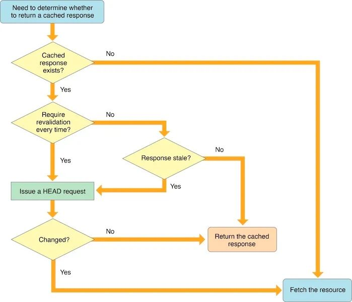

# WKWebView

原文地址：https://mp.weixin.qq.com/s/O8Pbhz0OBN9PGwquw1mRBA

`WKWebView`是一个多进程组件，`Network`、`UI Render`都在独立的进程中完成。

`WKWebView`和`App`不在同一个进程，如果`WKWebView`进程崩溃并不会导致应用崩溃，仅仅是页面白屏等异常。页面的载入、渲染等消耗内存和性能的操作，都在`WKWebView`的进程中处理，处理后再将结果交给`App`进程用于显示，所以`App`进程的性能消耗会小很多。

## 网页加载流程

1. 通过域名的方式请求服务器，请求前浏览器会做一个`DNS`解析，并将`IP`地址返回给浏览器。
2. 浏览器使用`IP`地址请求服务器，并且开始握手过程。`TCP`是三次握手，如果使用`https`则还需要进行`TLS`的握手，握手后根据协议字段选择是否保持连接。
3. 握手完成后，浏览器向服务端发送请求，获取`html`文件。
4. 服务器解析请求，并由`CDN`服务器返回对应的资源文件。
5. 浏览器收到服务器返回的`html`文件，交由`html`解析器进行解析。
6. 解析`html`由上到下进行解析`xml`标签，过程中如果遇到`css`或资源文件，都会进行异步加载，遇到`js`则会挂起当前`html`解析任务，请求`js`并返回后继续解析。因为`js`文件可能会对`DOM`树进行修改。
7. 解析完`html`，并执行完`js`代码，形成最终的`DOM`树。通过`DOM`配合`css`文件找出每个节点的最终展示样式，并交由浏览器进行渲染展示
8. 结束链接。

## 代理方法

`WKWebView`则会在渲染到屏幕之前，会回调一个代理方法决定是否渲染到屏幕上。这样就可以对请求下来的数据做一次校验，防止数据被更改，或验证视图是否允许被显示到屏幕上。

1. 重定向的回调，可以在请求重定向时获取到这次操作。
2. 当`WKWebView`进程异常退出时，可以通过回调获取。
3. 自定义处理证书。
4. 更深层的`UI`定制操作，将`alert`等`UI`操作交给原生层面处理，而`UI`方案`UIAlertView`是直接`webView`显示的。

### WKUIDelegate

`WKWebView`将很多`UI`的显示都交给原生层面去处理，例如弹窗或者输入框的显示。

在`WKWebView`中，系统将弹窗的显示交由客户端来控制。客户端可以通过下面的回调方法获取到弹窗的显示信息。参数中有一个`completionHandler`的回调`block`，需要客户端一定要调用，如果不调用则会发生崩溃。

```objective-c
- (void)webView:(WKWebView *)webView runJavaScriptAlertPanelWithMessage:(NSString *)message initiatedByFrame:(WKFrameInfo *)frame completionHandler:(void (^)(void))completionHandler;
```

有时候`H5`会要求用户进行一些输入，例如用户名密码之类的。客户端可以通过下面的方法获取到输入框事件，并由客户端展示输入框，用户输入完成后将结果回调给`completionHandler`中。

```objective-c
- (void)webView:(WKWebView *)webView runJavaScriptTextInputPanelWithPrompt:(NSString *)prompt defaultText:(nullable NSString *)defaultText initiatedByFrame:(WKFrameInfo *)frame completionHandler:(void (^)(NSString * _Nullable result))completionHandler;
```

### WKNavigationDelegate

关于加载流程相关的方法，都被抽象到`WKNavigationDelegate`中。

下面的方法，通过`decisionHandler`回调中返回一个枚举类型的参数，表示是否允许页面加载。这里可以对域名进行判断，如果是站外域名，则可以提示用户是否进行跳转。如果是跳转其他`App`或商店的`URL`，则可以通过`openURL`进行跳转，并将这次请求拦截。包括`cookie`的处理也在此方法中完成，后面会详细讲到`cookie`的处理。

除此之外，很多页面显示前的逻辑处理，也在此方法中完成。但需要注意的是，方法中不要做过多的耗时处理，会影响页面加载速度。

```objective-c
- (void)webView:(WKWebView *)webView decidePolicyForNavigationAction:(WKNavigationAction *)navigationAction decisionHandler:(void (^)(WKNavigationActionPolicy))decisionHandler;
```

开始加载页面，并请求服务器。

```objective-c
- (void)webView:(WKWebView *)webView didStartProvisionalNavigation:(null_unspecified WKNavigation *)navigation;
```

当页面加载失败的时候，会回调此方法，包括`timeout`等错误。在这个页面可以展示错误页面，清空进度条，重置网络指示器等操作。需要注意的是，调用`goBack`时也会执行此方法，可以通过`error`的状态判断是否`NSURLErrorCancelled`来过滤掉。

```objective-c
- (void)webView:(WKWebView *)webView didFailProvisionalNavigation:(WKNavigation *)navigation withError:(NSError *)error;
```

页面加载及渲染完成，会调用此方法，调用此方法时`H5`的`dom`已经解析并渲染完成，展示在屏幕上。所以在此方法中可以进行一些加载完成的操作，例如移除进度条，重置网络指示器等。

```objective-c
- (void)webView:(WKWebView *)webView didFinishNavigation:(null_unspecified WKNavigation *)navigation;
```

### WKScriptMessageHandler

`WKWebView`将和`js`的交互都由`WKUserContentController`类来处理，后面统称为`userContent`。

如果需要接收并处理`js`的调用，通过调用`addScriptMessageHandler:name:`方法，并传入一个实现了`WKScriptMessageHandler`协议的对象，即可接收`js`的回调，由于`userContent`会强引用传入的对象，所以应该是新创建一个对象，而不是`self`。注册对象时，后面的`name`就是`js`调用的函数名。

```objective-c
[self.webView.configuration.userContentController addScriptMessageHandler:[[WKWeakScriptMessageDelegate alloc] initWithDelegate:self] name:@"clientCallback"];
```

在`dealloc`中应该通过下面的方法，移除对指定`name`的处理。

```objective-c
[self.webView.configuration.userContentController removeScriptMessageHandlerForName:@"clientCallback"];
```

`H5`通过下面的代码即可对客户端发起调用，调用是通过`postMessage`函数传一个`json`串过来，需要加上转移字符。客户端接收到调用后，根据回调方法传入的`WKScriptMessage`对象，获取到`body`字典，解析传入的参数即可。

```
window.webkit.messageHandlers.clientCallback.postMessage("{\"funName\":\"getMobileCode\",\"value\":\"srggshqisslfkj\"}");
```

监听JavaScript调用原生方法的代理方法：

```objective-c
- (void)userContentController:(WKUserContentController *)userContentController didReceiveScriptMessage:(WKScriptMessage *)message {
    if ([message.name isEqualToString:@"Native"]) {
        NSDictionary *bodyParam = message.body;
        NSString *func = bodyParam[@"func"];
        if ([func isEqualToString:@""]) {
            //原生的方法
        }
    }
}
```

#### 调用

原生调用`H5`的方法也是一样，创建一个`WKUserScript`对象，并将`js`代码当做参数传入。除了调用`js`代码，也可以通过此方法注入代码改变页面`dom`，但是这样代码量较大，不建议这么做。

```objective-c
// 适配暗黑模式颜色
NSString *backgroundColor = @"";
NSString *labelColor = @"";
if (@available(iOS 13.0, *)) {
  if (UITraitCollection.currentTraitCollection.userInterfaceStyle == UIUserInterfaceStyleDark) {
    backgroundColor = @"'#1B1B21'";
    labelColor = @"'#B0B4BB'";
  }else{
    backgroundColor = @"'#FFFFFF'";
    labelColor = @"'#0D0D0D'";
  }
}
//写入JS代码
NSString *js = [NSString stringWithFormat:@"document.querySelector('.content').style.background=%@",backgroundColor];
WKUserScript *wkUserScript = [[WKUserScript alloc]initWithSource:js injectionTime:WKUserScriptInjectionTimeAtDocumentEnd forMainFrameOnly:YES];

[webView.configuration.userContentController addUserScript:wkcookieScript];
```

#### WKUserScript vs evaluateJavaScript

`WKWebView`对于执行`js`代码提供了两种方式，通过`userContent`添加一个`WKUserScript`对象的方式，以及通过`webView`的`evaluateJavaScript:completionHandler:`方式，注入`js`代码。

```objective-c
NSString *removeChildNode = @""
"var header = document.getElementsByTagName:('header')[0];"
"header.parentNote.removeChild(header);"
[self.webView evaluateJavaScript:removeChildNode completionHandler:nil];
```

这两种方式都可以注入`js`代码。

`evaluateJavaScript:completionHandler:`这种方式一般是在页面展示完成后执行的操作，用来调用`js`的函数并获取返回值非常方便。当然也可以用来注入一段`js`代码，但需要自己控制注入时机。

`WKUserScript`则可以控制注入时机，可以针对`document`是否加载完选择注入`js`。以及被注入的`js`是在当前页面有效，还是包括其子页面也有效。相对于`evaluateJavaScript:`方法，此方法不能获得`js`执行后的返回值，所以两个方法在功能上还是有区别的。

## 容器设计思路

项目中一般不会直接使用`WKWebView`，而是通过对其进行一层包装，成为一个`WKWebViewController`交给业务层使用。设计`webViewVC`时应该遵循简单灵活的思想去设计，自身只提供展示功能，不涉及任何业务逻辑。对外提供展示导航栏、设置标题、进度条等功能，都可以通过`WKWebViewConfiguration`赋值并在`WKWebViewController`实例化的时候传入。

对调用方提供`js`交互、`webView`生命周期、加载错误等回调，外接通过对应的回调进行处理。这些回调都是可选的，不实现对`webView`加载也没有影响。下面是实例代码，也可以把不同类型的回调拆分定义不同的代理。

```
@protocol WKWebViewControllerDelegate <NSObject>
@optional
- (void)webViewDidStartLoad:(WKWebViewController *)webViewVC;
- (void)webViewDidFinishLoad:(WKWebViewController *)webViewVC;
- (void)webView:(WKWebViewController *)webViewVC didFailLoadWithError:(NSError *)error;
- (void)webview:(WKWebViewController *)webViewVC closeWeb:(NSString *)info;
- (void)webview:(WKWebViewController *)webViewVC login:(NSDictionary *)info;
- (void)webview:(WKWebViewController *)webViewVC jsCallbackParams:(NSDictionary *)params;
@end
```

此外，`WKWebViewController`还应该负责处理公共参数，并且可以基于公共参数进行扩展。这里我们定义了一个方法，可以指定基础参数的位置，是通过`URL`拼接、`header`、`js`注入等方式添加，这个枚举是多选的，也就是可以在多个位置进行注入。除了基础参数，还可以额外添加自定义参数，也会添加到指定的位置。

```
- (void)injectionParamsType:(SVParamsType)type additionalParams:(NSDictionary *)additionalParams;
```

### 复用池

`WKWebView`第一次初始化的时候，会先启动`webKit`内核，并且有一些初始化操作，这个操作是非常消耗性能的。所以，复用池设计的第一步，是在`App`启动的时候，初始化一个全局的`WKWebView`。

并且，创建两个池子，创建`visiblePool`存放正在使用的，创建`reusablePool`存放空闲状态的。并且，在页面退出时，从`visiblePool`放入`reusablePool`的同时，应该将页面进行回收，清除页面上的数据。

当需要初始化一个`webView`容器时，从`reusablePool`中取出一个容器，并且放入到`visiblePool`中。通过复用池的实现，可以减少从初始化一个`webView`容器，到页面展示出来的时间。

### WKProcessPool

在`WKWebView`中定义了`processPool`属性，可以指定对应的进程池对象。每个`webView`都有自己的内容进程，如果不指定则默认是一个新的内容进程。内容进程中包括一些本地`cookie`、资源之类的，如果不在一个内容进程中，则不能共享这些数据。

可以创建一个公共的`WKProcessPool`，是一个单例对象。所有`webView`创建的时候，都使用同一个内容进程，即可实现资源共享。

### UserAgent

`User-Agent`是在`http`协议中的一个请求头字段，用来告知服务器一些信息的，`User-Agent`中包含了很多字段，例如系统版本、浏览器内核版本、网络环境等。这个字段可以直接用系统提供的，也可以在原有`User-Agent`的基础上添加其他字段。

例如下面是从系统的`webView`中获取到的`User-Agent`。

```
Mozilla/5.0 (iPhone; CPU iPhone OS 10_3_2 like Mac OS X) AppleWebKit/603.2.4 (KHTML, like Gecko) Mobile/14F89
```

在`iOS9`之后提供了`customUserAgent`属性，直接为`WKWebView`设置`User-Agent`，而`iOS9`之前需要通过`js`写入的方式对`H5`注入`User-Agent`。

```objective-c
- (void)setWebViewUserAgent {
    __weak __typeof(self) weakSelf = self;
    [self.webView evaluateJavaScript:@"navigator.userAgent" completionHandler:^(id _Nullable result, NSError * _Nullable error) {
        NSString *userAgent = result;
        userAgent = [userAgent stringByAppendingString:[NSString stringWithFormat:@""]];
        weakSelf.webView.customUserAgent = userAgent;
    }];
}
```

### 通信协议

一个设计的比较好的`WebView`容器，应该具备很好的相互通信功能，并且灵活具有扩展性。`H5`和客户端的通信主要有以下几种场景。

- `js`调用客户端，以及`js`调用客户端后获取客户端的`callback`回调及参数。
- 客户端调用`js`，以及调用`js`后的`callback`回调及参数。
- 客户端主动通知`H5`，客户端的一些生命周期变化。例如进入锁屏和进入前台等系统生命周期。

以`js`调用客户端为例，有两个纬度的调用。可以通过`URLRouter`的方式直接调用某个模块，这种调用方式遵循客户端的`URL`定义即可调起，并且支持传参。还可以通过`userContentController`的方式，进行页面级的调用，例如关闭`webView`、调起登录功能等，也就是通过`js`调用客户端的某个功能，这种方式需要客户端提供对应的处理代码。

二者之间相互调用，尽量避免高频调用，而且一般也不会有高频调用的需求。但如果发生相同功能高频调用，则需要设置一个`actionID`来区分不同的调用，以保证发生回调时可以正常被区分。

`callback`的回调方法也可以通过参数传递过来，这种方式灵活性比较强，如果固定写死会有版本限制，较早版本的客户端可能并不支持这个回调。

### 处理回调

`webView`的回调除了基础的调用，例如`refresh`刷新当前页面、`close`关闭当前页面等，直接由对应的功能类来处理调用，其他的时间应该交给外界处理。

这里的设计方案并不是一个事件对应一个回调方法，然后外界遵循代理并实现多个代理方法的方式来实现。而是将每次回调事件都封装成一个对象，直接将这个对象回调给外界处理，这样灵活性更强一些，而且外界获取的信息也更多。事件模型的定义可以参考下面的。

```
@interface WKWebViewCallbackModel : NSObject
@property(nonatomic, strong) WKWebViewController *webViewVC;
@property(nonatomic, strong) WKCallType *type;
@property(nonatomic, copy) NSDictionary *parameters;
@property(nonatomic, copy) NSString *callbackID;
@property(nonatomic, copy) NSString *callbackFunction;
@end
```

### 持久化

目前`H5`页面的持久化方案，主要是`WebKit`自带的`localStorage`和`Cookie`，但是`Cookie`并不是用来做持久化操作的，所以也不应该给`H5`用来做持久化。如果想更稳定的进行持久化，可以考虑提供一个`js bridge`的`CRUD`接口，让`H5`可以用来存储和查询数据。

持久化方案就采取和客户端一致的方案，给`H5`单独建一张数据表即可。

### 缓存机制

前端浏览器包括`WKWebView`在内，为了保证快速打开页面，减少用户流量消耗，都会对资源进行缓存。如果我们为了保证每次的资源文件都是最新的，也可以选择不使用缓存，但我们一般不这么做。

- `NSURLRequestUseProtocolCachePolicy = 0`，默认缓存策略，和`Safari`内核的缓存表现一样。
- `NSURLRequestReloadIgnoringLocalCacheData = 1,` 忽略本地缓存，直接从服务器获取数据。
- `NSURLRequestReturnCacheDataElseLoad = 2`, 本地有缓存则使用缓存，否则加载服务端数据。这种策略不会验证缓存是否过期。
- `NSURLRequestReturnCacheDataDontLoad = 3`, 只从本地获取，并且不判断有效性和是否改变，本地没有不会请求服务器数据，请求会失败。
- `NSURLRequestReloadIgnoringLocalAndRemoteCacheData = 4`, 忽略本地以及路由过程中的缓存，从服务器获取最新数据。
- `NSURLRequestReloadRevalidatingCacheData = 5`, 从服务端验证缓存是否可用，本地不可用则请求服务端数据。
- `NSURLRequestReloadIgnoringCacheData = NSURLRequestReloadIgnoringLocalCacheData`,



根据苹果默认的缓存策略，会进行三步检查。

1. 缓存是否存在。
2. 验证缓存是否过期。
3. 缓存是否发生改变。

#### 缓存文件

`iOS9`苹果提供了缓存管理类`WKWebsiteDataStore`，通过此类可以对磁盘上，指定类型的缓存文件进行查询和删除。因为现在很多`App`都从`iOS9`开始支持，所以非常推荐此`API`来管理本地缓存，以及`cookie`。本地的文件缓存类型定义为以下几种，常用的主要是`cookie`、`diskCache`、`memoryCache`这些。

- `WKWebsiteDataTypeFetchCache`，磁盘中的缓存，根据源码可以看出，类型是`DOMCache`
- `WKWebsiteDataTypeDiskCache`，本地磁盘缓存，和`fetchCache`的实现不同，是所有的缓存数据
- `WKWebsiteDataTypeMemoryCache`，本地内存缓存
- `WKWebsiteDataTypeOfflineWebApplicationCache`，离线`web`应用程序缓存
- `WKWebsiteDataTypeCookies`，`cookie`缓存
- `WKWebsiteDataTypeSessionStorage`，`html`会话存储
- `WKWebsiteDataTypeLocalStorage`，`html`本地数据缓存
- `WKWebsiteDataTypeWebSQLDatabases`，`WebSQL`数据库数据
- `WKWebsiteDataTypeIndexedDBDatabases`，数据库索引
- `WKWebsiteDataTypeServiceWorkerRegistrations`，服务器注册数据

通过下面的方法可以获取本地所有的缓存文件类型，返回的集合字符串，就是上面定义的类型。

```
+ (NSSet<NSString *> *)allWebsiteDataTypes;
```

可以指定删除某个时间段内，指定类型的数据，删除后会回调`block`。

```
- (void)removeDataOfTypes:(NSSet<NSString *> *)dataTypes modifiedSince:(NSDate *)date completionHandler:(void (^)(void))completionHandler;
```

系统还提供了定制化更强的方法，通过`fetchDataRecordsOfTypes:`方法获取指定类型的所有`WKWebsiteDataRecord`对象，此对象包含域名和类型两个参数。可以根据域名和类型进行判断，随后调用`removeDataOfTypes:`方法传入需要删除的对象，对指定域名下的数据进行删除。

```
// 获取
- (void)fetchDataRecordsOfTypes:(NSSet<NSString *> *)dataTypes completionHandler:(void (^)(NSArray<WKWebsiteDataRecord *> *))completionHandler;
// 删除
- (void)removeDataOfTypes:(NSSet<NSString *> *)dataTypes forDataRecords:(NSArray<WKWebsiteDataRecord *> *)dataRecords completionHandler:(void (^)(void))completionHandler;
```

#### http缓存策略

客户端和`H5`在打交道的时候，经常会出现页面缓存的问题，`H5`的开发同学就经常说“你清一下缓存试试”，实际上发生这个问题的原因，在于`H5`的缓存管理策略有问题。这里就讲一下`H5`的缓存管理策略。

`H5`的缓存管理其实就是利用`http`协议的字段进行管理的，比较常用的是`Cache-Control`和`Last-Modified`搭配使用的方式。

- `Cache-Control`：文件缓存有效时长，例如请求文件后服务器响应头返回`Cache-Control:max-age=600`，则表示文件有效时长`600`秒。所以此文件在有效时长内，都不会发出网络请求，直到过期为止。
- `Last-Modified`：请求文件后服务器响应头中返回的，表示文件的最新更新时间。如果`Cache-Control`过期后，则会请求服务器并将这个时间放在请求头的`If-Modified-Since`字段中，服务器收到请求后会进行时间对比，如果时间没有发生改变则返回`304`，否则返回新的文件和响应头字段，并返回`200`。

`Cache-Control`是`http1.1`出来的，表示文件的相对有效时长，在此之前还有`Expires`字段，表示文件的绝对有效时长，例如`Expires: Thu, 10 Nov 2015 08:45:11 GMT`，二者都可以用。

`Last-Modified`也有类似的字段`Etag`，区别在于`Last-Modified`是以时间做对比，`Etag`是以文件的哈希值做对比。当文件有效时长过期后，请求服务器会在请求头的`If-None-Match`字段带上`Etag`的值，并交由服务器对比。

### Cookie处理

众所周知，`http`协议中是支持`cookie`设置的，服务器可以通过`Set-Cookie:`字段对浏览器设置`cookie`，并且还可以指定过期时间、域名等。这些在`Chrome`这些浏览器中比较适用，但是如果在客户端内进行显示，就需要客户端传一些参数过去，可以让`H5`获取到登录等状态。

苹果虽然提供了一些`Cookie`管理的`API`，但在`WKWebView`的使用上还是有很多坑的，最后我会给出一个比较通用的方案。

#### WKWebView Cookie设计

之前使用`UIWebView`的时候，和传统的`cookie`管理类`NSHTTPCookieStorage`读取的是一块区域，或者说`UIWebView`的`cookie`也是由此类管理的。但是`WKWebView`的`cookie`设计不太一样，和`App`的`cookie`并没有存储在同一块内存区域，所以二者需要分开做处理。

`WKWebView`的`cookie`和`NSHTTPCookieStorage`之间也有同步操作，但是这个同步有明显的延时，而且规则不容易琢磨。所以为了代码的稳定性，还是自己处理`cookie`比较合适。

`WKWebView`和`app`是两个进程，`cookie`也是两份，但是`WK`的`cookie`在`app`的沙盒里。有一个定时同步，但是并没有一个特定规则，所以最好不要依赖同步。`WK`的`cookie`变化只有两个时机，一个是`js`执行代码`setCookie`，另一个是`response`返回`cookie`。

#### WKWebsiteDataStore

`Cookie`的管理一直都是`WKWebView`的一个弊端，对于`Cookie`的处理很不方便。在`iOS9`中可以通过`WKWebsiteDataStore`对`Cookie`进行管理，但是用起来并不直观，需要进行`dataType`进行筛选并删除。而且`WKWebsiteDataStore`自身功能并不具备添加功能，所以对`cookie`的处理也只有删除，不能添加`cookie`。

```
if (@available(iOS 9.0, *)) {
    NSSet *cookieTypeSet = [NSSet setWithObject:WKWebsiteDataTypeCookies];
    [[WKWebsiteDataStore defaultDataStore] removeDataOfTypes:cookieTypeSet modifiedSince:[NSDate dateWithTimeIntervalSince1970:0] completionHandler:^{
        
    }];
}
```

#### WKHTTPCookieStore

在`iOS11`中苹果在`WKWebsiteDataStore`的基础上，为其增加了`WKHTTPCookieStore`类专门进行`cookie`的处理，并且支持增加、删除、查询三种操作，还可以注册一个`observer`对`cookie`的变化进行监听，当`cookie`发生变化后通过回调的方法通知监听者。

`WKWebsiteDataStore`可以获取`H5`页面通过`document.cookie`的方式写入的`cookie`，以及服务器通过`Set-Cookie`的方式写入的`cookie`，所以还是很推荐使用这个类来管理`cookie`的，可惜只支持`iOS11`。

下面是给`WKWebView`添加`cookie`的一段代码。

```objective-c
NSMutableDictionary *params = [NSMutableDictionary dictionary];
[params setObject:@"password" forKey:NSHTTPCookieName];
[params setObject:@"e10adc3949ba5" forKey:NSHTTPCookieValue];
[params setObject:@"www.google.com" forKey:NSHTTPCookieDomain];
[params setObject:@"/" forKey:NSHTTPCookiePath];
[params setValue:[NSDate dateWithTimeIntervalSinceNow:60*60*72] forKey:NSHTTPCookieExpires];
NSHTTPCookie *cookie = [NSHTTPCookie cookieWithProperties:params];
[self.cookieWebview.configuration.websiteDataStore.httpCookieStore setCookie:cookie completionHandler:nil];
```

#### 我公司方案

处理`Cookie`最好的方式是通过`WKHTTPCookieStore`来处理，但其只支持`iOS11`及以上设备，所以这种方案目前还不能作为我们的选择。其次是`WKWebsiteDataStore`，但其只能作为一个删除`cookie`的使用，并不不能用来管理`cookie`。

我公司的方案是，通过`iOS8`推出的`WKUserContentController`来管理`webView`的`cookie`，通过`NSHTTPCookieStorage`来管理网络请求的`cookie`，例如`H5`发出的请求。通过`NSURLSession`、`NSURLConnection`发出的请求，都会默认带上`NSHTTPCookieStorage`中的`cookie`，`H5`内部的请求也会被系统交给`NSURLSession`处理。

在代码实现层面，监听`didFinishLaunching`通知，在程序启动时从服务端请求用户相关信息，当然从本地取也可以，都是一样的。数据是`key`、`value`的形式下发，按照`key=value`的形式拼接，并通过`document.cookie`组装成设置`cookie`的`js`代码，所有代码拼接为一个以分号分割的字符串，后面给`webView`种`cookie`时就通过这个字符串执行。

对于网络请求的`cookie`，通过`NSHTTPCookieStorage`直接将`cookie`种到根域名下的，可以对根域名下所有子域名生效，这里的处理比较简单。

```
SVREQUEST.type(SVRequestTypePost).parameters(params).success(^(NSDictionary *cookieDict) {
    self.cookieData = [cookieDict as:[NSDictionary class]];
    [self addCookieWithDict:cookieDict forHost:@".google.com"];
    [self addCookieWithDict:cookieDict forHost:@".google.cn"];
    [self addCookieWithDict:cookieDict forHost:@".google.jp"];
    
    NSMutableString *scriptString = [NSMutableString string];
    for (NSString *key in self.cookieData.allKeys) {
        NSString *cookieString = [NSString stringWithFormat:@"%@=%@", key, cookieDict[key]];
        [scriptString appendString:[NSString stringWithFormat:@"document.cookie = '%@;expires=Fri, 31 Dec 9999 23:59:59 GMT;';", cookieString]];
    }
    self.webviewCookie = scriptString;
}).startRequest();

- (void)addCookieWithDict:(NSDictionary *)dict forHost:(NSString *)host {
    [dict enumerateKeysAndObjectsUsingBlock:^(NSString * _Nonnull key, NSString * _Nonnull value, BOOL * _Nonnull stop) {
        NSMutableDictionary *properties = [NSMutableDictionary dictionary];
        [properties setObject:key forKey:NSHTTPCookieName];
        [properties setObject:value forKey:NSHTTPCookieValue];
        [properties setObject:host forKey:NSHTTPCookieDomain];
        [properties setObject:@"/" forKey:NSHTTPCookiePath];
        [properties setValue:[NSDate dateWithTimeIntervalSinceNow:60*60*72] forKey:NSHTTPCookieExpires];
        NSHTTPCookie *cookie = [NSHTTPCookie cookieWithProperties:properties];
        [[NSHTTPCookieStorage sharedHTTPCookieStorage] setCookie:cookie];
    }];
}
```

对`webView`种`cookie`是通过`WKUserContentController`写入`js`的方式实现的，也就是上面拼接的`js`字符串。但是这个类有一个问题就是不能持久化`cookie`，也就是`cookie`随`userContentController`的声明周期，如果退出`App`则`cookie`就会消失，下次进入`App`还需要种一次，这是个大问题。

所以我司的处理方式是在`decidePolicyForNavigationAction:`回调方法中加入下面这段代码，代码中会判断此域名是否种过`cookie`，如果没有则种`cookie`。对于`cookie`的处理，我新建了一个`cookieWebview`专门处理`cookie`的问题，当执行`addUserScript`后，通过`loadHTMLString:baseURL:`加载一个空的本地`html`，并将域名设置为当前将要显示页面的域名，从而使刚才种的`cookie`对当前`processPool`内所有的`webView`生效。

这种方案种`cookie`是同步执行的，而且对`webView`的影响很小，经过我的测试，平均添加一次`cookie`只需要消耗28ms的时间。从用户的角度来看是无感知的，并不会有页面的卡顿或重新刷新。

```
- (void)setCookieWithUrl:(NSURL *)url {
    NSString *host = [url host];
    if ([self.cookieURLs containsObject:host]) {
        return;
    }
    [self.cookieURLs addObject:host];
    
    WKUserScript *wkcookieScript = [[WKUserScript alloc] initWithSource:self.webviewCookie
                                                          injectionTime:WKUserScriptInjectionTimeAtDocumentStart
                                                       forMainFrameOnly:NO];
    [self.cookieWebview.configuration.userContentController addUserScript:wkcookieScript];
    
    NSString *baseWebUrl = [NSString stringWithFormat:@"%@://%@", url.scheme, url.host];
    [self.cookieWebview loadHTMLString:@"" baseURL:[NSURL URLWithString:baseWebUrl]];
}
```

删除`cookie`的处理则相对比较简单，`NSHTTPCookieStorage`通过`cookies`属性遍历到自己需要删除的`NSHTTPCookie`，调用方法将其删除即可。`webView`的删除方法更是简单粗暴，直接调用`removeAllUserScripts`删除所有`WKUserScript`即可。

```
- (void)removeWKWebviewCookie {
    self.webviewCookie = nil;
    [self.cookieWebview.configuration.userContentController removeAllUserScripts];
    
    NSMutableArray<NSHTTPCookie *> *cookies = [NSMutableArray array];
    [[NSHTTPCookieStorage sharedHTTPCookieStorage].cookies enumerateObjectsUsingBlock:^(NSHTTPCookie * _Nonnull cookie, NSUInteger idx, BOOL * _Nonnull stop) {
        if ([self.cookieData.allKeys containsObject:cookie.name]) {
            [cookies addObjectOrNil:cookie];
        }
    }];
    
    [cookies enumerateObjectsUsingBlock:^(NSHTTPCookie * _Nonnull cookie, NSUInteger idx, BOOL * _Nonnull stop) {
        [[NSHTTPCookieStorage sharedHTTPCookieStorage] deleteCookie:cookie];
    }];
}
```

## 白屏问题

如果`WKWebView`加载内存占用过多的页面，会导致`WebContent Process`进程崩溃，进而页面出现白屏，也有可能是系统其他进程占用内存过多导致的白屏。对于低内存导致的白屏问题，有以下两种方案可以解决。

在`iOS9`中苹果推出了下面的`API`，当`WebContent`进程发生异常退出时，会回调此`API`。可以在这个`API`中进行对应的处理，例如展示一个异常页面。

```
- (void)webViewWebContentProcessDidTerminate:(WKWebView *)webView;
```

如果从其他`App`回来导致白屏问题，可以在视图将要显示的时候，判断`webView.title`是否为空。如果为空则展示异常页面。

### 问题描述：

问题一：
点击文章列表进入文章详情，会有几秒显示空白页面，之后才是加载请求数据。加载请求数据显示加载动画，这段时间是可以接受的。主要矛盾是解决加载动画显示之前的白屏问题。
问题二：
后台设置的过期时间还没到，但是版本更新修改比较大，加载缓存数据会有问题，需要header请求，请求头部信息，查找是否有修改，更新缓存文件。

### 解决方法：

把页面文件保存到本地， 加载的时候，加载本地的，因为文章详情里面html文件代码都一样，框架都是那样的。只要后台那边不改代码，一般情况下都不变，所以把那个文件存到本地，以后都读本地读文件即可。不用去请求服务器，不再受服务器响应速度影响。

### 1、 先判断是否修改过

#### 设置html文件过期时间

在请求数据的时候，header中有一个过期时间。header信息可以在WKNavigationDelegate的`- (void)webView:(WKWebView *)webView decidePolicyForNavigationResponse:(WKNavigationResponse *)navigationResponse decisionHandler:(void (^)(WKNavigationResponsePolicy))decisionHandler;`代理方法中获得。

在上面方法中打印`navigationResponse`可以看到header。

```objective-c
- (void)webView:(WKWebView *)webView decidePolicyForNavigationResponse:(WKNavigationResponse *)navigationResponse decisionHandler:(void (^)(WKNavigationResponsePolicy))decisionHandler
{
    NSString *cacheControl = [(NSHTTPURLResponse*)navigationResponse.response allHeaderFields][@"Cache-Control"]; // max-age, must-revalidate, no-cache
    NSArray *cacheControlEntities = [cacheControl componentsSeparatedByString:@","];

    for(NSString *substring in cacheControlEntities) {
        
        if([substring rangeOfString:@"max-age"].location != NSNotFound) {
            
            // do some processing to calculate expiresOn
            NSString *maxAge = nil;
            NSArray *array = [substring componentsSeparatedByString:@"="];
            if([array count] > 1)
                maxAge = array[1];
            
           NSDate * expiresOnDate = [[NSDate date] dateByAddingTimeInterval:[maxAge intValue]];

        //保存过期时间
            [[NSUserDefaults standardUserDefaults] setObject:expiresOnDate forKey:kHtml_gqsj];

        }
    }

    decisionHandler(WKNavigationResponsePolicyAllow);
}
```

问题：
当后台那边对html文件进行了修改之后，app内html文件还没到过期时间，那么就会出请求不到数据等等问题。
解决方法：
可以只请求该url地址的header头， 请求的数据也不多，响应相应的比其他的请求快些。

html文件不是永远不变的， 后台那边可能会调整一些样式等，所以需要先使用header请求去 请求header判断一下缓存的html文件有没有修改过。
对应的代码如下：

```
/**
 header请求，获取头部的信息

 @param block yes：读取本地缓存 no：重新缓存文件
 @param baseUrl html文件地址
 */
- (void)requestWebViewHeader:(void (^)(BOOL isLoadCache))block
                     baseUrl:(NSString *)baseUrl {
    AFHTTPSessionManager *manager = [AFHTTPSessionManager manager];
    [manager HEAD:baseUrl parameters:nil success:^(NSURLSessionDataTask * _Nonnull task) {
        NSUserDefaults *userDefaults = [NSUserDefaults standardUserDefaults];
        if ([[userDefaults objectForKey:kHtml_lastModified] isEqual:[(NSHTTPURLResponse*)task.response allHeaderFields][@"Last-Modified"]]) {
            block(YES);
        } else {
            block(NO);
            [userDefaults setObject:[(NSHTTPURLResponse*)task.response allHeaderFields][@"Last-Modified"] forKey:kHtml_lastModified];
        }
    } failure:^(NSURLSessionDataTask * _Nullable task, NSError * _Nonnull error) {
        block(YES);
    }];
}
```

#### 控制台输出：

```
(lldb) po task.response
<NSHTTPURLResponse: 0x60400082f480> { URL: http://apptest.ningmengyun.com/news/newsDetail.html?ArticleID=1159&withNavigationBar=true } { Status Code: 200, Headers {
    "Accept-Ranges" =     (
        bytes
    );
    "Content-Encoding" =     (
        gzip
    );
    "Content-Length" =     (
        1353
    );
    "Content-Type" =     (
        "text/html"
    );
    Date =     (
        "Mon, 23 Apr 2018 04:06:18 GMT"
    );
    Etag =     (
        "\"809d9cf9cbd7d31:0\""
    );
    "Last-Modified" =     (
        "Thu, 19 Apr 2018 10:48:39 GMT"
    );
    Server =     (
        "Microsoft-IIS/7.5"
    );
    Vary =     (
        "Accept-Encoding"
    );
    "X-Powered-By" =     (
        "ASP.NET"
    );
} }

(lldb) po lastModified
Thu, 19 Apr 2018 10:48:39 GMT

(lldb) 
```

##### 关于url的问题：

点击每条文章，传入的url为`https://app.ningmengyun.com/news/newsDetail.html?ArticleID=1034`，其中的ArticleID为每条文章的id，但是缓存html和请求header头的时候不需要整个url，只需要前面的地址即可。参数都不需要。即：`https://app.ningmengyun.com/news/newsDetail.html`

请求头的参考：
https://blog.csdn.net/u013583789/article/details/52129316

### 2、判断是否修改过， 提前载入内存

没修改的话：直接加载缓存文件到内存中。
有修改的话：重新下载html文件到本地并且缓存到内存中。

```
- (void)cacheHeadlineHtml {
    NSString *path;
    NSString *baseUrl;
    NSString *cachesPath = [NSSearchPathForDirectoriesInDomains(NSCachesDirectory, NSUserDomainMask, YES) objectAtIndex:0];

        path = [cachesPath stringByAppendingString:kHtml_hcwz];
        baseUrl =LMURLHeader5(@"/news/newsDetail.html");

    [self requestWebViewHeader:^(BOOL isLoadCache) {
        if (isLoadCache) {
            //没修改
 self.htmlString_new = [NSString stringWithContentsOfFile:path encoding:NSUTF8StringEncoding error:nil];
        } else {
            //修改过
            [[NSFileManager defaultManager] removeItemAtPath:path error:nil];
            [self writeToCache:baseUrl];
        }
    } baseUrl:baseUrl];
}
```

### 3、加载webView

```
- (void)loadHtml {
    NSString *cachesPath = [NSSearchPathForDirectoriesInDomains(NSCachesDirectory, NSUserDomainMask, YES) objectAtIndex:0];
   NSString *path = [cachesPath stringByAppendingString:[NSString stringWithFormat:@"/Caches/%lu.html",[@"huancunwenzhang" hash]]];
   NSString *htmlString = [NSString stringWithContentsOfFile:path encoding:NSUTF8StringEncoding error:nil];

//有缓存
    if (!(htmlString == nil || [htmlString isEqualToString:@""])) {
        [_wkWebview loadHTMLString:htmlString baseURL:[NSURL URLWithString:self.urlString]];
    }
//没缓存
 else {
        NSURL *url = [NSURL URLWithString:self.urlString];
        NSURLRequest *request = [NSURLRequest requestWithURL:url];
        [_wkWebview loadRequest:request];
//没有缓存需要缓存
        [self writeToCache];
    }
}
```

注：
还有优化的地方：
可以把上面htmlString读取到内存中，常驻内存中，app运行时使用同一个。减少一点读取文件的时间。

##### 注：

这是读书详情的接口`http://apptest.ningmengyun.com/commodity/booksDetail.html?productId=100106`
可以使用接口`/commodity/booksDetail.html`直接去存储，路径和名称都使用接口的。

### 适配深色模式闪白色背景色

在创建WKWebView的时候直接先隐藏WKWebView

```objectivec
#pragma mark - WKNavigationDelegate
//在开始加载WKWebVie添加一个加载框
- (void)webView:(WKWebView *)webView didStartProvisionalNavigation:(WKNavigation *)navigation{
    [GiFHUD showInView:self.view GIF:LOADING];
}
//网页加载完成 延时0.2秒展示网页
- (void)webView:(WKWebView *)webView didFinishNavigation:(WKNavigation *)navigation{
    [webView evaluateJavaScript:@"document.body.style.backgroundColor=\"#141A26\"" completionHandler:nil];
  
    dispatch_after(dispatch_time(DISPATCH_TIME_NOW, (int64_t)(0.2 * NSEC_PER_SEC)), dispatch_get_main_queue(), ^{
        webView.hidden = NO;
	      [GiFHUD dismiss];	
    });
}

- (void)webView:(WKWebView *)webView didFailNavigation:(WKNavigation *)navigation withError:(NSError *)error{
    [GiFHUD dismiss];
}
```

注：如果不设置隐藏和延时的话，设置WKWebView颜色会有闪现一下白色在变回我们设置的颜色。

