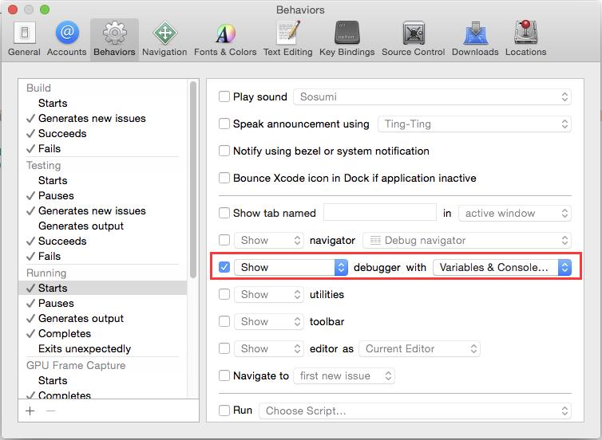
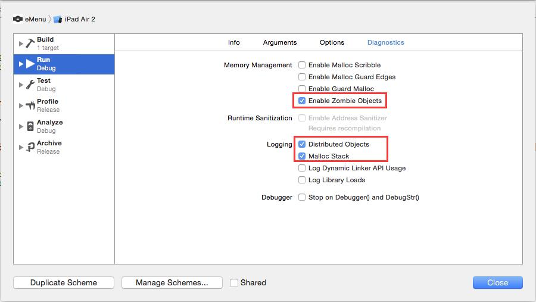
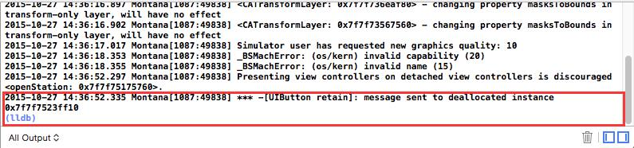
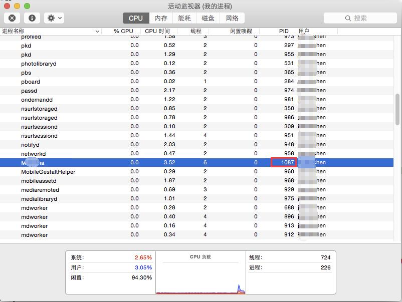
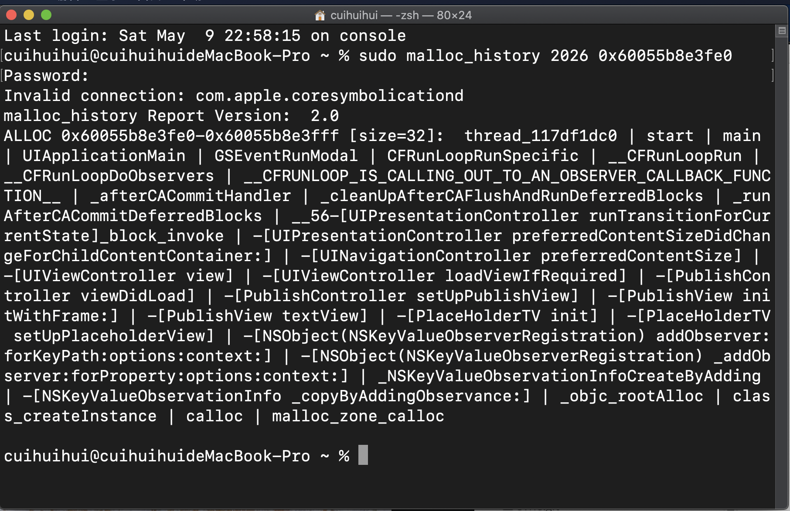

对已经释放的对象发送消息，或者对不能release的对象调用release。

默认情况下Xcode并不能准确定位到具体哪行代码引起的问题。

我们先对开发环境进行设置

先打开Debug的Console View界面，让Xcode在调试的时候输出更多的信息：菜单XCode > Preferences



再对环境变量进行设置：菜单Product > Scheme > Edit Scheme



设置好后调试程序，在输出界面发现了message sent to deallocated instance错误日志



在新的Xcode中，调试器默认使用的LLDB，那么怎么在LLDB状态下定位由于内存操作不当引起的Crash呢？

打开“活动监视器”，在进程列表中找到测试APP对应的进程号PID（Xcode启用调试后会在进程列表中找到对应APP的进程）



现在我们得到两个主要的信息：

APP进程ID：1087

崩溃地址：0x7f7f7523ff10

打开“终端”，输入以下命令：

```
sudo malloc_history 1087 0x7f7f7523ff10
```

得到错误日志，这样就能定位到最后调用的那行代码。

在终端输入`sudo malloc_history 2026 0x60055b8e3fe0`

2026是pid。

0x60055b8e3fe0 打开僵尸调试在Xcode控制台可以看到。


