# fishhook

Hook意思是钩子，像钩子一样挂钩程序，来扩展程序的功能或者改变程序运行的流程。

Facebook 提供的一个动态修改链接 mach-O 文件的工具 fishhook。它利用 MachO 文件加载原理，通过修改懒加载和非懒加载两个表的指针达到 C 函数 HOOK 的目的。

## fishhook简单使用

### 它所提供的接口

fishhook只有两个文件 “fishhook.h” 和 “fishhook.c”。它提供的接口仅有一个结构体和两个函数：

**rebinding 结构体**用来确定你要 HOOK 的函数和要交换的函数地址。

```c
struct rebinding {
  constchar *name;//需要HOOK的函数名称，C字符串
  void *replacement;//新函数的地址
  void **replaced;//原始函数地址的指针！
};
```

> 注意replaced：在使用该结构体时，由于函数内部要修改外部指针变量所保存的值，所以这里是指针的指针（二级指针）。

rebind_symbols和 rebind_symbols_image 函数用来 HOOK 的两个方法。只不过后者是指定某个**镜像文件**的时候使用。

> 镜像文件：比如 NSLog 函数是在 Fundation 框架中，那么 Fundation 在内存中就是一个镜像文件。

```c
int rebind_symbols(struct rebinding rebindings[], size_t rebindings_nel);
int rebind_symbols_image(void*header,intptr_t slide,struct rebinding rebindings[],size_t rebindings_nel);
```

### HOOK一下NSLog

新建一个项目。在 ViewDidLoad 中对系统的 **NSLog** 函数进行 HOOK 。

```objective-c

#pragma mark - 更改系统的NSLog函数
//函数指针，用来保存原始的函数地址
static void(*sys_nslog)(NSString *format,...);

//定义一个新函数。HOOK成功后NSLog调用时，会来到这里
void myNSLog(NSString *format,...) {
    format = [format stringByAppendingString:@"\n 勾上了\n"];
    //调用系统的NSLog，HOOK成功后sys_nslog指针保存的是Fundation中NSLog的地址
    sys_nslog(format);
}

#pragma mark -
void func(const char *str){
    printf("%s",str);
}

static void(*funcP)(const char *);
void newFunc(const char *str){
    printf("勾上了");
}

- (void)viewDidLoad {
    [super viewDidLoad];
    // Do any additional setup after loading the view.
    //rebinding结构体
    struct rebinding nslog;
    nslog.name = "NSLog";//需要HOOK的函数名称
    nslog.replacement = myNSLog;//新函数的地址
    nslog.replaced = (void *)&sys_nslog;//保存 原始函数地址 的指针

    struct rebinding refunc;
    refunc.name = "func";
    refunc.replacement = newFunc;
    refunc.replaced = (void *)&funcP;
//    struct rebinding rebs[1] = {refunc};

    //准备数组，将一个或多个 rebinding 结构体放进去。
    struct rebinding rebs[1] = {nslog};

    /**
     用于重新绑定符号
     参数1:存放rebinding 结构体的数组
     参数2:数组的长度
     */
    rebind_symbols(rebs, 1);
}

- (void)touchesBegan:(NSSet<UITouch *> *)touches withEvent:(UIEvent *)event {
    func("hello");
    NSLog(@"hello");
}
```

## MachO

首先我们要了解一个东西。我们写好的代码，生成的 iOS 程序其实是一个可执行文件。这个文件格式是 MachO 格式，所以一般我们称其为 **MachO** 文件。

这个文件里面包含的就是数据和指令。比如你定义的类、方法、全局变量、方法实现等等。

## HOOK不到自定义的函数

**自定义函数和系统函数，在文件位置上有什么区别？**

- **自定义函数**在本 MachO 文件中，在本镜像文件中。
- **系统函数**在系统的动态库中，比如 NSLog 在 Fundation 这个镜像文件中。**在运行时刻进入内存**。

结论：自定义的函数，在编译时刻，编译器就可以确定函数的实现地址（在 MachO 文件中的偏移地址）。但是系统函数是没办法知道的。那么在 CPU 执行我们的代码的时候，我们是如何告诉 CPU ，我们需要调用系统函数。以及如何知道系统函数的地址的呢？这里就要提到 PIC 技术了。

### PIC（Position Independ code）技术

PIC翻译过来就是位置独立代码。

> 说人话：比如当你的程序要调用一个 MachO 外部函数的时候，编译器是没办法知道该函数的地址的。所以它在 MachO 文件里面生成一个列表，列表里面放指针。让当前的系统函数调用指向这个列表里面对应的指针。等到我们的 MachO 文件加载进入内存时，再将系统函数的真实地址，一个一个的赋值给列表中的指针。

- 那么这个列表，就是**符号表**。
- 这里面的指针，就是**符号**。
- 给里面的指针赋值的过程，就是**符号绑定**。

fishhook 之所以 HOOK 不了自定义的函数，就是因为**自定义的函数没有通过符号寻找地址这个过程，而系统函数是通过符号去绑定实现地址的**。fishhook 就是利用这一点，去修改了系统函数的符号达到 HOOK 的目的。通过fishhook 的函数名称就可以看出来 **rebind_symbols** 符号重绑定。

## fishHook原理探索

### 观察符号绑定和重绑定过程

#### 分析MachO文件

##### Lazy Symbol Pointers懒加载符号表

将刚才的 MachO 文件放入到 MachOView 里面分析一下：

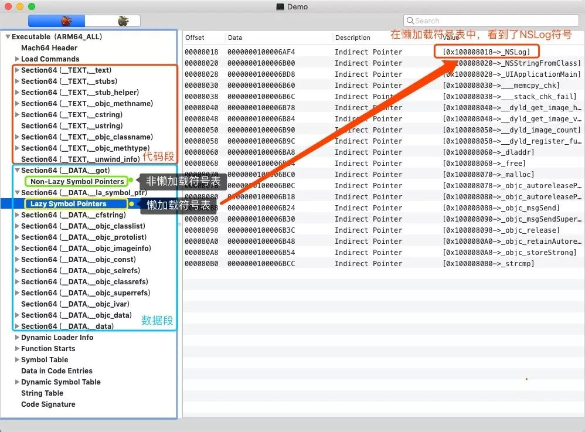

##### Offset符号偏移地址

在这里面我们就可以清晰的看到符号表在文件中长啥样了。并且最重要的是能够看出符号在文件中的偏移位置。

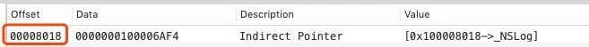

有了这个偏移值，我们可以在项目运行的时候，通过LLDB，观察的符号的绑定和重绑定过程。

#### 动态调试

1、来到我们原来的代码，在这几行打上断点并运行。

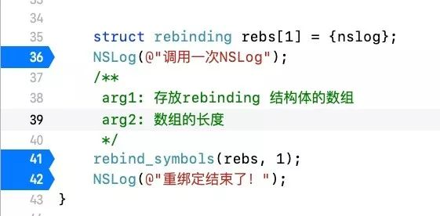

2、第一次断点触发时,我们利用 **LLDB** 查看符号中的值。

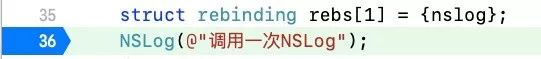

首先查看 MachO 文件的地址：通过 `image list`指令，查看所有镜像文件（ MachO 文件）的地址。

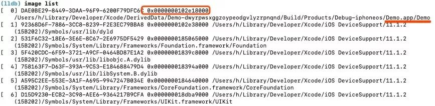

然后通过 `memory read`指令读取内存（ `memory read` ` image list地址 + offset符号偏移地址`）。因为符号是指针，所以读取8个字节的数据。

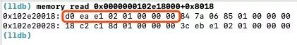

但是这里面存放的到底是不是 NSLog 的真实地址呢？我们如何查看。

我们可以利用 `dis-s`查看反汇编。由于 iOS 的小端模式，所以读数据从右往左读。比如：图中数据 `d0eae10201000000`那么读取出来的地址是 `0x0102e1ead0`

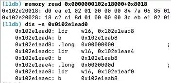

然后我们通过汇编发现，这里并不是 NSLog 的地址。如果是，这里会显示 Fundation 框架中的 NSLog 函数。其原因是因为 NSLog 是懒加载符号，此时是第一次调用，还没有绑定符号。此时如果跟汇编，我们最终会看到`dyld_stub_binder`函数的调用。所以，我们过掉断点。

3、来到第二个断点处

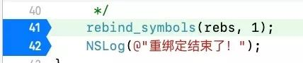

重复上面的步骤，查看符号的内存数据，然后取出里面的值，通过 dis 反汇编查看。你会发现此刻已经绑定了符号。可以清晰的看到里面是 NSLog 的实现地址了。（这个过程就是符号绑定！）

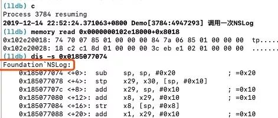

接下来，我们来看看 rebind_symbols 之后，我们的符号表里面保存的地址变成了啥？

4、来到第三个断点处（第42行）


重复上面的步骤，查看符号的内存数据，然后取出里面的值，通过 dis 反汇编查看。你会发现此刻符号内的数据已经替换成了自定义的函数地址了。（符号重绑定成功！）

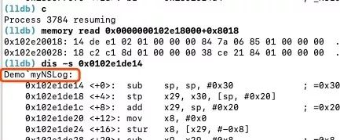

经过一系列动态调试，我们可以观察到符号绑定和重绑定的全部过程。但是，fishhook 是怎么通过我们传给它的一个字符就找到了我们 NSLog 的符号的呢？我们往下看...

### 通过符号找到字符串

#### Lazy Symbol Pointers

我们还是来到 MachOView 里面，NSLog 这个符号，在懒加载符号表里面是第一个。

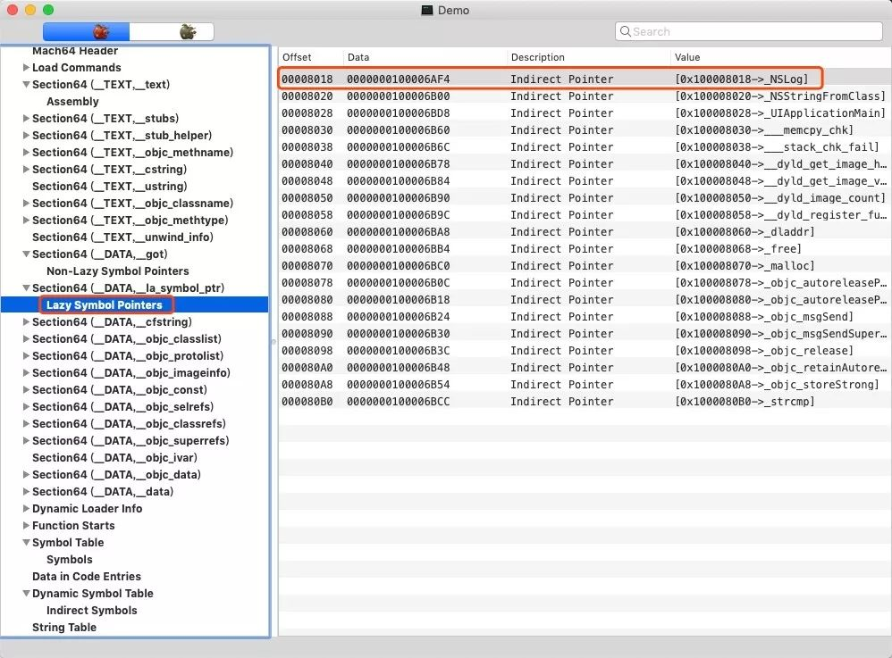

#### indirect Symbols

与懒加载表对应的另外一张表就出来了。indirect Symbols。懒加载表里面 NSLog 是第一个，那么它在 indirect Symbols 表里面也就是第一个。

接下来，将 indirect Symbols 里面对应的 Data 值换算成为10进制。

0x81 的十进制是 129 ，129又是另外一个列表的角标。

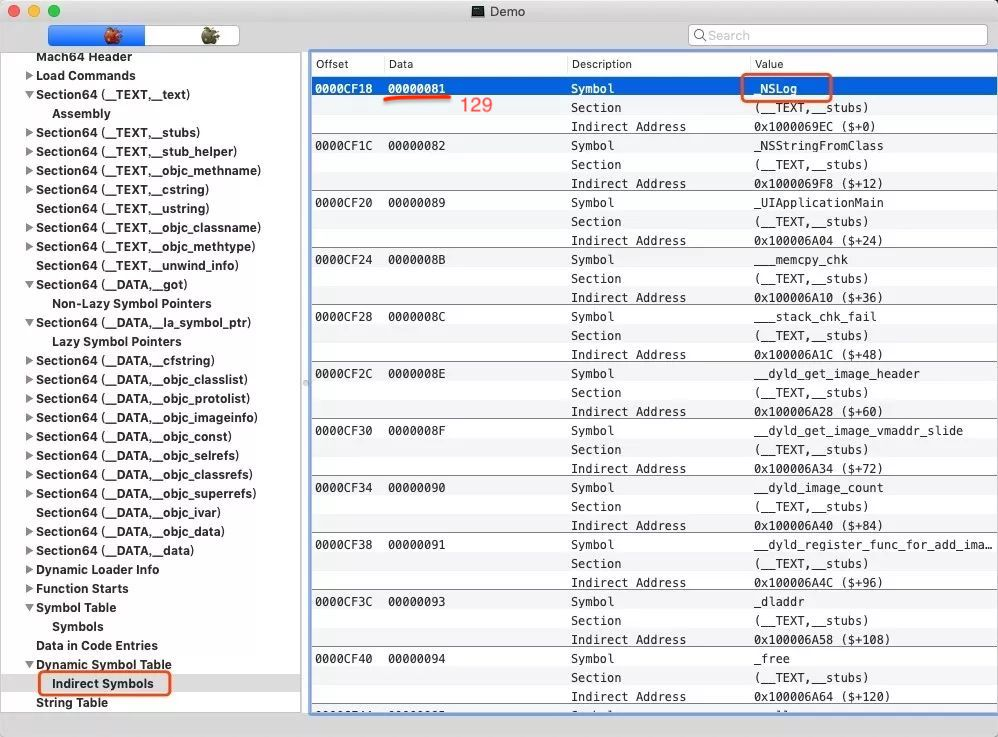

#### Symbols

这个列表就是 Symbols ，我们查看一下。

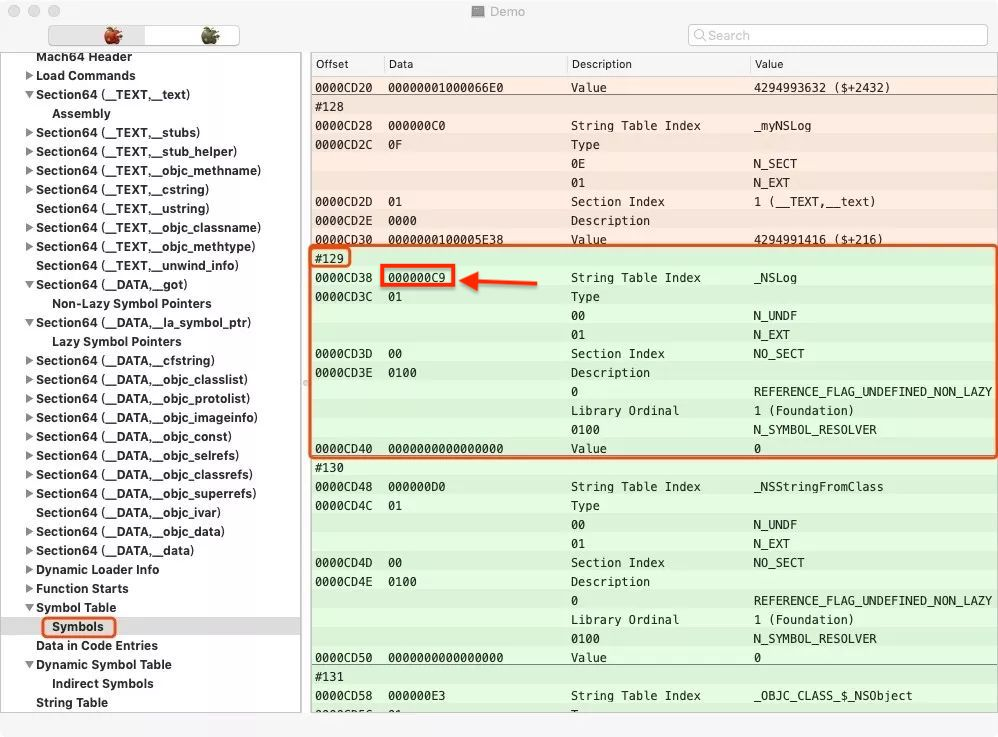

那么到了 Symbols 里面就接近我们最终的字符常量了。注意在 Symbols 里面有`String Table Index`的值。这里是 0xC9。这就说明，在 String Table 里面，偏移 0xC9 的地址就是我们NSLog字符。

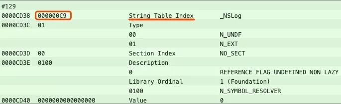

#### String Table

来到 String Table 里面。通过**起始位置加上偏移**便可以定位到 NSLog 字符了。

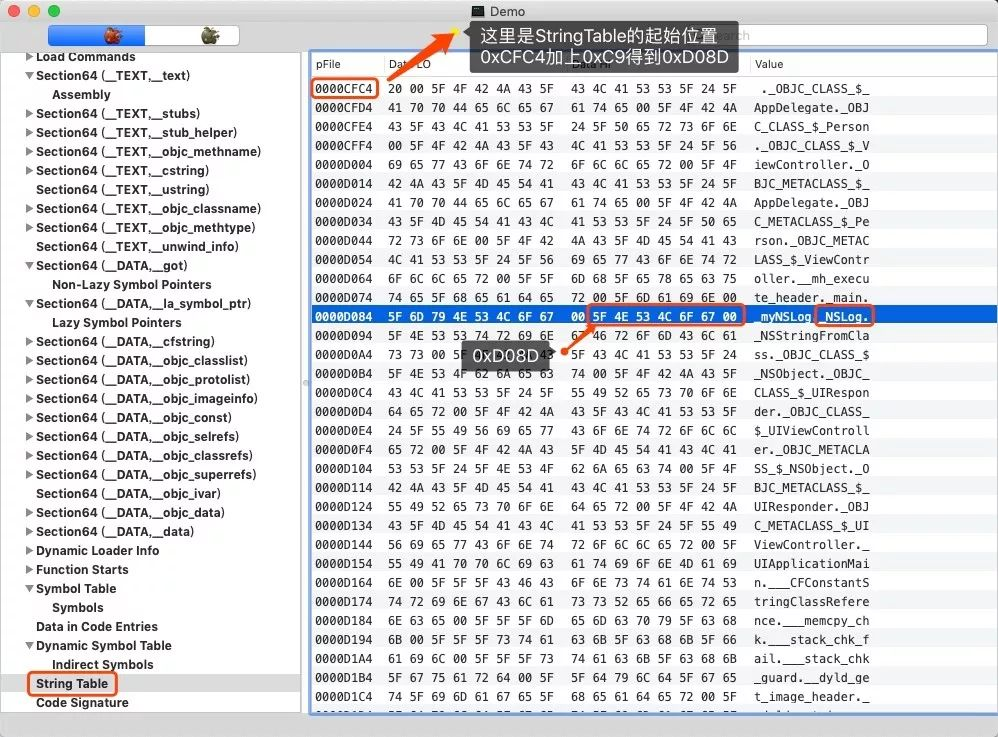

函数名称在字符表里面都是5F也就是 _ 开始 然后00也就是 . 结束! 这也就是为什么你给 fishhook 一个系统函数名称，它能够帮你顺利 HOOK 到系统函数的原理了。通过上面一顿分析，我相信官方的图你也能看懂了。官方是以 close 函数为例：

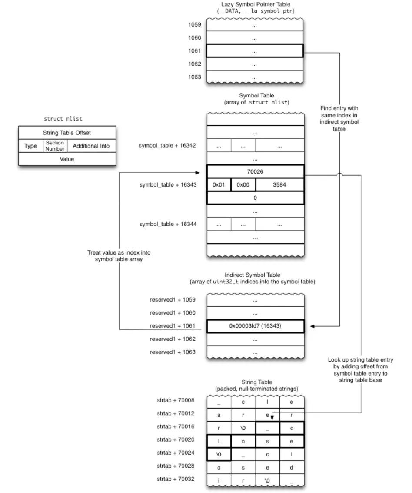

## 总结

修改外部符号（例：NSLog）的绑定。

通过`NSLog`字符串如何找到符号并修改：

1. 拿到NSLog字符串，去machO的`String Table`里面找`NSLog`，用`.`来分割。得到`String Table Index`。
2. 通过`String Table index`去`Symbol Table`的`Symbols`，定位到NSLog，得到符号表的偏移值（`Symbols Index`）
3. 通过`Symbols Index`去找`Indirect Symbols`得到该符号在`Indirect Symbols`中的顺序（偏移值）。
4. 由于`Lazy Symbol Pointers`的Index和`Indirect Symbols`一一对应，所以很容易就找到了对应的符号。
5. 最后修改`Lazy Symbol Pointers`里面的值。（因为外部符号的调用，都是找桩，桩去寻找`Lazy Symbol`里面的地址执行）

在`Lazy Symbol Pointers`懒加载符号表，修改了符号地址，把NSLog符号地址改为了自己应用程序image中自己定义方法MyNslog的地址。

## 后记

刚才我们通过动态调试加 MachOView 的分析梳理了整个**符号绑定以及重绑定**的过程。这个过程也是 fishhook 能够 HOOK 系统函数的原理。

## fishhook 用处

### 1、二进制重排启动优化

通过 objc_msgSend 函数的 HOOK ，定位到启动时所有的OC 方法。

### 2、埋点

Hook拦截用户手势交互或者进入某个指定页面等应用接口，进行用户行为统计分析。

### 3、应用加固

防止黑客通过Hook技术破解/攻破应用，来加固应用

### 4、应用隔离

通过Hook技术拦截系统/应用接口，避免数据泄漏