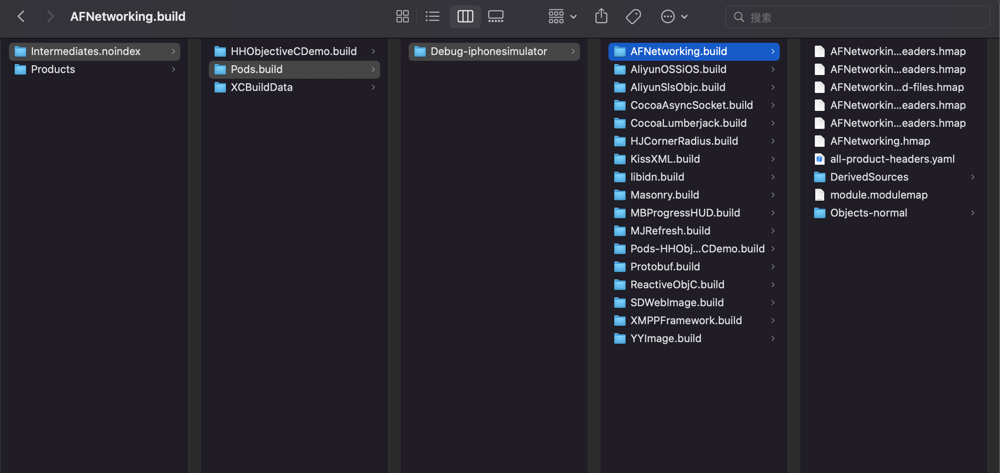
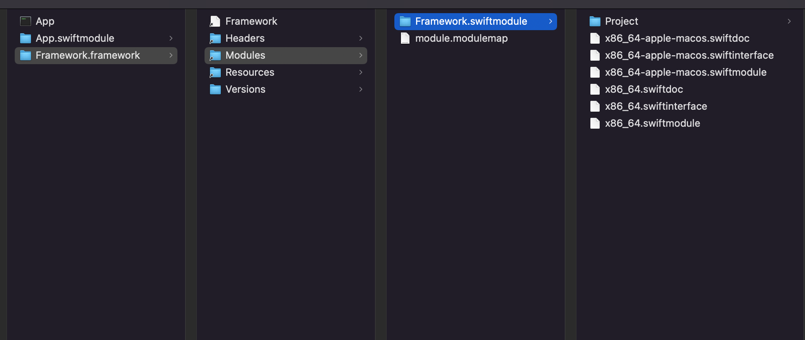

# hmap

全称headerMap头文件映射。

Key：ViewController.h  

value：目录+ViewController.h

通过引入头文件ViewController.h 作为key，找到value。

podfile每次编译对每个三方库都作为target都会生成hmap文件。每生成一个hmap文件需要0.1秒。

下面的目录Xcode有定义一个环境变量`$(TARGET_TEMP_DIR)`



AFNetworking-project-headers.hmap：以引号方式引入头文件。

buildsetting：控制clang的编译参数。定义shell环境变量。

headers.hmap路径放到`HEADER_SEARCH_PATHS`，则变成<>引入方式。一般系统的文件。

`USER_HEADER_SEARCH_PATHS`，引号引入方式。一般自己写的文件。

头文件参与文件的编译。

头文件如何把文件内容引入的：

1. 正常引入

   预处理的时候，通过头文件绝对路径，把.h直接写入.m中。

   通过路径，设置头文件查找的目录和头文件的名称

   clang默认当前工程目录。

2. module方式引入`#improt<UIKit.h>`

   普通：不同的.m都引入的一个头文件，所有的.m文件都包含同样的头文件内容，重复编译。

   module：通过module方式把一部分头文件包裹在一起，打包作为模块，预处理的时候把模块的头文件预编译成二进制，再编译.m文件，使用时直接把二进制放到.m中。加快编译速度，节省时间，避免符号重复问题（A.m和B.m都引入了C.h，C.h有一个全局函数，就会有符号重复）。

## 如何生成hmap

通过自己写命令生成hmap。减少Xcode编译的时间，加快编译。

适用于：自己写的组件。头文件不修改的时候，只需要跑一次命令。

GitHub搜：cocoapods-mapfile。

## import和include

`improt = include + # pragma once`，只编译一次。

## swift的module

```sh
# "${SOURCE_ROOT}/Products"
#  ${BUILT_PRODUCTS_DIR}

# 产物所在目录
echo "${BUILT_PRODUCTS_DIR}"
echo "${OTHER_LDFLAGS}---"
echo ${SOURCE_ROOT}

#rm -rf 删除Products文件目录
rm -rf "${SOURCE_ROOT}/Products"

#从BUILT_PRODUCTS_DIR目录拷贝文件到Products
cp -Rv -- "${BUILT_PRODUCTS_DIR}/" "${SOURCE_ROOT}/Products"
```

不能在同一个文件定义同一个key，可以创建不同的文件，导入。



swiftinterface兼容不同swift版本编译器，所以swiftinterface比swiftmodule要慢一点。

```swift
import Foundation

// 动态库
// runtime -> 性能下降
// swift 1.0 -》 2.0
@frozen
public struct Teacher {
    public init() {}
    // swift -》静态语言 -〉内存
    public var Kody = "11111112312312"
    //int
    public var Cat = 2
}
```

加了@frozen就是静态（冻住），不加就是运行

swift库版本从1.0更新到2.0的时候，把不需要更改的冻住，不用重新编译。

module是用来管理一组头文件的。

