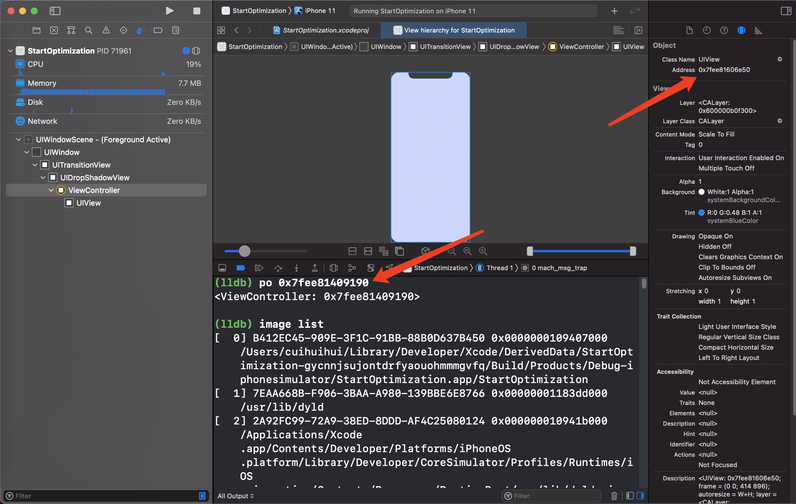

# 应用程序加载

## image镜像文件

底层基础库。并不是所有的都是从0开始写的。例如：UIKit，Foundation，libObjc，libDispath，libSystem等，都是image镜像文件。

库 映射到 内存中 就叫镜像images。

## 物理内存和虚拟内存



0x7fee81409190 不是内存中的真实地址 是虚拟地址

0x7fee81409190-ASLR不是真实物理地址

如果是的话，再开启一个app能不能访问这个地址？所以是虚拟表里的地址。

### 物理内存时代

早期启动一个应用程序是将整块加载进内存里。

#### 优点

- 代码在当前程序中的偏移地址确定，物理地址不知道。只有运行之后才知道。代码的访问：基地址加偏移地址。比较安全。

#### 缺点

- 安全问题：早期应用程序之间是可以访问的，因为用的物理地址进行的数据读写，所以**当前应用可以读取别的应用的数据**。
- 内存不足：将整个应用程序加载到内存中，是物理地址，加载应用程序多的时候会内存不够用。每一个应用在内存中的位置不确定，随机的。

### 虚拟内存

出现虚拟地址之后，虚拟地址固定，应用程序访问数据永远都是从0x000fcc（举例）开始。所以只要知道偏移地址，通过内存地址访问，安全系数降低了。因为安全漏洞所以出现了ASLR。

在每次启动程序的时候在地址前加ASLR。ASLR值是随机的。虚拟内存加一个偏移值，像早期物理地址有一个随机的开始位置。

虚拟地址映射到物理地址。

程序访问的是虚拟地址。CPU访问的是物理地址。

#### 优点

解决安全问题（app之间隔离）

#### 虚拟内存的分段管理

好处：解决内存不够用问题，内存更大化的利用

软件的发展速度比硬件快，大量的大型程序产生，所以没法同时运行多个项目，内存不够用。

大型软件，用户使用的时候，如果一次把软件加载进去不划算，用户使用的时候不会使用应用的所有功能，将整个应用程序放到内存里浪费。

应用程序加载到内存的时候 使用**懒加载**。不是将整个应用程序一次加载进去，将应用程序分成一小块一小块。启动应用的时候，把启动时候需要的代码载入内存中，用到新的功能的时候再把新的功能代码载入内存。

用户用到哪一块就加载哪一块儿，分段就会造成不连续的问题：

用户打开一个应用，会将用到的载入到内存。不会整个的载入。用户打开另一个应用，同理将用到的载入内存。用户来回切换不同的应用，不同应用不同模块就会载入到内存。内存地址不连续。不知道分配到内存的哪个地方。

在内存条里面排列的数据是打开的不同应用程序用的不同模块。随机的。应用程序访问内存中数据的时候在内存中就是乱序的。物理地址是乱序的，不连续的。

#### 虚拟表（分页加载）

CPU有一个硬件MMU（内存管理单元），作用是翻译地址。

程序找映射表，虚拟地址和物理地址的映射关系。虚拟地址连续的。虚拟地址从表中找到对应的物理地址中的数据。一块儿一块儿的映射，速度快 提升执行效率。所以需要一个分页page。iOS一页是16K，mac一页是4K。

需要时才加载，并且本身有内存覆盖的算法。

程序访问内存数据的时候是连续的，实际的地址是乱序的。中间有一个表格：应用程序访问的虚拟内存地址 做映射，地址翻译，寻找真实物理地址。 翻译工作是CPU和操作系统配合处理的。

安全问题：

每次只能访问一页地址。

应用程序访问的是虚拟地址，接触不了物理地址。当前应用程序只映射了当前应用的地址，访问不了别的应用的地址。进程和进程之间通过**地址映射表**做了相对的隔离。

### 共享缓存区

保证进程数据独立，iOS的共享缓存库UIKit foundation 是共有的，每个进程都可以访问。共享缓存也是放内存中的。在内存的一个位置。

不同app访问共享缓存区的物理地址一样，虚拟地址不一样（因为ASLR）。

## 1、加载到内存

点击App，操作系统会在手机上为程序开辟一段虚拟内存空间，然后加载Mach-O格式的可执行二进制文件。

### ASLR（随机偏移地址）

内存有一个PAGEZERO的区域，这是苹果的ASLR（Address Space Layout Random：随机偏移地址）技术，也就是**地址空间布局随机化**。是一种针对缓冲区溢出的安全保护技术，通过对堆、栈、共享库映射等线性区布局的随机化，增加攻击者预测目的地址的难度，防止攻击者指针定位攻击代码位置，达到阻止溢出攻击的一种技术。

当编译出一个App的时候，生成的Mach-O文件的内容地址是固定的。ASLR技术在每次App运行在内存中的时候，都会加上一个PAGEZERO，PAGEZERO的大小都是随机的。加上PAGEZERO以后，Mach-O里面的地址都会需要加上相对的偏移，在内存的首地址都会发生变化，基地址不一样。在虚拟地址前面加一个偏移量（ASLR），增加App的攻击难度。

在虚拟内存地址出现之后就出现了ASLR。

`image list`查看第一个就是程序运行的基地址（起始地址），项目本身在内存中的地址（machO地址）。

## 2、dyld动态链接器

在load方法中打断点，然后bt，查看堆栈，最下面的是`dyld_start`。

点击应用程序的时候，系统调用exec函数。

调用dyld进程加载dylib，链接库。

把Mach-O当作一个image加载到虚拟内存后，会启动dyld进程，dyld根据load commonds中的加载命令把需要的动态库加载到虚拟内存中。

### dyld具体的工作

1. 递归加载所依赖的动态库
   1. 加载动态库和可执行文件的初始化
   2. libsystem第一个被初始化，libsystem调libdispatch，libdispatch调libObjc初始化`_objc_init`
   3. `_objc_init`里面调`_dyld_objc_notify_register(&map_images, load_images, unmap_image);`。关于类的加载。
2. rebase和binding
3. 调起main函数

重写load方法，可以查看main之前打调用。

### _objc_init

```c++
void _objc_init(void)
{
    static bool initialized = false;
    if (initialized) return;
    initialized = true;
    
    // fixme defer initialization until an objc-using image is found?
    environ_init();		//环境变量初始化
	tls_init();			//创建线程的析构函数
    static_init();		//运⾏C++静态构造函数
    runtime_init();		//分类表初始化，类表初始化
    exception_init();	//异常处理的初始化(数组越界，方法找不到的报错)
#if __OBJC2__
    cache_t::init();	//缓存的初始化
#endif
    _imp_implementationWithBlock_init();//Mac OS的
    
    //&map_images引用传递，load_images值传递，加载load方法
    _dyld_objc_notify_register(&map_images, load_images, unmap_image);//3个函数

#if __OBJC2__
    didCallDyldNotifyRegister = true;//标识对_dyld_objc_notify_register的调⽤已完成
#endif
}
```

#### runtime_init

```c++
void runtime_init(void)
{
  	//初始化两张表
    objc::unattachedCategories.init(32);//分类表的初始化
    objc::allocatedClasses.init();		//类表的初始化，类表里面存的所有的类
}
```

#### _dyld_objc_notify_register(&map_images, load_images, unmap_image);

#### 1、load_images

```c++
void
load_images(const char *path __unused, const struct mach_header *mh)
{
    if (!didInitialAttachCategories && didCallDyldNotifyRegister) {
        didInitialAttachCategories = true;
        loadAllCategories();
    }

    // Return without taking locks if there are no +load methods here.
    if (!hasLoadMethods((const headerType *)mh)) return;

    recursive_mutex_locker_t lock(loadMethodLock);

    // Discover load methods
    {
        mutex_locker_t lock2(runtimeLock);
        //找load方法
        prepare_load_methods((const headerType *)mh);
    }

    // Call +load methods (without runtimeLock - re-entrant)
    call_load_methods();//执行load方法
}
```

##### 1、prepare_load_methods

```c++
void prepare_load_methods(const headerType *mhdr)
{
    size_t count, i;

    runtimeLock.assertLocked();
    //找所有的非懒加载类（重写了load就是非懒加载类）
    classref_t const *classlist = 
        _getObjc2NonlazyClassList(mhdr, &count);
    for (i = 0; i < count; i++) {
        schedule_class_load(remapClass(classlist[i]));
    }

  	//找完类的load，然后找分类的load
    category_t * const *categorylist = _getObjc2NonlazyCategoryList(mhdr, &count);
    for (i = 0; i < count; i++) {
        category_t *cat = categorylist[i];
        Class cls = remapClass(cat->cls);
        if (!cls) continue;  // category for ignored weak-linked class
        if (cls->isSwiftStable()) {
            _objc_fatal("Swift class extensions and categories on Swift "
                        "classes are not allowed to have +load methods");
        }
        realizeClassWithoutSwift(cls, nil);
        ASSERT(cls->ISA()->isRealized());
        add_category_to_loadable_list(cat);
    }
}
```

###### schedule_class_load

```c++
static void schedule_class_load(Class cls)
{
    //不需要super load，父类的load优先子类的load
    if (!cls) return;
    ASSERT(cls->isRealized());  // _read_images should realize

    if (cls->data()->flags & RW_LOADED) return;

    // Ensure superclass-first ordering
    //递归，会先找父类的load
    schedule_class_load(cls->getSuperclass());

    add_class_to_loadable_list(cls);
    cls->setInfo(RW_LOADED); 
}
```

##### 2、call_load_methods

```c++
void call_load_methods(void)
{
    static bool loading = NO;
    bool more_categories;

    loadMethodLock.assertLocked();

    // Re-entrant calls do nothing; the outermost call will finish the job.
    if (loading) return;
    loading = YES;

    void *pool = objc_autoreleasePoolPush();

    do {
        // 1. Repeatedly call class +loads until there aren't any more
        while (loadable_classes_used > 0) {
            call_class_loads();//类的load
        }

        // 2. Call category +loads ONCE
        more_categories = call_category_loads();//分类的load

        // 3. Run more +loads if there are classes OR more untried categories
    } while (loadable_classes_used > 0  ||  more_categories);

    objc_autoreleasePoolPop(pool);

    loading = NO;
}
```

##### +load方法执行顺序

1. +load方法调用顺序是：`SuperClass -->SubClass --> SuperClassCategaryClass --> SubClassCategaryClass`。
2. 不同的类按照编译先后顺序调用+load方法（后编译，先执行）；
3. 分类顺序按照编译先后顺序调用+load（后编译，先执行）；

##### 总结

1. load方法是在main函数执行前执行的。iOS应用启动的时候，就会加载所有的类，就会调用这个方法。
2. +load方法是在加载类和分类时系统调用，一般不手动调用，如果想要在类或分类加载时做一些事情，可以重写类或分类的+load方法。
3. 不需要[super load]，因为会自动的找superClass的load。
4. 类、分类的加载和+load方法有关，在程序运行过程只调用一次。
5. load是线程安全的，都有加锁操作。

##### load和initialize

想在类加载进内存的时候调用，就用load方法

想在第一次加载使用类的时候调用，就用initialized方法，也是只会调用一次。

#### 2、map_images

```c++
void
map_images(unsigned count, const char * const paths[],
           const struct mach_header * const mhdrs[])
{
    mutex_locker_t lock(runtimeLock);
    return map_images_nolock(count, paths, mhdrs);
}
```

```c++
void 
map_images_nolock(unsigned mhCount, const char * const mhPaths[],
                  const struct mach_header * const mhdrs[])
{
    static bool firstTime = YES;
    header_info *hList[mhCount];
    uint32_t hCount;
    size_t selrefCount = 0;

    // Perform first-time initialization if necessary.
    // This function is called before ordinary library initializers. 
    // fixme defer initialization until an objc-using image is found?
    if (firstTime) {
        preopt_init();//共享缓存有关
    }

    if (PrintImages) {
        _objc_inform("IMAGES: processing %u newly-mapped images...\n", mhCount);
    }


    // Find all images with Objective-C metadata.
    hCount = 0;

  	//统计所有类（可执行文件中类，动态库中的类）。可执行文件、动态库都是Mach O格式的文件
    // Count classes. Size various table based on the total.
    int totalClasses = 0;
    int unoptimizedTotalClasses = 0;
    {
        uint32_t i = mhCount;
        while (i--) {//找到所有的类
            const headerType *mhdr = (const headerType *)mhdrs[i];
            //从头部文件读
            auto hi = addHeader(mhdr, mhPaths[i], totalClasses, unoptimizedTotalClasses);
            if (!hi) {
                // no objc data in this entry
                continue;
            }
            
            if (mhdr->filetype == MH_EXECUTE) {
                // Size some data structures based on main executable's size
#if __OBJC2__
                // If dyld3 optimized the main executable, then there shouldn't
                // be any selrefs needed in the dynamic map so we can just init
                // to a 0 sized map
                if ( !hi->hasPreoptimizedSelectors() ) {
                  size_t count;
                  _getObjc2SelectorRefs(hi, &count);
                  selrefCount += count;
                  _getObjc2MessageRefs(hi, &count);
                  selrefCount += count;
                }
#else
                _getObjcSelectorRefs(hi, &selrefCount);
#endif
                
#if SUPPORT_GC_COMPAT
                // Halt if this is a GC app.
                if (shouldRejectGCApp(hi)) {
                    _objc_fatal_with_reason
                        (OBJC_EXIT_REASON_GC_NOT_SUPPORTED, 
                         OS_REASON_FLAG_CONSISTENT_FAILURE, 
                         "Objective-C garbage collection " 
                         "is no longer supported.");
                }
#endif
            }
            
            hList[hCount++] = hi;
            
            if (PrintImages) {
                _objc_inform("IMAGES: loading image for %s%s%s%s%s\n", 
                             hi->fname(),
                             mhdr->filetype == MH_BUNDLE ? " (bundle)" : "",
                             hi->info()->isReplacement() ? " (replacement)" : "",
                             hi->info()->hasCategoryClassProperties() ? " (has class properties)" : "",
                             hi->info()->optimizedByDyld()?" (preoptimized)":"");
            }
        }
    }

    // Perform one-time runtime initialization that must be deferred until 
    // the executable itself is found. This needs to be done before 
    // further initialization.
    // (The executable may not be present in this infoList if the 
    // executable does not contain Objective-C code but Objective-C 
    // is dynamically loaded later.
    if (firstTime) {
        sel_init(selrefCount);//C++的构造函数和析构方法。
        arr_init();

#if SUPPORT_GC_COMPAT
        /**
        关于Mac OS的，不用管。
        */
#endif

#if TARGET_OS_OSX
        /**
        关于Mac OS的，不用管。
        */
#endif
      
    }

  	//所有类初始化完成之后
    if (hCount > 0) {
        _read_images(hList, hCount, totalClasses, unoptimizedTotalClasses);
    }

    firstTime = NO;
    
    // Call image load funcs after everything is set up.
    for (auto func : loadImageFuncs) {
        for (uint32_t i = 0; i < mhCount; i++) {
            func(mhdrs[i]);
        }
    }
}
```

##### arr_init

```c++
void arr_init(void) 
{
    AutoreleasePoolPage::init();//自动释放池
    SideTablesMap.init();		//散列表
    _objc_associations_init();	//关联对象的初始化操作
    if (DebugScanWeakTables)
        startWeakTableScan();
}
```

##### _read_images

_read_images镜像文件，llvm编译阶段SEL和IMP绑定修复。

_read_images里面有很多的fix up，因为虚拟内存（ASLR）。地址空间随机布局。app每次启动内存地址都不固定。需要dyld的rebase和binding，修改镜像指针地址。

作用：进行类的初始化。

流程：

1. 加载所有类到类的gdb_objc_realized_classes表中。 
2. 对所有类做重映射。
3. 将所有SEL都注册到namedSelectors表中。
4. 修复函数指针遗留。
5. 将所有Protocol都添加到protocol_map表中。
6. 对所有Protocol做重映射。
7. 初始化所有非懒加载的类，进行rw、ro等操作。 
8. 遍历已标记的懒加载的类，并做初始化操作。
9. 处理所有Category，包括Class和Meta Class。 
10. 初始化所有未初始化的类。

```c++
void _read_images(header_info **hList, uint32_t hCount, int totalClasses, int unoptimizedTotalClasses)
{
    header_info *hi;
    uint32_t hIndex;
    size_t count;
    size_t i;
    Class *resolvedFutureClasses = nil;
    size_t resolvedFutureClassCount = 0;
    static bool doneOnce;
    bool launchTime = NO;
    TimeLogger ts(PrintImageTimes);

    runtimeLock.assertLocked();

#define EACH_HEADER \
    hIndex = 0;         \
    hIndex < hCount && (hi = hList[hIndex]); \
    hIndex++

    if (!doneOnce) {
        doneOnce = YES;
        launchTime = YES;

#if SUPPORT_NONPOINTER_ISA
        // Disable non-pointer isa under some conditions.

# if SUPPORT_INDEXED_ISA
        // Disable nonpointer isa if any image contains old Swift code
        //默认开启isa指针优化
        for (EACH_HEADER) {
            if (hi->info()->containsSwift()  &&
                hi->info()->swiftUnstableVersion() < objc_image_info::SwiftVersion3)
            {
                DisableNonpointerIsa = true;
                if (PrintRawIsa) {
                    _objc_inform("RAW ISA: disabling non-pointer isa because "
                                 "the app or a framework contains Swift code "
                                 "older than Swift 3.0");
                }
                break;
            }
        }
# endif

# if TARGET_OS_OSX
        // Disable non-pointer isa if the app is too old
        // (linked before OS X 10.11)
        // Note: we must check for macOS, because Catalyst and Almond apps
        // return false for a Mac SDK check! rdar://78225780
//        if (dyld_get_active_platform() == PLATFORM_MACOS && !dyld_program_sdk_at_least(dyld_platform_version_macOS_10_11)) {
//            DisableNonpointerIsa = true;
//            if (PrintRawIsa) {
//                _objc_inform("RAW ISA: disabling non-pointer isa because "
//                             "the app is too old.");
//            }
//        }

        // Disable non-pointer isa if the app has a __DATA,__objc_rawisa section
        // New apps that load old extensions may need this.
        for (EACH_HEADER) {
            if (hi->mhdr()->filetype != MH_EXECUTE) continue;
            unsigned long size;
            if (getsectiondata(hi->mhdr(), "__DATA", "__objc_rawisa", &size)) {
                DisableNonpointerIsa = true;
                if (PrintRawIsa) {
                    _objc_inform("RAW ISA: disabling non-pointer isa because "
                                 "the app has a __DATA,__objc_rawisa section");
                }
            }
            break;  // assume only one MH_EXECUTE image
        }
# endif

#endif

        if (DisableTaggedPointers) {
            disableTaggedPointers();
        }
        
        initializeTaggedPointerObfuscator();

        if (PrintConnecting) {
            _objc_inform("CLASS: found %d classes during launch", totalClasses);
        }

        // namedClasses
        // Preoptimized classes don't go in this table.
        // 4/3 is NXMapTable's load factor
        int namedClassesSize = 
            (isPreoptimized() ? unoptimizedTotalClasses : totalClasses) * 4 / 3;
        gdb_objc_realized_classes =
            NXCreateMapTable(NXStrValueMapPrototype, namedClassesSize);

        ts.log("IMAGE TIMES: first time tasks");
    }

    // Fix up @selector references
    // Note this has to be before anyone uses a method list, as relative method
    // lists point to selRefs, and assume they are already fixed up (uniqued).
    //修复selector。rebase过程，sel修改为正确的内存地址。
    static size_t UnfixedSelectors;
    {
        mutex_locker_t lock(selLock);
        for (EACH_HEADER) {
            if (hi->hasPreoptimizedSelectors()) continue;

            bool isBundle = hi->isBundle();
            SEL *sels = _getObjc2SelectorRefs(hi, &count);
            UnfixedSelectors += count;
            for (i = 0; i < count; i++) {
                const char *name = sel_cname(sels[i]);
                SEL sel = sel_registerNameNoLock(name, isBundle);
                if (sels[i] != sel) {
                    sels[i] = sel;
                }
            }
        }
    }

    ts.log("IMAGE TIMES: fix up selector references");

    // Discover classes. Fix up unresolved future classes. Mark bundle classes.
    bool hasDyldRoots = dyld_shared_cache_some_image_overridden();

    for (EACH_HEADER) {
        if (! mustReadClasses(hi, hasDyldRoots)) {
            // Image is sufficiently optimized that we need not call readClass()
            continue;
        }

        classref_t const *classlist = _getObjc2ClassList(hi, &count);

        bool headerIsBundle = hi->isBundle();
        bool headerIsPreoptimized = hi->hasPreoptimizedClasses();

        for (i = 0; i < count; i++) {
            Class cls = (Class)classlist[i];
            Class newCls = readClass(cls, headerIsBundle, headerIsPreoptimized);

            if (newCls != cls  &&  newCls) {
                // Class was moved but not deleted. Currently this occurs 
                // only when the new class resolved a future class.
                // Non-lazily realize the class below.
                resolvedFutureClasses = (Class *)
                    realloc(resolvedFutureClasses, 
                            (resolvedFutureClassCount+1) * sizeof(Class));
                resolvedFutureClasses[resolvedFutureClassCount++] = newCls;
            }
        }
    }

    ts.log("IMAGE TIMES: discover classes");

    // Fix up remapped classes
    // Class list and nonlazy class list remain unremapped.
    // Class refs and super refs are remapped for message dispatching.
    
    if (!noClassesRemapped()) {
        for (EACH_HEADER) {
            Class *classrefs = _getObjc2ClassRefs(hi, &count);
            for (i = 0; i < count; i++) {
                remapClassRef(&classrefs[i]);
            }
            // fixme why doesn't test future1 catch the absence of this?
            classrefs = _getObjc2SuperRefs(hi, &count);
            for (i = 0; i < count; i++) {
                remapClassRef(&classrefs[i]);
            }
        }
    }

    ts.log("IMAGE TIMES: remap classes");

#if SUPPORT_FIXUP
    // Fix up old objc_msgSend_fixup call sites
    for (EACH_HEADER) {
        message_ref_t *refs = _getObjc2MessageRefs(hi, &count);
        if (count == 0) continue;

        if (PrintVtables) {
            _objc_inform("VTABLES: repairing %zu unsupported vtable dispatch "
                         "call sites in %s", count, hi->fname());
        }
        for (i = 0; i < count; i++) {
            fixupMessageRef(refs+i);
        }
    }

    ts.log("IMAGE TIMES: fix up objc_msgSend_fixup");
#endif


    // Discover protocols. Fix up protocol refs.
    for (EACH_HEADER) {
        extern objc_class OBJC_CLASS_$_Protocol;
        Class cls = (Class)&OBJC_CLASS_$_Protocol;
        ASSERT(cls);
        NXMapTable *protocol_map = protocols();
        bool isPreoptimized = hi->hasPreoptimizedProtocols();

        // Skip reading protocols if this is an image from the shared cache
        // and we support roots
        // Note, after launch we do need to walk the protocol as the protocol
        // in the shared cache is marked with isCanonical() and that may not
        // be true if some non-shared cache binary was chosen as the canonical
        // definition
        if (launchTime && isPreoptimized) {
            if (PrintProtocols) {
                _objc_inform("PROTOCOLS: Skipping reading protocols in image: %s",
                             hi->fname());
            }
            continue;
        }

        bool isBundle = hi->isBundle();

        protocol_t * const *protolist = _getObjc2ProtocolList(hi, &count);
        for (i = 0; i < count; i++) {
            readProtocol(protolist[i], cls, protocol_map, 
                         isPreoptimized, isBundle);
        }
    }

    ts.log("IMAGE TIMES: discover protocols");

    // Fix up @protocol references
    // Preoptimized images may have the right 
    // answer already but we don't know for sure.
    for (EACH_HEADER) {
        // At launch time, we know preoptimized image refs are pointing at the
        // shared cache definition of a protocol.  We can skip the check on
        // launch, but have to visit @protocol refs for shared cache images
        // loaded later.
        if (launchTime && hi->isPreoptimized())
            continue;
        protocol_t **protolist = _getObjc2ProtocolRefs(hi, &count);
        for (i = 0; i < count; i++) {
            remapProtocolRef(&protolist[i]);
        }
    }

    ts.log("IMAGE TIMES: fix up @protocol references");

    // Discover categories. Only do this after the initial category
    // attachment has been done. For categories present at startup,
    // discovery is deferred until the first load_images call after
    // the call to _dyld_objc_notify_register completes. rdar://problem/53119145
    if (didInitialAttachCategories) {
        for (EACH_HEADER) {
            load_categories_nolock(hi);
        }
    }

    ts.log("IMAGE TIMES: discover categories");

    // Category discovery MUST BE Late to avoid potential races
    // when other threads call the new category code before
    // this thread finishes its fixups.

    // +load handled by prepare_load_methods()

    // Realize non-lazy classes (for +load methods and static instances)
  //处理非懒加载类的加载
    for (EACH_HEADER) {
        classref_t const *classlist = hi->nlclslist(&count);
        for (i = 0; i < count; i++) {
            Class cls = remapClass(classlist[i]);
            if (!cls) continue;

            addClassTableEntry(cls);

            if (cls->isSwiftStable()) {
                if (cls->swiftMetadataInitializer()) {
                    _objc_fatal("Swift class %s with a metadata initializer "
                                "is not allowed to be non-lazy",
                                cls->nameForLogging());
                }
                // fixme also disallow relocatable classes
                // We can't disallow all Swift classes because of
                // classes like Swift.__EmptyArrayStorage
            }
            realizeClassWithoutSwift(cls, nil);
        }
    }

    ts.log("IMAGE TIMES: realize non-lazy classes");

    // Realize newly-resolved future classes, in case CF manipulates them
    if (resolvedFutureClasses) {
        for (i = 0; i < resolvedFutureClassCount; i++) {
            Class cls = resolvedFutureClasses[i];
            if (cls->isSwiftStable()) {
                _objc_fatal("Swift class is not allowed to be future");
            }
            realizeClassWithoutSwift(cls, nil);
            cls->setInstancesRequireRawIsaRecursively(false/*inherited*/);
        }
        free(resolvedFutureClasses);
    }

    ts.log("IMAGE TIMES: realize future classes");

    if (DebugNonFragileIvars) {
        realizeAllClasses();
    }


    // Print preoptimization statistics
    if (PrintPreopt) {
        static unsigned int PreoptTotalMethodLists;
        static unsigned int PreoptOptimizedMethodLists;
        static unsigned int PreoptTotalClasses;
        static unsigned int PreoptOptimizedClasses;

        for (EACH_HEADER) {
            if (hi->hasPreoptimizedSelectors()) {
                _objc_inform("PREOPTIMIZATION: honoring preoptimized selectors "
                             "in %s", hi->fname());
            }
            else if (hi->info()->optimizedByDyld()) {
                _objc_inform("PREOPTIMIZATION: IGNORING preoptimized selectors "
                             "in %s", hi->fname());
            }

            classref_t const *classlist = _getObjc2ClassList(hi, &count);
            for (i = 0; i < count; i++) {
                Class cls = remapClass(classlist[i]);
                if (!cls) continue;

                PreoptTotalClasses++;
                if (hi->hasPreoptimizedClasses()) {
                    PreoptOptimizedClasses++;
                }
                
                const method_list_t *mlist;
                if ((mlist = cls->bits.safe_ro()->baseMethods)) {
                    PreoptTotalMethodLists++;
                    if (mlist->isFixedUp()) {
                        PreoptOptimizedMethodLists++;
                    }
                }
                if ((mlist = cls->ISA()->bits.safe_ro()->baseMethods)) {
                    PreoptTotalMethodLists++;
                    if (mlist->isFixedUp()) {
                        PreoptOptimizedMethodLists++;
                    }
                }
            }
        }

        _objc_inform("PREOPTIMIZATION: %zu selector references not "
                     "pre-optimized", UnfixedSelectors);
        _objc_inform("PREOPTIMIZATION: %u/%u (%.3g%%) method lists pre-sorted",
                     PreoptOptimizedMethodLists, PreoptTotalMethodLists, 
                     PreoptTotalMethodLists
                     ? 100.0*PreoptOptimizedMethodLists/PreoptTotalMethodLists 
                     : 0.0);
        _objc_inform("PREOPTIMIZATION: %u/%u (%.3g%%) classes pre-registered",
                     PreoptOptimizedClasses, PreoptTotalClasses, 
                     PreoptTotalClasses 
                     ? 100.0*PreoptOptimizedClasses/PreoptTotalClasses
                     : 0.0);
        _objc_inform("PREOPTIMIZATION: %zu protocol references not "
                     "pre-optimized", UnfixedProtocolReferences);
    }

#undef EACH_HEADER
}
```

##### 修复处理

##### 1、Rebase重定向

**针对本地函数，例如viewDidLoad:**

在编译过程中，Mach-O文件的文件引用。由于签名和ASLR技术加载了PAGEZERO区域，所以文件里面的内容都会有偏移。这时候就需要修正文件里面的指针引用。Rebase过程就是对于文件里面的指针一个修正过程。

文件中的数据访问内存地址都是随机的，虚拟内存出现后，虚拟内存地址是固定的从0开始，不安全，通过偏移地址就可以访问，所以出现ASLR。每次生成的虚拟页表不从0开始，从一个随机值起始位置开始。每次应用起始位置都不同。

ASLR+`viewDidLoad在mach-o文件中的偏移值`就可以得到`viewDidLoad`地址，自定义test函数同样。

外部的函数`NSLog`得不到，`NSLog`在Fundation里面，和machO文件无关。

image镜像文件通过dyld（动态链接器）加载。Fundation通过dyld加载。`NSLog`地址通过dyld得到。

**通过ASLR+偏移就可以找到代码的动作就叫rebase重定位动作。**

##### 2、binding绑定（懒加载绑定）

**针对外部的函数，例如NSLog。**

执行的时候把函数地址和项目中符号绑定。

一旦执行就绑定，NSLog是懒绑定，用的时候才绑定。

生成本地macho文件 代码和数据。里面有符号表，是一个指针。执行的时候发现外部符号会找符号。如果符号没绑定地址则在内存共享缓存空间找外部动态库，然后绑定。以后就可以直接找。

##### PIC技术

内部文件访问函数的时候，通过内部符号访问外部。外部地址绑定，外部符号表绑定。

一般除了`dyld_stub_binder`是非懒加载绑定，其它的都是懒加载绑定。

**外部函数都会生成符号表。通过符号表就可以找到绑定的空间。**

在编译过程，可执行文件对动态库的方法调用是只声明了符号。在调用dyld把这些动态库在加载到内存后，需要去相应的动态库中链接对应的方法，找到其指针，然后对可执行文件中的指针执行修复。Bind过程中就是把这些指向动态库的指针进行修复。

#### ⾮懒加载类的初始化

关键函数： realizeClassWithoutSwift

```c++
/***********************************************************************
* realizeClassWithoutSwift
* Performs first-time initialization on class cls, 
* including allocating its read-write data.
* Does not perform any Swift-side initialization.
* Returns the real class structure for the class. 
* Locking: runtimeLock must be write-locked by the caller
**********************************************************************/
static Class realizeClassWithoutSwift(Class cls, Class previously)
{
    /**
 		 省略代码
 		 */
    if (ro->flags & RO_FUTURE) {
        // This was a future class. rw data is already allocated.
        rw = cls->data();
        ro = cls->data()->ro();
        ASSERT(!isMeta);
        cls->changeInfo(RW_REALIZED|RW_REALIZING, RW_FUTURE);
    } else {
        // Normal class. Allocate writeable class data.
      	//给rw开辟内存空间，然后将ro的数据“拷⻉”到rw⾥⾯。
        rw = objc::zalloc<class_rw_t>();
        rw->set_ro(ro);
        rw->flags = RW_REALIZED|RW_REALIZING|isMeta;
        cls->setData(rw);
    }

    cls->cache.initializeToEmptyOrPreoptimizedInDisguise();

#if FAST_CACHE_META
    if (isMeta) cls->cache.setBit(FAST_CACHE_META);
#endif

    // Choose an index for this class.
    // Sets cls->instancesRequireRawIsa if indexes no more indexes are available
    cls->chooseClassArrayIndex();

    if (PrintConnecting) {
        _objc_inform("CLASS: realizing class '%s'%s %p %p #%u %s%s",
                     cls->nameForLogging(), isMeta ? " (meta)" : "", 
                     (void*)cls, ro, cls->classArrayIndex(),
                     cls->isSwiftStable() ? "(swift)" : "",
                     cls->isSwiftLegacy() ? "(pre-stable swift)" : "");
    }

    // Realize superclass and metaclass, if they aren't already.
    // This needs to be done after RW_REALIZED is set above, for root classes.
    // This needs to be done after class index is chosen, for root metaclasses.
    // This assumes that none of those classes have Swift contents,
    //   or that Swift's initializers have already been called.
    //   fixme that assumption will be wrong if we add support
    //   for ObjC subclasses of Swift classes.
  //递归调⽤realizeClassWithoutSwift，对⽗类和元类进⾏初始化
    supercls = realizeClassWithoutSwift(remapClass(cls->getSuperclass()), nil);
    metacls = realizeClassWithoutSwift(remapClass(cls->ISA()), nil);

#if SUPPORT_NONPOINTER_ISA
    if (isMeta) {
        // Metaclasses do not need any features from non pointer ISA
        // This allows for a faspath for classes in objc_retain/objc_release.
        cls->setInstancesRequireRawIsa();
    } else {
        // Disable non-pointer isa for some classes and/or platforms.
        // Set instancesRequireRawIsa.
        bool instancesRequireRawIsa = cls->instancesRequireRawIsa();
        bool rawIsaIsInherited = false;
        static bool hackedDispatch = false;

        if (DisableNonpointerIsa) {
            // Non-pointer isa disabled by environment or app SDK version
            instancesRequireRawIsa = true;
        }
        else if (!hackedDispatch  &&  0 == strcmp(ro->getName(), "OS_object"))
        {
            // hack for libdispatch et al - isa also acts as vtable pointer
            hackedDispatch = true;
            instancesRequireRawIsa = true;
        }
        else if (supercls  &&  supercls->getSuperclass()  &&
                 supercls->instancesRequireRawIsa())
        {
            // This is also propagated by addSubclass()
            // but nonpointer isa setup needs it earlier.
            // Special case: instancesRequireRawIsa does not propagate
            // from root class to root metaclass
            instancesRequireRawIsa = true;
            rawIsaIsInherited = true;
        }

        if (instancesRequireRawIsa) {
            cls->setInstancesRequireRawIsaRecursively(rawIsaIsInherited);
        }
    }
// SUPPORT_NONPOINTER_ISA
#endif

    // Update superclass and metaclass in case of remapping
  //设置⽗类，isa指针的初始化
    cls->setSuperclass(supercls);
    cls->initClassIsa(metacls);
  
    /**
 		 省略代码
 		 */
    return cls;
}
```

### Objc

大部分修复操作都已经在Rebase和Bind中做了，这一部分的工作主要是做Objc运行时的处理。如加载category里面的方法到类中，这一部分在苹果开源的objc库中可以找到相关内容。

### Initalizers

这一个阶段基本就是执行c++的初始化，OC load方法。执行完以后。由dyld调用程序中的main函数

## 3、执行main函数

执行main函数，开始一个RunLoop，保持程序的不断运行，然后开始执行程序中AppDelegate中的代码。

加载可程序后执行的总体步骤如下：

>Load dylibs --- Rebase --- Bind --- ObjC --- Initializers