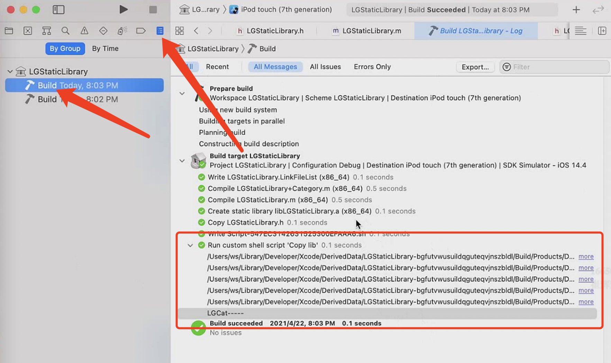
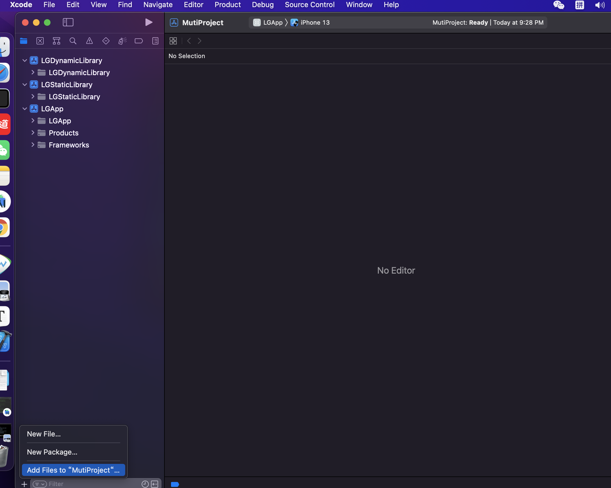

# 动态库静态库

库：可执行的二进制文件。能够被操作系统加载到内存。

## 静态库（.a .so .dll）

静态链接库：可以简单的看成⼀群⽬标⽂件（.o文件）的集合，即很多⽬标⽂件经过压缩打包后形成的⽂件。Windows下的`.lib`、Linux和Mac下的` .a`、Mac独有的`.framework`。

缺点：

浪费内存和磁盘空间，模块更新困难，浪费响应的性能。

## 动态库

与静态库相反，动态库在编译时并不会被拷⻉到⽬标程序中，**⽬标程序中只会存储指向动态库的引⽤**。

程序运⾏时，动态库才会被真正加载进来。

格式有：.framework、.dylib、.tdb。

一个已经链接完全的镜像image。

大部分苹果的库都是共享动态库，减少包的大小。

缺点：

会导致⼀些性能损失。但是可以优化，⽐如延迟绑定(Lazy Binding)技术

动态库是运行的时候通过dyld动态链接的。app冷启动的时候会有影响，最好不要超过6个。

## 动态库和静态库的区别

静态库 ：.m生成.o->.o文件的合集.a通过链接 -》可执行文件exec或者动态库

动态库： 所有的代码和所有的符号都是放到一起，编译连接的最终产物，不能再链接修改，不能再合并。

静态库是动态库的前身，动态库是静态库链接之后的产物。

静态库可以链接成动态库。

### 加快编译速度

**模块化项目**:

将项目分解成多个模块（如frameworks或libraries），这样在进行小的更改时不需要重新编译整个应用。

**使用预编译框架**:

如果项目中使用了第三方库，考虑使用预编译的版本。

在CocoaPods中，`use_frameworks!` 是一个指令，用于告诉CocoaPods以动态库的形式集成依赖库。

`use_frameworks! :linkage => :static`或`use_frameworks! :linkage => :dynamic`，允许开发者指定是使用静态链接还是动态链接。

**使用动态库可以减少最终应用程序的启动时间，因为动态库在需要时才加载，静态库在应用程序启动时被加载。**

这是一个`Podfile`中使用`use_frameworks!`的例子：

```ruby
platform :ios, '9.0'

use_frameworks!

target 'MyApp' do
  pod 'Alamofire', '~> 5.2'
  pod 'SwiftyJSON', '~> 5.0'
end
```

使用静态库可以减少应用程序的总大小，并可能减少编译时间，因为动态库需要额外的编译步骤。

## 动态库和静态库存放位置

- 动态库是链接最终产物，动态库没法和项目合并，所以需要在App的目录里去保存动态库。动态库放到app指定的目录（主项目framework目录）下面。链接动态库通过路径链接。 

- 静态库是.o文件的合集，可以和项目.a一起链接形成整个 App。静态库链接到主程序，和主程序代码合并。

一堆.o编译成动态库。

## 把动态库静态库拷贝到主项目

把静态库动态库加入，workspace编译主工程也会触动动态库静态库编译

动态库需要选择`Embed & Sign`拷贝到framework指定到路径下。静态库不需要，因为静态库编译链接之后和主工程合并一起了。

## Framework

Mac OS/iOS 平台还可以使⽤ Framework。framework是文件格式，目录。Framework 实际上是⼀种打包⽅式，**将库的⼆进制⽂件，头⽂件和资源⽂件打包到⼀起，⽅便管理和分发。**

静态库：Header + .a源文件 + 签名 + 资源文件 + Modules

动态库：Header + .dylib源文件 + 签名 + 资源文件


Framework和系统的UIKit.Framework有很⼤区别：

系统的Framework 不需要拷⻉到⽬标程序中

⾃⼰做的 Framework 哪怕是动态的，最后也还是要拷⻉到 App 中（App 和 Extension 的 Bundle 是共的），因此苹果⼜把这种 Framework 称为 Embedded Framework。

## Embedded Framework

开发中使⽤的动态库会被放⼊到ipa下的framework⽬录下，基于沙盒运⾏。

不同的App使⽤相同的动态库，会在多个App中各⾃打包、签名、加载⼀份。

## XCFramework

XCFramework可以让你将你的框架打包成一个多平台的二进制文件，支持iOS、macOS、tvOS和watchOS等平台。

多架构：模拟器，手机。上架的时候需要把模拟器架构剥离。库文件会小。

静态库链接之后已经合并，所以静态库不需要剥离。

XCFramework：是苹果官⽅推荐的，可以更⽅便的表示⼀个多个平台和架构的分发⼆进制库的格式。

Xcode会自动选择哪个架构。

- 真机：arm64。
- 模拟器、Mac：x86_64、arm64。

和传统的framework相⽐：

- 可以⽤单个.xcframework⽂件提供多个平台的分发⼆进制⽂件；
- 与Fat Header相⽐，可以按照平台划分，可以包含相同架构的不同平台的⽂件；
- 在使⽤时，不需要再通过脚本去剥离不需要的架构体系。

## -ObjC参数与-force_load

##### 针对链接器，链接加载静态库.o生成动态库.dylib的几个级别

- -noall_load

​	默认的，app里面有没有用到静态库的代码（以类来判断）就不加载，使用到了就加载。

​	静态库进行链接的时候，链接库扫描的时候

- -all_load

​	把所有的代码全部加载进来

- -ObjC

​	只加载所有与OC相关的代码

- -force_load <file> 下面跟上路径

​	指定的静态库才会完全加载进来。

​	两个静态库产生符号冲突的时候，可以通过force_load哪个库作为主链接。

-noall_load和-all_load是针对链接器。

静态库中有分类，分类是动态创建的，链接器把分类给剥离干掉。所以需要设置级别-force_load。

## dead strip

代码剥离。针对符号。全局符号，导出符号才可以。静态的本地符号不会。

链接器会剥离下面：

1. 没有被入口函数使用
2. 不能成为导出符号

-all_load针对静态库，dead strip针对文件，两个可以同时使用。


## tbd文件

只有动态库才有tbd格式文件。

动态库链接的路径

tbd本质是动态库配置文件：

1. targets：支持的架构
2. install-name：动态库路径，哪个路径下找动态库
3. exports:下的symbols：导出符号（动态库哪些符号暴露给外面使用的）。

## 要减小App的体积，应该使用静态库还是动态库，为什么?

按常理 分发体积 动态库要比静态库小。

1. 配置文件冗余

   静态库每个.o文件都有Mach header，Segment，Section，blob配置文件冗余。

   动态库是放在一起的，只有一个。所以动态库小。

2. dead

   占位符号 没有用到的删掉

3. 内存对齐

   动态库会内存对齐，静态库不对齐。

​		有一种情况 静态库.o 所占的空间 没有达到对齐所在的空间比动态库小。静态库里面的代码比较少的时候。

​		静态库.o里面代码的存放不用对齐，例如本身占2个字节，对齐之后要占8个字节。

​		最终链接产物  代码的存放 要对齐 2 8


主工程，动态库，静态库

探究符号信息，代码信息。

手动：

打开静态库，编译，Products文件夹中的.a文件。

来到.a路径下，终端`nm -pa .a文件的路径`查看macho中的符号表信息。

- `nm -pa .a静态库文件路径`：a是查看macho文件里面的所有符号表，p是不排序。
- `objdump -macho -d ${LGSTATICLIBRARY_PATH}`：查看machO代码段里面保存的代码，-d:打印代码段里面的内容

自动：

写脚本，编译后的.a文件拷贝到sourceRoot路径。

Build Phases --> Copy lib --> Shell /bin/sh

```sh
# 删除 ${SOURCE_ROOT}/Products 目录及其内容
rm -rf -- "${SOURCE_ROOT}/Products"

# 创建 ${SOURCE_ROOT}/Products 目录
mkdir -p  -- "${SOURCE_ROOT}/Products"

# 复制 ${BUILT_PRODUCTS_DIR} 目录及其内容到 ${SOURCE_ROOT}/Products
cp -Rv -- "${BUILT_PRODUCTS_DIR}/" "${SOURCE_ROOT}/Products"

# 输出 'LGCat-----' 到控制台
echo 'LGCat-----'
```

编译后查看



## 工程配置

打开主工程，Xcode菜单栏选择File --> Save As WorkSpace生成`.xcworkspace`工作空间。

然后把其它动态库静态库添加进来。



## 动态库

XCode链接需要经过几个阶段：

1. 配置库的头文件：`build setting`设置`HEADER_SEARCH_PATHS`。通过xcconfig设置。
2. 库（library）的位置：在`build settings`里的`Library Search Paths`
3. 给链接器ld设置名称 设置`OTHER_LDFLAGS`

### 库的链接类型


## 自己做的pod库，打包

在你的`HHUtils`框架的Xcode项目中，确保所有依赖项都被正确嵌入。你可以通过以下步骤来检查：

1. 打开`HHUtils`项目的`Build Phases`。
2. 确认`Link Binary With Libraries`部分包含所有必要的依赖项（例如`Alamofire.framework`和`SnapKit.framework`）。
3. 确认`Embed Frameworks`部分也包含这些依赖项。

```sh
#!/bin/bash

# 设置变量
SCHEME="HHUtils"
CONFIGURATION="Release"
BUILD_DIR="./build"
IOS_ARCHIVE_PATH="$BUILD_DIR/iOS.xcarchive"
IOS_SIMULATOR_ARCHIVE_PATH="$BUILD_DIR/iOSSimulator.xcarchive"
XCFRAMEWORK_OUTPUT_PATH="$BUILD_DIR/HHUtils.xcframework"

# 清理之前的构建
rm -rf "$BUILD_DIR"

# 构建iOS设备Framework
xcodebuild archive \
  #-workspace HHUtils.xcworkspace \
  -scheme "$SCHEME" \
  -configuration "$CONFIGURATION" \
  -destination 'generic/platform=iOS' \
  -archivePath "$IOS_ARCHIVE_PATH" \
  SKIP_INSTALL=NO \
  BUILD_LIBRARY_FOR_DISTRIBUTION=YES

# 检查iOS设备Framework是否存在
if [ ! -d "$IOS_ARCHIVE_PATH/Products/Library/Frameworks/HHUtils.framework" ]; then
  echo "iOS Framework not found!"
  exit 1
fi

# 构建iOS模拟器Framework
xcodebuild archive \
  #-workspace HHUtils.xcworkspace \
  -scheme "$SCHEME" \
  -configuration "$CONFIGURATION" \
  -destination 'generic/platform=iOS Simulator' \
  -archivePath "$IOS_SIMULATOR_ARCHIVE_PATH" \
  SKIP_INSTALL=NO \
  BUILD_LIBRARY_FOR_DISTRIBUTION=YES

# 检查iOS模拟器Framework是否存在
if [ ! -d "$IOS_SIMULATOR_ARCHIVE_PATH/Products/Library/Frameworks/HHUtils.framework" ]; then
  echo "iOS Simulator Framework not found!"
  exit 1
fi

# 创建XCFramework
xcodebuild -create-xcframework \
  -framework "$IOS_ARCHIVE_PATH/Products/Library/Frameworks/HHUtils.framework" \
  -framework "$IOS_SIMULATOR_ARCHIVE_PATH/Products/Library/Frameworks/HHUtils.framework" \
  -output "$XCFRAMEWORK_OUTPUT_PATH"

echo "XCFramework has been created at $XCFRAMEWORK_OUTPUT_PATH"
```

