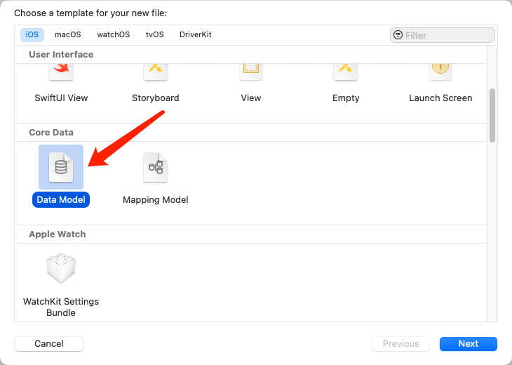
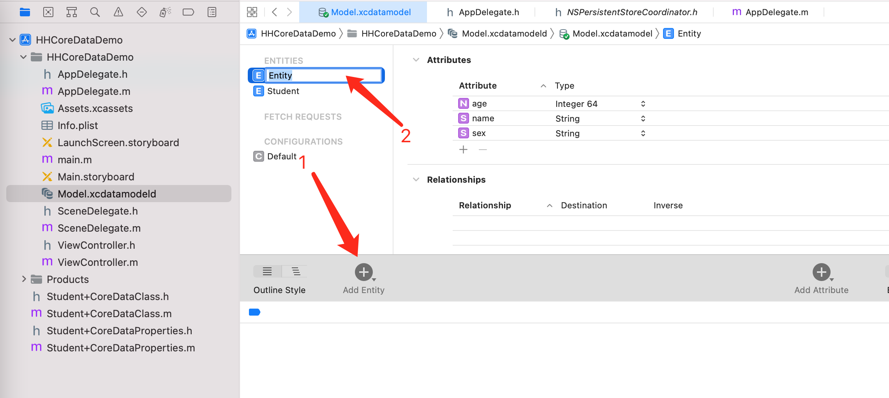
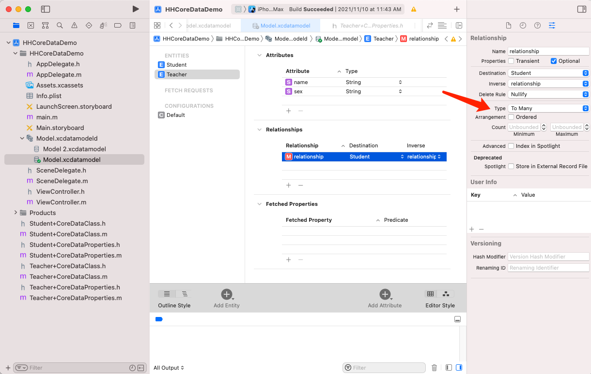

# CoreData

**一、预备知识**

在了解CoreData，大家有必要了解对象关系映射（英语称object Relational Mapping，简称ORM）。

ORM是通过使用描述对象和数据库之间映射的元数据，可以实现将对象自动持久化到关系数据库当中。

**二、初识CoreData**

CoreData是苹果自己推出的数据存储框架，采用了一种ORM（对象关系映射）的存储关系。CoreData一个比较大的优势在于在使用CoreData过程中不需要我们编写SQL语句，也就是将OC对象存储于数据库，也可以将数据库数据转为OC对象（数据库数据与OC对象相互转换）。

## 使用CoreData

AppDelegate.h

```objective-c
#import <UIKit/UIKit.h>
#import <CoreData/CoreData.h>

@interface AppDelegate : UIResponder <UIApplicationDelegate>

@property (readonly, strong) NSPersistentContainer *persistentContainer;

- (void)saveContext;


@end
```

AppDelegate.m

```objective-c
@synthesize persistentContainer = _persistentContainer;

- (NSPersistentContainer *)persistentContainer {
    // The persistent container for the application. This implementation creates and returns a container, having loaded the store for the application to it.
    @synchronized (self) {
        if (_persistentContainer == nil) {
            _persistentContainer = [[NSPersistentContainer alloc] initWithName:@"HHCoreDataDemo"];
            [_persistentContainer loadPersistentStoresWithCompletionHandler:^(NSPersistentStoreDescription *storeDescription, NSError *error) {
                if (error != nil) {
                    // Replace this implementation with code to handle the error appropriately.
                    // abort() causes the application to generate a crash log and terminate. You should not use this function in a shipping application, although it may be useful during development.
                    
                    /*
                     Typical reasons for an error here include:
                     * The parent directory does not exist, cannot be created, or disallows writing.
                     * The persistent store is not accessible, due to permissions or data protection when the device is locked.
                     * The device is out of space.
                     * The store could not be migrated to the current model version.
                     Check the error message to determine what the actual problem was.
                    */
                    NSLog(@"Unresolved error %@, %@", error, error.userInfo);
                    abort();
                }
            }];
        }
    }
    
    return _persistentContainer;
}

#pragma mark - Core Data Saving support

- (void)saveContext {
    NSManagedObjectContext *context = self.persistentContainer.viewContext;
    NSError *error = nil;
    if ([context hasChanges] && ![context save:&error]) {
        // Replace this implementation with code to handle the error appropriately.
        // abort() causes the application to generate a crash log and terminate. You should not use this function in a shipping application, although it may be useful during development.
        NSLog(@"Unresolved error %@, %@", error, error.userInfo);
        abort();
    }
}
```

## CoreData几个类

### NSManagedObjectModel

NSManagedObjectModel意思是托管对象模型，其中一个托管对象模型关联到一个模型文件，里面存储着数据库的数据结构。

创建托管对象模型。注意URL路径文件名要和项目中的`.xcdatamodeld`一样！

```objective-c
- (NSManagedObjectModel *)managedObjectModel {
    // The managed object model for the application. It is a fatal error for the application not to be able to find and load its model.
    if (_managedObjectModel != nil) {
        return _managedObjectModel;
    }
    // 这个就是数据模型文件.可视化建模的文件(Model.xcdatamodeld)他会在编译后变成momd格式的文件
    //注意名字要一样
    NSURL *modelURL = [[NSBundle mainBundle] URLForResource:@"Model" withExtension:@"momd"];
    _managedObjectModel = [[NSManagedObjectModel alloc] initWithContentsOfURL:modelURL];
    return _managedObjectModel;
}
```

### NSPersistentStoreCoordinator

NSPersistentStoreCoordinator意思是持久化存储协调器，主要负责协调上下文与存储的区域的关系。

创建持久化存储调度器

```objective-c
- (NSPersistentStoreCoordinator *)persistentStoreCoordinator {
    // The persistent store coordinator for the application. This implementation creates and return a coordinator, having added the store for the application to it.
    if (_persistentStoreCoordinator != nil) {
        return _persistentStoreCoordinator;
    }
    
    // Create the coordinator and store
    //数据链接器指定数据模型器
    _persistentStoreCoordinator = [[NSPersistentStoreCoordinator alloc] initWithManagedObjectModel:[self managedObjectModel]];
    //沙盒路径,可以链接远程的服务器,不仅仅是本地的,所以是url
    NSURL *storeURL = [[self applicationDocumentsDirectory] URLByAppendingPathComponent:@"LessonCoredata.sqlite"];
    NSError *error = nil;
    NSString *failureReason = @"There was an error creating or loading the application's saved data.";
    
    //1:指定文件格式. 链接文件的格式:二进制文件.xml文件.sql文件.(最后一个为内存);
    //2:数据连接器的一些配置信息,(一般用不上).
    //3:真是数据文件的沙盒路径
    //4:coredata的一些选项.如:数据库升级时使用的一些选项配置.
    //5:错误信息
    
    //options升级时用的
    //支持数据库升级
    NSDictionary *dic = @{NSMigratePersistentStoresAutomaticallyOption : @YES, NSInferMappingModelAutomaticallyOption:@YES};

    if (![_persistentStoreCoordinator addPersistentStoreWithType:NSSQLiteStoreType configuration:nil URL:storeURL options:dic error:&error]) {
        // Report any error we got.
        NSMutableDictionary *dict = [NSMutableDictionary dictionary];
        dict[NSLocalizedDescriptionKey] = @"Failed to initialize the application's saved data";
        dict[NSLocalizedFailureReasonErrorKey] = failureReason;
        dict[NSUnderlyingErrorKey] = error;
        error = [NSError errorWithDomain:@"YOUR_ERROR_DOMAIN" code:9999 userInfo:dict];
        // Replace this with code to handle the error appropriately.
        // abort() causes the application to generate a crash log and terminate. You should not use this function in a shipping application, although it may be useful during development.
        NSLog(@"Unresolved error %@, %@", error, [error userInfo]);
        //程序中断.
        abort();
    }
    
    return _persistentStoreCoordinator;
}
```

### NSManagedObjectContext

NSManagedObjectContext意思是托管对象上下文，数据库的大多数操作是在这个类操作。

首先讲述NSManagedObjectContext，苹果推荐使用initWithConcurrencyType方式创建，在创建时，指定当前是什么类型的并发队列，参数也是一个枚举值。

NSManagedObjectContext枚举值参数有三个类型：

1. NSConfinementConcurrencyType：此类型在iOS9之后被苹果弃用，所以不建议用这个API
2. NSPrivateQueueConcurrencyType：代表私有并发队列的类型，操作也是在子线程中完成的。
3. NSMainQueueConcurrencyType：代表主并发队列类型，如果在操作过程中，需要涉及到UI操作，则应该使用这个参数初始化上下文完成操作。

下面我们一个company的模型文件-主队列并发类型的NSManagedObjectContext

```objective-c
- (NSManagedObjectContext *)managedObjectContext {
    // Returns the managed object context for the application (which is already bound to the persistent store coordinator for the application.)
    if (_managedObjectContext != nil) {
        return _managedObjectContext;
    }
    
    //持久化存储调度器
    NSPersistentStoreCoordinator *coordinator = [self persistentStoreCoordinator];
    if (!coordinator) {
        return nil;
    }
    
    //创建上下文对象，并发队列设置为主队列
    _managedObjectContext = [[NSManagedObjectContext alloc] initWithConcurrencyType:NSMainQueueConcurrencyType];
    //上下文对象设置属性为持久化存储器
    [_managedObjectContext setPersistentStoreCoordinator:coordinator];
    return _managedObjectContext;
}	
```

### NSManagedObject

意思是托管对象类，其中CoreData里面的托管对象（实体模型对象）都会继承此类。

### 创建实体



#### 生成对应实体的实体类，在此之前要注意下图两个设置部分，否则会引起崩溃现象


### 编译报错

```
Multiple commands produce '路径/Student+CoreDataClass.o':
1) Target 'HHCoreDataDemo' (project 'HHCoreDataDemo') has compile command with input '路径/Student+CoreDataClass.m'
2) Target 'HHCoreDataDemo' (project 'HHCoreDataDemo') has compile command with input '路径/Student+CoreDataClass.m'

```

```
Multiple commands produce '路径/Student+CoreDataProperties.o':
1) Target 'HHCoreDataDemo' (project 'HHCoreDataDemo') has compile command with input '路径/Student+CoreDataProperties.m'
2) Target 'HHCoreDataDemo' (project 'HHCoreDataDemo') has compile command with input '路径/Student+CoreDataProperties.m'
```

##### 解决方法：

需要在`Build Phases`中`Compile Sources`删除`+CoreDataClass.m`和`+CoreDataProperties.m`，不需要编译那两个文件。

### 新增模型



## 版本迁移

`CoreData`版本迁移的方式有很多，一般都是先在`Xcode`中，原有模型文件的基础上，创建一个新版本的模型文件，然后在此基础上做不同方式的版本迁移。

本章节将会讲三种不同的版本迁移方案，但都不会讲太深，都是从使用的角度讲起，可以满足大多数版本迁移的需求。

### 为什么要版本迁移？

在已经运行程序并通过模型文件生成数据库后，再对模型文件进行的修改，如果只是修改已有实体属性的默认值、最大最小值、`Fetch Request`等属性自身包含的参数时，并不会发生错误。如果修改模型文件的结构，或修改属性名、实体名等，造成**模型文件的结构发生改变**，这样再次运行程序**就会导致崩溃**。

在开发测试过程中，可以直接将原有程序卸载就可以解决这个问题，但是**本地之前存储的数据也会消失**。如果是线上程序，就涉及到版本迁移的问题，否则会导致崩溃，并提示错误。

然而在需求不断变化的过程中，后续版本肯定会对原有的模型文件进行修改，这时就需要用到版本迁移的技术，下面开始讲版本迁移的方案。

### 创建新版本模型文件

本文中讲的几种版本迁移方案，在迁移之前都需要对原有的模型文件创建新版本。

```rust
选中需要做迁移的模型文件 -> 点击菜单栏Editor -> Add Model Version -> 选择基于哪个版本的模型文件(一般都是选择目前最新的版本)，新建模型文件完成。
```

对于新版本模型文件的命名，我在创建新版本模型文件时，一般会**拿当前工程版本号当做后缀**，这样在模型文件版本比较多的时候，就可以很容易**将模型文件版本和工程版本对应起来**。

添加完成后，会发现之前的模型文件会变成一个文件夹，里面包含着多个模型文件。

## 模型嵌套

一个Teacher中有多个Student，点击Relationships 右边Type选择To Many。




