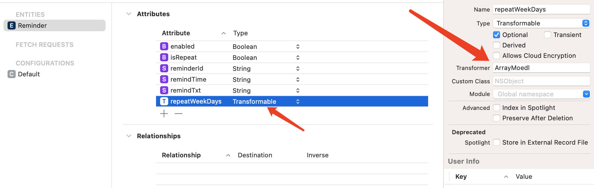
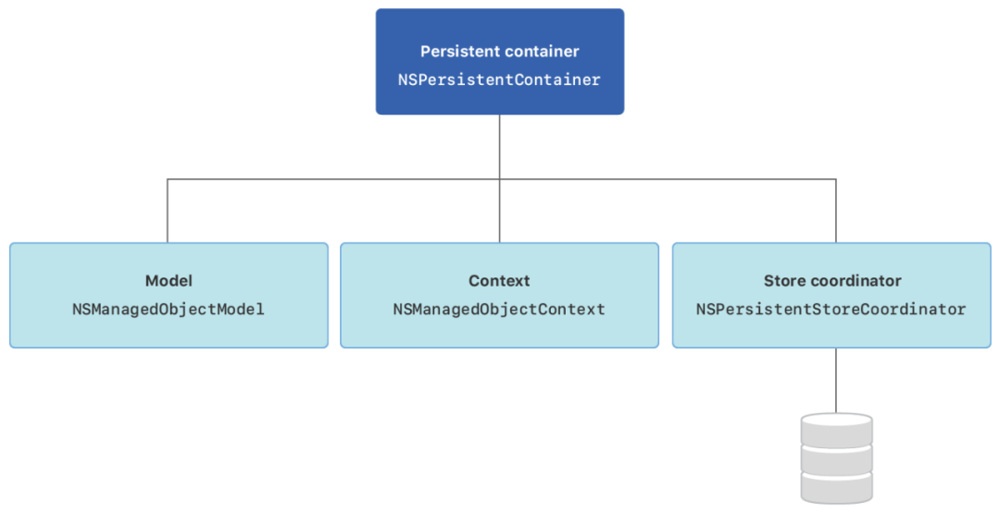

# CoreData

对象关系映射（Object Relational Mapping，简称ORM）。

ORM是通过使用描述对象和数据库之间映射的元数据，可以实现将对象自动持久化到关系数据库当中。

使用CoreData过程中不需要我们编写SQL语句，也就是将OC对象存储于数据库，也可以将数据库数据转为OC对象（数据库数据与OC对象相互转换）。

## CoreData几个类

### 数据模型文件 - Data Model

用`Core Data`时，我们需要一个用来存放数据模型的地方，数据模型文件就是我们要创建的文件类型。它的后缀是`.xcdatamodeld`。只要在项目中选 **新建文件→Data Model** 即可创建。

默认系统提供的命名为 `Model.xcdatamodeld` 。

这个文件就相当于数据库中的“库”。通过编辑这个文件，就可以去添加定义自己想要处理的数据类型。

### 数据模型中的“表格” - Entity实体

如果把数据模型文件比作数据库中的“库”，那么`Entity`就相当于数据库中的“表格”。`Entity`就是让你定义数据表格类型的名词。

假设我这个数据模型是用来存放图书馆信息的，那么就建立一个叫`Book`的`Entity`。

#### 生成对应实体的实体类

1. 先选择Code Generation，Language选择OC还是Swift
2. Xcode -- Editor -- Create NSManagedObject Subclass

### “属性” - Attributes

当建立一个名为`Book`的`Entity`时，会看到视图中有栏写着`Attributes`，当定义一本书时，自然要定义书名，书的编码等信息。这部分信息叫`Attributes`，即书的属性。

Book的`Entity`：

| 属性名 | 类型      |
| :----- | :-------- |
| name   | String    |
| isbm   | String    |
| page   | Integer32 |

同理，也可以再添加一个读者：Reader的`Entity`描述。

Reader的`Entity`：

| 属性名 | 类型   |
| :----- | :----- |
| name   | String |
| idCard | String |

### “关系” - Relationship

在使用`Entity`编辑时，除了看到了`Attributes`一栏，还看到下面有`Relationships`一栏。

当定义图书馆信息时，书籍和读者的信息，这两个信息彼此是孤立的，而事实上他们存在着联系。

比如一本书，它被某个读者借走了，这样的数据该怎么存储？

直观的做法是再定义一张表格来处理这类关系。但是`Core Data`提供了更有效的办法 - `Relationship`。

从`Relationship`的思路来思考，当一本书A被某个读者B借走，我们可以理解为这本书A当前的“借阅者”是该读者B，而读者B的“持有书”是A。

从以上描述可以看出，`Relationship`所描述的关系是双向的，即A和B互相以某种方式形成了联系，而这个方式是我们来定义的。

在`Reader`的`Relationship`下点击`+`号键。然后在`Relationship`栏的名字上填`borrow`，表示读者和书的关系是“借阅”，在`Destination`栏选择`Book`，这样，读者和书籍的关系就确立了。

对于第三栏，`Inverse`，却没有东西可以填，这是为什么？

因为我们现在定义了读者和书的关系，却没有定义书和读者的关系。记住，**关系是双向的。**

就好比你定义了A是B的父亲，那也要同时去定义B是A的儿子一个道理。计算机不会帮我们打理另一边的联系。

理解了这点，我们开始选择`Book`的一栏，在`Relationship`下添加新的`borrowBy`，`Destination`是`Reader`，这时候点击`Inverse`一栏，会发现弹出了`borrow`，直接点上。

这是因为我们在定义`Book`的`Relationship`之前，我们已经定义了`Reader`的`Relationship`了，所以电脑已经知道了读者和书籍的关系，可以直接选上。而一旦选好了，那么在`Reader`的`Relationship`中，我们会发现`Inverse`一栏会自动补齐为`borrowBy`。因为电脑这时候已经完全理解了双方的关系，自动做了补齐。

#### “一对一”和“一对多” - to one和to many

我们建立`Reader`和`Book`之间的联系的时候，发现他们的联系逻辑之间还漏了一个环节。

假设一本书被一个读者借走了，它就不能被另一个读者借走，而当一个读者借书时，却可以借很多本书。

也就是说，一本书只能对应一个读者，而一个读者却可以对应多本书。

这就是 一对一→`to one` 和 一对多→`to many` 。

`Core Data`允许我们配置这种联系，具体做法就是在`RelationShip`栏点击对应的关系栏，它将会出现在右侧的栏目中。

在`Relationship`的配置项里，有一项项名为`Type`，点击后有两个选项，一个是`To One`（默认值），另一个就是`To Many`了。

#### Entity的Attributes中Type是字典、数组或者其他类型的时候

选择Transformable类型，这个类型从字面意思来理解为可转换类型。选中这条数据，如下图



可以看到在Trasnformer这栏填上自己定义的类，这个类需要继承于ValueTransformer

```swift
import Foundation
@objc(ArrayMoedl)
final class ArrayMoedl: ValueTransformer {
    
    override func transformedValue(_ value: Any?) -> Any? {
        
        guard let value = value as? Array<Any> else{
            return nil
        }
        do {
            if #available(iOS 11.0, *) {
                let data = try NSKeyedArchiver.archivedData(withRootObject:value, requiringSecureCoding: true)
                return data
            } else {
                // Fallback on earlier versions
                return NSKeyedArchiver.archivedData(withRootObject:value)
            }
        }catch{
            assertionFailure("Failed to transform 'Array' to 'Data'")
            return nil
        }
    }
    
    override func reverseTransformedValue(_ value: Any?) -> Any? {
        guard let data = value as? NSData else{return nil}
        do {
            if #available(iOS 11.0, *) {
                let result = try NSKeyedUnarchiver.unarchivedObject(ofClass:NSArray.self,  from:data as Data)
                return result
            }else {
                guard let result = NSKeyedUnarchiver.unarchiveObject(with: data as Data)else{
                    return nil
                }
                return result
            }
        }catch{
            assertionFailure("Failed to transform 'Data' to 'Array'")
            return nil
        }
    }
    
    override class func allowsReverseTransformation() -> Bool {
        return true
    }
}
```

上面的Array也可以改为字典或者其他自定义类型。

### NSPersistentContainer

持久化容器



### NSManagedObjectContext

NSManagedObjectContext意思是托管对象上下文，数据库的大多数操作是在这个类操作。

### NSManagedObject

托管对象类，CoreData里面的托管对象（实体模型对象）都会继承此类。

1. 定义一个数据模型类Person，继承自NSManagedObject。
2. 在Person类中定义实体的属性，并使用@NSManaged修饰符告诉编译器这些属性将由CoreData管理。

### 编译报错

```
Multiple commands produce '路径/Student+CoreDataClass.o':
1) Target 'HHCoreDataDemo' (project 'HHCoreDataDemo') has compile command with input '路径/Student+CoreDataClass.m'
2) Target 'HHCoreDataDemo' (project 'HHCoreDataDemo') has compile command with input '路径/Student+CoreDataClass.m'

```

```
Multiple commands produce '路径/Student+CoreDataProperties.o':
1) Target 'HHCoreDataDemo' (project 'HHCoreDataDemo') has compile command with input '路径/Student+CoreDataProperties.m'
2) Target 'HHCoreDataDemo' (project 'HHCoreDataDemo') has compile command with input '路径/Student+CoreDataProperties.m'
```

解决方法：

需要在`Build Phases`中`Compile Sources`删除`+CoreDataClass.m`和`+CoreDataProperties.m`，不需要编译那两个文件。

## 版本迁移

`CoreData`版本迁移的方式有很多，一般都是先在`Xcode`中，原有模型文件的基础上，创建一个新版本的模型文件，然后在此基础上做不同方式的版本迁移。

### 创建新版本模型文件

本文中讲的几种版本迁移方案，在迁移之前都需要对原有的模型文件创建新版本。

> 选中需要做迁移的模型文件 -> 点击菜单栏Editor -> Add Model Version -> 选择基于哪个版本的模型文件(一般都是选择目前最新的版本)，新建模型文件完成。

对于新版本模型文件的命名，一般会**拿当前工程版本号当做后缀**，这样在模型文件版本比较多的时候，可以很容易**将模型文件版本和工程版本对应起来**。

添加完成后，会发现之前的模型文件会变成一个文件夹，里面包含着多个模型文件。
