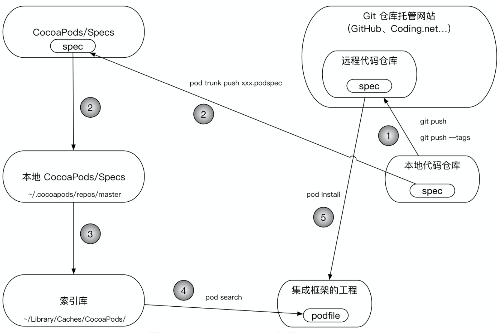

# CocoaPods原理



## 项目安装框架源码

### 使用pod search搜索不到时

删除`/Users/用户名/Library/Caches/CocoaPods`下的`search_index.json`检索索引文件，然后pod search就会重新生成最新的。就可以搜索到自己刚才的库。

pod search 的时候就是在search_index.json中查找的。

使用的时候要在Podfile文件中添加source指定源地址。

### 远程代码spec索引仓库

使用的时候 pod setup更新 本地索引库 把远程索引库pod到本地。需要经常更新索引库。

### 本地代码spec索引仓库

本地代码仓库的文件地址路径：`/硬盘/Users/用户名/.cocoapods/repos`，里面有master和trunk。

向cocoapods上面上传代码和拉取代码，拉取代码需要安装cocoapods。

`pod search AFNetworking`就是在`.cocoapods/repos`本地资源库找到索引`AFNetworking.podspec.json`。

本地索引库里面很多.spec文件，pod search搜索到时候不是直接在本地索引库查找的，有一个检索的索引文件json格式的。键值对。找到之后根据.spec中的框架地址，从github下载源码。不是直接从github上找并下载的。

项目里面有一个podfile，根据podfile查找。podfile会在github上找源码 根据GitHub远程索引库（里面有很多索引文件.spec文件，不是源码）。

## 抽成本地库

先抽成本地的，本地的私有索引库。然后提交远程。

### 1、cd到本地的Lib文件夹，也可以是其它任意文件夹。

### 2、`pod lib create GroupShadowTableView`，创建模版。

Cloning `https://github.com/CocoaPods/pod-template.git` into `GroupShadowTableView`.从github上面clone一个pod模版，创建仓库。

Configuring GroupShadowTableView template. 下面就是一些配置。

模版执行完之后 

- What platform do you want to use?? [ iOS / macOS ] 选择iOS
- What language do you want to use?? [ Swift / ObjC ] 输入语言swift/Objc 
- Would you like to include a demo application with your library? [ Yes / No ]是否包含demo 选择Yes
- Which testing frameworks will you use? [ Quick / None ] 测试framework 选None 选其它的会创建其它的模版，和测试框架有关
- Would you like to do view based testing? [ Yes / No ] 基础测试文件 选No
- What is your class prefix? 选择文件前缀  自己定义HH

然后就创建好了，项目会自动打开。里面自动有一个.podspec文件。因为前面选择 了Yes，所以里面 有Delegate和 Viewcontroller 方便测试。

### 3、拖入文件 `Pod install` 安装

Xcode项目中Pods里面的Development Pods的文件夹下有一个GroupShadowTableView文件夹，也就是`ReplaceMe.m`文件所在的位置，在/Lib/GroupShadowTableView/GroupShadowTableView/Classes该文件夹中放自己抽取的代码，以及自己写的代码。再把ReplaceMe.m文件删除。

然后 在终端cd Podfile文件路径cd /Users/当前用户/Documents/Lib/GroupShadowTableView/Example 然后pod install安装。

**一定要记得pod install** 不然Development Pods文件夹下没有文件，本地无法使用。

### 4、把依赖的其它第三方引入

编译之后可能会出错，因为少了依赖的第三方框架AFN，MJ，Masnory等。

Pods/Development Pods/自己代码文件夹/Pod/.podspec。里面有一个Pod文件夹，Pod文件夹中有一个.podspec文件，添加需要的第三方：

```
  s.dependency 'AFNetworking'
  s.dependency 'Masonry'
  s.dependency 'LGMacroAndCategoryModule'//自己写的也可以引入

  s.prefix_header_contents = '#import "Masonry.h"','#import "UIKit+AFNetworking.h"','#import "LGMacros.h"'
```

把依赖的第三方在.podspec文件中添加上，然后pod install安装。

每次修改都要进行`pod install`。

### 5、编译成功，本地的库就已经完成了。

### 注

Developer Pods放本地库文件，还未提交远程之前，提交远程之后使用远程库，会删除Developer Pods文件夹下的本地库文件

## Podfile

```
use_frameworks!

platform :ios, '9.0'

target 'LGCommonUIModule_Example' do
  pod 'LGCommonUIModule', :path => '../'
  pod 'LGMacroAndCategoryModule', :path => '../../LGMacroAndCategoryModule'//本地库
end
```

可以在其它项目中pod刚才做好的本地库，进行使用。

需要在Podfile文件指定路径，Podfile文件里面pod 'GroupShadowTableView', :path => '../'。

`:path`指定的是本地路径。

`../`是上级文件夹路径。路径是相对于Podfile的路径。

#### 找不到资源文件

代码放在Classes文件夹中，图片Images.xcassets放在Assets文件夹中

加载图片需要换bundle

```objective-c
    NSString *bundlePath = [[NSBundle bundleForClass:[self class]].resourcePath stringByAppendingPathComponent:@"/LGModuleTest.bundle"];
    NSBundle *resoure_bundle = [NSBundle bundleWithPath:bundlePath];
    
    self.imageView.image = [UIImage imageNamed:@"share_wechat" inBundle:resoure_bundle compatibleWithTraitCollection:nil];
```

同时还需要修改Pods/Development Pods/自己代码文件夹/Pod/.podspec文件下的resource_bundles

```
   s.resource_bundles = {
     'LGModuleTest' => ['LGModuleTest/Assets/*']
   }
```

每次修改最后都**需要pod install**。

同样json文件一样 需要配置bundle。xib也需要配置bundle

```objective-c
    NSString *bundlePath = [[NSBundle bundleForClass:[self class]].resourcePath stringByAppendingPathComponent:@"/LGHomeModule.bundle"];
    NSString *path = [[NSBundle bundleWithPath:bundlePath] pathForResource:[NSString stringWithFormat:@"Home_TableView_Response_%@", channelId] ofType:@"json"];
```

## 做成远程的

本地的索引库，其他人使用的话用不了你本地电脑上的。所以做成远程的代码仓库。使用码云或者github等。

创建一个仓库，仓库名必须跟框架名一样，选择导入已有项目，然后创建。

cd本地仓库文件夹

git remote add origin https://github.com/huicuihui/GroupShadowTableView.git 后面的https地址是github当前仓库地址。
git push -u origin master。提交到远程master（分支名称）。

## .spec

要找远程索引库，向远程索引库提交.spec文件，根据.spec文件中地址找框架源码。本地索引库也有.spec文件，里面也有远程地址。
所以就要修改.spec文件。

```
Pod::Spec.new do |s|
	# 框架名称
  s.name             = 'HHTableListViewController'
  # 版本号
  s.version          = '0.2.0'
  # 描述
  s.summary          = '封装tableView基类'

# This description is used to generate tags and improve search results.
#   * Think: What does it do? Why did you write it? What is the focus?
#   * Try to keep it short, snappy and to the point.
#   * Write the description between the DESC delimiters below.
#   * Finally, don't worry about the indent, CocoaPods strips it!

	# 可以修改也可以不改
  s.description      = '封装tableView基类 刷新自动加载更多'

	# 主页地址，远程库的地址。（如果是私有的，地址只需要写到自己的github地址，不需要写项目具体地址）
  s.homepage         = 'https://github.com/huicuihui/HHTableListViewController'
  # s.screenshots     = 'www.example.com/screenshots_1', 'www.example.com/screenshots_2'
  s.license          = { :type => 'MIT', :file => 'LICENSE' }
  s.author           = { '805988356@qq.com' => '805988356@qq.com' }
  
  # 重要：框架源码地址。找框架源码的时候就是根据这个找的。这个地址错了就找不到了。github就写github，码云就写gitee，可以直接复制仓库地址。
  s.source           = { :git => 'https://github.com/huicuihui/HHTableListViewController.git', :tag => s.version.to_s }
  # s.social_media_url = 'https://twitter.com/<TWITTER_USERNAME>'

  s.ios.deployment_target = '8.0'

	# 源代码文件（哪些文件是需要的，根据这个去找）。/**/* 代表 ：所有文件，文件夹中的所有文件。
  s.source_files = 'HHTableListViewController/Classes/**/*' # 找的Classes下的文件
  
  # 资源文件位置
  s.resource_bundles = {
    'HHTableListViewController' => ['HHTableListViewController/Assets/*.{png,jpeg,jpg,imageset}']
  }

  # s.public_header_files = 'Pod/Classes/**/*.h'
  # s.frameworks = 'UIKit', 'MapKit'
  s.dependency 'AFNetworking', '~> 4.0'
  s.dependency 'MJRefresh'
  s.dependency 'Masonry'
end
```

把spec文件提交
提交到本地。

终端打印`pod repo`，master显示github上的源地址.

如果用的是码云或者是其它的源地址，要在podfile文件中指定source，写上source ‘https://gifted.com/huicuihui/Spec.git’ 在这里面找。
另外还要有source ‘https://github.com/CocoaPods/Specs.git’ 因为还有其他的第三方在github上。

本地端索引库地址：/Users/cuihuihui/.cocoapods/repos。里面的master是github上的索引。

私有库是提交到本地索引库的，本地端的spec文件会自动的同步远程索引库。
向本地提交一个spec文件，本地的spec文件会 自动的向远程端同步。

## 提交

pod repo HHSpec HHGroupShadowTableView.podspec

pod repo 不成功，因为pod库有一个版本号，github上需要打标签。标签tag要和.podspec中的版本号一致。

## 提交到远程spec库

先cd进入当前文件夹

### 检查是否出错

pod spec lint

### 1、推到cocoapod上

pod trunk register 805988356@qq.com 'huicuihui' --description='huihuiPro'。注册账号。

pod trunk push HHGroupShadowTableView.podspec --allow-warnings。如果有警告的话 需要在后面添加--allow-warnings去ignore警告。

### 2、推到master上

pod master push HHGroupShadowTableView.podspec --allow-warnings

### 3、提交到自己的私有仓库

在github上创建一个仓库HHSpecs 来管理自己的共有和私有库。

pod repo add HHSpecs https://github.com/huicuihui/HHGroupShadowTableView.git

pod repo push HHSpecs HHGroupShadowTableView.podspec --allow-warnings

提交 pod repo push HHSpec HHTools.podspec，提交的时候会验证.spec本地索引库是否写对。

`/Users/michael/Documents/HHLib/HHUtils/Example/Pods/Local Podspecs/HHUtils.podspec.json`

如果引用其它第三方可能提交不上去，就不使用pod repo push这个指令提交，改为直接复制一个其它的本地索引库文件，然后改一下名字，版本，描述等等，修改.podspec文件。

## 移除本版本

pod trunk delete HHGroupShadowTableView 0.1.0（即：pod trunk delete 库名 版本号）
